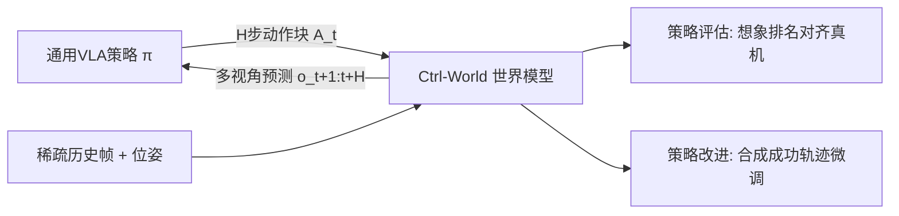

# Ctrl-World: A Controllable Generative World Model for Robot Manipulation

**会议**: ICLR 2026  
**OpenReview**: [https://openreview.net/forum?id=748bHL2BAv](https://openreview.net/forum?id=748bHL2BAv)  
**项目主页**: [https://ctrl-world.github.io](https://ctrl-world.github.io)  
**领域**: 机器人 / 具身智能, 世界模型, 视频生成  
**关键词**: World Model, VLA Policy, Multi-View Prediction, Action Conditioning, Policy Evaluation, DROID  

## 一句话总结
把预训练的被动视频扩散模型改造成一个**可控、多视角、长时一致**的机器人世界模型，让通用 VLA 策略能在"想象空间"里闭环 rollout，从而无需真机就能评估策略、并通过合成成功轨迹微调把策略成功率提升 44.7%。

## 研究背景与动机
- **领域现状**：VLA（视觉-语言-动作）通用策略已能完成多种操作技能，但在开放世界面对陌生物体/指令时仍脆弱。要评估这些策略需要海量真机 rollout，要改进它们又需要昂贵的专家纠错数据——两者都慢、贵、难规模化。
- **现有痛点**：世界模型本是可扩展的替代方案，但现有 action-conditioned 世界模型大多停留在**被动视频预测**，无法真正与先进通用策略做 policy-in-the-loop 交互。具体三大缺陷：(1) 只模拟单个第三人称视角，部分可观测导致幻觉（物体没接触就"吸"进夹爪），且不兼容需要腕部视角的现代 VLA；(2) 缺乏对高频动作因果效应的细粒度控制；(3) 长时生成的时序一致性差，误差累积漂移。
- **核心矛盾**：现代 VLA 策略要求世界模型同时具备**多视角预测 + 细粒度动作控制 + 长时一致性**，而把一个预训练视频生成器变成"策略兼容的交互式模拟器"恰恰要把这三者一并补齐。
- **本文目标**：构建一个能与通用策略多步交互的可控多视角世界模型，既能在想象中给策略打分排名（对齐真机），又能合成成功轨迹反哺策略改进。
- **核心 idea**：**[轻量改造预训练视频扩散模型]** 从 1.5B Stable-Video-Diffusion 出发，只新初始化一个动作投影 MLP，引入多视角联合预测、帧级动作条件、位姿条件记忆检索三件套，把被动视频生成器转成可控交互模拟器。

## 方法详解

### 整体框架
给定策略 π 输出的 H 步动作块 $A_t=[a_{t+1},\dots,a_{t+H}]$，世界模型 $W$ 预测未来多视角观测 $o_{t+1:t+H}\sim W(\cdot\mid o_t, A_t)$，再把 $o_{t+H}$ 喂回策略产生下一动作块，策略与世界模型自回归交替，实现纯想象空间的长时 rollout。模型以预训练 SVD 的时空 Transformer 为骨干，叠加三项改造。

### 关键设计

**1. 多视角联合预测：补全可观测、对齐 VLA 输入格式。** 现代 VLA 同时依赖多个第三人称相机（全局上下文）和腕部相机（精细接触），因此世界模型必须每步生成跨视角空间一致的预测。Ctrl-World 把 $N$ 路图像（每路 $H\times W$ 个 token）沿 token 维拼接，联合预测所有视角 $o_{t:t+H}$，复用前馈 Transformer 捕捉多相机空间关系。关键收益在于**腕部视角的引入**——接触密集的物体交互中，腕部相机提供接触事件与物体状态变化的细粒度信息，显著抑制了单视角下"物体凭空进夹爪"这类幻觉，同时让一致性也随之提升。

**2. 帧级动作条件：把高频动作与视觉动态紧密对齐。** 预训练视频模型只吃文本和图像，控制精度不足。Ctrl-World 额外用策略输出的动作序列 $[a_{t+1:t+H}]$ 做条件，并把每个动作转成笛卡尔空间机械臂位姿 $[a'_{t+1:t+H}]$，与历史位姿 $[q_{t-km},\dots,q_t]$ 拼接，在空间 Transformer 里用**帧级 cross-attention** 让每一帧的视觉 token 去关注自己对应的位姿嵌入（历史帧对应真实位姿，未来帧对应动作位姿）。正因如此，模型能对相差仅几厘米的动作产出截然不同的 rollout，达到厘米级控制精度——消融显示去掉该模块时第三视角 PSNR 从 23.56 跌到 21.20，腕部视角更是崩到 15.69。

**3. 位姿条件记忆检索：用历史锚点压住长时漂移。** 长 rollout 中预测误差会累积导致漂移失真。Ctrl-World 在输入里加入过去帧，但为避免上下文过长，以步长 $m$ 稀疏采样 $k$ 帧历史，使模型预测 $o_{t+1:t+H}\sim W(\cdot\mid o_{t-km},\dots,o_t,l)$；同时把对应机械臂位姿 $[q_{t-km},\dots,q_t]$ 通过帧级 cross-attention 注入各历史帧。这样模型能**用机械臂位姿去检索相似的过去状态**，把未来预测重新锚定到相关历史——注意力可视化显示预测 t=4s 帧时强烈关注同位姿的 t=0s 帧。对腕部相机这种视野剧烈变化的视角尤其关键，去掉记忆后预测明显变模糊。

**训练目标**：仅新初始化动作投影 MLP，其余参数保持预训练权重，用扩散损失微调。对目标 $x_0=o_{t+1:t+H}$ 加高斯噪声 $x_{t'}=\sqrt{\alpha_{t'}}x_0+\sqrt{1-\alpha_{t'}}\epsilon_{t'}$，优化
$$L = \mathbb{E}_{x_0,\epsilon,t'}\lVert \hat{x}_0(x_{t'},t',c)-x_0\rVert^2$$
其中条件 $c=[q_{t-km},\dots,q_t, a'_{t+1:t+H}, o_{t-km},\dots,o_t]$ 涵盖位姿、动作、历史帧全部输入。

**用于评估与改进**：评估时给定初始观测和指令做 policy-in-the-loop rollout，按人类偏好判定成功/失败即可对策略排名；改进时（Algorithm 1）通过 (i) 用 LLM 改写指令、(ii) 在世界模型里重置机械臂到随机初始状态来扩大搜索多样性，每任务生成 400 条轨迹，保留 25–50 条成功轨迹做监督微调。

## 实验关键数据

### 主实验：长轨迹生成质量（验证集，10 秒 rollout，256 clip 平均）

| 方法 | PSNR ↑ | SSIM ↑ | LPIPS ↓ | FID ↓ | FVD ↓ |
|---|---|---|---|---|---|
| WPE-Single-View | 20.33 | 0.772 | 0.131 | 25.50 | 156.4 |
| IRASim-Single-View | 21.36 | 0.774 | 0.117 | 26.46 | 138.1 |
| Ctrl-World-Single-View | 21.27 | 0.793 | 0.110 | 23.47 | 127.5 |
| **Ctrl-World (多视角)** | **23.56** | **0.828** | **0.091** | 25.00 | **97.4** |

单视角公平对比下已超过 WPE/IRASim，多视角联合预测进一步把 FVD 从 127.5 压到 97.4。

### 消融实验（去掉各组件后的质量下降）

| 视角 | 配置 | PSNR ↑ | SSIM ↑ | LPIPS ↓ | FVD ↓ |
|---|---|---|---|---|---|
| 第三视角 | Ctrl-World | 23.56 | 0.828 | 0.091 | 97.4 |
| 第三视角 | w/o memory | 23.06 | 0.812 | 0.099 | 105.5 |
| 第三视角 | w/o frame-level cond | 21.20 | 0.789 | 0.109 | 122.7 |
| 腕部视角 | Ctrl-World | 19.18 | 0.665 | 0.252 | 127.1 |
| 腕部视角 | w/o joint pred | 15.94 | 0.580 | 0.345 | 158.1 |
| 腕部视角 | w/o frame-level cond | 15.69 | 0.571 | 0.375 | 179.1 |

三大组件去掉任何一个都掉点，帧级条件和联合预测对腕部视角尤为致命。

### 关键发现
- **评估对齐真机**：在自建 DROID 平台、新相机位置上零样本评估 π0 / π0-FAST / π0.5 三个公开策略，想象空间的指令跟随率与真机高度相关（拟合 $y=0.87x-0.04$），成功率相关 $y=0.81x-0.11$（略低估低层执行精度，如碰撞/旋转等复杂物理）。
- **策略改进**：用合成成功轨迹微调 π0.5，在空间理解/形状理解/折毛巾方向/新物体四类下游任务上，平均成功率从 38.7% → 83.4%，**提升 44.7%**。
- 训练成本：2×8 张 H100，batch 64，约 2–3 天；可对超过 20 秒的新场景/新相机位姿保持时空一致。

## 亮点与洞察
- **把"评估"和"改进"统一进一个世界模型**：以往世界模型多只做视频预测，本文证明同一个可控世界模型既能当"裁判"（排名对齐真机）又能当"数据工厂"（合成轨迹反哺），形成想象空间内的闭环 feedback。
- **腕部视角是抑制幻觉的关键**：直觉上多视角只是更全，但实验揭示腕部相机提供的接触级信息直接决定了接触密集任务能否被正确建模，单视角的部分可观测正是幻觉根源。
- **轻量改造路线**：只新加动作投影 MLP、冻结式继承 SVD 知识，说明强大的视频先验可以被低成本"控制化"，而非从零训世界模型。
- **位姿检索式记忆**：用机械臂位姿做检索键去对齐相似历史帧，是一个比"无脑塞长上下文"更省、更稳的长时一致性方案。

## 局限与展望
- **低层物理精度不足**：碰撞、物体滑走、旋转等复杂动力学建模不准，导致成功率被系统性低估；策略真机里"失败后反复重试"的行为世界模型常捕捉不到。
- **数据分布外失败模式多**：DROID 含部分失败轨迹但远不够覆盖，作者预期补充域内策略 rollout 数据可缩小 gap。
- **成功判定依赖人工**：当前用人类偏好打标成功/失败，规模化需依赖尚不成熟的 VLM 奖励模型。
- **平台局限**：实验绑定 DROID（Panda 臂 + Robotiq 夹爪），跨本体/跨平台泛化未验证。

## 相关工作与启发
- **机器人视频生成**：相比把视频模型当策略骨干（靠 tracking/逆动力学解码动作）或合成假动作标签训练策略，本文是真正的 action-conditioned 预测，服务于评估+改进双目的。
- **Action-conditioned 世界模型**：在 Dreamer 系列、IRASim、WPE 等基础上，补齐多视角、长时一致、细粒度可控三块短板，使之能服务 SOTA 通用 VLA。
- **启发**：世界模型作为"策略的离线沙盒"路线（评估排名 + 合成微调数据）对任何昂贵真机交互的具身领域都有借鉴价值；预训练视频扩散先验 + 少量条件化适配是低成本拿到可控模拟器的可行配方。

## 评分
- **新颖性**: ⭐⭐⭐⭐ — 多视角+帧级动作条件+位姿记忆检索的组合本身是工程式整合，但"同一可控世界模型同时做策略评估与改进闭环"的定位和腕部视角抑幻觉的洞察有清晰增量。
- **实验充分度**: ⭐⭐⭐⭐ — 质量指标全套对比 + 完整消融 + 真机相关性回归 + 下游策略改进，证据链完整；不足在于只在 DROID 单平台、成功判定靠人工。
- **写作质量**: ⭐⭐⭐⭐ — 动机清晰、三组件叙述层次分明、图表（相关性回归、控制可视化）有说服力。
- **价值**: ⭐⭐⭐⭐ — 给"无真机评估与改进 VLA"提供了可落地范式，44.7% 的策略提升对具身社区有直接吸引力。

<!-- RELATED:START -->

## 相关论文

- [\[ICLR 2026\] World-In-World: World Models in a Closed-Loop World](world-in-world_world_models_in_a_closed-loop_world.md)
- [\[ICLR 2026\] Sparse Imagination for Efficient Visual World Model Planning](sparse_imagination_for_efficient_visual_world_model_planning.md)
- [\[ICLR 2026\] WorldGym: World Model as an Environment for Policy Evaluation](worldgym_world_model_as_an_environment_for_policy_evaluation.md)
- [\[ICLR 2026\] Genie Envisioner: A Unified World Foundation Platform for Robotic Manipulation](genie_envisioner_a_unified_world_foundation_platform_for_robotic_manipulation.md)
- [\[ICLR 2026\] Empowering Multi-Robot Cooperation via Sequential World Models](empowering_multi-robot_cooperation_via_sequential_world_models.md)

<!-- RELATED:END -->
