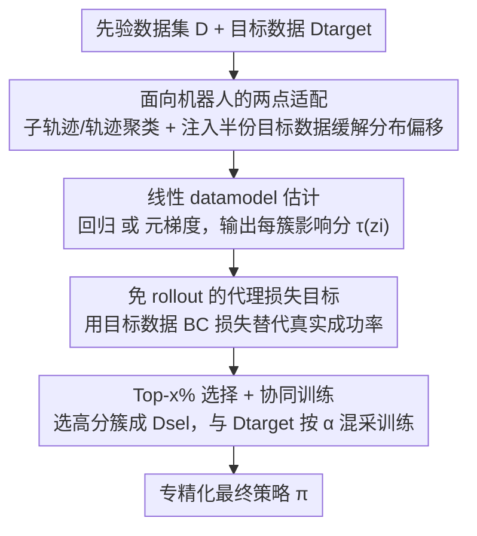

# DataMIL: Selecting Data for Robot Imitation Learning with Datamodels

**会议**: ICLR2026  
**OpenReview**: [https://openreview.net/forum?id=AcTsKglDdh](https://openreview.net/forum?id=AcTsKglDdh)  
**代码**: 待确认  
**领域**: 机器人 / 具身智能  
**关键词**: 模仿学习, 数据选择, datamodels, 数据归因, 协同训练

## 一句话总结
DataMIL 把 NLP/CV 里的 datamodels（数据归因）框架搬到机器人模仿学习，用策略本身端到端地给每条先验数据打"对任务成功率的影响分"，再挑高分数据与目标数据协同训练；它用一个免 rollout 的代理损失替代昂贵的真机评测，在 60+ 仿真与真实操作任务上比相似度检索类基线平均高出约 10%，并能从 OXE 这类超大异构数据集里选出真正有用的跨本体数据。

## 研究背景与动机
**领域现状**：机器人社区正在复刻语言/视觉大模型的路线，靠堆积海量、多样的演示数据（多任务、多场景、多本体，如 OXE）训练"通用策略"（RT-1/RT-2、π0、GR00T 等）。这些通用策略在一大堆任务上平均表现不错，但落到单个具体任务上常常不够强，需要再用新采的任务专属数据做后训练微调。

**现有痛点**：一个自然的想法是——别只用少量任务数据，而是从已有的大数据集里挑一部分有用的子集，和任务数据一起协同训练（co-training）。但"挑数据"这件事在机器人里特别难：理论上要验证某个子集好不好，得在这个子集上重训一个策略再去真机 rollout 评测，既慢又危险，对任何上规模的数据集都不可行。现有机器人数据选择方法为了绕开 rollout，全都退化成**启发式相似度**：假设"和目标演示最相似的数据最有用"——语言描述相似（Zha 等）、视觉相似（STRAP）、运动光流相似（FlowRetrieval）、状态-动作对相似（BehaviorRetrieval）。

**核心矛盾**：这些相似度启发式都隐含了"相似=有用"的假设，却完全**不考虑一条数据对最终策略性能的真实影响**。论文反复强调的反例：两条看起来几乎一样的状态，动作分布可能截然不同——一条能降低目标任务损失、是有益的，另一条会把策略带偏、是有害的。光看相似度根本区分不开这两者，所以朴素地"全量用上"或"按相似度选"都可能把性能拖下去。

**本文目标**：在不做真机 rollout 的前提下，找到一个子集 $D'\subset D$ 使 $M(A(D'))$（即在该子集上训练得到的策略的真实成功率）最大化，形式化为 $\arg\max_{D'\subset D} M(A(D'))$。

**切入角度**：NLP/CV 早就有比相似度更"贴近真实目标"的工具——**datamodels**（Ilyas 等 2022）。它把"学习算法 + 模型"看成一个吃数据、吐性能的黑箱，去拟合一个估计器 $\hat f(D')\approx M(A(D'))$，从而不必真训练就能预测"在这个子集上训练会得到多好的策略"。问题是 datamodels 在机器人里同样卡在 rollout 上——估计 $M$ 仍需真机评测。

**核心 idea**：用一个**可微、免 rollout 的代理损失**$\hat M$（目标数据上的行为克隆损失）替换真实成功率 $M$，让 datamodels 能在机器人场景被高效估计；从而用"端到端、性能感知"的方式给每条数据打分选数据，而不是靠人类定义的相似度。

## 方法详解

### 整体框架
DataMIL（Datamodels for Imitation Learning）要解决的是：给定一个大的先验数据集 $D$、一个固定的模仿学习算法 $A$、以及一小撮目标任务演示 $D_\text{target}$，从 $D$ 里挑出真正能提升目标任务成功率的子集 $D_\text{sel}$。整条管线分四步串起来：① 先把先验数据按时序结构**聚类**成轨迹或子轨迹（降低单样本影响估计的方差）；② 用**回归**或**元梯度**两种估计器、配合一个**免 rollout 的代理损失**，给每个数据簇估计一个线性影响分 $\tau(z_i)$；③ 选出影响分最高的前 $x\%$ 组成 $D_\text{sel}$；④ 把 $D_\text{sel}$ 与 $D_\text{target}$ **协同训练**出最终策略。所有打分都在离线完成，不碰真机。

datamodel 的核心是一个线性近似：对任意子集 $D'\subset D$，预测值写成 $\hat f(D')=\sum_{z_i\in D'}\tau(z_i)$，其中 $\tau(z_i)$ 是样本 $z_i$ 对目标指标的**可加贡献**。线性形式让"选数据"变得极简——直接取 $\tau$ 最高的样本即可。

### 关键设计

**1. 线性 datamodel 估计：回归 vs 元梯度两条路给数据打分**

这是 DataMIL 的内核，针对"怎么在不穷举子集的情况下给每条数据估一个对性能的影响分"。两种估计器都假设训练结果可线性分解 $\hat f(D')=\sum_{z_i\in D'}\tau(z_i)$，区别只在算 $\tau(z_i)$ 的方式。**回归估计器**最直接但最贵：随机采 $m$ 个子集 $D_j\subset D$，每个都训练一个策略 $A(D_j)$ 并评测得 $M_j=M(A(D_j))$，凑出 $m$ 对 (子集, 性能) 后做最小二乘回归

$$\{\tau(z_1),\dots,\tau(z_n)\}:=\arg\min_{\tau\in\mathbb{R}^n}\sum_{j=1}^{m}\Big(\sum_{j:z_i\in D_j}\tau_i-M(A(D_j))\Big)^2,$$

本质就是把目标指标线性回归到"每个样本是否出现在子集里"上。问题是它要训成百上千个模型，对 Octo 这类现代视觉运动策略根本扛不住。于是引入**元梯度估计器**：用权重向量 $w\in[0,1]^n$ 参数化数据集（$w_i=1$ 表示纳入第 $i$ 样本），对 $M(A(w))$ 在全 1 向量 $w_0$ 处做一阶泰勒展开 $M(A(w))\approx M(A(w_0))+\nabla_w M(A(w_0))^\top(w-w_0)$，其中梯度 $I=\nabla_w M(A(w_0))$ 就是经典的**影响函数**，刻画数据权重变化如何影响性能。直接算 $I$ 需要对整个训练过程求导（即"元梯度"，历来很难），但近期工作（Engstrom 等 2025）证明可借 SGD 的迭代结构、用逐步自动微分 + 高效数据结构**精确且高效**地算出元梯度，得到的影响分 $I_i$ 直接当 datamodel 系数用——只需训一遍即可，比回归估计快得多。

**2. 免 rollout 的代理损失目标：用行为克隆损失替代真实成功率**

这一招解决了把 datamodels 搬进机器人的最大障碍——真实成功率 $M$ 要靠真机 rollout，既贵又**不可微**，元梯度估计器没法用。DataMIL 引入一个代理指标 $\hat M$：取一小份留出的目标演示 $D_\text{target}$，定义

$$\hat M(\pi, D_\text{target})=\frac{1}{|D_\text{target}|}\sum_{(s,a)\in D_\text{target}}-L_\text{BC}(\pi(s),a),$$

即目标数据上行为克隆损失的负值。它有两个关键性质：(1) 完全不需要额外 rollout；(2) 对策略参数完全可微，从而能喂给元梯度估计器。这样原优化目标里的 $M$ 就被 $\hat M$ 替换，整条选数据流程变成端到端可微。论文专门在 MetaWorld 的 pick-place-wall 任务上验证了"代理够不够好"：对比直接为真实成功率估 datamodel（DM-rollouts）、为代理损失估（DataMIL-rg 回归 / DataMIL-meta 元梯度）三种做法，结论是——换成代理指标只带来很小的成功率下降，再换成元梯度又掉一点但训练显著更快；而且无论哪种选出来的数据，训出的策略都远超"全量数据"和"只用目标数据"两个基线（约 7× 于全量策略，目标-only 几乎全失败）。这说明验证损失虽然在机器人里是个有噪声的性能预测器，但作为**数据选择信号**已经足够好用。

**3. 面向机器人的两点适配：时序聚类降噪 + 注入目标数据缓解分布偏移**

datamodels 直接照搬到机器人会踩两个坑，这个设计点把两处机器人特有的修补合在一起。其一是**聚类降噪**：在单个状态-动作对粒度上估影响分噪声极大（每个样本训练中只被看到几次，个体效应微弱难测），而机器人数据天然成序列结构，所以按不同时间尺度聚类——子轨迹、任务、整个域——再估"簇级"影响。粒度有 trade-off：细粒度选得精但噪声大，粗粒度估得稳但丢细节；论文发现最优聚类尺度是数据集规模的函数——中等规模（LIBERO）用子轨迹聚类平衡得最好，超大规模（OXE）则聚到轨迹级才稳。其二是**缓解分布偏移**：机器人里光照、相机位姿、机器人动力学的微小变化都会剧烈改变数据分布，跨异构数据集（不同本体/场景/任务）选数据时尤甚；由于 datamodel 依赖在先验数据上训策略来估影响，训练分布与目标分布差太大会让估计变差。对策是把 $D_\text{target}$ 对半分，一半混进先验数据参与 datamodel 估计（让策略学习对齐目标域），另一半纯用来算代理目标。这个技巧只在真实世界（OXE）用，仿真（MetaWorld/LIBERO）里目标数据和先验数据分布本就接近，无需此举。

**4. Top-x% 选择 + 协同训练：把影响分变成最终策略**

拿到每个簇的影响分后，DataMIL 取正影响最高的前 $x\%$ 簇组成 $D_\text{sel}$，再用协同训练配方训下游策略：每个训练步以概率 $\alpha$ 从 $D_\text{target}$ 采样、以概率 $1-\alpha$ 从 $D_\text{sel}$ 采样，做行为克隆。这一步看似平凡，但它是"性能感知选择"落地的最后一环——前面所有的估计/聚类/代理损失都是为了让这里挑出的 $D_\text{sel}$ 真的有益；协同混采则保证目标任务数据始终有足够权重，避免被大量先验数据淹没。整套流程总结为四步：聚类先验数据 → 用代理指标 + 回归/元梯度估影响 → 选 top 簇成 $D_\text{sel}$ → 与目标数据协同训练。

## 实验关键数据

### 主实验
在 60+ 仿真与真实操作任务上验证，覆盖 MetaWorld（50 任务）、LIBERO（100 任务，取 LIBERO-10 评测）、Open-X Embodiment（真机 4 任务、2 本体）。

| 设置 | 策略 / 估计器 | 关键对比 | 结果 |
|------|--------------|---------|------|
| MetaWorld（50 任务） | MLP 高斯头 / 回归估计器，选 top 10% | vs SR/AR/BR/STRAP/Flow 等 SOTA 基线 | DataMIL 平均成功率高约 **10%** |
| MetaWorld pick-place-wall | 代理验证 | vs Target-Only / All-Data | 选数据策略 ≈ **7×** 全量数据策略成功率，目标-only 几乎全失败 |
| LIBERO-10（10 长程任务） | Octo（Transformer 扩散策略）/ 元梯度，先验 LIBERO-90（4500 演示），选 10% | vs STRAP/BR/Flow | 基线各任务波动大；DataMIL **跨所有任务稳定最高**，平均最优 |
| OXE 真机（Franka-Ball / Franka-Pouch / Tiago-Sink / Droid-Multitask） | Octo / 元梯度 | vs Random / BR / Flow / AR | DataMIL 在所有任务上**一致最高**，含未见本体 Tiago |

### 消融与分析

| 配置 / 分析 | 现象 | 结论 |
|------------|------|------|
| 代理指标 $\hat M$ 替代真实 $M$ | 仅边际下降 | 验证损失虽噪声大，但作为选择信号够用 |
| 元梯度替代回归 | 再掉一点，但训练显著更快 | 大模型（Octo）下元梯度是唯一可行路线 |
| 聚类粒度 vs 数据规模 | LIBERO 用子轨迹、OXE 用轨迹级 | 最优粒度随数据规模变化 |
| 选中数据的来源分布 | DataMIL 跨多数据集均衡选；基线集中在单一源（AR→RT-1，Flow→BC-Z，BR→Bridge） | 无精确匹配数据时，需要"相关且通用"的数据促成正迁移 |

### 关键发现
- **相似度基线的系统性缺陷**：状态相似（SR）拒不掉差动作、动作相似（AR）选到任务无关但动作分布像的数据、状态-动作相似（BR）给两个模态等权未必合适——它们都被"相似≠有用"反例打败。
- **跨本体迁移**：在 Tiago-Sink（Tiago 本体从未出现在先验数据里）中，DataMIL 仍能选出 RT-1/BC-Z/Bridge 等"虽然外观差异大、但都是桌面 ego 视角操作"的跨本体数据，提升成功率。
- **有害数据长得像有用数据**：DataMIL 排名最高与最低的样本往往视觉上很像（同本体/同数据集），呼应 CV 里"有害数据和有益数据外观相似只是标签不同"的发现——这正是相似度方法做不到、而性能感知方法能区分的核心。

## 亮点与洞察
- **把"选数据"重新锚定到真实优化目标**：不再问"哪条数据像目标"，而是问"哪条数据真的让策略更强"。这一视角转换是整篇论文的灵魂，也是它能区分"长得像但有害"数据的根本原因。
- **代理损失这一刀切得很关键**：用目标数据 BC 损失替代真机成功率，同时解决了"贵"和"不可微"两个问题，让元梯度估计器得以在机器人里跑起来——这是工程上让 datamodels 落地机器人的命门。
- **聚类粒度随数据规模自适应**是个可迁移的实用经验：任何想做样本级影响归因的场景，都面临"个体信号弱、噪声大"的问题，按数据天然结构聚类再估簇级影响是通用解法。
- **"相关且通用 > 精确匹配"的迁移洞察**：当没有与目标任务精确匹配的数据时，均衡选取多源、通用的数据反而能促成正迁移、避免过拟合到单一域——这对真实世界跨本体数据复用很有启发。

## 局限与展望
- **计算成本仍高**：即便用了高效的元梯度估计器，估 datamodel 的开销仍是"在全量数据上训一个策略"的数倍，可扩展性是主要瓶颈；作者建议用更小的代理模型加速。
- **超参依赖且缺乏直觉**：目标数据集规模、聚类尺度等一堆超参目前还没有强先验指导，依赖经验调，作者期待后续工作让这些选择更有原则、更易用。
- **目标设置以单任务为主**：虽然 Droid-Multitask 部分触及多任务，但真正大规模、多任务的机器人设置尚未充分验证，是重要的开放方向。
- **代理损失是有噪声的预测器**：论文自己承认验证损失在机器人里对真实成功率的预测有噪声，换成代理与元梯度都会带来小幅性能损失——精度与效率之间存在权衡。

## 相关工作与启发
- **vs BehaviorRetrieval (BR)**：BR 在状态-动作对上训 VAE，按隐空间相似度检索单个状态-动作对；DataMIL 不靠相似度，直接估每条数据对性能的影响，能区分"相似但有害"的数据。
- **vs FlowRetrieval (Flow)**：Flow 用 GMFlow 光流特征训 VAE 做检索；同属相似度启发式，在异构数据（如 Franka-Pouch）上会错选到 BC-Z 等无关域，DataMIL 则稳定选到同本体 Franka 数据。
- **vs STRAP**：STRAP 用 DinoV2 特征 + 动态时间规整检索相似子轨迹；在干净、单视角、单本体的 LIBERO 上对相似度基线友好，但跨任务有效性波动大，DataMIL 跨任务一致更强。
- **vs CUPID（并行工作）**：CUPID 聚焦单任务，用在线 rollout 估计策略梯度影响；DataMIL 完全离线打分、且能从大型异构数据集里选，端到端、性能感知。
- **vs 通用策略数据混合（Re-Mix 等）**：Re-Mix 用 DoReMi 式优化学域级混合比例做通用训练；DataMIL 面向任务专精的样本级/簇级选择，目标不同。

## 评分
- 新颖性: ⭐⭐⭐⭐⭐ 首次把 datamodels 数据归因框架完整落地机器人模仿学习，并用代理损失绕开 rollout，视角和工程都新。
- 实验充分度: ⭐⭐⭐⭐⭐ 60+ 任务、仿真+真机、两种估计器、含未见本体与多任务，覆盖很全。
- 写作质量: ⭐⭐⭐⭐ 动机推导清晰、反例直观；部分公式细节散落附录，主文略需对照。
- 价值: ⭐⭐⭐⭐⭐ 给"如何复用大规模异构机器人数据"提供了一条性能感知的实用路线，影响面大。

<!-- RELATED:START -->

## 相关论文

- [\[CVPR 2026\] NIL: No-data Imitation Learning](../../CVPR2026/robotics/nil_no-data_imitation_learning.md)
- [\[ICLR 2026\] Difference-Aware Retrieval Policies for Imitation Learning](difference-aware_retrieval_policies_for_imitation_learning.md)
- [\[CVPR 2026\] Video2Robo: 3DGS-based Synthetic Data from One Video Enables Scalable Robot Learning](../../CVPR2026/robotics/video2robo_3dgs-based_synthetic_data_from_one_video_enables_scalable_robot_learn.md)
- [\[ICLR 2026\] Rodrigues Network for Learning Robot Actions](rodrigues_network_for_learning_robot_actions.md)
- [\[ICLR 2026\] Geometry-Aware Policy Imitation](geometry-aware_policy_imitation.md)

<!-- RELATED:END -->
