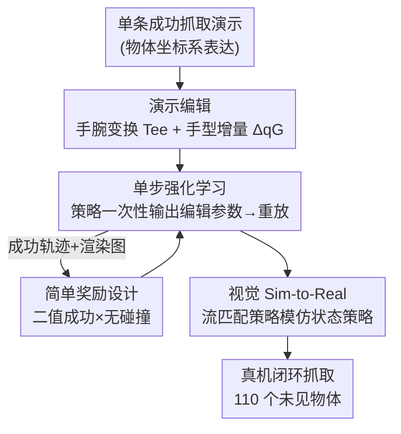

# DemoGrasp: Universal Dexterous Grasping from a Single Demonstration

**会议**: ICLR2026  
**OpenReview**: [https://openreview.net/forum?id=Bf4FeuW0Mr](https://openreview.net/forum?id=Bf4FeuW0Mr)  
**代码**: 项目页 https://research.beingbeyond.com/demograsp  
**领域**: 机器人 / 具身智能 / 灵巧抓取  
**关键词**: 灵巧抓取, 演示编辑, 单步强化学习, Sim-to-Real, 流匹配策略

## 一句话总结
DemoGrasp 从**一条**成功抓取演示出发，让 RL 策略只学"如何编辑这条演示"（改手腕位姿决定抓哪、改手指关节决定怎么抓），把高维长程的灵巧抓取压成一个单步决策问题，用二值成功+碰撞惩罚这种极简奖励就能在数千物体上训出通用策略，仿真 95%、真机 110 个未见物体 86.5% 成功率，并能跨七种机械手本体迁移。

## 研究背景与动机

**领域现状**：多指灵巧手因为接近人手、自由度高，被认为是最适合做工具使用、手内重定向、双手协作的末端执行器，而"通用抓取（任意物体都能抓起）"是这一切的前提。近几年主流做法是用强化学习（RL）训练闭环抓取策略，并配上 UniDexGrasp / UniDexGrasp++ / ResDex / UniGraspTransformer 等一系列在观测特征设计、稠密奖励 shaping、课程学习上的技巧。

**现有痛点**：灵巧手动辄十几到几十个自由度（DoF），动作空间高维；闭环抓取又是长程任务，导致 RL 探索极其困难。为了让 RL 收敛，前人不得不堆复杂的奖励项（手-物距离、抬物、抬手等）和多阶段课程；很多工作还训在"没有机械臂的浮空手"上、用了真机拿不到的特权接触信息（privileged contact），并且在碰撞惩罚和其他奖励项之间反复权衡。这些都让方法既难迁移到新本体，又难真机落地——尤其抓桌面上又薄又小的物体时容易频繁碰撞或失败。

**核心矛盾**：通用灵巧抓取本质是个**多任务优化**问题（物体几何千差万别），叠加高维动作 + 长程 horizon，使得"直接在底层机器人动作空间里探索"既低效又容易陷入次优、还要面对灾难性遗忘和梯度干扰。换句话说，难点不在"会不会抓"，而在"探索空间太大、奖励太难调"。

**本文目标**：去掉复杂奖励 shaping 和多阶段流程，用一个简单框架学到既强又好迁移、还能直接真机部署的通用灵巧抓取策略。

**切入角度**：作者的关键观察是——**一条**针对某个物体的成功抓取演示，已经编码了大量可迁移的抓取模式：靠近物体抓取中心、收拢手型、抬起手腕。要抓不同位置、不同大小的新物体，往往只需对这条演示里的动作做**小幅编辑并重放**：对手腕位姿做个变换就改了"抓哪"，把手型调得更张开就改了"怎么抓"。

**核心 idea**：让 RL 不在底层动作空间里探索，而是只探索"如何编辑这条演示"的两个轴（手腕 SE(3) 变换 + 手指增量关节角），并把整个抓取试验形式化为**单步 MDP**，从而把探索负担和奖励复杂度同时压到最低。

## 方法详解

### 整体框架

DemoGrasp 的输入是任意摆放的物体（初始末端位姿、物体位姿、完整点云），输出是一个能抓起它的平滑动作序列；训练目标是一条对数千物体通用的状态策略，再蒸馏出一条只看图像的视觉策略用于真机。整条管线分四步串起来：先准备**一条**成功抓取演示并把它表达在"以物体几何中心为原点"的初始物体坐标系下；面对新物体时，**演示编辑器**策略只在第一帧看一眼观测，输出一个末端 SE(3) 变换 $T^{ee}$ 和一组手指增量关节角 $\Delta q_G$，用它们改写演示里的动作并在仿真里重放，整段 episode 只回传一个奖励——这就是把多步抓取**重写成单步 MDP**；奖励只用"二值成功 + 碰撞惩罚"这一极简组合训练；最后在训练好的 RL 策略的成功轨迹上（配渲染图像）训一条**流匹配视觉策略**，做 Sim-to-Real。

### 关键设计

**1. 演示编辑：把"通用抓取"重述为"对一条演示做参数化改写"**

这一步直击"高维动作 + 长程探索"的痛点。作者把演示定义为某物体一次成功抓取的轨迹 $D = \{(q^{*hand}_t, p^{*ee\text{-}obj}_t)\}_{t=0}^{T_D}$，其中手型序列 $\{q^{*hand}_t\}$ 是从张开到收拢、末端轨迹 $\{p^{*ee\text{-}obj}_t\}$ 是先逼近物体中心再抬起，且全部表达在"把世界系平移到物体几何中心"的**初始物体坐标系**里。对新位置的同一物体，直接重放这条演示就已有不错成功率（见消融的 75% 起点），因为重放天然带平移不变性。但通用抓取需要更多灵活性：大物体要换抓取部位、薄物体要让手指探到底下。于是引入两类编辑参数——末端变换矩阵 $T^{ee}\in SE(3)$ 改"抓哪"，手指增量角 $\Delta q_G$ 改"怎么抓"。动作按式改写：抬起前的末端位姿乘上 $T^{ee}$、$T_{lift}$ 之后沿 $z$ 方向加常量 $\Delta z$ 垂直抬起；手型则在初始张开姿 $q^{*hand}_0$ 与编辑后的抓取姿 $q^{*hand}_{T_{lift}}+\Delta q_G$ 之间逐元素插值。记编辑后演示 $D' = \mathrm{Edit}(D, T^{ee}, \Delta q_G)$，重放它就能在不同位置、朝向、手型下抓物，从而把探索从"底层动作"挪到了一个紧凑的编辑参数空间。

**2. 单步 MDP 重构：把长程抓取压成"看一眼、出一组参数、重放到底"**

有了编辑方案，作者干脆把整个任务重写成**单步 MDP**：策略只在第一帧观测（初始末端位姿 $p^{ee}_0$、初始物体位姿 $p^{obj}_0$、完整点云 $c^{obj}_0$）下输出一个动作——即编辑参数 $(T^{ee}, \Delta q_G)$；环境随后重放编辑后的演示最多 $T$ 步、然后终止并回传整段奖励。策略 $\pi(T^{ee}, \Delta q_G \mid p^{ee}_0, p^{obj}_0, c^{obj}_0)$ 只需最大化单步期望奖励 $\mathbb{E}[r]$。实现上把末端旋转在观测里用四元数、在动作里用欧拉角，得到紧凑表示。这一步是整套方法效率的来源：动作空间低维、决策 horizon 为 1，多任务探索负担被大幅削减，复杂奖励 shaping 也就没必要了——这正是它能在数百到数千物体上并行训练的关键。

**3. 简单奖励设计：二值成功 × 无碰撞，再用"半数环境放开桌面碰撞"破解薄物体死结**

因为动作空间紧凑、horizon 短，作者用了一个几乎不能更简单的奖励：$r = \mathbb{1}[\text{success}] \cdot \mathbb{1}[\text{执行中无碰撞}]$，让策略专注于"无碰撞地抓起来"。但桌面上的扁平物体常常**必须**让手指轻触桌面才能探到物体底下，严格无碰撞反而抓不起来。作者用 IsaacGym 的大规模并行仿真，在**一半环境里随机关闭机器人-桌面碰撞检测**、允许手与桌面穿透；碰撞通过手部关键点是否穿透桌面来判定。最终效果是分层的：无碰撞成功 $\mathbb{E}[r]=1$、有桌面接触的成功 $\mathbb{E}[r]=0.5$、失败 $0$，从而既鼓励避免无谓碰撞、又在难抓物体上允许"有益的轻触"。正是这个设计让它成为（据作者所知）首个能在桌面无严重碰撞地抓起未见薄小物体的方法。

**4. 视觉 Sim-to-Real：用流匹配策略蒸馏状态策略，闭合视觉与动作的仿真-现实差**

状态策略依赖物体位姿和完整点云，这些在真机上拿不到。作者在状态策略的成功 rollout 上记录机器人本体感受（手指关节角 + 末端位姿）、动作、以及渲染的 RGB/深度图，构成约 3.5 万条轨迹的数据集，再训一条带**动作分块（action chunking）的流匹配（Flow-Matching）策略**做模仿学习——流匹配能高质量建模多峰动作分布。为闭合视觉差，数据采集时对颜色、纹理、光照、相机外参、桌面位置做域随机化，并微调一个预训练 ViT 作视觉编码器。由此得到一条只看图像的闭环策略，可零样本部署到真机，并支持 RGB / 深度输入、能扩展到杂乱场景和语言指令抓取。

### 一个完整示例

以"抓桌上一个偏大的瓶子、且它被随机摆在 50cm×50cm 区域某处"为例走一遍：① 系统先把世界系平移到瓶子几何中心建立初始物体坐标系；② 演示编辑器只看第一帧（末端位姿 + 瓶子位姿 + 点云），输出 $T^{ee}$ 把演示的逼近方向对准这个新位置、并因为瓶子较大而输出一组让手更张开的 $\Delta q_G$；③ 把编辑后的演示在仿真里重放——末端先按 $T^{ee}$ 变换后的轨迹逼近、收拢手型、再沿 $z$ 抬起 10cm 以上；④ 若抬起成功且无桌面穿透，整段 episode 拿到 $r=1$，该 $(T^{ee},\Delta q_G)$ 被 RL 强化。训练时数千个这样的物体在 IsaacGym 里并行试验，策略逐渐学会"看一眼就给出正确编辑参数"。部署时则换成流匹配视觉策略闭环执行，遇到失败还能 regrasp 重抓。

### 损失函数 / 训练策略

RL 阶段优化单步期望奖励 $\mathbb{E}[r]$（式 3 的二值成功×无碰撞），在 IsaacGym 并行环境上对数百到数千物体同时训练，半数环境随机放开桌面碰撞。视觉阶段用流匹配 + 动作分块做模仿学习，蒸馏状态策略的成功轨迹，配合颜色/纹理/光照/相机外参/桌面位置的域随机化与 ViT 微调。

## 实验关键数据

### 主实验

在 DexGraspNet + Shadow Hand 上（3200 训练物体），DemoGrasp 在状态/视觉两种设定下都明显超过此前 SOTA，且训练↔未见物体的泛化 gap 仅约 1%：

| 设定 | 指标(子集) | DemoGrasp | 之前SOTA(UniGraspTransformer) | 提升 |
|------|-----------|-----------|------|------|
| 状态 | Train. | 95.2 | 91.2 | +4.0 |
| 状态 | Test 未见类 | 94.4 | 88.3 | +6.1 |
| 视觉 | Train. | 92.2 | 88.9 | +3.3 |
| 视觉 | Test 未见类 | 90.1 | 86.8 | +3.3 |

跨本体泛化：仅用 175 个物体训练，Allegro+UR5 在五个 OOD 数据集上大多超过 RobustDexGrasp（如 DGA 74.4 vs 64.4、Omni6DPose 82.24 vs 73.00、VisualDexterity 97.80 vs 92.50）；七种机械手平均在未见数据集上达 84.6% 成功率。真机 110 个未见物体平均 86.5%、常规尺寸 95.3%、薄物体 68.3%、小物体 76.7%、杂乱场景 >80%。

### 消融实验

| 配置 | 关键指标(成功率%) | 说明 |
|------|------|------|
| Sampling + BC | 77.56 | 用采样代替 RL，数据多峰不一致，难收敛 |
| RL（完整） | 96.24 | 单步 RL 直接优化期望回报，单峰一致 |
| 只重放原演示(无 RL) | 75.29 / 73.43(train/test) | 平移不变重放已有非平凡起点 |
| +Δxyz | 81.35 / 76.04 | 加手腕平移 +6% |
| +Δxyz+Δrpy | 94.22 / 81.39 | 加手腕旋转 +13%，最关键 |
| +Δxyz+Δrpy+Δq | 96.24 / 82.74 | 加手指 DoF 仅 +2%，但抓得更稳 |

相机配置消融：Two-RGB 在真机难例（tiny bottle、phone case）上 5/5，明显优于深度方案（0/5），说明双 RGB 对薄小物体更鲁棒。

### 关键发现
- **RL 不可替代**：同样的编辑方案下，用采样+BC 只有 77.56%，而 RL 96.24%——因为采样对同一物体会产出多峰且互相矛盾的成功轨迹，BC 难以收敛到最优；RL 直接优化期望回报得到单峰一致策略。
- **手腕旋转贡献最大**（+13%），手腕平移次之（+6%），手指 DoF 增益最小（+2%）——说明把灵巧手当"单自由度夹爪"用就已能抓得不错，但加上手指 DoF 能形成更鲁棒的力闭合（如侧抓花瓶、用拇/食/无名指夹持）。
- **平移不变性**带来强空间泛化：基线不随机化物体初始位置，DemoGrasp 在 50cm×50cm 大范围随机下仍训得动，因为重放机制对平移天然不变，空间随机化不阻碍 RL 探索。
- 加机械臂几乎不掉点（FR3+Shadow 仅比浮空 Shadow 低 1.4%），而无碰撞训练让带臂策略更利于真机部署。

## 亮点与洞察
- **把问题"降维"而非"加技巧"**：前人靠堆奖励项和课程去硬啃高维长程探索，DemoGrasp 反其道把任务重述成单步、低维编辑——同一个困难被换了个更小的解空间，复杂奖励自然消失。这种"换问题表述"的思路比"调更好的奖励"更治本。
- **一条演示当"先验骨架"**：演示编码了逼近-收拢-抬起的可迁移模式，策略只需学"怎么微调"。这与"轨迹优化里给个好初值"异曲同工，可迁移到其他长程操作任务（如插拔、倒水）——先录一条、再让 RL 学编辑参数。
- **"半数环境放开桌面碰撞"是个很巧的工程 trick**：用并行仿真把"该不该碰桌面"这个二难变成数据层面的软约束，既保留无碰撞偏好又解锁薄物体，几乎零额外奖励设计成本。
- 流匹配 + 动作分块对多峰动作分布的建模，配合域随机化，是状态→视觉零样本真机迁移能成功的关键拼图。

## 局限与展望
- 薄/小物体真机成功率（68.3% / 76.7%）仍明显低于常规物体（95.3%），桌面接触式抓取的精细控制还有空间。
- 方法依赖"一条好演示"作为起点；演示质量/代表性对结果的影响、以及多类形态物体是否需要不同演示，文中以单演示为主，未充分展开（不同物体族是否该配不同 demo 值得探究）。
- 单步 MDP 假设"一次编辑+重放"足以覆盖抓取——对需要中途重规划的强闭环交互（如物体滑动、动态干扰）可能不够，真机靠视觉策略的 regrasp 弥补，但本质仍是开环编辑的重放。
- 评估集中在抓起-抬升任务，向手内操作、工具使用等后续灵巧操作的延展仅作为愿景。

## 相关工作与启发
- **vs UniDexGrasp / UniDexGrasp++**: 他们在底层动作空间用稠密奖励 + 课程/迭代蒸馏硬训多步策略，且常用浮空手、特权接触信息；DemoGrasp 在编辑参数空间用单步 RL + 二值奖励，带臂训练、无需特权信息，更利于真机。
- **vs UniGraspTransformer**: 它靠"逐物体穷举 RL + Transformer 蒸馏"绕过多任务 RL；DemoGrasp 直接用演示编辑把多任务探索压到单步，仿真上还反超 4–6%。
- **vs ResDex**: 残差 RL 加速多任务探索仍在底层动作空间；DemoGrasp 换的是问题表述（演示编辑）而非残差结构。
- **vs RobustDexGrasp**: 同为面向真机的通用抓取，DemoGrasp 在多数 OOD 数据集上更高，且首次在桌面无严重碰撞地抓起未见薄小物体。

## 评分
- 新颖性: ⭐⭐⭐⭐⭐ "演示编辑 + 单步 MDP"是对通用灵巧抓取问题表述的根本性简化，很漂亮
- 实验充分度: ⭐⭐⭐⭐⭐ 仿真+真机、七种本体、多 OOD 数据集、细致动作空间/采样vsRL消融
- 写作质量: ⭐⭐⭐⭐ 思路清晰、图表到位，少数公式需对照原文细读
- 价值: ⭐⭐⭐⭐⭐ 极简奖励 + 强真机迁移，对落地灵巧抓取有很高实用与启发价值

<!-- RELATED:START -->

## 相关论文

- [\[CVPR 2026\] DemoFunGrasp: Universal Dexterous Functional Grasping via Demonstration-Editing Reinforcement Learning](../../CVPR2026/robotics/demofungrasp_universal_dexterous_functional_grasping_via_demonstration-editing_r.md)
- [\[ICLR 2026\] RFS: Reinforcement Learning with Residual Flow Steering for Dexterous Manipulation](rfs_reinforcement_learning_with_residual_flow_steering_for_dexterous_manipulatio.md)
- [\[ICLR 2026\] D-REX: Differentiable Real-to-Sim-to-Real Engine for Learning Dexterous Grasping](d-rex_differentiable_real-to-sim-to-real_engine_for_learning_dexterous_grasping.md)
- [\[ICLR 2026\] One Demo Is All It Takes: Planning Domain Derivation with LLMs from A Single Demonstration](one_demo_is_all_it_takes_planning_domain_derivation_with_llms_from_a_single_demo.md)
- [\[CVPR 2025\] DexGrasp Anything: Towards Universal Robotic Dexterous Grasping with Physics Awareness](../../CVPR2025/robotics/dexgrasp_anything_towards_universal_robotic_dexterous_grasping_with_physics_awar.md)

<!-- RELATED:END -->
