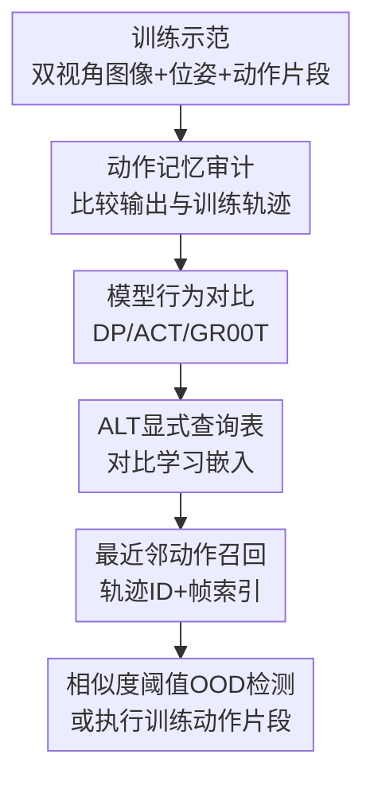

# Demystifying Robot Diffusion Policies: Action Memorization and a Simple Lookup Table Alternative

**会议**: ICLR2026  
**OpenReview**: [https://openreview.net/forum?id=PL0tJOfm7I](https://openreview.net/forum?id=PL0tJOfm7I)  
**代码**: https://stanfordmsl.github.io/alt/  
**领域**: 机器人 / 具身智能  
**关键词**: 机器人模仿学习, Diffusion Policy, 动作记忆, 查询表策略, OOD检测

## 一句话总结

这篇论文系统证明小数据机器人模仿学习中的 Diffusion Policy 更像是在根据当前图像检索训练集动作片段，而不是学习可泛化的动作生成器，并提出一个显式的 Action Lookup Table (ALT) 用对比学习嵌入 + 最近邻检索达到接近 Diffusion Policy 的表现，同时推理更快、OOD 判断更直接。

## 研究背景与动机

**领域现状**：机器人视觉运动模仿学习里，Diffusion Policy 已经成为非常强的单技能操控策略。它把策略建模成条件扩散模型：输入相机图像和机器人状态，输出一个短动作片段，执行其中一部分后再闭环重新推理。这个范式在小规模示范数据上常常比传统行为克隆和 transformer action chunking 更稳，尤其在抓取、放置、长时序操控任务里表现突出。

**现有痛点**：真正奇怪的地方在于，Diffusion Policy 通常只用几十到几百条示范训练，却保留了上亿参数级别的生成模型容量。按照经典机器学习直觉，这种设定应该非常容易过拟合，而且训练中常见现象确实是训练损失很低、测试损失很高；但实践里，过拟合反而像是得到好机器人策略的必要条件。也就是说，模型的泛化解释和实际表现之间出现了明显冲突。

**核心矛盾**：如果 Diffusion Policy 真在学习动作空间的连续泛化，那么面对训练点之间的图像、训练范围外的物体位置、甚至视觉干扰时，它应该生成插值、外推或逐渐退化的动作片段。可作者观察到的现象相反：模型即使看到猫、狗这类完全 OOD 图像，也往往仍输出某个训练动作片段的近似拷贝。这说明它的鲁棒性未必来自任务理解，而可能来自一种“只从熟悉动作里选一个”的保守检索行为。

**本文目标**：论文围绕三个问题展开。第一，Diffusion Policy 在小数据机器人操控中是否主要依赖动作记忆？第二，同样数据上训练的 ACT 和 GR00T-N1.5 是否也有相同行为？第三，如果记忆检索真是关键机制，能否用一个更简单、更快、可解释的查询表策略复现类似效果？

**切入角度**：作者没有直接从模型内部权重解释扩散策略，而是设计了“动作记忆审计”实验：给模型输入不同分布的观测，然后比较输出动作轨迹和训练轨迹之间的相似度。如果输出在各种 OOD 场景里都贴近某条训练轨迹，就能支持“记忆检索”假设。

**核心 idea**：把 Diffusion Policy 在稀疏示范数据下的成功重新解释为“闭环观测驱动的动作片段查表”，并用显式 ALT 查询表证明这种机制本身已经能解释相当一部分性能。

## 方法详解

### 整体框架

论文包含两个紧密相连的部分：先用动作相似度审计揭示 Diffusion Policy、ACT、GR00T-N1.5 在同一机器人任务上的行为差异，再构造 ALT，把“观测嵌入到动作片段”的隐式记忆机制显式变成一个可查询数据库。ALT 的输入是手腕相机图像、第三视角图像和末端执行器位姿，输出不是神经网络生成的新动作，而是训练集中某条示范轨迹的动作片段或 OOD 标记。

这张图里的前半部分是解释实验，后半部分是 ALT 策略。作者先证明 Diffusion Policy 的输出高度贴近训练动作，再问：既然它像查表，能不能真的查表？答案是可以，但关键不只是用原始状态做最近邻，而是训练一个任务对齐的低维表征空间，让相近观测能检索到正确动作片段。

### 关键设计

**1. 动作记忆审计：用轨迹相似度区分“生成泛化”和“训练动作召回”**

作者定义了一个 memory-audit 相似度 $S$，用来衡量当前推理轨迹 $\tau^{(r)}$ 是否贴近某条训练轨迹。记最近训练轨迹为 $\tau^{(1)}$，第二近训练轨迹为 $\tau^{(2)}$，轨迹距离函数为 $s(\cdot, \cdot)$，则相似度写成 $S = 1 - \frac{s(\tau^{(r)}, \tau^{(1)})}{s(\tau^{(1)}, \tau^{(2)})}$。如果输出轨迹几乎压在某条训练轨迹上，同时和第二近轨迹有明显间隔，$S$ 就接近 1，说明模型更像是在回放训练动作，而不是在多条动作之间平滑插值。

这个指标的价值在于它不评价动作是否“成功”，而只评价动作是否“像训练集”。这很重要，因为一个模型在 OOD 图像下可能选错了动作，但只要它选的是某条熟悉动作，就仍能揭示记忆机制。作者在真实抓杯任务中设计了四类输入：训练位置本身、训练位置之间的插值位置、从训练位置逐渐移到 OOD 区域的位置、以及加入猫狗等视觉干扰的 OOD 图像。若模型有动作泛化能力，输出应随输入连续变化；若模型是记忆检索，输出会突然落到某条训练轨迹附近。实验结果支持后者。

**2. 三类策略对比：Diffusion Policy 记忆最强，ACT 更会插值，GR00T 靠预训练抗干扰**

作者把 Diffusion Policy、ACT 和 GR00T-N1.5 放在同一数据和同一测试场景里比较。Diffusion Policy 在 InD、OOD-Distractors、OOD-Interpolate、OOD-Extrapolate 多种情况下都保持较高的最大相似度，说明它倾向于从训练动作片段中挑一个输出。特别是在猫、狗这类完全无关图像下，它没有生成随机动作，而是回退到一两个训练动作序列，这种行为虽然未必正确，但非常像“保守的动作记忆”。

ACT 的行为更接近传统动作泛化器：在训练点之间，它会产生多个训练动作片段的混合，看起来像合理插值；但在强 OOD 干扰下，这种插值反而会变成不可靠的平均或漂移动作。GR00T-N1.5 则介于两者之间：动作头仍可能受扩散式 manifold attraction 影响而靠近训练模式，但大规模 VLA 预训练给了它更强的视觉不变性，所以在干扰场景下能更好忽略无关第三视角图像，依赖第一视角中的任务线索。

**3. ALT显式查询表：把隐式记忆机制变成可解释、低延迟的最近邻检索**

ALT 的基本思路非常朴素：训练一个融合编码器，把每个时间步的手腕视角图像 $I_i^h$、第三视角图像 $I_i^t$ 和末端位姿 $p_i$ 映射到低维表征；训练完成后，把每个训练帧的表征、轨迹 ID、帧索引和对应动作片段存入数据库。部署时，新观测先被编码成表征，再用余弦相似度或近邻数据结构找到最接近的训练表征，最后直接取出对应动作片段执行。

它和普通 KD-tree baseline 的区别在于表征空间不是随便来的。作者用对比学习训练融合编码器：同一观测经过两种增强得到正样本对，不同样本作为负样本，使用 NT-Xent loss 让同一状态的不同视图靠近、不同状态分开。这样，查询表的键不是原始像素或原始位姿，而是一个更适合动作召回的任务对齐表征。实验里朴素 KD-tree 的真实任务成功率只有 63.3%，而 ALT 可以达到 Diffusion Policy 级别的 InD 成功率，说明“记忆”要工作，仍然需要好的检索表征。

**4. 相似度阈值OOD检测：查不到熟悉状态时显式拒绝，而不是硬生成动作**

Diffusion Policy 面对 OOD 输入时仍会输出某条训练动作，这带来一种表面鲁棒性，但也有安全隐患：模型不会告诉你“我其实没见过这个状态”。ALT 因为是显式最近邻检索，可以把最大相似度和阈值 $\gamma$ 比较；如果低于阈值，就直接标记为 OOD，触发安全 fallback，而不是继续执行可能错误的动作片段。

这个阈值也揭示了 ALT 的取舍。表 3 中 $\gamma=0.9$ 更保守，会把更多 OOD 场景检测出来，但可能拒绝一些本可执行的状态；$\gamma=0.75$ 更宽松，在不使用位姿输入的版本中达到 100% InD 真实任务成功率，并通过更多 OOD 场景，但对 OOD 拒绝不那么严格。因此 ALT 不只是“快版 Diffusion Policy”，还把原本隐性的置信度问题变成了可调的工程安全参数。

### 一个完整示例

假设训练集中有 30 个杯子位置，每个位置只有一条抓杯示范。Diffusion Policy 在训练位置看到杯子时，几乎输出对应示范的动作片段；当杯子放在两个训练位置之间时，它并不会总是生成一条位于两条示范中间的新动作，而是经常选择最像的某条训练动作；当第三视角图像里出现猫或狗时，它仍可能召回某条熟悉抓杯轨迹。

ALT 把这个过程显式化：训练阶段，每个示范帧都被编码成一个低维向量，并和“第几条轨迹、第几帧、后续动作片段”绑定。推理阶段，当前双视角图像和末端位姿进入编码器，得到一个查询向量。如果它与训练库中某个向量的相似度超过阈值，系统取出那一帧对应的动作片段执行；如果相似度低于阈值，系统不假装会泛化，而是报告 OOD。这样，原来藏在扩散采样过程里的“吸向训练模式”被替换成了一个可检查的检索步骤。

### 损失函数 / 训练策略

ALT 的编码器使用 ResNet-18 作为图像骨干，并融合手腕视角、第三视角和末端位姿。每个样本 $d_i=(I_i^h, I_i^t, p_i)$ 经过两套增强 $A_1$ 和 $A_2$，得到两个视图 $v_i^{(1)}$ 和 $v_i^{(2)}$，再通过融合编码器得到 $z_i^{(1)}$ 和 $z_i^{(2)}$。训练目标采用归一化温度缩放交叉熵损失：

$$
L_c = -\frac{1}{2B}\sum_{i=1}^{B}\left[\log\frac{\exp(\operatorname{sim}(z_i^{(1)}, z_i^{(2)})/\tau)}{\sum_{k\ne i}^{2B}\exp(\operatorname{sim}(z_i^{(1)}, z_k)/\tau)} + (1 \leftrightarrow 2)\right]
$$

其中 $\operatorname{sim}(\cdot,\cdot)$ 是余弦相似度，嵌入先做 L2 归一化，温度 $\tau$ 在实验中设为 0.4。这个损失让同一观测的不同增强靠近，同时把 batch 内其他观测推开，从而形成能支持最近邻动作召回的低维表征空间。论文还比较了 ResNet、SimpleCNN、ViT、CLIP、Swin 等编码器，结果显示表征质量对 ALT 至关重要，ResNet-18 在不同维度下最稳定。

## 实验关键数据

### 主实验

| 场景 | ALT 最大相似度 | Diffusion Policy 最大相似度 | ACT 最大相似度 | GR00T-N1.5 最大相似度 |
|------|----------------|------------------------------|----------------|------------------------|
| InD | 1.000 | 0.935 | 0.465 | 0.783 |
| OOD-Distractors | 1.000 | 0.837 | 0.278 | 0.798 |
| OOD-Interpolate | 1.000 | 0.690 | 0.406 | 0.725 |
| OOD-Extrapolate (side) | 1.000 | 0.838 | 0.428 | 0.463 |
| OOD-Extrapolate (back) | 1.000 | 0.875 | 0.355 | 0.745 |

这组数据的核心结论不是 ALT “更聪明”，因为 ALT 直接选择训练轨迹，相似度天然为 1；真正重要的是 Diffusion Policy 在多种 OOD 场景下仍然保持很高的训练轨迹相似度。ACT 的相似度明显更低，说明它确实在做更多动作插值；GR00T 的相似度和 OOD 表现更复杂，体现出预训练 VLA 的抗干扰能力。

| 方法 | 轨迹召回率 | InD真实任务成功率 | MIT推理时间 | 关键现象 |
|------|------------|-------------------|-------------|----------|
| KD-Tree | 100% | 63.3% | 约 0.09s | 原始近邻检索能召回，但任务成功率不足 |
| Diffusion Policy | 100% | 100% | 约 2.65s | 表现强，但推理慢且 OOD 时仍硬输出动作 |
| ALT w/ pose, $\gamma=0.9$ | 100% | 未报告 | 约 0.009s | 更保守，多个 OOD 场景被检测为 OOD |
| ALT w/o pose, $\gamma=0.9$ | 100% | 未报告 | 约 0.009s | 去掉位姿后更容易拒绝 OOD 输入 |
| ALT w/o pose, $\gamma=0.75$ | 100% | 100% | 约 0.009s | 达到 InD 成功率 100%，但阈值更宽松 |

ALT 的推理时间约 0.009 秒，而 Diffusion Policy 约 2.65 秒，速度约提升 294 倍，论文摘要中概括为约 300 倍。结合模型内存小于 Diffusion Policy 的 1/100，这说明在低数据单技能场景下，显式查询表不是玩具 baseline，而是一个很强的工程替代方案。

### 消融实验

| 配置 | 关键指标 | 说明 |
|------|----------|------|
| ResNet-64 | InD 100%，OOD1/2/3/4/7/8 成功，OOD5/6 失败 | 卷积骨干在小数据操控视觉上最稳定 |
| ResNet-128 | InD 100%，趋势与 ResNet-64 接近 | 增大维度没有明显破坏表征 |
| ResNet-256 | InD 100%，趋势与 ResNet-64 接近 | 高维 ResNet 仍稳定 |
| SimpleCNN-64/128/256 | InD 约 19.35%/22.58%/22.58% | 容量和表征能力不足，几乎不能支撑查询表 |
| ViT-64/128/256 | InD 约 12.9%/12.9%/16.13% | 缺少合适预训练和空间归纳偏置，小数据下不稳定 |
| CLIP-128 | InD 100%，但多个 OOD 场景失败 | 语义特征有用，但对输出维度敏感 |
| Swin-64/128/256 | InD 77.42%/83.87%/90.32% | 层级局部窗口结构随维度提升而改善 |

这个消融说明 ALT 的成败并不只是“把训练样本存起来”。真正决定性能的是表征空间是否让同一动作上下文聚在一起、让不同状态分开。ResNet 的局部视觉归纳偏置适合杯子抓取这种几何明确的操控场景，而纯 SimpleCNN 不够强，ViT 在小数据下缺少稳定性，CLIP/Swin 则各有维度和预训练依赖。

### 关键发现

- Diffusion Policy 在真实机器人抓杯任务中表现出最强动作记忆：InD 最大相似度 0.935，OOD-Distractors 仍有 0.837，甚至高度无关图像也会触发某条训练动作的召回。
- ACT 更像动作插值模型，在训练点之间能产生合理混合，但强 OOD 干扰下容易输出偏离训练集的随机或平均动作，因此鲁棒性不如 Diffusion Policy。
- GR00T-N1.5 的 OOD 鲁棒性来自大规模预训练带来的视觉不变性；当冻结 diffusion transformer 只微调小适配层时，记忆化较弱，若进一步微调整个动作专家，则动作记忆明显增强。
- Robomimic 仿真也支持同一结论：Can、Square、Tool Hang、Transport 等任务的 Diffusion Policy rollout 与训练轨迹高度相似，例如 Tool Hang image-observation 相似度达到 0.962，Transport 达到 0.965。
- ALT 的最大价值在于把“模型是否见过类似状态”显式暴露出来，能用相似度阈值做 OOD 监控，而 Diffusion Policy 的隐式采样过程缺少这种直接信号。

## 亮点与洞察

- 这篇论文最有意思的地方是把 Diffusion Policy 的“过拟合为什么有用”讲成了一个反直觉但很有解释力的故事：在单技能、小数据、闭环执行下，动作记忆并不一定是坏事，反而可能是一种保守可靠的策略。
- 作者没有只停留在概念解释，而是设计了轨迹相似度审计，把“模型是不是在记忆”变成可量化问题。这个审计方法可以迁移到其他机器人策略上，用来区分策略是在生成新行为，还是在回放训练库。
- ALT 是一个很好的 sanity check：如果一个极简查询表能接近 Diffusion Policy，说明很多性能可能来自数据覆盖和检索表征，而不是扩散模型本身的复杂生成能力。
- 对机器人安全很有启发的是 OOD 阈值。很多神经策略遇到陌生输入仍会自信输出动作，而 ALT 至少能告诉系统“最近的训练样本也不够近”，这比盲目执行更适合真实机器人部署。
- 对 VLA 微调也有启发：小数据上全量微调 diffusion action expert 可能把模型推向强记忆，而冻结大部分预训练模块、只调小适配层，可能更好保留预训练带来的泛化和鲁棒性。

## 局限与展望

- 实验主要集中在单技能、低数据、短动作片段的操控任务上，尤其是真实机器人抓杯任务。多技能、长时序、强组合泛化的任务是否仍能用“动作查表”解释，需要更多证据。
- ALT 的基础版本依赖存储训练帧表征和动作片段，数据规模变大后会面临内存和检索速度问题。论文提到可用近似最近邻、聚类、动作 tokenization 等方式扩展，但没有系统验证大规模场景。
- 轨迹相似度审计能证明输出像训练轨迹，却不能完全解释模型内部为什么选择那条轨迹，也不能区分“有益记忆”和“偶然重合”的所有边界情况。
- 对 OOD 的处理仍比较粗：相似度阈值能拒绝不熟悉输入，但阈值如何随任务风险、环境变化、相机漂移自适应调整，仍是部署时的关键问题。
- Diffusion Policy 在更大示范数据、更复杂任务或多任务训练下可能从记忆走向真正动作流形泛化。本文更像是在指出当前小数据 regime 的主导机制，而不是否定扩散策略在所有机器人任务中的泛化潜力。

## 相关工作与启发

- **vs Diffusion Policy**: Diffusion Policy 用迭代去噪生成动作片段，表面上是条件生成模型；本文认为在小数据机器人任务中，它的输出常常落回训练动作模式。ALT 则把这种行为显式写成最近邻动作召回，牺牲一部分表达能力，换来更快推理和 OOD 可解释性。
- **vs ACT**: ACT 同样输出 action chunk，但 transformer decoder 更容易在动作片段之间插值。这让它在训练点之间看起来更会泛化，却在强 OOD 干扰下更容易漂到不可靠动作；Diffusion Policy/ALT 的记忆性反而提供了一种保守 fallback。
- **vs GR00T-N1.5**: GR00T 依赖大规模 VLA 预训练获得视觉鲁棒性，小数据微调时既有动作头的记忆倾向，也有预训练语义表征带来的抗干扰能力。本文启发是：机器人策略的泛化可能更多来自预训练表征，而不是小数据动作头本身。
- **vs 传统最近邻模仿学习**: 早期检索式模仿学习往往直接在视觉特征或状态空间做近邻，效果受特征质量限制。ALT 的关键改进是用对比学习构造动作相关表征，让查询表更像一个任务对齐的反应式记忆系统。
- **对后续研究的启发**: 可以把训练库检索、OOD 拒绝、扩散动作生成结合起来：先判断当前状态是否被训练数据覆盖，再决定是直接召回、局部插值，还是交给更强的生成式或规划式策略处理。

## 评分

- 新颖性: ⭐⭐⭐⭐☆ 不是发明全新控制框架，而是用非常清晰的实验把 Diffusion Policy 的小数据成功重新解释为动作记忆，并用 ALT 做了有力反证式验证。
- 实验充分度: ⭐⭐⭐⭐☆ 真实机器人、Robomimic、三类策略对比和编码器消融都很扎实；不足是复杂多技能任务和大数据 regime 仍未覆盖。
- 写作质量: ⭐⭐⭐⭐☆ 论文的问题设置很清楚，三个 research question 层层推进；部分附录实验很多，主文对 ALT 大规模扩展的讨论略偏概念。
- 价值: ⭐⭐⭐⭐⭐ 对机器人模仿学习很有实际价值，因为它提醒研究者不要把小数据成功轻易解释成泛化，并给出一个可部署、可监控、低延迟的强 baseline。

<!-- RELATED:START -->

## 相关论文

- [\[ICLR 2026\] Contractive Diffusion Policies](contractive_diffusion_policies.md)
- [\[ICLR 2026\] Abstracting Robot Manipulation Skills via Mixture-of-Experts Diffusion Policies](abstracting_robot_manipulation_skills_via_mixture-of-experts_diffusion_policies.md)
- [\[ICML 2026\] Discrete Diffusion VLA: Bringing Discrete Diffusion to Action Decoding in Vision-Language-Action Policies](../../ICML2026/robotics/discrete_diffusion_vla_bringing_discrete_diffusion_to_action_decoding_in_vision-.md)
- [\[CVPR 2026\] REACH: Explicit Recovery Behavior for Diffusion Policies](../../CVPR2026/robotics/reach_explicit_recovery_behavior_for_diffusion_policies.md)
- [\[ICLR 2026\] Robust Finetuning of Vision-Language-Action Robot Policies via Parameter Merging](robust_fine-tuning_of_vision-language-action_robot_policies_via_parameter_mergin.md)

<!-- RELATED:END -->
