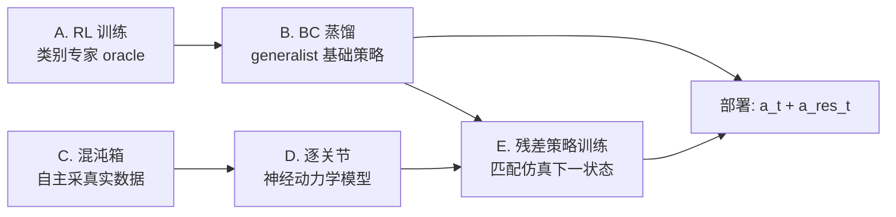

# DexNDM: Closing the Reality Gap for Dexterous In-Hand Rotation via Joint-Wise Neural Dynamics Model

**会议**: ICLR 2026  
**OpenReview**: [https://openreview.net/forum?id=80vjyj5o7l](https://openreview.net/forum?id=80vjyj5o7l)  
**代码**: [meowuu7.github.io/DexNDM](https://meowuu7.github.io/DexNDM)  
**领域**: 机器人 / 灵巧操作 / Sim-to-Real  
**关键词**: 手内旋转, 神经动力学模型, 残差策略, 自主数据采集, 信息瓶颈  

## 一句话总结
DexNDM 用**逐关节神经动力学模型**把高维手-物系统拆成单关节的低维有效动力学，配合"混沌箱"自主采数据，训练残差策略修正仿真基础策略，让单一策略在真实世界中首次实现对复杂形状、高长径比、小尺寸物体在多种手腕朝向下的稳健手内旋转。

## 研究背景与动机
**领域现状**：手内物体旋转（in-hand rotation）是灵巧操作的核心技能，但接触丰富、快速变化、随负载变化的动力学造成了难以逾越的"现实差距"（sim-to-real gap）。

**现有痛点**：已有方法被严重约束——要么假设手掌始终朝上（Qi 2022、AnyRotate），要么只能处理常规尺寸的规则物体，要么依赖昂贵的定制硬件与触觉传感。没有任何工作能在多样手腕朝向与旋转轴下，对长条、小件、复杂形状（动物模型）的物体实现空中旋转。

**核心矛盾**：从真实数据学神经动力学模型是提升 sim-to-real 上限的有前途思路，但灵巧操作存在"数据量 vs 分布相关性"的不可调和冲突——泛化需要海量覆盖多样物体的数据，但保证数据分布相关性又几乎不可能：次优策略无法操纵难物体、掉落需要频繁人工复位、手部遮挡使物体状态难以追踪。

**本文目标**：让单一仿真训练的策略泛化到真实世界中广泛多样的物体与条件。

**核心 idea**：**[因子化动力学]** 不去整体建模高维手-物系统，而是把动力学按关节因子化，把全系统影响（自驱动、关节间耦合、物体负载）压缩进每个关节的低维有效项，让每个关节只用自身本体感受历史预测演化——这一信息瓶颈带来高样本效率与强泛化，进而解锁 **[自主数据采集]** 的"混沌箱"策略。

## 方法详解

### 整体框架
DexNDM 是一条 specialist-to-generalist 的基础策略训练 + 神经 sim-to-real 修正流水线：先按物体类别用 RL 训练专家 oracle，再用行为克隆蒸馏成统一的本体感受 generalist；随后自主采集真实交互数据，学逐关节神经动力学模型，并训练残差策略补偿基础策略的动作以闭合现实差距。部署时执行"基础动作 + 残差"。

### 关键设计

**1. 逐关节神经动力学：用信息瓶颈换泛化。** 全手模型 $q_{t+1}=f_\theta(H_t)$ 用整手 $W$ 步状态-动作历史 $H_t=\{q_j,a_j\}$ 隐式捕获含物体外力的全系统动力学，但仍数据饥渴。DexNDM 改为把每个关节 $i$ 的动力学写成 $H^{\text{eff}}_t\ddot q^i_t + G^{\text{eff}}_t = \tau^i_t$，其中 $H^{\text{eff}}_t,G^{\text{eff}}_t\in\mathbb{R}$ 是把关节耦合、驱动、物体效应蒸馏后的低维有效项；神经模型仅用该关节自身历史预测 $q^i_{t+1}=f_{\psi_i}(h^i_t)$，$h^i_t=\{q^i_j,a^i_j\}$。这条投影既"信息充分"（足以准确预测下一状态），又"鲁棒地简单"（维度太低无法重构原始高维全系统影响），从而强制丢弃伪相关、只学每个关节的本质动力学，兼顾样本效率、泛化性与表达力。

**2. 信息收缩的泛化理论。** 作者用数据处理不等式形式化"为什么简化能更好泛化"：设投影 $g:(H_t,q^i_{t+1})\mapsto(h^i_t,q^i_{t+1})$，则 $\mathrm{KL}(g(P)\|g(Q))<\mathrm{KL}(P\|Q)$（Theorem 3.1，非单射且在 $P,Q$ 结构不同处合并点时严格成立）。再据泛化间隙收缩（Theorem 3.2），在协变量偏移下 $\sup|R_P(f_2\circ g_X)-R_Q(f_2\circ g_X)|<\sup|R_P(f_1)-R_Q(f_1)|$。结论（Claim 3.1）：在分布偏移较大时，逐关节模型在目标分布上的预测误差低于全手模型——这正是它能"用分布不一致的数据训练却泛化到目标旋转任务"的根因。

**3. 混沌箱自主数据采集。** 因为模型能从分布不同的数据泛化，采数据不必再做易失败的任务 rollout。"混沌箱"遵循四原则：策略感知（粗对齐分布）、含负载交互、广覆盖、可扩展。实现极简：把机械手放进装满软球的容器，开环重放仿真基础策略动作提供分布先验，软球交互施加丰富随机接触，并以 0.5 概率给动作加高斯噪声（$\sigma=0.01$）扩展覆盖。全程自主、硬件安全、无需人工复位，从而廉价规模化地采集真实转移。

**4. 残差策略闭合差距。** 不直接用 $f_\psi$ 训练或微调策略（那需要全局精确、无穿透、对 OOD 探索超鲁棒的接触动力学），而是训练残差策略 $\pi^{\text{res}}$：给定基础观测与基础动作，输出修正 $a^{\text{res}}_t$，目标是让真实世界的状态转移逼近仿真。优化 $\arg\min_{\pi^{\text{res}}}\mathbb{E}\sum\|q_{t+1}-f_\psi(\{q_j,a_j+\pi^{\text{res}}\})\|$，在训练基础策略所用轨迹数据集上以监督方式求解；部署时执行 $a_t+a^{\text{res}}_t$。

## 实验关键数据

### 主实验（仿真泛化，对未见物体）

| 方法 | ±x RotR↑ | ±y RotR↑ | ±z RotR↑ | General RotR↑ | GO Succ.↑ |
|------|----------|----------|----------|---------------|-----------|
| AnyRotate*（复现） | 91.9 | 163.8 | 173.9 | 162.6 | 64.3 |
| Ours (Generalist) | **144.2** | **224.3** | **314.3** | **242.3** | **88.3** |

基础策略相比强基线提升 **37%–81%**。

### 真实世界对比 AnyRotate（部分物体，Rot 弧度 / TTF 秒）

| 方法 | Cube Rot | Cube TTF | Tin Cyl. Rot | Gum Box Rot |
|------|----------|----------|--------------|-------------|
| AnyRotate | 6.53 | 24.0 | 5.09 | 4.08 |
| Ours (Direct Transfer) | 14.92 | 38.67 | 9.16 | 10.65 |
| Ours (DexNDM) | **39.10** | **198.39** | **15.68** | **13.96** |

对比 Visual Dexterity（存活角，⌊rad/0.5π⌋）：Teapot 从 8 提到 **48**，Bunny 从 2 到 **5**，Elephant 从 3(需支撑桌) 到 **7**（空中）。

### 消融实验（真实多轴旋转，Rot 弧度）

| 物体集 | 方法 | ±x | ±y | ±z | Cubic Diag |
|--------|------|----|----|----|------------|
| Regular | Direct Transfer | 9.84 | 10.37 | 11.69 | 9.03 |
| Regular | Whole-Hand NDM | 5.92 | 2.41 | 7.38 | 3.30 |
| Regular | **DexNDM** | **11.36** | **14.24** | **23.82** | **16.93** |
| Small | Whole-Hand NDM | 0.35 | 0.87 | 0.00 | 0.26 |
| Small | **DexNDM** | **5.24** | **6.81** | **9.29** | **6.03** |

### 关键发现
- **全手 NDM 反而劣于直接迁移**：整手建模数据饥渴、在小物体上几乎完全失败（多处 Rot≈0），而逐关节 DexNDM 全面超越，验证了因子化的必要性。
- **样本效率与可迁移性**（Fig.6）：在低数据（7.5k）与高数据（3.1M）两种 regime、以及不同训练分布迁移下，逐关节模型在表达力、样本效率、可迁移性上均优于全手模型。
- 首次在**手掌朝下**配置下让长物体（10–16cm）绕长轴在空中旋转近一整圈；与 AnyRotate 不同，作者发现 "Base Up/Down" 比 "Thumb Up/Down" 更难，归因于 LEAP 与 Allegro 执行器性能差异。

## 亮点与洞察
- **把"建模难"转化为"信息瓶颈设计"**：逐关节因子化既是工程简化也有理论支撑（DPI + 泛化间隙收缩），论证清晰。
- **模型泛化性解锁了数据策略**：正因模型能从分布不一致数据学习，才能用"混沌箱"这种与任务无关、零人工复位的方式廉价采数据，形成"模型↔数据"互相成就的闭环。
- **残差而非微调**：绕开了"需要全局精确接触动力学"的死结，用监督式残差在已有轨迹上训练，工程上务实可靠。
- 泛化广度空前：长径比达 5.33、物手比 0.31–1.68、复杂动物形状、多手腕朝向，并落地到遥操作工具使用与装配。

## 局限与展望
- 逐关节因子化对**强关节间耦合**或物体动力学占主导的极端任务可能丢失必要的全系统信息，方法的有效范围有边界（作者自身也做了 scope 分析）。
- 混沌箱用软球施加随机接触提供的是**粗分布先验**，对与目标任务接触模式差异极大的物体，残差修正能力可能受限。
- 残差策略依赖学到的动力学模型质量；动力学模型若在某些 OOD 区域不准，修正会偏差。
- 仍基于 LEAP 手与特定 oracle 流程，跨硬件迁移（执行器差异已被观察到影响难度）仍需验证。

## 相关工作与启发
- **手内旋转**：AnyRotate（轴/腕泛化但仅常规规则物体）、Visual Dexterity（复杂形状但小/高长径比未验证）、RotateIt（奖励设计来源）、DexterityGen（遥操作应用）。DexNDM 在物体复杂度、尺寸、长径比与腕姿四个维度同时突破。
- **Sim-to-Real**：域随机化（启发式范围受限）、系统辨识（受参数化约束）、在线自适应 RMA（依赖训练覆盖）、神经动力学（ASAP/UAN 学 sim-real delta action、Neural Lander/MB-Max 学整体模型）。DexNDM 用逐关节模型放松数据分布要求，是 RMA 思想在动力学因子化上的延伸。
- **启发**：当"全系统精确建模 + 分布相关数据"不可兼得时，主动设计一个有理论保证的低维信息瓶颈表示，往往比硬上高维模型更能泛化——这一思路可迁移到其他接触丰富、状态难观测的机器人任务。

## 评分
- **新颖性**: ⭐⭐⭐⭐⭐ 逐关节神经动力学 + 信息收缩泛化理论 + 混沌箱自主采数据，三者形成自洽闭环，是 sim-to-real 灵巧操作的原创框架。
- **实验充分度**: ⭐⭐⭐⭐⭐ 仿真 + 真实世界、多轴多腕姿、与多个 SOTA 对比、系统消融（全手 vs 逐关节）、样本效率/可迁移性分析、遥操作落地，覆盖全面。
- **写作质量**: ⭐⭐⭐⭐ 动机与矛盾刻画清晰，方法-理论-实验逻辑连贯；理论部分略密集，但有直觉解释。
- **价值**: ⭐⭐⭐⭐⭐ 首次实现空前泛化的真实手内旋转（长/小/复杂物体 × 多腕姿），并给出可复用的"因子化动力学 + 自主采数据"范式，对灵巧操作社区影响大。

<!-- RELATED:START -->

## 相关论文

- [\[CVPR 2026\] Contact-Aware Neural Dynamics](../../CVPR2026/robotics/contact-aware_neural_dynamics.md)
- [\[ICLR 2026\] Unified Diffusion VLA: Vision-Language-Action Model via Joint Discrete Denoising Diffusion Process](unified_diffusion_vla_vision-language-action_model_via_joint_discrete_denosing_d.md)
- [\[ICLR 2026\] Block-wise Adaptive Caching for Accelerating Diffusion Policy](block-wise_adaptive_caching_for_accelerating_diffusion_policy.md)
- [\[ICLR 2026\] Towards Bridging the Gap between Large-Scale Pretraining and Efficient Finetuning for Humanoid Control](towards_bridging_the_gap_between_large-scale_pretraining_and_efficient_finetunin.md)
- [\[ICLR 2026\] RRNCO: Towards Real-World Routing with Neural Combinatorial Optimization](rrnco_towards_real-world_routing_with_neural_combinatorial_optimization.md)

<!-- RELATED:END -->
