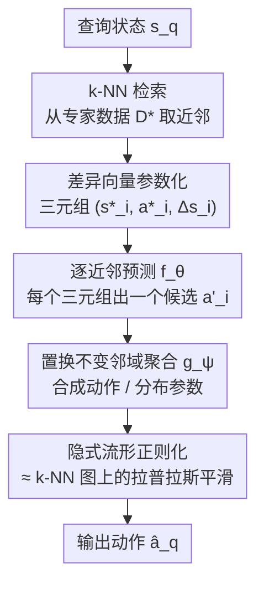

# Difference-Aware Retrieval Policies for Imitation Learning

**会议**: ICLR2026  
**OpenReview**: [https://openreview.net/forum?id=9AA27en4go](https://openreview.net/forum?id=9AA27en4go)  
**代码**: 待确认  
**领域**: 机器人 / 模仿学习  
**关键词**: 模仿学习, 行为克隆, 检索增强, 流形正则化, 拉普拉斯平滑

## 一句话总结
DARP 把模仿学习从"状态→动作"的全局映射，重参数化为"在专家数据里检索 k 个近邻、再基于每个近邻与查询状态的差异向量预测动作并做置换不变聚合"的半参数化检索策略，理论上等价于一个免调参的拉普拉斯平滑，在 MuJoCo / Robosuite / RoboCasa 上比标准行为克隆稳定提升 15–46%。

## 研究背景与动机
**领域现状**：模仿学习里最朴素也最常用的是行为克隆（Behavior Cloning, BC）——把专家演示 $D^*=\{(s^*_j,a^*_j)\}$ 当成监督学习样本，训一个全局参数化策略 $\pi_\theta(a\mid s)$ 去拟合状态到动作的映射。简单、好用，能学到相当灵巧的操作行为。

**现有痛点**：BC 在闭环部署时很脆，尤其是长程任务。根因是**协变量偏移（covariate shift）**：策略每一步的小误差会累积，把智能体一点点推到演示数据没覆盖到的状态。在这些低密度 / 分布外（OOD）区域，过参数化的神经网络策略可以任意震荡，输出高方差、不可靠的动作，最终任务失败。

**核心矛盾**：BC 的目标函数只在专家状态上最小化监督风险，它**控制了偏差，却完全没约束方差**——它只要求"在训练状态上预测对"，不要求"邻近状态的预测要彼此一致"，于是训练点之间的插值可以有任意大的局部 Lipschitz 常数。已有缓解手段（DAgger、Lipschitz 约束、数据增强、显式图正则）大多要跳出纯 BC 的假设：需要仿真器、在线专家反馈、大量次优数据或任务先验，或者引入额外的平滑超参数 $\lambda$ 去调。

**本文目标**：留在纯 BC 设定里——只用专家状态-动作对，不要额外数据、不要在线监督、不要任务先验——能不能仅靠原始演示就把策略方差压下来？

**切入角度**：作者把"全局参数化"和"局部非参数化"两条路线对照。全局模型把整份数据压进一个函数，分布偏移下脆；局部方法（近邻检索 / 局部加权回归）贴着数据结构走、更鲁棒，但效果死死依赖距离度量，朴素平均又会把不同动作糊在一起、丢掉多模态。作者想取两者之长：用检索拿到局部邻域提供鲁棒性，用参数化网络提供准确性与表达力。

**核心 idea**：不再直接从当前查询状态前馈出动作，而是先检索 $k$ 个近邻，把每个近邻表示成 $(s^*_i,a^*_i,\Delta s_i=s^*_i-s_q)$ 三元组喂给网络，得到 $k$ 个候选动作，再用置换不变的聚合函数合成一个动作。作者证明这种"把邻域聚合塞进架构"的做法，**隐式地等价于在 k-NN 图上做拉普拉斯平滑**，无需引入任何额外超参。

## 方法详解

### 整体框架
DARP（Difference-Aware Retrieval Policies）是一个**半参数化检索策略**：训练侧仍是标准 BC 的回归 / 最大似然目标，但把"邻域聚合"从损失函数搬进了网络架构本身。给定一个查询状态 $s_q$，流程是：① 在专家数据集 $D^*$ 里按某个距离 $d(s_q,s^*_i)$ 检索 $k$ 个近邻，得到索引集 $N_k(s_q)$；② 对每个近邻构造三元组 $(s^*_i,a^*_i,\Delta s_i=s^*_i-s_q)$，其中 $\Delta s_i$ 是该近邻相对查询状态的差异向量；③ 用一个网络 $f_\theta$ 对每个三元组独立预测一个候选动作 $a'_i=f_\theta(s^*_i,a^*_i,\Delta s_i)$；④ 用一个置换不变的聚合函数 $g_\psi$ 把这 $k$ 个候选合成最终动作（或动作分布参数）。训练时直接最小化聚合后动作与专家动作的差距，**不需要 $\lambda$、不需要改目标函数**。

理解这套设计要先看它背后的理论脉络（作者分三步推导）：先写一个**显式**的邻域正则目标 MRIL（BC 损失 + 平滑罚项，论文证明它能降方差、保稳定）；再说明同样的平滑可以**隐式**通过架构得到（iMRIL，把聚合搬进参数化）；最后把 iMRIL 落地成可大规模训练的实用算法 DARP。

### 关键设计

**1. 隐式流形正则化：用架构换掉正则项，免调 $\lambda$**

这是整篇论文的理论支点，针对的痛点是"BC 不控方差、显式正则又要调 $\lambda$"。作者先写出显式的邻域正则目标 MRIL：

$$L_{\text{MRIL}}(f)=\mathbb{E}_{(s,a)\sim D^*}\big[\ell(f(s),a)\big]+\lambda\,\mathbb{E}_{s\sim D^*}\Big[\sum_{i\in N_k(s)} w_i(s)\,\|f(s)-f(s^*_i)\|_2^2\Big]$$

第一项是普通 BC 监督风险，第二项是平滑罚项——要求近邻状态映射到相近动作，权重 $w_i(s)\propto K_\Delta(\|s^*_i-s\|/h)$ 是核归一化权重。作者证明（Theorem 1）这个罚项本质是 k-NN 图上的图拉普拉斯惩罚，在样本趋于无穷时收敛到加权 Dirichlet 能量，因而（i）像数据相关的 Tikhonov 正则一样降方差，（ii）给出局部 Lipschitz 上界，（iii）让闭环误差递推 $\Delta_{t+1}\le L_s\Delta_t+L_a\|\pi(s_t)-f(s^*_t)\|_2$ 从 BC 的线性累积变成次线性。

关键的一跳是 Theorem 2：把聚合从损失搬到架构后，最小化标准 BC 目标 $\arg\min_\theta \mathbb{E}\big[\|\tfrac{1}{k}\sum_{i\in N_k}f_\theta(s^*_i)-a^*\|^2\big]$ 得到的解，在 k-NN 图拉普拉斯 $L$ 的谱上等价于施加一个**固定低通滤波** $\varphi(\mu)=1-\mu$：保留低频（沿数据流形的平滑变化）、压制高频（近邻间的剧烈抖动），其有效正则强度 $\lambda\approx 1$。也就是说，邻域聚合这一步天然就是拉普拉斯平滑，**不必再调任何平滑超参**。这与旧的显式平滑方法（L2C2、CCIL 等需要 Lipschitz 约束或合成标签）形成对比——DARP 把平滑写进了网络结构而非目标。

**2. 差异向量参数化：让网络学"动作随局部扰动怎么变"**

如果只把近邻状态 $s^*_i$ 喂给网络做平均，那只是普通的局部回归，仍受限于"近邻的绝对状态"。作者的观察是：邻域聚合真正该学的是**专家动作在局部扰动下如何变化**。所以 DARP 不用 $f_\theta(s^*_i)$，而是给网络额外喂入近邻动作 $a^*_i$ 和差异向量 $\Delta s_i=s^*_i-s_q$，预测一个为查询状态量身调整的候选：

$$a'_i=f_\theta(s^*_i,a^*_i,\Delta s_i=s^*_i-s_q),\qquad \hat a_q=\frac{1}{k}\sum_{i\in N_k(s_q)} a'_i$$

差异向量是关键：它把"近邻的动作"按"近邻离我有多远、朝哪个方向偏"做局部修正，而不是死记绝对状态。消融实验里这一项贡献最大——把输入从 $(s^*_i,a^*_i,\Delta s_i)$ 退化成只给查询状态 $(s^*_i,a^*_i,s_q)$ 或只给差异的模长 $\|\Delta s_i\|_2$，成功率都明显下滑。Divergence 分析还给出了机制证据：在 BC 失败而 DARP 成功的分叉点（SoD），查询状态的状态似然已经低于 1 分位阈值 $\tau_s$（即状态本身 OOD），但它到近邻的差异似然仍高于 $\tau_\Delta$（即差异向量还在分布内）——正是这种"状态 OOD、差异 ID"的重参数化让 DARP 在轻度分布外处仍能预测得准。

**3. 置换不变邻域聚合：可从简单平均推广到表达力更强的集合网络**

近邻是一个无序集合，聚合函数必须对近邻排列不敏感，否则会引入虚假依赖。最简单的 $g$ 就是对 $k$ 个候选取平均（对应理论里的拉普拉斯平滑）。但平均是 $\ell_2$ 回归目标的隐式高斯假设的特例，作者把它推广为一类置换不变聚合 $g_\psi$，可以用 Set Transformer 或 DeepSets 实现：$\hat a_q=g_\psi(\{f_\theta(s^*_i,a^*_i,\Delta s_i)\}_{i\in N_k(s_q)})$。消融里证实置换不变性是必要的——换成置换相关（permutation-dependent）的聚合器，成功率从 0.72 掉到 0.19。

**4. 超越线性聚合：用 $g_\psi$ 预测分布参数，支持多模态动作**

简单平均只能表达单峰高斯，碰到多模态专家行为（如 Push-T 这种存在多条可行轨迹的任务）会把不同模式糊成一团。DARP 让聚合器 $g_\psi$ 不直接输出动作，而是输出一个动作分布 $p(a_q;\alpha)$ 的参数 $\alpha$——比如高斯混合模型的均值 / 协方差 / 权重，或扩散模型的 score 函数，从而把训练目标从 $\ell_2$ 回归换成最大似然：

$$\arg\max_\theta\ \mathbb{E}_{(s_q,a_q)\sim D^*}\big[\log p(a_q;\alpha_\theta(s_q))\big],\quad \alpha_\theta(s_q)=g_\psi\big(\{f_\theta(s^*_i,a^*_i,\Delta s_i)\}_{i\in N_k(s_q)}\big)$$

推理时从 $p(a_q;\alpha_\theta(s_q))$ 采样即可。这让 DARP 在保持检索半参数化优势的同时，具备了 GMM / 扩散策略级别的多模态表达力。

### 损失函数 / 训练策略
训练全程只用**标准模仿学习目标**：单峰版是聚合动作对专家动作的 $\ell_2$ 回归（式 5），多模态版是动作分布的最大似然（式 6），都不含额外平滑超参 $\lambda$。$f_\theta$ 用标准前馈 / 卷积网络即可，距离 $d$ 默认用预训练嵌入空间里的欧氏距离。检索的近邻在训练和推理时都从同一份专家数据 $D^*$ 取，不引入任何新数据。

## 实验关键数据

### 主实验
三问驱动评测：Q1 能否稳定超过 BC；Q2 能否处理高维表示与复杂动作分布；Q3 各架构组件各贡献多少。

MuJoCo 低维状态locomotion（分数越高越好，100 次试验 95% 置信区间）：

| 方法 | Hopper | Ant | Walker | HalfCheetah |
|------|--------|-----|--------|-------------|
| R&P（最近邻直取） | 711.8 | -306.0 | 419.2 | -178.6 |
| LWR（局部加权回归） | 1703.8 | 846.6 | 1484.9 | 1945.8 |
| BC | 2313.7 | 2376.2 | 2658.4 | 1063.2 |
| REGENT（检索 Transformer） | 1819.4 | -302.1 | 507.0 | 169.9 |
| MRIL（显式平滑版） | 2793.6 | 3869.1 | 4371.0 | 701.6 |
| **DARP** | **3545.6** | **4383.3** | **4894.0** | **5515.4** |
| DARP Set Transformer | 2965.9 | 4063.8 | 4752.4 | 3417.9 |

机器人操作低维状态成功率（%）：

| 方法 | Robosuite Stack | Threading | Square Peg | RoboCasa Drawer | Door | Stove |
|------|-----------------|-----------|------------|-----------------|------|-------|
| BC | 47 | 37 | 46 | 54 | 29 | 28 |
| **DARP** | **72** | **63** | **62** | **85** | **45** | **43** |

高维视觉（R3M 嵌入）Robosuite 成功率（%）：

| 方法 | Stack | Threading | Peg |
|------|-------|-----------|-----|
| BC | 44 | 38 | 17 |
| **DARP** | **75** | **76** | **52** |

视觉任务上 DARP 对 BC 的平均提升约 35%，**比低维状态下的约 22% 还高**——说明 DARP 在复杂高维表示上反而更能适配。多模态 Push-T 任务上 DARP 比 BC 高 20% 以上。

### 消融实验
Robosuite Stack，100 次试验成功率：

| 配置 | 成功率 | 说明 |
|------|--------|------|
| DARP 完整 $(s^*_i,a^*_i,\Delta s_i)$ | 0.85 | 完整模型 |
| 去掉近邻动作 $(s^*_i,\Delta s_i)$ | 0.72 | 近邻动作影响较温和 |
| 10 个 BC 集成 | 0.67 | 纯集成不如 DARP |
| 随机近邻 | 0.59 | 距离度量被破坏即明显掉点 |
| 用差异模长 $(s^*_i,a^*_i,\|\Delta s_i\|_2)$ | 0.58 | 丢方向信息明显变差 |
| 纯 BC（只用 $s_q$） | 0.53 | 基线 |
| 用查询状态代替差异 $(s^*_i,a^*_i,s_q)$ | 0.47 | 去掉差异向量大幅下降 |
| 置换相关聚合器 | 0.19 | 破坏置换不变性几乎崩溃 |

### 关键发现
- **差异向量是头号功臣**：去掉差异向量（改喂查询状态）从 0.85 掉到 0.47；连方向都丢、只留模长也掉到 0.58。这印证了"重参数化成差异向量"是性能来源。
- **置换不变性不可破**：换成置换相关聚合器直接崩到 0.19，说明把近邻当无序集合处理是底线。
- **近邻选择要有意义的距离度量**：随机近邻掉到 0.59，距离度量是检索质量的命门。
- **近邻动作贡献相对温和**：去掉后从 0.85 到 0.72，是锦上添花而非命脉。
- **机制证据**：分叉点处状态已 OOD（状态似然 < $\tau_s$）但差异仍 ID（差异似然 > $\tau_\Delta$），解释了 DARP 为何在轻度分布外更稳。

## 亮点与洞察
- **"把正则项搬进架构"是很漂亮的换元**：DARP 不去损失里加平滑罚项调 $\lambda$，而是把邻域聚合写进网络结构，再用谱分析证明它等价于固定低通滤波 $1-\mu$。这把"要不要 / 怎么调平滑超参"这个老大难直接消解掉了，是可迁移到其他序列决策问题的通用思路。
- **差异向量重参数化点出了泛化的真正自由度**：与其记住"在哪个绝对状态做什么"，不如学"相对近邻偏了多少该怎么修"——在状态分布外但差异分布内的区域，这种重参数化能续上预测，是对协变量偏移很务实的应对。
- **半参数化拿了两头好处**：非参数检索把预测锚在真实数据上（鲁棒），参数化逐近邻预测 + 聚合提供准确性与多模态表达力，且不需要任何 BC 之外的额外假设——这条"不加监督就降方差"的路线对真实机器人数据稀缺场景很有吸引力。
- **同一架构吃通低维 / 高维 / 多模态**：从 MuJoCo 状态到 R3M 视觉特征、从平均到 Set Transformer/GMM/扩散，DARP 的骨架不变，扩展性好。

## 局限与展望
- **重度依赖检索距离度量**：随机近邻直接掉点，意味着在没有好嵌入 / 距离度量的领域（如原始高维像素、缺乏预训练 encoder 的新模态）DARP 的优势可能打折，论文用的是预训练嵌入空间欧氏距离。
- **推理要带着整份专家数据做 k-NN**：半参数化意味着部署时不能像 BC 那样丢掉数据集，检索开销和存储随演示规模增长，论文未深入讨论大规模 $D^*$ 下的检索延迟。
- **理论假设较强**：变方差 / 稳定性保证建立在专家策略 $C^2$ 光滑、紧致状态空间、样本趋于无穷收敛到 Dirichlet 能量等假设上，真实有限样本、非光滑专家行为下的保证有多紧仍需更多验证。
- **评测以仿真为主**：MuJoCo / Robosuite / RoboCasa 都是仿真，真实机器人上的检索鲁棒性与实时性还需补充（Transformer 相关结果本身也带非确定性）。

## 相关工作与启发
- **vs LWR / VINN（非参数局部回归）**: 它们对检索到的近邻直接做（加权）平均，纯非参数，受限于绝对状态且朴素平均糊掉多模态；DARP 把近邻重参数化成 $(s^*_i,a^*_i,\Delta s_i)$ 三元组学半参数策略，既保留局部鲁棒性又补回参数化的泛化与多模态表达。
- **vs REGENT / DPT（in-context 检索 Transformer）**: 它们把检索到的状态 / 动作 / 奖励塞进因果 Transformer，目标是快速适配新任务；DARP 不追求跨任务 few-shot，而是聚焦在标准模仿学习上把性能与稳定性做高，且给出了"等价于拉普拉斯平滑"的理论解释。
- **vs L2C2 / CCIL（显式平滑约束）**: 它们用 Lipschitz 约束或合成纠正标签显式地逼策略平滑；DARP 通过架构改动隐式实现同样的平滑，且仍用标准 BC 目标、不引入额外平滑超参。
- **vs MRIL（本文的显式平滑版）**: MRIL 在损失里加平滑罚项，需要调 $\lambda$；DARP 把聚合搬进架构隐式平滑，实验里几乎在所有任务上都超过 MRIL，验证了"隐式 > 显式 + 调参"。

## 评分
- 新颖性: ⭐⭐⭐⭐⭐ "邻域聚合塞进架构 ≈ 免调参拉普拉斯平滑" + 差异向量重参数化，理论与方法都干净。
- 实验充分度: ⭐⭐⭐⭐ 覆盖 locomotion / 操作 / 视觉 / 多模态 + 细致消融 + 机制分析，但全是仿真、缺真机验证。
- 写作质量: ⭐⭐⭐⭐⭐ 从 MRIL→iMRIL→DARP 三步推导清晰，理论与直觉穿插得好。
- 价值: ⭐⭐⭐⭐ 纯 BC 假设下不加任何监督就稳定提升 15–46%，对数据稀缺的真实模仿学习很有参考价值。

<!-- RELATED:START -->

## 相关论文

- [\[ICLR 2026\] Geometry-Aware Policy Imitation](geometry-aware_policy_imitation.md)
- [\[ICLR 2026\] DataMIL: Selecting Data for Robot Imitation Learning with Datamodels](datamil_selecting_data_for_robot_imitation_learning_with_datamodels.md)
- [\[ICML 2026\] Fourier Features Let Agents Learn High Precision Policies with Imitation Learning](../../ICML2026/robotics/fourier_features_let_agents_learn_high_precision_policies_with_imitation_learnin.md)
- [\[ICLR 2026\] Contractive Diffusion Policies](contractive_diffusion_policies.md)
- [\[CVPR 2026\] NIL: No-data Imitation Learning](../../CVPR2026/robotics/nil_no-data_imitation_learning.md)

<!-- RELATED:END -->
