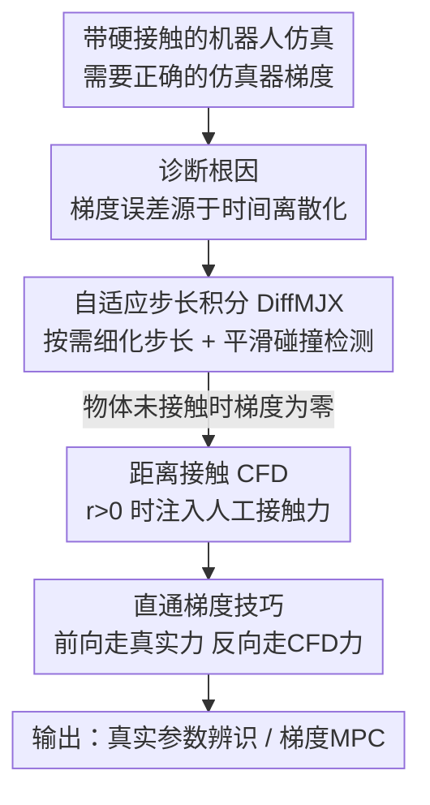

# Differentiable Simulation of Hard Contacts with Soft Gradients for Learning and Control

**会议**: ICLR2026  
**OpenReview**: [https://openreview.net/forum?id=2EGtfFwxx8](https://openreview.net/forum?id=2EGtfFwxx8)  
**代码**: https://github.com/martius-lab/diffmjx  
**领域**: 机器人 / 可微仿真 / 梯度优化  
**关键词**: 可微仿真, 硬接触, 自适应积分, 直通估计, MuJoCo  

## 一句话总结
针对惩罚式仿真器（MuJoCo）在硬接触下自动微分梯度失真、以及物体未接触时梯度为零这两个老问题，本文用「自适应步长积分（DiffMJX）」修正离散化导致的梯度误差，再用「距离接触 CFD + 直通技巧」在不破坏前向真实性的前提下给未接触物体注入有信息量的梯度，从而能用一阶梯度直接做真实立方体参数辨识和高维肌肉骨骼系统的控制。

## 研究背景与动机
**领域现状**：机器人学里的模仿学习、强化学习、系统辨识都高度依赖梯度优化。仿真器若能给出准确的梯度，就能直接拿仿真梯度去拟合真实数据、缩小 sim-to-real 差距，甚至把训练时间从小时级压到秒级。MuJoCo 这类惩罚式（penalty-based）仿真器把接触建模成一个凸优化里的软约束，理论上处处可微，是当前机器人仿真的事实标准。

**现有痛点**：尽管仿真器能算梯度，绝大多数方法却"刻意回避"使用仿真器梯度。原因有两个：其一，要逼真地模拟硬接触必须把求解器调到很刚（stiff）的设置，而此时用自动微分得到的梯度会严重失真；如果把接触调软来保住梯度，sim-to-real 差距又会变大。其二，当两个物体没有接触时（比如机械手还没碰到球），接触力为零，对应的梯度也为零——优化器收不到"该往哪个方向去接触"的信号。

**核心矛盾**：作者把第一个问题的根因挖了出来——惩罚式仿真器的梯度误差并不是仿真器本身的毛病，而是来自**对刚性微分方程做时间离散化（数值积分）时产生的误差**。也就是说，自动微分算出的梯度之所以"错"，是因为它对应的是离散近似系统、而非底层连续系统的真实梯度。常见的建议是"把步长调小"，但要小到能保证梯度正确，仿真会慢到无法接受。

**本文目标**：(1) 在保持硬接触真实性、不牺牲仿真速度的前提下拿到正确的接触梯度；(2) 让未接触物体之间也能产生有信息量的梯度。

**切入角度**：既然误差来自刚性 ODE 的固定步长积分，那就引入数值分析里成熟的**自适应步长积分**——只在碰撞这种刚性瞬间自动细化步长，平时用大步长。同时，受 contact-invariant optimization 启发，用**人工接触力**为未接触物体造梯度，但只在反向传播里用、不污染前向轨迹。

**核心 idea**：用"自适应积分修离散化误差 + 距离接触配直通技巧造梯度"两把钥匙，分别解开惩罚式可微仿真的两把锁。

## 方法详解

### 整体框架
本文围绕一个标准的机器人控制计算图展开：状态 $x_k=[q_k,v_k]$ 在离散动力学 $x_{k+1}=\text{step}(x_k,a_k,p)$ 下推进，损失 $L(\tilde x_{k+1},x_k,a_k,p)$ 对动作 $a_k$ 或模型参数 $p$ 的梯度被用来做优化。问题出在 `step` 内部对含硬接触的刚性 ODE 做数值积分这一步。

整体流程是：先**诊断**出梯度误差的根因在时间离散化；随后用 **DiffMJX**（把自适应积分库 Diffrax 接入 MuJoCo XLA，并平滑碰撞检测里的不可微分支）拿到硬接触下的正确梯度；再叠加 **CFD**（在 $r>0$ 即未接触区也允许求解器施加人工接触力）；最后用**直通梯度技巧**让前向仍走真实物理、反向才走 CFD，从而既不破坏仿真真实性又拿到未接触物体间的有效梯度。产出的梯度被用于两类下游：真实立方体的参数辨识，以及基于梯度的模型预测控制（MPC）。

### 关键设计

**1. 诊断根因：硬接触梯度失真来自刚性 ODE 的时间离散化，而非接触模型本身**

作者用一个一维玩具例子把问题讲透：一个点质量以速度 $v_0=-1$ 撞向平面再弹回，损失 $L=|q_N-q_T|$ 是终态高度与目标的距离。他们对比两种接触模型——DiffTaichi 那样的理想弹性碰撞，以及类 MuJoCo 的惩罚式碰撞。结论很关键：理想弹性碰撞的 ODE 在碰撞前后分段线性、碰撞瞬间速度突变，Hu et al.(2020) 的"碰撞时刻（time-of-impact, TOI）"修正能把 ODE 在接触时刻切成两段线性段分别积分、消掉离散化误差；但惩罚式仿真在碰撞过程中是**变刚度的非线性段**，没法简单切成大的线性段，所以 TOI 修正在惩罚式仿真上不灵。

反过来，惩罚式 ODE 是光滑的，这意味着**减小步长能连续地把积分误差压下去**（而理想弹性情况下减小步长梯度符号依然错）。这条诊断是后面所有设计的逻辑起点：既然误差是离散化误差、且系统光滑，那就该用"按需细化步长"而不是"全程小步长"来治本。

**2. DiffMJX：把自适应步长积分接进 MuJoCo XLA，按需付出精度代价**

自适应积分的思路很优雅：同时用两个不同阶数的积分器算下一状态，两者之差即为误差估计；若误差小于阈值就接受这一步，否则拒绝并由反馈控制器选一个新步长重试。本文用 Diffrax 在 JAX 里做高效数值积分，并花了大力气把四元数和有状态的执行器（stateful actuators）无缝接进去，保证和 MJX 及其它 MuJoCo 库兼容。效果是：在同样的计算预算下，自适应积分把损失和梯度的误差降低了**多个数量级**（图 5 的 Pareto 前沿），而且 Diffrax 的步长选择在并行环境间相互独立——`vmap` 跨环境时，一个仿真里发生接触不会拖慢其它仿真。

仅有自适应积分还不够：胶囊、圆柱、长方体等几何体的碰撞检测里有离散的 case 分支（不可微），会引入梯度伪影。作者用标准的光滑代理把这些分支平滑掉。**MJX + Diffrax 自适应积分 + 平滑碰撞检测** 合起来称为 DiffMJX，此时解析梯度几乎与中心差分吻合。

**3. CFD（Contacts From Distance）：让"还没接触"的物体之间也能产生接触力**

第二个问题是未接触物体间梯度为零。比如台球例子里，对白球施力 $F$ 想让它撞黑球、损失是黑球到目标的距离；若 $F$ 不足以让两球相撞，则 $\nabla_F L=0$，优化器毫无方向。CFD 的做法是让求解器在正的有符号距离 $r>0$（即尚未接触）时也能施加一个小的人工接触力。具体到 MuJoCo：接触力大小由阻抗 $d(r)$ 和位置级参考加速度 $h(r)$ 决定，CFD 把阻抗 $d(r)$ 在 $r<0$ 处保持不变、在 $r>0$ 处额外接一段样条（由 solimp-CFD 参数 $(d_c,d_0,w_c,m_c,p_c)$ 控制），默认从 $d_0$ 平滑延续、再衰减到 $d_c=0$ 以保证可微；CFD-宽度 $w_c$ 决定人工力在多远距离内生效。同时把参考加速度 $h(r)$ 里作用在有符号距离上的 ReLU 换成 softplus 软化，得到修正后的接触力 $f_{\text{CFD}}$。

**4. 直通梯度技巧：前向走真实物理、反向才走 CFD，鱼与熊掌兼得**

直接把 CFD 加进仿真会产生非物理行为——人工力会让四足机器人像踩在厚度 $w_c$ 的海绵垫上一样悬浮（图 7 上）。为了既要 CFD 的梯度、又不破坏前向真实性，作者在 ODE 层面用直通技巧（straight-through-trick）：

$$\dot x(t) = \operatorname{sg}\!\big(F_\theta(t,x(t))\big) + \tilde F_\theta(t,x(t)) - \operatorname{sg}\!\big(\tilde F_\theta(t,x(t))\big)$$

其中 $\operatorname{sg}$ 是停止梯度算子，$F$ 是 MJX/DiffMJX 的原始 ODE，$\tilde F$ 是用 CFD 的 ODE（$\dot v_{\text{CFD}}=M^{-1}(\tau-c+J^\top f_{\text{CFD}})$）。这样前向计算时三项里前后两个 $\tilde F$ 抵消、净值就是真实的 $F_\theta$；反向求导时 $\operatorname{sg}$ 包住的两项导数为零，只剩 $\tilde F_\theta$ 的导数 $\partial\tilde F_\theta/\partial(x,\theta)$ 起作用。关键在于**这些导数是在未被改动的前向轨迹 $x(t)$ 上求值的**——所以损失曲线完全不变，但梯度变得有信息量。代价是前向要算两遍（带 CFD / 不带 CFD），但梯度只算一遍，而梯度计算才是主要开销，所以整体仍然划算。回到台球例子，加上 CFD + 直通技巧后，即便两球没碰，也能拿到指向"该如何让它们相撞"的非零梯度。

### 损失函数 / 训练策略
两类下游各自的优化目标都很朴素，把难度都压在了梯度质量上：参数辨识用多步预测的 L2 损失（把轨迹切成长度 5 的片段、让仿真器从初态往后展开 4 步），用 Adam 优化；梯度 MPC 在 256 步预测窗口上对控制序列反传可微代价，用学习率 0.01 的 Adam 迭代 32 次，执行 16 步后以上一次计划为热启动重规划。两个对梯度 MPC 至关重要的工程点：(1) **梯度裁剪**——接触出现时梯度尺度剧变，必须裁剪；(2) 记录所有梯度迭代的 rollout 代价、取代价最小的那次，因为代价地形高度非凸、迭代间代价非单调。

## 实验关键数据

### 主实验：真实立方体参数辨识
用 Contactnets 数据集（Pfrommer et al. 2021）的 550 条真实轨迹——一个 10cm 亚克力立方体反复抛到木桌上——通过梯度下降估计立方体边长。

| 方法 | 边长估计误差 | 鲁棒性表现 |
|------|------|----------|
| 原始 MJX | 收敛受限 | 边长初始化在 60mm 或 140mm 时训练完全停滞或收敛严重受限 |
| MJX + CFD | ~5% 相对真值 | CFD 解决了差初值带来的收敛问题 |
| DiffMJX + CFD | ~5%，精度更高 | 自适应积分通过碰撞时动态调步长显著降低离散化误差、提升精度 |

作者称这是**首次用全自动可微的惩罚式仿真器、通过标准梯度优化完成真实立方体动力学的参数辨识**。

### 消融 / 控制实验（梯度 MPC vs 采样 MPC）
基线为 MuJoCo MPC 的 predictive sampling（每步采样 $k=\{64,256,1024\}$ 条轨迹取最低代价，且用 brown noise 采样以公平对比）。物理系统用 MyoSuite 的肌肉-肌腱模型。

| 任务 | 采样 MPC | 梯度 MPC（无 CFD） | 梯度 MPC（CFD） | 说明 |
|------|---------|------|------|------|
| 灵巧手内操作（换两球，MyoHand 39 肌腱） | 难以求解 | 可靠求解 | 可靠求解 | 接触因重力频繁发生，无需 CFD |
| 仿生网球（MyoArm 63 肌腱 + 假肢） | 强基线，接近求解 | **无法求解**（球初始错过双手） | 可求解 | 仅靠球到目标距离作监督，需 CFD 造梯度 |
| 桌面立方体重定向 | 仅勉强重定向、保不住位置 | 同左 | **完美求解** | 重力不足以让所有手指接触，需 CFD |
| 手内立方体重定向 | 失败 | 求解 | 求解 | 接触由重力自动发现，CFD 影响不大 |

### 关键发现
- **CFD 的价值高度依赖任务是否"自带接触"**：手内操作/重定向因重力让接触频繁发生，有没有 CFD 差别不大；而仿生网球、桌面重定向这种"需要主动发起接触"的任务，没 CFD 就根本解不了。
- **过参数化反而帮了梯度法**：肌肉-肌腱模型每个关节至少两块肌肉的过参数化，像优化过参数神经网络一样帮梯度规划器逃离局部极小；而 RL 和采样规划器在高维过参数系统里反而吃力。
- **梯度裁剪 + 取最优迭代**是梯度 MPC 能稳定工作的两个不可或缺的工程细节。

## 亮点与洞察
- **把"梯度错"归因到时间离散化而非接触模型，是全文的概念支点**：这个诊断直接决定了用自适应积分治本，而不是像 TOI 那样去切分轨迹——后者在惩罚式变刚度 ODE 上根本切不动。这种"先把误差来源讲清楚再对症下药"的写法很有说服力。
- **直通技巧用在 ODE/物理层面非常巧**：直通估计原本是离散神经元的把戏，这里被搬到连续动力学上，用 $\operatorname{sg}(F)+\tilde F-\operatorname{sg}(\tilde F)$ 一行就实现了"前向真实、反向虚构"的解耦，且导数在未改动轨迹上求值，保证损失曲线不变。这是可直接复用到任何"想给前向不可见的量造梯度"场景的 trick。
- **复用现成基础设施（MuJoCo XLA + Diffrax）而非另起炉灶**，让方法对实践者门槛很低：DiffMJX 和 CFD 本质是给 MJX 加了几个可调旋钮（积分误差阈值、solimp-CFD 参数），并保持与已有 MuJoCo 库兼容。

## 局限与展望
- **CFD 引入额外超参**（solimp-CFD 的 $(d_c,d_0,w_c,m_c,p_c)$、CFD 宽度 $w_c$），需要按任务调；$w_c$ 设大了人工力影响范围广、设小了又退化为零梯度，作者把调参指南放在附录 B，但仍是实践负担。
- **前向算两遍**：CFD 需要分别算带/不带 CFD 的前向，虽然梯度只算一遍、整体可接受，但前向开销翻倍在超长 rollout 上仍不可忽视。
- **参数辨识仅在立方体这一刚体几何上验证**，作者自己也承认"还需更多实验来刻画该方法的适用范围和局限"；对柔体、复杂几何、多体密集接触的可扩展性未知。
- **梯度 MPC 依赖梯度裁剪和取最优迭代等工程技巧**才稳定，说明代价地形仍高度非凸，方法的鲁棒性边界尚不清晰。

## 相关工作与启发
- **vs 互补式（complementary-based）可微求解器**（Werling 2021；Taylor 2022）：他们精确计算接触力、动力学有突变，靠隐函数定理做解析重构或随机平滑来求梯度；本文走惩罚式路线，把问题归到积分误差并用自适应积分解决，避免了对硬接触做解析重构。
- **vs TOI（time-of-impact）修正**（Hu et al. 2020, DiffTaichi；Schwarke et al. 2024）：TOI 针对理想弹性/脉冲式仿真，在接触时刻切分线性段；本文明确指出 TOI 对惩罚式仿真的变刚度非线性段不适用，改用减小/自适应步长这条对光滑 ODE 才奏效的路线。
- **vs contact-invariant optimization**（Mordatch et al. 2012）：他们也想让优化感知未实现的接触；本文 CFD 把这一思想落到惩罚式仿真器里，并用直通技巧把人工力限制在反向传播，保住前向真实性，这是关键区别。
- **vs 采样式规划 / 图网络学接触动力学**（MuJoCo MPC；Allen et al. 2023）：本文展示一阶可微仿真梯度在高维肌肉骨骼操作任务上能超过采样式预测规划，给"为什么要用仿真器梯度"提供了正面证据。

## 评分
- 新颖性: ⭐⭐⭐⭐⭐ 把硬接触梯度失真精准归因到时间离散化，并用自适应积分 + 距离接触直通技巧两条互补路线系统性解决，视角新颖
- 实验充分度: ⭐⭐⭐⭐ 既有真实立方体参数辨识又有多任务高维 MPC，但参数辨识只在单一刚体几何上验证
- 写作质量: ⭐⭐⭐⭐⭐ 用一维玩具例子层层剖析根因、图文对照清晰，逻辑链完整
- 价值: ⭐⭐⭐⭐⭐ 直接落地为 MJX 的可用旋钮、与现有库兼容，对机器人可微仿真社区实用价值高

<!-- RELATED:START -->

## 相关论文

- [\[ICLR 2026\] MoMaGen: Generating Demonstrations under Soft and Hard Constraints for Multi-Step Bimanual Mobile Manipulation](momagen_generating_demonstrations_under_soft_and_hard_constraints_for_multi-step.md)
- [\[ICLR 2026\] Efficient Differentiable Contact Model with Long-range Influence](efficient_differentiable_contact_model_with_long-range_influence.md)
- [\[ICLR 2026\] D-REX: Differentiable Real-to-Sim-to-Real Engine for Learning Dexterous Grasping](d-rex_differentiable_real-to-sim-to-real_engine_for_learning_dexterous_grasping.md)
- [\[ICLR 2026\] AutoBio: A Simulation and Benchmark for Robotic Automation in Digital Biology Laboratory](autobio_a_simulation_and_benchmark_for_robotic_automation_in_digital_biology_lab.md)
- [\[ICLR 2026\] BFM-Zero: A Promptable Behavioral Foundation Model for Humanoid Control Using Unsupervised Reinforcement Learning](bfm-zero_a_promptable_behavioral_foundation_model_for_humanoid_control_using_uns.md)

<!-- RELATED:END -->
