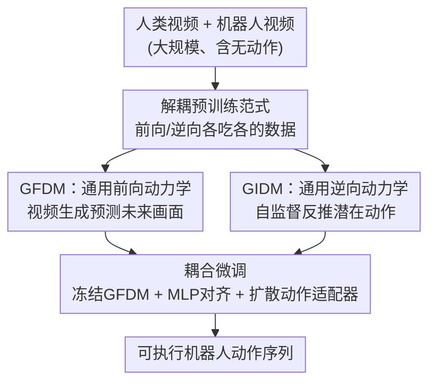

# Disentangled Robot Learning via Separate Forward and Inverse Dynamics Pretraining

**会议**: ICLR2026  
**OpenReview**: [https://openreview.net/forum?id=DdrsHWobR1](https://openreview.net/forum?id=DdrsHWobR1)  
**代码**: 有（论文页给出 GitHub 链接，待确认具体仓库）  
**领域**: 机器人 / 具身智能 / VLA  
**关键词**: VLA、前向动力学、逆向动力学、无动作视频、解耦预训练

## 一句话总结
DeFI 把机器人策略学习拆成"预测未来画面"和"反推潜在动作"两个独立模块，分别在大规模人类+机器人视频上预训练，再耦合做端到端微调，让海量无动作标签的视频也能为 VLA 所用，在 CALVIN ABC-D（平均完成长度 4.51）、SimplerEnv-Fractal（51.2%）和真机（81.3%）上都刷到 SOTA。

## 研究背景与动机
**领域现状**：视觉-语言-动作（VLA）模型是当下通用机器人的主流框架，借助 VLM 的视觉语言理解能力，在海量带动作标签的数据上学习"看图+读指令→输出动作"。近年一条很有前景的路线是把"未来画面预测（forward dynamics）"和"动作推理（inverse dynamics）"塞进一个端到端架构里隐式联合学习，比传统 VLA 效果更好。

**现有痛点**：这种耦合范式有两个硬伤。其一，2D 视频预测和 3D 动作预测目标互相打架，训练不稳定；其二（更要命），视觉和动作纠缠在一起训练，使模型没法吃下规模大几个数量级、且天然蕴含跨形态运动先验的无动作人类/网络视频。另一条路线想绕开它——先用人类+机器人视频预训练一个视频预测模型管前向动力学，再接一个简单模型做逆向动作推断——但又走偏了：它默认"预测准就够了"，把逆向动力学模块当配角随便糊一个（如 VPP 直接砍掉逆向模块，Vidar 有但没有可扩展的预训练配方），结果逆向模块成了瓶颈，吃不下前向模型的预测能力。

**核心矛盾**：根本问题是——大家普遍低估了"准确推断动作"和"准确预测未来"同等重要，且逆向动力学同样需要在大规模无动作视频上做可扩展的预训练才能发挥潜力。

**本文目标**：设计一个对 2D 视频预测和 3D 动作预测都"双赢"的范式，让无动作视频既能学前向动力学、也能学逆向动力学。

**切入角度**：既然耦合训练会让两个目标互相干扰、又锁死了无动作视频的利用，那就干脆把前向和逆向动力学知识的**预训练彻底解耦**，各自吃最适合自己的数据源、各自专精，最后再耦合到统一架构里端到端微调。

**核心 idea**：用"解耦预训练前向（GFDM）+ 逆向（GIDM）动力学、再端到端耦合微调"替代"前向逆向纠缠的端到端 VLA"，从而把海量无动作视频的潜力释放出来。

## 方法详解

### 整体框架
DeFI 要解决的是"如何让无动作视频同时喂饱前向预测和逆向动作推理"。它把策略学习拆成两个独立知识模块，分两阶段走：**阶段一·解耦预训练**——视觉通用前向动力学模型 GFDM 在混合的人类+机器人视频上用视频生成目标做预训练（学会从当前观测+指令预测未来画面），与此同时通用逆向动力学模型 GIDM 用自监督方式在无标签视频转移上做预训练（学会从画面变化反推潜在动作）；两者互不干扰、各自专精互补知识。**阶段二·耦合微调**——冻结 GFDM 当稳定骨干提供未来视频表征，用 MLP 把它投影到 GIDM 的输入流形，GIDM 推断潜在动作，最后接一个基于扩散的动作适配器把潜在动作翻译成可执行机器人指令，三个模块端到端联合优化。这样前向预测、动作反演、底层控制三个目标被对齐，只需少量机器人数据就能高效泛化到下游任务。

### 关键设计

**1. 解耦预训练范式：让前向和逆向动力学各自吃最合适的数据、再合作**

针对"视觉-动作纠缠训练既互相干扰、又锁死无动作视频"这个根本痛点，DeFI 不再把前向预测和逆向推理塞进一个 loss 里硬学，而是把它们当成**两份互补的知识**分别预训练：前向动力学模型专注从 2D 视频预测中捕捉运动级规律，逆向动力学模型专注基于状态转移的 3D 动作推理。关键在于两者都在混合人类+机器人数据上预训练，但抽取的知识正交——前者管"接下来画面怎么变"，后者管"这个变化对应什么动作"。这种"先分离专精、再整合"的结构，既让每个模块都能从异构数据里受益，又避免了两个目标在同一参数空间里抢梯度，从而把无动作人类视频（数量比机器人示范大几个数量级）的潜力真正释放出来。

**2. GFDM：用视频生成学隐式前向动力学，再单步去噪压成轻量未来表征**

给定当前观测 $o_t$ 和指令 $l$，前向动力学模型 $F_\theta$ 要合成一段长度 $H{+}1$ 的短时未来视频 $\hat{o}_{t:t+H}$。作者采用稳定视频扩散（SVD）+ CLIP 文本编码器，在混合数据上预训练：视频 VAE $(\mathcal{E},\mathcal{D})$ 定义潜空间，去噪器 $\epsilon_\theta$ 在潜扩散目标下训练。加噪过程为 $q(z^{(s)}_{t:t+H}\mid z^{(0)}_{t:t+H}) = \mathcal{N}(\sqrt{\bar\alpha_s}\, z^{(0)}_{t:t+H}, (1-\bar\alpha_s)I)$，条件上下文 $c_t = (z_t, f_{\text{text}}(l))$、$z_t=\mathcal{E}(o_t)$，损失为噪声预测 $L_{\text{diff}}(\theta)=\mathbb{E}\,\lVert \epsilon - \epsilon_\theta(z^{(s)}_{t:t+H}, s, c_t)\rVert_2^2$。

但完整去噪整段显式视频很贵，大量算力浪费在重建跟操作无关的像素细节上——而控制真正需要的是运动动力学而非外观。受"生成模型单步去噪后的特征已含足够运动信息"这一观察启发，作者**冻结预训练好的 GFDM 并把去噪限制为单步**，直接拿到高效的未来潜嵌入。对多相机机器人（第三视角+腕部相机），各视角独立预测未来视频。这一步是把"会预测未来"的能力以最低代价转成下游可用的运动上下文。

**3. GIDM：把动作推断改写成自监督表征学习，让无动作视频也能学逆向动力学**

这是全文最关键的"补短板"设计——逆向动力学不再是配角，而是和前向同等重要、同样要在大规模无动作视频上预训练。作者构造一个代理任务：取间隔 $n$ 帧的一对帧 $o_t, o_{t+n}$（跨数据集统一约 1 秒间隔），用 DINOv2 编码出潜状态 $e_t, e_{t+n}$。GIDM $I_\theta$ 由带因果时序掩码的时空 Transformer 编码器 + VQ-VAE 码本组成：把一组可学习动作查询 $q_a\in\mathbb{R}^{N\times d}$ 与当前/未来帧的 DINO 嵌入、T5 提取的指令嵌入沿序列维拼接喂进去，得到 $\tilde a^L_{t\to t+n}=I_\theta(e_t,e_{t+n},l,q_a)$，再经 VQ 量化 $\hat a^L_{t\to t+n}=\mathrm{VQ}_\theta(\tilde a^L_{t\to t+n})$ 得到离散动作 token。训练用 VQ-VAE 目标（沿用 LAPA），量化后的潜在动作过一个空间 Transformer 解码器去预测未来帧的 DINO 特征 $\hat e_{t+n}$，最小化与真值 $e_{t+n}$ 的 MSE。

**为什么有效**：把"反推动作"伪装成"用潜在动作码重建未来视觉特征"，迫使模型从纯视觉转移里蒸馏出有意义的潜在动作码——这就把异构无动作数据用起来学逆向动力学，且离散 token 形式天然方便 VLM 预测动作，补齐了"预测→控制"链条里最弱的一环。

**4. 耦合微调：冻结前向骨干 + MLP 对齐 + 扩散动作适配器端到端联合优化**

微调阶段把三个模块耦合成一个支持端到端优化的系统。GFDM $F_\theta$ **保持冻结**——它已在覆盖下游域的大规模数据上预训练，再在小得多的下游数据上微调反而会侵蚀动力学先验、损害泛化；冻结的它当稳定骨干，输出时序一致、编码长程动力学的未来视频表征。一个轻量 MLP 把这些未来嵌入投影到 GIDM 的输入流形上保证表征兼容，GIDM $I_\phi$ 被优化去解读对齐后的潜表征、推断捕捉底层运动的潜在动作。为提取更丰富的时空表征，还用一个 video former 从 GFDM 取中间层特征，与 MLP 投影特征融合后喂给基于扩散的动作适配器（由 30M 的 DiT-B 初始化），把潜在动作翻译成可执行机器人指令。至此未来预测、动作反演、底层控制三个目标被联合对齐，从而无需海量机器人示范也能强泛化。

### 一个完整示例
推理时走一遍：当前观测 $o_t$ + 指令"cutting the bread" → GFDM 单步去噪生成未来视频特征 $\hat z_{t:t+H}$（脑补出"刀切向面包"的场景演化）→ MLP 把这些未来嵌入投到 GIDM 输入空间，GIDM 结合当前潜状态推断出潜在动作序列 → 扩散动作适配器以潜在动作为条件，吐出最终可执行的控制指令。整条链路把"想象未来"和"反推动作"串成可执行控制。

## 实验关键数据

### 主实验

| 数据集 | 设置 | 指标 | DeFI | 之前最佳 | 提升 |
|--------|------|------|------|----------|------|
| CALVIN ABC-D | 第三视角 | Avg. Len. ↑ | 4.05 | 3.80 (UniVLA) | +0.25 |
| CALVIN ABC-D | 多视角 | Avg. Len. ↑ | 4.51 | 4.33 (VPP) | +0.18 |
| SimplerEnv-Fractal | Visual Matching | Avg. 成功率 | 51.2% | 42.0% (TraceVLA) | +9.2pt |
| SimplerEnv-Fractal | Variant Aggregation | Avg. 成功率 | 45.4% | 45.0% (TraceVLA) | +0.4pt |
| 真机 Franka（8 任务） | — | Avg. 成功率 | 81.3% | 48.2% (Diffusion Policy) | +33.1pt |

在 CALVIN 多视角下，DeFI 五个连续任务成功率为 97.9/94.2/90.7/87.0/81.2，全面超过 Seer、VPP、UP-VLA 等把视觉预测和动作推理塞进单一 VLA 的方法，也超过 UniVLA 这种"抽潜在动作当伪标签预训练 VLA"的路线，证明解耦预训练比纠缠训练更能榨干无动作视频；尤其在长程任务上优势更明显。

### 消融实验

| 配置 | Avg. Len. | 说明 |
|------|-----------|------|
| All w/ pretrain（完整） | 4.51 | 前向+逆向都预训练 |
| GIDM w/o pretrain | 4.16 | 逆向模块不预训练，掉 0.35 |
| GFDM w/o pretrain | 3.28 | 前向模块不预训练，掉 1.23 |

### 关键发现
- **前向预训练贡献最大**：去掉 GFDM 预训练 Avg. Len. 从 4.51 暴跌到 3.28，说明强大的前向动力学骨干是地基；但去掉 GIDM 预训练也掉 0.35，印证了"准确动作推断和准确未来预测同等重要"的核心论点。
- **数据效率突出**：仅用 10% 下游数据时，相对 VPP 在 CALVIN ABC-D 上平均任务长度有 18% 的相对提升；只需约 60% 数据就能超过此前 SOTA，体现海量低成本人类视频抬高了机器人学习的上界。
- **失败场景诚实**：SimplerEnv 某些任务（如 Open/Close Drawer 仅 38.6%）表现欠佳，作者归因于 GFDM 在真实世界数据上预训练且微调时冻结，存在域偏移，错误会传导到逆向模块导致动作失准。

## 亮点与洞察
- **把"逆向动力学"从配角扶正**：以往视频-as-policy 路线默认"预测准就行"，本文用一句"accurate action inference is as important as accurate future prediction"重新定调，并给出可扩展的自监督预训练配方，这是最大的认知贡献。
- **代理任务设计很巧**：用"潜在动作码重建未来 DINO 特征"作为自监督代理，把"反推动作"这件本来需要动作标签的事，变成纯视觉就能学，从而解锁海量无动作视频——这个 trick 可迁移到任何"缺动作标签但有大量视频"的具身学习场景。
- **单步去噪当特征提取器**：冻结视频扩散模型、只跑一步去噪拿运动特征，既省算力又保留运动先验，是"生成模型当感知骨干"的实用范例。

## 局限与展望
- **GFDM 冻结带来的域偏移**：前向模型冻结虽保泛化，但一旦下游域和预训练域差距大（如 SimplerEnv 部分任务），预测画面失真会传导到逆向模块，作者自己承认这是失败来源；可探索轻量域自适应或部分解冻。
- **依赖强大视频生成器**：方法地基是大规模视频扩散模型，预训练成本高，资源受限场景复现门槛不低。
- **潜在动作码的可解释性与跨形态对齐**：VQ 离散动作码是否真正对齐执行所需的动作流形、能否跨本体迁移，文中未深究，值得后续验证。

## 相关工作与启发
- **vs VPP / Vidar（video-as-policy）**：它们把逆向动力学当配角（VPP 直接砍掉、Vidar 随便糊），性能增益主要靠强视频生成器；DeFI 把逆向模块同等重视并做大规模自监督预训练，补齐"预测→控制"的鸿沟，多视角 Avg. Len. 4.51 > VPP 4.33。
- **vs UP-VLA / Seer（耦合端到端 VLA）**：它们把视觉/潜特征预测和动作推理整合进单一框架隐式联合学，受目标互相干扰且吃不下无动作视频；DeFI 解耦预训练再耦合，4.51 > Seer 4.28 / UP-VLA 4.08。
- **vs UniVLA（抽潜在动作当伪标签）**：UniVLA 从人类视频抽潜在动作标签去预训练 VLA，是间接路线；DeFI 证明"解耦前向+逆向分别预训练"比"只抽潜在动作当伪标签"更有效（第三视角 4.05 > 3.80）。

## 评分
- 新颖性: ⭐⭐⭐⭐⭐ 把前向/逆向动力学彻底解耦预训练、并将逆向推断扶正为自监督表征学习，范式层面有清晰创新。
- 实验充分度: ⭐⭐⭐⭐⭐ CALVIN + SimplerEnv + 真机三套基准，含数据效率、预训练消融、人类视频消融，且诚实报告失败场景。
- 写作质量: ⭐⭐⭐⭐ 动机推导清楚、图示完整，公式偶有符号略简但整体可读。
- 价值: ⭐⭐⭐⭐⭐ 释放无动作视频用于 VLA 的潜力，数据效率提升对真机落地意义大。

<!-- RELATED:START -->

## 相关论文

- [\[CVPR 2026\] DynBridge: Bridging Imagination and Control through Interaction Dynamics for Robot Manipulation](../../CVPR2026/robotics/dynbridge_bridging_imagination_and_control_through_interaction_dynamics_for_robo.md)
- [\[ICLR 2026\] Accelerated co-design of robots through morphological pretraining](accelerated_co-design_of_robots_through_morphological_pretraining.md)
- [\[ICLR 2026\] DataMIL: Selecting Data for Robot Imitation Learning with Datamodels](datamil_selecting_data_for_robot_imitation_learning_with_datamodels.md)
- [\[ICLR 2026\] Rodrigues Network for Learning Robot Actions](rodrigues_network_for_learning_robot_actions.md)
- [\[ICLR 2026\] LeRobot: An Open-Source Library for End-to-End Robot Learning](lerobot_an_open-source_library_for_end-to-end_robot_learning.md)

<!-- RELATED:END -->
