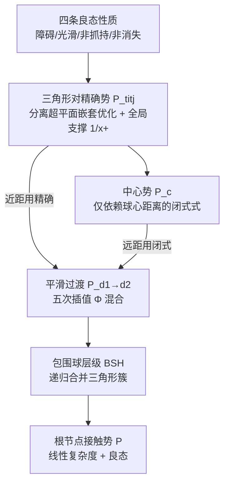

# Efficient Differentiable Contact Model with Long-range Influence

**会议**: ICLR 2026  
**OpenReview**: [https://openreview.net/forum?id=YSIHQy80Cr](https://openreview.net/forum?id=YSIHQy80Cr)  
**代码**: 待确认  
**领域**: 可微物理仿真 / 机器人控制  
**关键词**: 可微仿真, 接触模型, 长程梯度, 障碍势函数, 包围球层级(BSH), 接触丰富操作  

## 一句话总结
本文系统刻画了"良态接触模型"必须满足的四条性质（无穿透、二阶光滑、非抓持、梯度不消失），并设计了一个用包围球层级（BSH）高效求值、即便物体相距很远也能提供非零梯度的可微接触势函数，让梯度优化器从平凡初值就能发现复杂的接触丰富运动。

## 研究背景与动机
**领域现状**：可微物理仿真把仿真器变成可反传梯度的函数，已广泛用于模型预测控制、机器人协同设计、神经 PDE 求解等下游任务，核心卖点之一是能从平凡初值自动"发现"接触丰富的运动。

**现有痛点**：但多项系统性分析（Suh et al. 2022、Antonova et al. 2023）指出，可微仿真给出的解析梯度并不可靠——在非光滑接触处会变得**崎岖（rugged）**，在物体远离、无接触的区域会**消失（vanishing）**，导致优化器困在平凡局部最优。已有补救手段大多走"全局优化"路线（贝叶斯优化、最优传输）去逃离局部最优。

**核心矛盾**：作者主张这些梯度病态的根源其实在**接触模型本身**：两个刚体一旦接触，接触力突然引入造成梯度崎岖；而无接触时缺乏交互项导致梯度消失。与其在外层套全局搜索，不如直接修好接触模型内部的梯度景观。

**本文目标**：给出一套接触势函数应满足的形式化性质，并构造一个**同时满足全部性质又计算可行**的实用接触模型，使一阶梯度优化器即可处理接触丰富任务。

**核心 idea**：(1) **理论层** — 提出四条良态性质：障碍形式、光滑性、非抓持、非消失，其中"非消失"带来**长程影响（long-range influence）**，让任意远的物体之间也有梯度；(2) **实践层** — 用基于分离超平面的全局支撑势函数满足这些性质，再借鉴 N 体仿真的 Barnes-Hut / 快速多极思想，用包围球层级把 $O(T^2)$ 的接触求值降到线性。

## 方法详解

### 整体框架
方法分两步：先在**理论上**定义良态接触势必须满足的四条性质，并指出现有模型都至少缺一条；再在**构造上**给出一个满足全部性质的势函数——以一对三角形间的分离超平面优化定义"精确势"，用全局支撑的 $1/(\cdot)_+$ 替代局部支撑的对数障碍以避免梯度消失；最后用包围球层级（BSH）把远距三角形簇的精确势**平滑过渡**到一个只依赖球心距离的闭式"中心势"，从而层级化、近线性地求值整张接触势。

### 关键设计

**1. 四条良态性质：把"好梯度"翻译成可验证的数学条件。** 这是全文的理论骨架。**障碍形式（Barrier-Form）**要求 $P(x)\ge 0$ 连续且 $P(x)=\infty \iff x\in C_{obs}$，从而配合线搜索/信赖域能严格保证无穿透；**光滑性（Smoothness）**要求 $P$ 在 $C_{free}$ 上**二阶**可微——这点至关重要，因为由隐函数定理，仿真梯度 $\partial x^{t+1}/\partial(x^t,x^{t-1}) = -[\partial^2 L/\partial x^{t+1,2}]^{-1}\,\partial^2 L/\partial x^{t+1}\partial(\cdot)$ 需要 $P$ 二阶可微才能正确求值，而经典 IPC（Li et al. 2020）只有一阶可微；**非抓持（Non-prehensile）**要求接触力只能"推开"不能"拉拢"，形式化为力 $f_i$ 必须落在从一个凸包指向另一个凸包的方向锥 $\mathcal{F}_{J\to I}$ 内；**非消失（Non-vanishing）**则由 $\mathcal{F}_{J\to I}$ 中向量恒非零自动保证，即把 $P$ 写成所有良分离顶点簇对的成对势之和 $P=\sum_{\langle I,J\rangle} P_{I\cup J}$，使任意远的三角形对之间都贡献非零力。作者用 Table 1 证明此前模型（互补条件、软罚、对数障碍、SDRS）都至少违反一条，唯有本文四条全满足。

**2. 基于分离超平面的全局支撑成对势：在不破坏障碍/光滑的前提下让梯度"传得远"。** 对一对三角形 $t_i,t_j$，由于两者都是凸集，可插入分离平面 $p_{ij}=(n_{ij}^T,d_{ij})^T$ 把它们隔开。把该平面建模成零质量辅助物体，定义嵌套优化的成对势

$$P_{t_i\cup t_j}=\min_{p_{ij}}\Big[\tfrac{12}{(1-\|n_{ij}\|)_+}+\sum_{k}\tfrac{1}{(\langle x_{i(k)},n_{ij}\rangle+d_{ij})_+}+\sum_{k}\tfrac{1}{(\langle x_{j(k)},-n_{ij}\rangle-d_{ij})_+}\Big].$$

关键差异是：与原始公式（Liang et al. 2024、Ye et al. 2025）用**局部支撑**的对数障碍不同，本文改用 $1/(\cdot)_+=1/\max(\cdot,0)$ 这种在 $\mathbb{R}_+$ 上**全局支撑**的函数——正是这一改动让势函数在物体距离任意大时仍不衰减，从而满足非消失。该目标严格凸、有唯一最小点，故 $P_{t_i\cup t_j}$ 良定义且全局二阶可微，可用牛顿法求 $p_{ij}$、再由逆函数定理算一二阶导。

**3. 势函数间的平滑过渡：用五次插值把精确势无缝换成闭式近似。** 直接对所有三角形对求精确势是 $O(T^2)$，太慢。作者引入混合势

$$P^{I\cup J}_{d_1\to d_2}=(1-\phi_{d_1\to d_2}(x))\,P^{I\cup J}_{d_1}+\phi_{d_1\to d_2}(x)\,P^{I\cup J}_{d_2},$$

其中插值用经典五次平滑核 $\Phi(d)=\mathrm{clip}(6d^5-15d^4+10d^3,0,1)$（二阶导连续，保光滑）。Lemma 5.1 证明：只要 $R_I+R_J\le d_1<d_2$ 且 $P_{d_2}$ 也光滑、非抓持，则混合后的势**继承** $P_{d_1}$ 的全部良态性质。这把"近距用精确、远距用近似"的切换做成了不破坏任何性质的平滑融合，是后续层级化的理论许可证。

**4. 包围球层级（BSH）递归求值：把成对接触做成近线性的 N 体问题。** 这是效率核心。把三角形的三个顶点收缩到中心点后，精确势退化成只依赖球心距离的**闭式中心势**

$$P^{t_i\cup t_j}_c=12\Big[1+\tfrac{1}{\|x_{t_i}-x_{t_j}\|^{1/2}}\Big]^2,\qquad P^{I\cup J}_c=12\Big[1+1/\sqrt{\|x_I-x_J\|}\Big]^2.$$

对每个刚体建一棵**分层**包围球二叉树（每个球紧包其两个子球，而非紧包几何——后者虽更紧但会破坏良态性质），叶子存单个三角形。递归地：当两节点球心距离 $\ge R_I+R_J$（良分离）时直接用闭式中心势 $P_c$ 代替整棵子树；否则下降到子节点对求和。叶子与内部节点都用上面的平滑过渡（$d_1=R_I+R_J$，$d_2=(1+\epsilon)d_1$，$\epsilon$ 为用户控制精度的余量）拼接。Theorem 5.4 保证最终 $P=\sum_{I\ne J}P^{I\cup J}_{BSH}$ 仍同时满足障碍、光滑、非抓持与非消失；Appendix 在均匀网格特例下证明求值代价为 $O(T)$，类比快速多极方法把 $O(N^2)$ 降到线性。

## 实验关键数据

### 物理精度验证（叠书问题）
20 块木板逐块外伸到理论极限并内收 0.1%，测不同接触系数 $\mu$ 下的稳定性与接触力误差：

| 接触系数 $\mu$ | 1e−5 | 1e−6 | 1e−7 | 1e−8 | 1e−10 |
|---|---|---|---|---|---|
| 板间间隙 Margin (m) | 1.82e−2 | 5.67e−3 | 1.47e−3 | 4.12e−4 | 3.13e−5 |
| 接触力 (N) | 6.38e−3 | 6.40e−4 | 6.42e−5 | 6.42e−6 | 6.42e−8 |
| 稳定 | ✗ | ✓ | ✓ | ✓ | ✓ |

当 $\mu<10^{-6}$ 时系统稳定、间隙误差在毫米量级、接触力与理论值误差可忽略——说明"非接触也产生力"的设计不损害物理真实性。

### 性质完备性对比（Table 1）

| 方法 | 障碍 | 光滑 | 非抓持 | 非消失 |
|---|---|---|---|---|
| Werling 2021 / Xu 2022（互补） | ✗ | ✗ | ✓ | ✗ |
| Fisher 2001（软罚） | ✗ | ✗ | ✓ | ✗ |
| Harmon 2009 / Li 2020（IPC 对数障碍） | ✓ | ✗ | ✓ | ✗ |
| Ye 2025（SDRS） | ✓ | ✓ | ✓ | ✗ |
| **Ours** | ✓ | ✓ | ✓ | ✓ |

### 控制任务收敛性
在 Billiards、Push、Sort、Gather、Ant-Push 五个接触丰富的操作/运动任务上，与 IPC、SDRS、MuJoCo（有限差分梯度）、GB（一阶 bundled 梯度）对比：

- **Billiards（台球）**：从平凡初值（物体相距很远），除本文外所有方法因梯度消失**毫无进展**；加随机采样后它们能起步但仍慢，本文无论是否采样都收敛更快。
- **Push（推箱）**：用 48 帧 horizon 的滚动时域控制生成 200 帧轨迹，本文模型自动引导杆"先绕到箱子背后、再多次推"完成多阶段接触运动；其他方法即便加采样也无进展。
- **Gather / Sort / Ant-Push**：10 个立方体聚拢/按标签分拣、9 连杆 16-DOF 蚂蚁机器人推箱，本文仅凭梯度信息即可完成，其余方法收效甚微。

### 关键发现
1. **长程梯度是"从平凡初值发现运动"的决定因素**：基线方法的失败几乎都源于梯度消失，而非局部崎岖。
2. **效率代价存在但被 BSH 缓解**：本文因嵌套优化+层级混合，单帧比 IPC 慢，但 BSH 版本远快于暴力计算所有三角形对的版本，随网格分辨率增长优势扩大。

## 亮点与洞察
- **把"好梯度"工程问题升格为可证明的数学性质**：四条性质 + Table 1 的完备性对照，给整个可微接触领域提供了一张清晰的"评判表"。
- **一个看似微小的替换（局部支撑→全局支撑 $1/(\cdot)_+$）撬动了长程影响**，这是非消失性质的物理来源，思路干净。
- **跨领域迁移巧妙**：把图形学/天体物理的 Barnes-Hut、快速多极方法搬到接触势求值，并用平滑过渡保证近似不破坏可微性，兼顾理论严谨与计算可行。
- **平滑过渡的不变性引理（Lemma 5.1）**很优雅——把"近似不损性质"做成可组合的递归保证，是层级化能成立的关键。

## 局限与展望
- **仅限刚体**：包围球只有在刚体下才能严格包住三角形；一旦发生形变，球可能包不住几何，破坏非抓持/非消失性质，故无法处理软体机器人或可变形物体操作。
- **计算开销可观**：递归定义 + 三角形对间嵌套优化，相比常规刚体仿真器引入了不小的额外成本，单帧仍慢于 IPC。
- **复杂度分析受限**：$O(T)$ 仅在均匀网格特例下证明，一般场景的代价较难界定。
- 展望：把良态性质推广到可变形接触、寻找比嵌套优化更轻量的成对势求解，是自然的后续方向。

## 相关工作与启发
- **可微仿真谱系**：从 MuJoCo 有限差分梯度，到解析梯度刚体/降阶可变形仿真器，再到位置基动力学（Huang et al. 2024）；本文聚焦其中最难可微的"接触处理"子步。
- **接触模型谱系**：互补条件（Werling 2021）、软罚（Fisher 2001）、对数障碍 IPC（Li 2020）、SDRS（Ye 2025）——本文指出它们各缺一条性质，并以 SDRS 为最接近的起点改造。
- **梯度病态分析**：Suh et al. 2022、Antonova et al. 2023 揭示崎岖/消失梯度，本文给出"从接触模型内部修复"而非"外层套全局搜索"的另一条路径。
- **启发**：在任何"仿真即可微函数"的设定里，与其在优化器层面打补丁，不如先审视底层物理模型是否提供了**信息充分且光滑的梯度**——把数值病态归因到建模而非求解，是值得借鉴的诊断思路。

## 评分
- 新颖性: ⭐⭐⭐⭐⭐ — 首次把良态接触模型刻画为四条可证明性质并给出全部满足的构造，"全局支撑势 + BSH 长程梯度"组合是真正的新点。
- 实验充分度: ⭐⭐⭐⭐ — 五个接触丰富任务 + 物理精度验证 + 与四类基线对比，覆盖较全；但多为定性收敛曲线，量化指标和大规模/真实机器人验证偏少。
- 写作质量: ⭐⭐⭐⭐ — 理论推导严谨、性质-构造-效率三段递进清晰，图示直观；公式密集对非仿真背景读者门槛较高。
- 价值: ⭐⭐⭐⭐⭐ — 直击可微物理落地的核心痛点（梯度消失），为机器人控制/协同设计从平凡初值优化提供了可复用的接触模型基座。

<!-- RELATED:START -->

## 相关论文

- [\[ICLR 2026\] Sparse Imagination for Efficient Visual World Model Planning](sparse_imagination_for_efficient_visual_world_model_planning.md)
- [\[CVPR 2026\] Contact-Aware Neural Dynamics](../../CVPR2026/robotics/contact-aware_neural_dynamics.md)
- [\[ICLR 2026\] Differentiable Simulation of Hard Contacts with Soft Gradients for Learning and Control](differentiable_simulation_of_hard_contacts_with_soft_gradients_for_learning_and_.md)
- [\[ICLR 2026\] D-REX: Differentiable Real-to-Sim-to-Real Engine for Learning Dexterous Grasping](d-rex_differentiable_real-to-sim-to-real_engine_for_learning_dexterous_grasping.md)
- [\[ICLR 2026\] Compositional Diffusion with Guided Search for Long-Horizon Planning](compositional_diffusion_with_guided_search_for_long-horizon_planning.md)

<!-- RELATED:END -->
