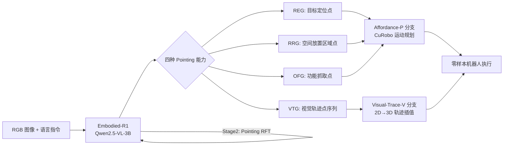

# Embodied-R1: Reinforced Embodied Reasoning for General Robotic Manipulation

**会议**: ICLR 2026  
**代码**: https://github.com/pickxiguapi/Embodied-R1  
**领域**: 机器人操控 / 具身智能  
**关键词**: 具身推理、pointing 表示、强化微调、视觉语言模型、零样本泛化

## 一句话总结
以"pointing"（二维坐标点/轨迹点序列）作为统一的 embodiment-agnostic 中间表示，通过两阶段强化微调（RFT）训练 3B 参数 VLM，在 11 个空间推理基准和 8 个真机任务上达到 SOTA，零样本成功率 87.5%。

## 研究背景与动机

**领域现状**：Vision-Language-Action（VLA）模型在机器人操控中展现了强大的视觉感知能力，但在新场景下操控性能大幅退化，端到端方法和模块化方法各有局限。

**现有痛点**：当前方法面临两个核心挑战——(a) **数据稀缺**：有限的具身数据难以充分将语言和视觉与物理动作绑定；(b) **机器人异构性**：不同机器人形态的差异严重阻碍知识跨平台迁移。即便如 FSD 这样通过 CoT 锚定推理的高级方法，也受限于 SFT 学到的刚性模板，在新任务上泛化能力受限。

**核心矛盾**：感知端（VLM）理解能力强，行动端却难以可靠落地，形成"seeing-to-doing gap"——视觉理解无法稳定转化为有效机器人动作。

**本文目标**：设计一种轻量级（3B）、具身感知强、零样本操控成功率高的 VLM，在不做任务专有微调的前提下泛化到真实机器人任务。

**切入角度**：将"pointing"（图像坐标点或点序列）作为统一的中间表示，既具有语义性，又与具体机器人形态无关，从而同时解决数据稀缺（可利用海量互联网视觉数据）和异构性（跨机器人通用）两大问题。

**核心 idea**：用强化微调代替 SFT，让模型通过奖励信号学会自由推理产生 pointing 输出，绕过端到端动作学习和多模型级联的缺陷，实现对新场景的强泛化。

## 方法详解

### 整体框架

Embodied-R1 以 Qwen2.5-VL-3B 为基础，定义四种具身 pointing 能力，构造 Embodied-Points-200K 数据集，经两阶段 RFT 训练后输出 `<think>...</think><answer><point>[[...]]</point></answer>` 格式的结构化推理结果，再交由下游 Action Executor 执行。

### 关键设计

**1. 四种具身 Pointing 能力：从单点到轨迹的统一表示**

传统 VLA 直接预测低级关节角度，导致强烈的 embodiment 依赖；而现有 pointing 方法（affordance point、bounding box 等）各自为政，表达能力有限。Embodied-R1 将 pointing 系统化为四种能力，共享同一坐标空间 $p = (p, q) \in [0, w] \times [0, h]$：
- **REG**（Referring Expression Grounding）：根据语言描述定位目标对象，输出一个点（需落入分割掩码 $M_{gt}$ 内）；
- **RRG**（Region Referring Grounding）：理解空间关系语言（如"黄色杯子和纸箱之间的空区域"），输出放置目标点；
- **OFG**（Object Functional Grounding）：定位对象的功能部件（如刀的刀柄、锅的提手），输出功能抓取点；
- **VTG**（Visual Trace Generation）：输出有序轨迹点序列 $\tau = \{p_t \mid t=1,...,T\}$，描述对象的完整操控路径。

这种统一格式使模型只需学习一种输出语言，却能覆盖从"抓哪里"到"怎么走"的全链路操控信息，同时完全无关于机器人的自由度和硬件参数。

**2. 两阶段 RFT 课程：从空间感知到精细 pointing**

SFT 在 pointing 任务中存在一个根本性困境——"multi-solution dilemma"：例如"在空区域放置物体"这一指令有无数等效合法答案，SFT 倾向于过拟合单个数据点，而 RFT 可以对任意正确答案给予正强化，真正学到任务的空间约束。据此，Embodied-R1 采用两阶段训练：

- **Stage 1 - 空间推理**（Embodied-Spatial-84K + ViRL-18K）：先在多项选择题格式的空间理解数据上用 GRPO 训练，建立稳固的空间感知基础，同时混入通识推理数据防止灾难性遗忘。
- **Stage 2 - 具身 pointing**（Embodied-Points-200K）：在第一阶段基础上继续 RFT，数据以"问题-验证标准"对的形式组织而非"问题-答案"对，让 GRPO 根据奖励函数判定正确性，实现自由推理而非模板记忆。

**3. 模块化多任务奖励库：精细化多任务平衡**

多任务训练时简单任务容易主导梯度，因此设计了可组合的奖励库 $\mathcal{F} = \{r_{format}, r_{acc}, r_{mask}, r_{dis}, r_{trace}\}$：

- $r_{format}$：二元奖励，检查 `<think>` 和 `<point>[[...]]</point>` 标签是否合规；
- $r_{acc}$：通用 QA 准确率（多选题用）；
- $r_{mask}$：预测点是否落入分割掩码，$r_{mask}(p, M_{gt}) = \mathbb{I}(p \in M_{gt})$；
- $r_{dis}$：稠密辅助距离奖励，$r_{dis} = \min(1.0, \max(0.0, 1.0 - \frac{d - D_{min}}{D_{max} - D_{min}}))$，引导预测点快速向目标区域靠近；
- $r_{trace}$：轨迹质量奖励，通过 RMSE 评估生成轨迹与 GT 的相似度后归一化。

每个任务的总奖励 $R = \sum_{r \in \mathcal{F}} w_r \cdot r$，权重归一化至 $[0,1]$，确保不同任务梯度尺度一致。例如 RRG 的奖励为 $R_{RRG} = 0.1 r_{format} + 0.2 r_{dis} + 0.7 r_{mask}$，强调空间放置精度。

**4. 双分支 Action Executor：pointing 到真实执行的解耦架构**

Embodied-R1 产出的 pointing 信号通过两条独立分支转化为机器人动作：
- **Affordance-P 分支**：利用 RRG + OFG 预测抓取点和放置点，交由 CuRobo 运动规划器生成无碰撞末端执行器轨迹；
- **Visual-Trace-V 分支**：利用 VTG 生成的 2D 轨迹点，经针孔相机模型 + 初始深度信息映射到 3D 笛卡尔坐标，插值为连续 SE(3) 运动轨迹后由机器人跟随执行。

这种解耦设计使 Embodied-R1 可以按需切换控制策略，甚至与扩散策略等学习型底层控制器集成，保持上层推理的通用性。

### 训练策略

所有 RFT 阶段均使用 **GRPO** 算法：行为策略在每个输入上采样多个候选响应，在组内归一化奖励计算相对优势，再用 clipped surrogate loss 最大化期望回报，同时维持训练稳定性。基础模型为 Qwen2.5-VL-3B-Instruct。

## 实验关键数据

### 主实验

**SIMPLEREnv（WidowX）零样本操控**：

| 方法 | 类型 | 成功率(Avg) |
|------|------|------------|
| OpenVLA | End-to-end VLA | 5.2% |
| π0 | End-to-end VLA | 27.1% |
| π0-fast | End-to-end VLA | 48.3% |
| OpenVLA-OFT | End-to-end VLA | 41.8% |
| ThinkAct | End-to-end VLA | 43.8% |
| Sofar | Modular | 53.8% |
| FSD-13B | Affordance | 40.6% |
| **Embodied-R1** | **Pointing+RFT** | **56.2%** |

**真机 xArm 8 任务零样本成功率**：

| 方法 | 平均成功率 |
|------|-----------|
| MOKA | 9.2% |
| RoboPoint | 12.5% |
| FSD | 25.0% |
| Embodied-R1-P（Affordance 分支） | 83.3% |
| **Embodied-R1-V（Visual Trace 分支）** | **87.5%** |

### 消融实验

**SFT vs RL（RRG 基准）**：

| 配置 | Where2Place | VABench-P |
|------|------------|-----------|
| RL + Think（完整模型） | **65.50** | **65.39** |
| RL - Think | 63.00 | 60.50 |
| SFT + Think | 41.25 | 47.67 |
| SFT - Think | 36.85 | 50.46 |

**视觉干扰鲁棒性**（真机任务）：

| 干扰条件 | 抓取率 | 成功率 |
|---------|-------|-------|
| 无干扰 | 100% | 100% |
| 背景变化（BC） | 100% | 100% |
| BC + 光线变化 | 83% | 83% |
| BC + 光线 + 高度变化 | 83% | 83% |

### 关键发现

- RL 训练相比 SFT 在 OOD 泛化上有决定性优势（Where2Place: 65.5 vs 41.3），显式推理进一步提升约 4-5 个点
- 通识数据（ViRL-18K）的混合对最终 Rank 有明显贡献（Embodied-R1: 2.1 vs w/o CS: 3.4）
- 尽管仅在真实数据上训练，VTG 能力零样本泛化到仿真、新型机器人和手绘草图场景

## 亮点与洞察

- **pointing 作为通用表示的精妙设计**：将机器人操控抽象成"在图像上指点"，既可利用海量互联网视觉数据克服数据稀缺，又天然无关于机器人硬件，一举解决两大核心痛点，且推理结果可解释

- **RFT 对 multi-solution 问题的天然适配**：embodied pointing 中合法答案不唯一（空区域放置位置有无数选择），SFT 会过拟合单答案，而 RFT 对任意正确答案均能正强化，这一洞察是方法成立的关键理论依据

- **3B 小模型超越 13B 大模型**：Embodied-R1（3B）在多个基准上超过 FSD-13B、RoboBrain-7B 等，证明正确的训练范式比模型规模更重要

## 局限与展望

- 当前 pointing → 执行的管线在非抓放类任务（如精细装配、布料操作）上应用受限，VTG 仅追踪目标对象运动，复杂接触力控制需要集成底层学习策略
- 真机实验仅覆盖 xArm 平台，跨机器人迁移尚未系统验证
- 长视野任务目前需要外部高级规划器（如 Gemini-2.5-Pro）做任务分解，端到端长链推理能力待提升

## 相关工作与启发

- **vs FSD（Yuan 2025）**：FSD 也用 pointing + CoT，但依赖 SFT 的刚性模板，本文改用 RFT 使推理更自由，zero-shot 泛化从 40.6% 提升至 56.2%
- **vs RoboPoint**：RoboPoint 只做单点预测，本文扩展为四种能力，覆盖从定位到轨迹的完整操控意图
- **vs π0/OpenVLA**：端到端方法直接学习低级动作，与预训练数据存在 action-domain mismatch；pointing 中间表示完全规避这一问题
- **vs R1 系列推理模型（DeepSeek-R1 等）**：将 R1 范式从数学/代码域迁移到具身操控，验证 RFT 在物理世界任务中同样有效

## 评分

- 新颖性: ⭐⭐⭐⭐ 系统化 pointing 四能力 + RFT 在操控域的首次成功应用，idea 清晰有力
- 实验充分度: ⭐⭐⭐⭐ 11 个基准 + 仿真 + 真机 + 消融 + 鲁棒性测试覆盖全面，真机 87.5% 令人信服
- 写作质量: ⭐⭐⭐⭐ 框架清晰，问题拆解到位，图表信息密度高
- 价值: ⭐⭐⭐⭐ 3B 模型零样本 62% 超越强 baseline，pointing 范式有望成为具身 AI 中间层标准抽象

<!-- RELATED:START -->

## 相关论文

- [\[ICLR 2026\] Vlaser: Vision-Language-Action Model with Synergistic Embodied Reasoning](vlaser_vision-language-action_model_with_synergistic_embodied_reasoning.md)
- [\[NeurIPS 2025\] Robot-R1: Reinforcement Learning for Enhanced Embodied Reasoning in Robotics](../../NeurIPS2025/robotics/robot-r1_reinforcement_learning_for_enhanced_embodied_reasoning_in_robotics.md)
- [\[ICLR 2026\] EVLP: Learning Unified Embodied Vision-Language Planner with Reinforced Supervised Fine-Tuning](evlp_learning_unified_embodied_vision-language_planner_with_reinforced_supervise.md)
- [\[ICLR 2026\] From Seeing to Doing: Bridging Reasoning and Decision for Robotic Manipulation](from_seeing_to_doing_bridging_reasoning_and_decision_for_robotic_manipulation.md)
- [\[CVPR 2026\] Obstruction Reasoning for Robotic Grasping](../../CVPR2026/robotics/obstruction_reasoning_for_robotic_grasping.md)

<!-- RELATED:END -->
