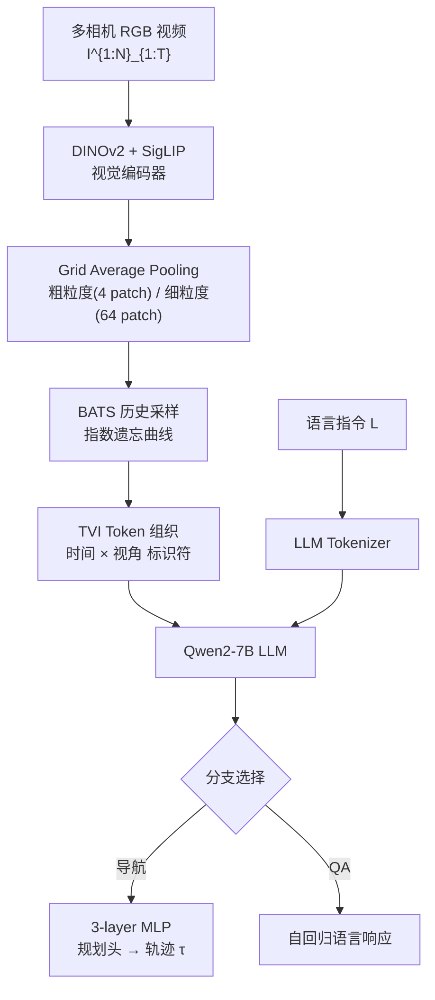

# Embodied Navigation Foundation Model

**会议**: ICLR 2026  
**项目主页**: https://pku-epic.github.io/NavFoM-Web/  
**代码**: 论文接受后开源（pre-trained weights 一并公开）  
**领域**: 具身导航 / 机器人  
**关键词**: 导航基础模型、跨机体导航、视觉语言导航、Token预算采样、多任务联合训练

## 一句话总结

NavFoM 是首个跨机体×跨任务的具身导航基础模型，在 800 万条导航样本上联合训练四足机器人、无人机、轮式机器人和车辆，用 TVI 标识符 Token 处理任意相机配置，用预算感知历史采样控制推理开销，在 7 个公开 benchmark 上免微调达到 SOTA 或竞争性性能。

## 研究背景与动机

**领域现状**：具身导航是智能体在物理世界中移动的核心能力，近年借助视觉-语言模型（VLM）取得长足进步，VLM 在检索、分类、字幕等零样本任务上展示出强泛化能力。

**现有痛点**：现有导航方法高度依赖特定任务场景和特定机体架构——跨任务方法（如 NaVid、Uni-NaVid）假设固定相机配置，跨机体方法（如 NoMaD、ViNT）隐式学习特定机体的物理先验，两条线始终相互割裂，无法形成统一的导航智能。

**核心矛盾**：不同机体相机配置各异（单目、四目、六目、八目），不同任务时间跨度差异悬殊（VLN 约 122 步、跟踪任务超 1000 帧），统一处理意味着 token 数量呈数量级增长，直接拼接不可行。

**本文目标**：构建一个能在四足机器人、无人机、轮式机器人和车辆上跨任务（VLN、目标搜索、主动跟踪、自动驾驶）通用的导航基础模型 NavFoM，且无需任务特定微调。

**切入角度**：以自我中心视频 + 语言指令为统一输入格式，输出航点轨迹，兼容绝大多数现有任务设定；用专用标识符 Token 承载相机视角与时序信息，用预算感知采样压缩推理开销。

**核心 idea**：用 Temporal-Viewpoint Indicator (TVI) Token 解耦视角×时序信息，用指数遗忘曲线驱动的历史帧采样（BATS）在固定 token 预算内保留关键历史，从而将多机体多任务导航统一进一个 VLM 框架。

## 方法详解

### 整体框架

NavFoM 在标准视频 VLM（Qwen2-7B + DINOv2 + SigLIP）的基础上扩展为双分支架构：导航分支输出轨迹航点，QA 分支自回归生成语言响应。两个分支共享主干，通过 TVI Token 将来自不同时刻、不同视角的视觉 Token 有序组织后送入 LLM，最终由三层 MLP 规划头将 LLM 隐状态解码为 $M=8$ 个归一化航点 $\{(x,y,z,\theta)\}$。

### 关键设计

**1. Temporal-Viewpoint Indicator (TVI) Token：让 LLM 分清"哪个时刻哪个视角"**

视觉 Token 本身不携带时序和视角信息，朴素拼接让 LLM 无法区分"前向摄像头 t=3"与"侧向摄像头 t=7"。TVI Token 引入三类嵌入来弥补这一缺口：

$$
E_{\text{TVI}} = \begin{cases}
E_{\text{Base}} + P_{\text{time}}(\text{TimePE}(t)) + P_{\text{angle}}(\text{AnglePE}(\varphi)) & \text{导航} \\
E_{\text{Base}} + P_{\text{time}}(\text{TimePE}(t)) & \text{视频 QA} \\
E_{\text{Base}} & \text{图像 QA}
\end{cases}
$$

其中 $\text{AnglePE}(\varphi)$ 将方位角 $\varphi$ 先分解为 $\cos\varphi$ 和 $\sin\varphi$ 再分别过正弦位置编码，确保角度的循环连续性（$0 \equiv 2\pi$，距离度量满足几何近邻关系）；$\text{TimePE}(t)$ 对时间步做正弦位置编码，对不规则采样间隔鲁棒；$P_{\text{time}}/P_{\text{angle}}$ 均为两层 MLP。三种任务使用不同的 TVI 组合，使同一套 token 序列既能服务导航又能服务 QA，大幅提升 LLM 对输入语义的理解。消融实验显示，TVI 相比最近邻历史视角位置嵌入（HAMT）在 RxR Val-Unseen SR 上提升约 12%（52.3% → 64.4%）。

**2. Budget-Aware Temporal Sampling (BATS)：指数遗忘曲线驱动的 token 预算管理**

导航过程中累积的视频帧数随任务时长线性增长，直接保留全部历史帧会导致推理时间和显存随任务进行呈线性膨胀。均匀采样（Uniform Sampling）丢失近期关键帧，Token Merging 在训练期引入额外开销且推理速度不一致。BATS 从人类"遗忘曲线"汲取灵感，对历史帧赋予指数增长的采样概率：

$$
P(t) = (1-\epsilon)\,e^{k(t-T)/T} + \epsilon, \quad k > 0
$$

越接近当前时刻 $T$ 的帧采样概率越高，远距历史以较低概率随机保留。给定 token 预算 $B_{\text{token}}$，期望采样帧数为：

$$
\mathbb{E}_{\text{frames}} \approx \int_0^T P(t)\,dt = (1-\epsilon)\frac{1-e^{-k}}{k}T + \epsilon T
$$

约束 $\mathbb{E}_{\text{frames}}$ 的 token 消耗不超过 $B_{\text{token}}$，用 Brent 法离线计算各帧数对应的 $k$，推理时直接查表无需额外计算。BATS 对多相机天然自适应：视角数 $N$ 增大时，分子 $(4+1) \times \mathbb{E}_{\text{frames}}$ 被约束不变，自动减少每视角保留帧数。消融显示，在相同预算 $B=1024$ 下，BATS 比均匀采样在 nDTW 上高 6.2 分（64.1 vs 57.9），预算从 2048 降至 1024 时性能下降仅 1.4%（相比均匀采样的 6.0%）。

**3. 多任务协同训练：跨任务数据产生正向迁移**

NavFoM 在 1270 万样本上联合训练：800 万导航样本（VLN 3.37M + 目标导航 1.02M + 主动跟踪 897K + 自动驾驶 681K + 网络视频导航）+ 476 万 QA 样本（图像 QA 315M + 视频 QA 161M）。轨迹损失采用 MSE，QA 采用交叉熵，总损失 $\mathcal{L} = \beta \mathcal{L}_{\text{nav}} + \mathcal{L}_{\text{QA}}$（$\beta=10$ 用于平衡数值量级）。

消融显示，仅用搜索任务单独训练时 SR 仅 10.3%，加入全部其他导航数据后升至 45.2%（+34.9%）；跟踪任务从 12.6% 升至 62.0%（+49.4%）。改善来源于：单任务训练的相机配置和目标类别分布窄，跨任务数据补充了多视角观察和开放词汇的泛化能力，有效抑制了任务特定过拟合。

### 训练策略

模型基于 Qwen2-7B + DINOv2 + SigLIP 预训练权重初始化，fine-tune 一个 epoch；在 56 块 NVIDIA H100 GPU 上训练约 72 小时（总计 4032 GPU 小时）。轨迹航点在输出前归一化至 $[-1, 1]$，三类场景（室内导航、无人机、汽车）使用不同缩放因子 $\alpha_{\text{task}}$。实际部署使用 RTX 4090 单卡，token 预算 1600 时显存 19.1 GB，推理频率 5 Hz（约 218 ms/帧）。

## 实验关键数据

### 主实验

| 数据集 | 设置 | 指标 | 本文 | 之前 SOTA | 提升 |
|--------|------|------|------|-----------|------|
| VLN-CE RxR Val-Unseen | 单视角 | SR↑ | **57.4%** | 51.8% (StreamVLN) | +5.6% |
| VLN-CE RxR Val-Unseen | 四视角 | SR↑ | **64.4%** | 56.3% (HNR, 含深度+里程计) | +8.1% |
| VLN-CE R2R Val-Unseen | 四视角 | SR↑ | **61.7%** | — | — |
| HM3D-OVON Val-Unseen | 零样本 | SR↑ | **45.2%** | 43.6% (MTU3D, 有监督) | +1.6% |
| EVT-Bench 跟踪 | 单视角 | SR↑ | **85.0%** | 85.1% (TrackVLA) | 持平 |
| EVT-Bench 跟踪（干扰目标） | 单视角 | SR↑ | **61.4%** | 57.6% (TrackVLA) | +3.8% |
| NAVSIM 自动驾驶 | 八视角 | PDMS↑ | **84.3** | 84.6 (LAW) | 竞争性 |

### 消融实验

| 配置 | VLN-CE RxR SR (B=2048) | nDTW | 说明 |
|------|------------------------|------|------|
| 均匀采样 (baseline) | 62.4% | 63.9 | Cheng et al. 2025 方式 |
| 线性概率采样 | 63.0% | 64.8 | 手工线性权重 |
| **BATS（本文）** | **64.4%** | **65.8** | 指数遗忘曲线 |
| 视角-历史位置嵌入 (HAMT) | 52.3% | 58.7 | 增加额外分量干扰 |
| 独立可学习特殊 Token | 59.1% | 59.6 | 无结构先验 |
| 手工 Token（无 MLP 投影） | 53.6% | 58.0 | 缺乏可学习变换 |
| **TVI Token（本文）** | **64.4%** | **65.8** | 时序 × 视角完整表示 |

### 关键发现

- 多视角（四目）相比单目在 RxR-CE 提升 7.0% SR，在 R2R-CE 提升 5.5% SR，说明多视角导航基础模型是有前景的研究方向
- 跨任务协同训练对数据分布窄的任务（搜索 +34.9%、跟踪 +49.4%）收益远大于 VLN（+2–3%），表明数据多样性对分布外泛化至关重要
- NavFoM 在零样本设置下 HM3D-OVON 超越有监督微调的 MTU3D（45.2% vs 40.8%），验证基础模型的泛化优势

## 亮点与洞察

- **TVI Token 的优雅设计**：用三套正弦编码（角度分解为 sin/cos 保证循环连续性）+ 可学习 MLP 投影，同时满足视角感知、时间感知、任务可分离三大约束，比专用位置嵌入轻量且效果显著更好——关键在于把信息注入到"前导标识符"而非视觉 Token 本身，LLM 可以用注意力机制灵活地利用这些标识
- **BATS 与遗忘曲线的类比**：把人类记忆规律迁移到 token 预算分配，用指数采样概率对齐"近期重要、远期稀疏"的导航直觉，且可离线计算参数表，推理零额外开销，工程友好
- **800 万规模数据 + QA 协同训练**：比前代方法（NaVid 1.2M、Uni-NaVid 5.9M）数据量大一倍，且引入 QA 数据不仅增强语言理解，还通过共享 backbone 为导航提供视觉语义基础

## 局限与展望

- 在 NAVSIM 自动驾驶上与专用方法（LAW 84.6 PDMS）尚有微小差距，表明高度感知精度要求的专项任务上通用模型仍不如定制方案
- BATS 存在理论边界：当帧数极大（如四目 ×1120 步）时下界概率约束 $\epsilon$ 使期望帧数方程无解，实际场景出现率极低但存在系统性缺口
- 当前轨迹预测为纯视觉，未引入地图、语义先验或记忆机制，复杂长程任务（多房间、城市尺度）仍具挑战
- 实验以英语指令为主，多语言导航泛化尚未验证

## 相关工作与启发

- **vs NaVid / Uni-NaVid**：同属视频 VLM 驱动的导航方法，但只支持单一或固定相机配置；NavFoM 引入 TVI Token 打破相机配置约束，数据规模也扩大一倍
- **vs NaVILA / StreamVLN**：专注 VLN 单任务优化；NavFoM 无需任务特定微调，在多任务联合评估中仍具竞争力
- **vs NoMaD / ViNT**：经典跨机体导航方法，依赖 topological map 或隐式物理先验；NavFoM 以纯 VLM 方式端到端建模，无需任何地图构建
- **vs TrackVLA**：专门为主动跟踪设计的方法；NavFoM 在单目跟踪上与其持平，干扰场景下反而更优，体现出多任务训练带来的鲁棒性

## 评分

- 新颖性: ⭐⭐⭐⭐ 首个同时实现跨机体 × 跨任务的导航基础模型，TVI Token 设计简洁且具普适性
- 实验充分度: ⭐⭐⭐⭐⭐ 7 个 benchmark + 多平台真实机器人实验 + 详尽消融，覆盖全面
- 写作质量: ⭐⭐⭐⭐ 架构图清晰，消融与分析逻辑完整，细节充实
- 价值: ⭐⭐⭐⭐⭐ 为具身导航基础模型建立了有说服力的基线，TVI+BATS 设计可复用于其他具身任务

<!-- RELATED:START -->

## 相关论文

- [\[ICLR 2026\] From Seeing to Experiencing: Scaling Navigation Foundation Models with Reinforcement Learning](from_seeing_to_experiencing_scaling_navigation_foundation_models_with_reinforcem.md)
- [\[CVPR 2026\] SocialNav: Training Human-Inspired Foundation Model for Socially-Aware Embodied Navigation](../../CVPR2026/robotics/socialnav_training_human-inspired_foundation_model_for_socially-aware_embodied_n.md)
- [\[ICLR 2026\] Ground Slow, Move Fast: A Dual-System Foundation Model for Generalizable Vision-Language Navigation](ground_slow_move_fast_a_dual-system_foundation_model_for_generalizable_vision-la.md)
- [\[ICLR 2026\] From Spatial to Actions: Grounding Vision-Language-Action Model in Spatial Foundation Priors](from_spatial_to_actions_grounding_vision-language-action_model_in_spatial_founda.md)
- [\[ICLR 2026\] Vlaser: Vision-Language-Action Model with Synergistic Embodied Reasoning](vlaser_vision-language-action_model_with_synergistic_embodied_reasoning.md)

<!-- RELATED:END -->
