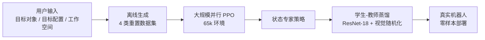

# Emergent Dexterity via Diverse Resets and Large-Scale Reinforcement Learning

**会议**: ICLR 2026  
**代码**: https://omnireset.github.io  
**领域**: 机器人灵巧操作 / 强化学习  
**关键词**: 灵巧操作、多样化重置、大规模强化学习、sim-to-real、涌现行为

## 一句话总结
OmniReset 通过自动生成四类多样化初始状态分布，让 PPO 在大规模并行仿真中无需任何人工演示、课程或任务特定奖励，即可涌现出复杂多阶段灵巧操作策略，并零样本迁移到真实机器人。

## 研究背景与动机

**领域现状**：基于大规模并行仿真的强化学习（如 IsaacLab）在四足运动、简单抓取等任务上取得了显著进展，但在长时域接触密集型操作（插销、拧腿、抽屉插入等）上仍远落后于人类水平。

**现有痛点**：标准探索策略（PPO/SAC）在大规模并行下会迅速饱和——反复采样同一狭窄状态分布，陷入局部最优。为此，研究者不得不引入大量手工工程：任务特定的奖励塑形、精心设计的课程、专家演示辅助，这些都严重制约了方法的泛化性和可扩展性。

**核心矛盾**：增加计算量和并行环境数本应带来收益，但若初始状态分布太窄，更多并行只是重复低效地探索同一区域，性能很快饱和——RL 难以"发现"稀疏奖励，更无法将多个子行为串联成长时域策略。

**本文目标**：实现一种可扩展的框架，让 RL 能在无需人工演示、无课程、无任务特定奖励的前提下，通过增加计算量持续提升性能，最终解决先前方法无法完成的长时域灵巧操作任务。

**切入角度**：既然长时域灵巧操作本质上是若干"交互模式"（接近、接触、稳定抓取、精细插入/旋转）的组合，那么只要让 RL 算法在训练中**充分覆盖**这些交互模式所对应的状态空间区域，它就能自主发现如何将这些片段拼接成完整策略，而不需要人告诉它"先抓后插"。

**核心 idea**：用四类自动生成的多样化重置状态（到达、接近物体、稳定抓取、接近目标），密集覆盖操作任务的关键交互状态空间，配合大规模并行 PPO，让灵巧行为从计算中涌现出来。

## 方法详解

### 整体框架

OmniReset 的工作流程分为两个阶段：**离线生成**多样化重置数据集，然后在**在线 RL 训练**中均匀采样这些重置状态驱动 PPO 学习。训练收敛后，通过**学生-教师蒸馏**将基于状态的专家策略压缩为可在真实机器人上部署的视觉运动策略（RGB 输入）。

### 关键设计

**1. 四类多样化重置状态：密集覆盖交互模式**

传统 RL 训练从固定的"到达"初始状态出发，机器人很难自己探索到稀疏奖励区域（如插销成功的一瞬间）。OmniReset 的核心洞察是：长时域灵巧操作任务可以分解为几个反复出现的交互模式，而这些模式对应的状态空间区域是可以被显式覆盖的。

具体地，OmniReset 在离线阶段自动构建四类重置数据集：**到达重置** $\mathcal{D}_R$（机器人末端在工作空间内随机位置，目标物体随机摆放在桌面上）为算法提供完整任务的起点；**接近物体重置** $\mathcal{D}_{NO}$（末端对齐至预计算的 1000 个抓取点之一 + 小随机偏移，夹爪随机开/闭）覆盖非抓握接触和抓取初始化；**稳定抓取重置** $\mathcal{D}_G$（目标物体悬浮在工作空间随机高度，末端处于有效抓取姿态）覆盖空中操控阶段；**接近目标重置** $\mathcal{D}_{NG}$（目标物体置于目标配置附近的预计算偏移处，末端与物体接触）覆盖插入/旋转等接触密集的末端阶段。训练时均匀采样 $\mathcal{D} = \mathcal{D}_R \cup \mathcal{D}_{NO} \cup \mathcal{D}_G \cup \mathcal{D}_{NG}$，所有重置提前用碰撞检测和短步仿真验证合法性后缓存到 GPU，以保证采样效率。

这种设计的精妙之处在于：四类重置从"任务末端"到"任务起点"近似均匀地覆盖了到达目标的所有路径，使得稀疏成功奖励能够通过值函数更新平滑传播到整个状态空间，RL 算法因此能够自主发现并组合多种子策略。

**2. 任务无关的通用奖励函数**

过去的方法往往需要为每个任务手工设计奖励塑形项。OmniReset 使用统一的奖励结构，在所有任务中保持相同权重：

$$r(s_t, a_t) = r_{\text{success}}(s_t) + r_{\text{dist}}(s_t) + r_{\text{reach}}(s_t) + r_{\text{smooth}}(s_t, a_t) + r_{\text{term}}(s_t)$$

其中 $r_{\text{success}}$ 是稀疏二值完成奖励，$r_{\text{dist}}$ 鼓励目标物体靠近目标位形，$r_{\text{reach}}$ 鼓励夹爪靠近目标物体，$r_{\text{smooth}}$ 惩罚大幅或急剧变化的动作，$r_{\text{term}}$ 惩罚触发终止的不安全状态。这种设计能够奏效，正是因为多样化重置已经解决了探索难题：算法不再需要奖励引导它"发现"如何接触物体或如何抓握，这些状态通过重置直接提供，奖励只需要告诉算法"哪个方向更好"。

**3. 大规模并行环境 + gSDE 探索噪声**

多样化重置解决了状态覆盖问题，但需要足够多的并行环境来充分利用这种覆盖。消融实验表明，从 4096 到 65536 并行环境，性能持续提升（尤其是全任务成功率），而较少环境虽然能解决近目标子任务，却无法完成完整的多阶段任务。算法层面采用**非对称 Actor-Critic**：Actor 接收 5 步历史的机器人状态 + 物体位姿 + 历史动作；Critic 额外接收环境特权参数，以稳定训练。同时引入**广义状态依赖探索噪声**（gSDE）：探索噪声由策略网络最后一层特征条件化，使得机器人能在状态空间的不同区域学到不同的时序相关探索策略——这对于多阶段异质任务（同一次 rollout 里需要先推后插）至关重要。

**4. 学生-教师蒸馏实现 sim-to-real 迁移**

基于状态的专家策略无法直接在真实机器人上运行，OmniReset 采用学生-教师蒸馏将其转化为仅依赖 RGB 图像的视觉运动策略。收集 10,000 条专家 rollout（含三路相机：正面、侧面、腕部的 224×224 图像），用 ImageNet 预训练的 ResNet-18 编码器 + 高斯 MLP 头训练学生策略。视觉随机化涵盖光照、背景、物体/机器人外观、工作台纹理、相机姿态和视角抖动，配合颜色抖动、模糊、灰度、噪声等标准图像增强以弥合 sim-to-real 视觉差距；动力学随机化则通过系统辨识校准关节摩擦和延迟，并在 RL 训练时随机化控制器增益和物理参数。

## 实验关键数据

### 主实验

OmniReset 在 6 类任务的 Hard 变体（宽初始状态分布）上均显著超越三个基线（均提前获得最优演示）：

| 任务 | OmniReset 成功率 | BC-PPO | DeepMimic | Demo Curriculum |
|------|-----------------|--------|-----------|-----------------|
| Peg Insertion (Hard) | ~1.0 | 几乎 0 | 几乎 0 | 较低 |
| Leg Twisting (Hard) | ~0.9 | 几乎 0 | 几乎 0 | 较低 |
| Drawer Insertion (Hard) | ~0.8+ | 几乎 0 | 几乎 0 | 较低 |
| Cube Stacking (Hard) | ~0.9+ | 几乎 0 | 极低 | 极低 |
| Wall Slide (Hard) | ~0.9+ | 极低 | 极低 | 极低 |
| Cupcake Placement (Hard) | ~0.9 | 极低 | 极低 | 极低 |

**真实机器人**：Peg Insertion 任务，OmniReset 蒸馏策略零样本迁移达 **25% 成功率**，而用 100 条真实演示训练的 Diffusion Policy 仅 **4%**；定性上，OmniReset 策略展现出稳健的"重试行为"，能在第一次插入失败后自主恢复。

### 消融实验

| 配置 | 全任务成功率 | 说明 |
|------|------------|------|
| 65536 并行环境 | ~0.85 | 最优配置 |
| 32768 并行环境 | ~0.65 | 明显下降 |
| 8192 并行环境 | ~0.2 | 接近失败 |
| 广泛抓取采样范围 | ~0.9 | 最优 |
| 适中抓取采样范围 | ~0.6 | 样本效率低 |
| 窄抓取采样范围 | ~0.3 | 难以收敛 |

### 关键发现
- 基线方法能解决近目标子任务（Near-Goal 起始成功率较高），但完全无法扩展到完整长时域任务（Reaching 起始成功率接近 0）
- OmniReset 训练的策略在受到强力扰动后成功率几乎不降，而基线在小扰动下即显著下降
- Drawer Insertion 任务中，RL 自主涌现出"翻转抽屉后推入"而非抓取的非抓握策略；Leg Twisting 中则自主涌现出"利用桌面调整抓姿后旋入"的复合策略
- 完成四腿桌装配时，OmniReset 与简单脚本调度器组合即可完成极长时域任务

## 亮点与洞察
- **重置即课程的最简形式**：OmniReset 证明了"密集覆盖状态空间"比"精心设计课程"更简单、更可扩展——后者需要人工定义难度梯度，前者只需随机物理采样；这与 LLM 领域"简单大规模数据胜过精心设计算法"的规律高度吻合。
- **涌现 vs. 工程**：Drawer Insertion 中机器人自主发明了"先推翻再滑入"的策略，这在人类设计的课程或演示中几乎不会出现，说明足够宽广的探索空间可以催生超越人类先验的解法。
- **计算可扩展性**：不同于大多数 RL 方法，OmniReset 在 4096→65536 并行环境的整个范围内性能均持续提升，真正实现了"更多计算 = 更好性能"，这与 LLM Scaling Laws 的精神一致。
- **极低的人工输入**：用户只需指定目标对象、目标配置和工作空间三项，无需任何关于"怎么做"的先验知识，框架其余全部自动化。

## 局限与展望
- 当前仍是**单任务单物体**框架，多任务扩展是直接后续方向
- 真实机器人的零样本成功率（25%）仍有较大提升空间，sim-to-real 差距尚未完全消除
- 尚未扩展到灵巧手（高维动作空间），但现有抓取采样方法（如 UniGrasp）原则上可接入
- 四类重置状态的划分依赖对任务"关键交互阶段"的隐式假设，对极端长时域或高度分支任务可能需要更精细的状态空间分析
- 缺乏对 Scaling Laws 的系统性定量研究（论文指出这是开放方向）

## 相关工作与启发
- **vs. BC-PPO / DeepMimic / Demo Curriculum**：这些方法均需要专家演示，且只能在窄初始条件分布下成功；OmniReset 无需演示且在宽分布下表现更优，证明了"覆盖"比"引导"更根本
- **vs. 反向课程（Reverse Curriculum）**：反向课程从目标状态逆向生成初始条件，需要成功轨迹作为锚点；OmniReset 的四类重置可看作一种更通用的"前向覆盖"，不依赖已有成功信号
- **vs. 内在探索奖励（ICM/RND）**：好奇心驱动的探索增加了算法复杂度且难以规模化；OmniReset 通过改变初始状态分布来"替代"探索，更简单且更易并行
- **vs. 运动规划混合方法（Tang et al. 2024）**：混合方法降低了探索负担但增加了系统复杂度；OmniReset 选择完全依赖 RL，代价是需要更多计算，但收益是更统一、可扩展的框架

## 评分
- 新颖性: ⭐⭐⭐⭐ 核心思路（多样化重置）并非全新，但系统化提炼为可扩展框架并实证其缩放行为是重要贡献
- 实验充分度: ⭐⭐⭐⭐⭐ 6 类操作任务 × Hard/Easy 变体、详细消融、鲁棒性分析、真实机器人验证，实验设计扎实
- 写作质量: ⭐⭐⭐⭐ 论文清晰地将方法与 LLM Scaling Laws 类比，叙事逻辑强，但部分实验结果仅以图表展示缺乏数字量化
- 价值: ⭐⭐⭐⭐⭐ 为"RL 驱动灵巧操作"提供了一条无需专家知识即可扩展的路径，对领域有实质推动

<!-- RELATED:START -->

## 相关论文

- [\[ICLR 2026\] Rethinking Policy Diversity in Ensemble Policy Gradient in Large-Scale Reinforcement Learning](rethinking_policy_diversity_in_ensemble_policy_gradient_in_large-scale_reinforce.md)
- [\[ICLR 2026\] RoboCasa365: A Large-Scale Simulation Framework for Training and Benchmarking Generalist Robots](robocasa365_a_large-scale_simulation_framework_for_training_and_benchmarking_gen.md)
- [\[ICLR 2026\] Towards Bridging the Gap between Large-Scale Pretraining and Efficient Finetuning for Humanoid Control](towards_bridging_the_gap_between_large-scale_pretraining_and_efficient_finetunin.md)
- [\[ICLR 2026\] RFS: Reinforcement Learning with Residual Flow Steering for Dexterous Manipulation](rfs_reinforcement_learning_with_residual_flow_steering_for_dexterous_manipulatio.md)
- [\[ICLR 2026\] Partially Equivariant Reinforcement Learning in Symmetry-Breaking Environments](partially_equivariant_reinforcement_learning_in_symmetry-breaking_environments.md)

<!-- RELATED:END -->
