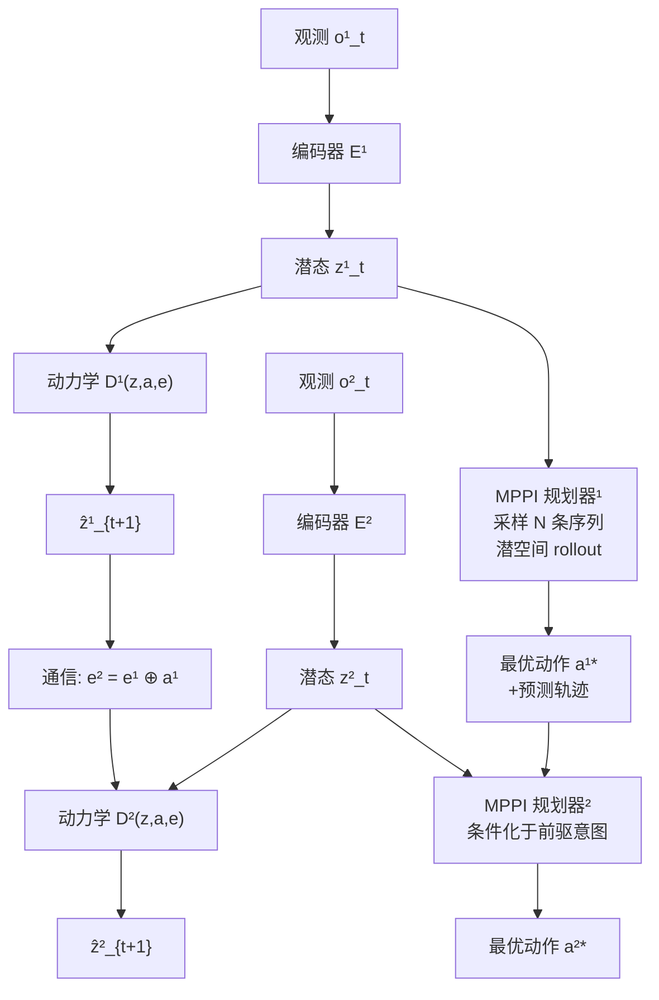

# Empowering Multi-Robot Cooperation via Sequential World Models

**会议**: ICLR 2026  
**OpenReview**: [https://openreview.net/forum?id=IvUM6UwYCJ](https://openreview.net/forum?id=IvUM6UwYCJ)  
**代码**: [SeqWM](https://openreview.net/forum?id=IvUM6UwYCJ)（论文主页提供）  
**领域**: 机器人 / 多智能体  
**关键词**: 多机器人合作、世界模型、序列范式、模型预测路径积分、自回归动力学建模

## 一句话总结

提出 SeqWM（Sequential World Model），将序列化（自回归）范式引入多机器人模型强化学习，使每个机器人独立维护一个世界模型并顺序传递预测轨迹，在降低建模复杂度的同时，通过意图共享让系统自发涌现出预测适应、时序对齐、角色分工等高级协作行为，并成功完成 sim-to-real 迁移。

## 研究背景与动机

**领域现状**：模型基强化学习（MBRL）凭借高样本效率和多步规划能力在单机器人任务中取得显著成果，但将其扩展至多机器人合作时面临"联合动力学"建模复杂度爆炸的核心挑战。  
**现有痛点**：去中心化方法为每个智能体独立建模，忽略耦合关系，协调能力差；中心化方法（如 CoDreamer、MARIE）在联合状态-动作空间中预测，高维度（O∈R²²⁹，A∈R²⁶）下计算成本极高，难以部署到真实机器人。  
**核心矛盾**：去中心化建模失去协调能力，中心化建模无法负担高维联合空间的计算代价——两者都不能同时满足"高效建模"与"精准协调"。  
**本文目标**：在二者之间寻找一条"有序通信"的中间路线，将多机器人 MBRL 同时满足低建模复杂度和显式意图共享两个需求。  
**核心 idea**：借鉴多智能体序列决策范式（MAT、HARL），把联合动力学分解为**自回归的 per-agent 世界模型**——每个机器人只学自己的局部动力学，但在预测时以前驱机器人的预测轨迹为条件输入；规划时同样顺序传递最优动作计划，实现"意图共享"。

## 方法详解

### 整体框架

SeqWM 包含两个协同组件：**Sequential World Modelling**（在潜空间中自回归建模联合动力学）和 **Sequential Planning**（基于 MPPI 的序列化多智能体规划器）。训练时遵循序列更新策略，确保每个 agent 的世界模型总以最新前驱预测为条件，保证单调提升。

### 关键设计

**1. 自回归潜空间世界模型：以前驱预测为条件降低建模复杂度**

SeqWM 的核心是将联合动力学 $P(s_{t+1}|s_t,\mathbf{a}_t)$ 分解为 $n$ 个条件概率的乘积。对于第 $i$ 个 agent，其世界模型为：

$$
z^i_t = E^i(o^i_t), \quad
\hat{z}^i_{t+1} = D^i(z^i_t, a^i_t, e^i_t), \quad
e^{i+1}_t = e^i_t \oplus a^i_t
$$

其中 $e^i_t$ 是前驱 agent 通过**拼接**（concat）传来的通信消息，包含所有 $j<i$ 的潜态预测和动作。关键在于：（a）每个 agent 的编码器、动力学预测器均独立，无参数共享，便于真实机器人的分布式部署；（b）通信采用简单 concat 而非交叉注意力或 RNN，消融实验证明这保留了完整通信内容，同时避免了额外可学习参数导致的梯度不稳定；（c）训练损失严格遵循自回归顺序——训练 agent $i+1$ 时，其输入来自前 $i$ 个 agent **最新版本**模型的预测，形成序列更新策略。

训练目标（预测 horizon $H$ 步，衰减权重 $\lambda$）：

$$
\mathcal{L}_i(\theta) = \sum_{t}^{H} \lambda^t \Big[
\underbrace{\|\hat{z}^i_{t+1} - \text{sg}(z^i_{t+1})\|^2}_{\text{dynamics loss}}
+ \underbrace{\text{Soft-CE}(\hat{r}^i_t, r_t)}_{\text{reward loss}}
+ \underbrace{\text{Soft-CE}(\hat{q}^i_t, G_t)}_{Q\text{-value loss}}
\Big]
$$

stop-gradient 算子 $\text{sg}(\cdot)$ 作用于潜态目标 $z^i_{t+1}=E^i(o^i_{t+1})$，防止循环梯度流。

**2. 序列化 MPPI 规划：通过意图传递实现联合规划**

规划阶段同样遵循序列结构：agent $i$ 先从 actor 提供的初始分布中采样 $N$ 条候选动作序列，在本地世界模型中进行潜空间 rollout，估计每条轨迹的价值：

$$
V^i_{t+H} = \gamma^H Q^i(\hat{z}^i_{t+H}, a^i_{t+H}, e^i_{t+H}) + \sum_{h=t}^{t+H-1} \gamma^{h-t} R^i(\hat{z}^i_h, a^i_h, e^i_h)
$$

基于 Cross-Entropy Method，按价值排序后保留 elite 子集，迭代更新动作分布。收敛后，agent $i$ 将**优化后的动作序列 + 预测轨迹**作为消息传递给 agent $i+1$——这正是"意图共享"的核心：后续机器人能直接参考前驱机器人的完整未来规划，而非仅当前动作。

**3. 通信鲁棒性设计：随机掩码 + 低通滤波 + 缓存回退**

- **随机掩码训练**（受 MAE 启发）：训练时以一定概率对 agent 间通信做随机遮蔽，并随机打乱序列顺序，迫使世界模型在通信缺失时也能鲁棒预测，显著提升对丢包/干扰的抵抗力。  
- **低通动作平滑**：规划每次迭代中，采样的动作序列沿时间维度经低通滤波抑制高频抖动，避免真实机器人关节磨损，保障硬件安全。  
- **通信缓存回退**：当 $t+1$ 时刻通信失败时，agent $i+1$ 从缓存取回 agent $i$ 在 $t$ 时刻存储的预测消息 $\hat{z}^i_{t+1}=D^i(E^i(o^i_t))$，保证系统降级运行。  
- **启发式提前终止**：当相邻规划迭代的动作分布 KL 散度低于阈值时终止，减少机器人在线规划延迟。

## 实验关键数据

### 主实验

| 任务 | 评估指标 | SeqWM | 最强 Baseline | 说明 |
|------|----------|-------|--------------|------|
| Bi-DexHands: Over | Episode Return | **最高** | MARIE | 2–4M 步达近最优 |
| Bi-DexHands: Scissors | Episode Return | **最高** | MARIE | 2–4M 步达近最优 |
| Bi-DexHands: Pen | Episode Return | **最高、最低方差** | HASAC | 稳定性显著更好 |
| Multi-Quad: Gate | 成功率 | **~100% 早期达到** | MAT | 样本效率大幅领先 |
| Multi-Quad: Shepherd | 成功率 | **~100% 早期达到** | MAT | 序列意图共享关键 |

（全部任务的学习曲线见论文 Figure 3 与 Appendix Figure 12）

### 消融实验

| 配置 | BottleCap 性能 | 说明 |
|------|--------------|------|
| SeqWM (concat) | **最高且稳定** | 完整信息+无额外参数 |
| MLP fusion | 下降 | 额外参数破坏梯度稳定性 |
| Cross-Attn fusion | 下降 | 长 horizon 下梯度不稳 |
| RNN fusion | 低于 Dec（无通信） | 对输入顺序敏感，多智能体场景有害 |
| DecWM（无意图共享） | 中等 | 去掉轨迹传递后显著下降 |
| SeqFree（无世界模型，仅单步通信） | **最低** | 验证世界模型和意图共享均不可缺 |

### 关键发现

- 序列模型（SeqWM）与中心化模型预测误差相近，均显著低于去中心化模型，证明自回归分解在降低建模复杂度同时保持了建模精度。  
- SeqWM 在 5-agent Gate 中成功泛化，机器人自发形成"预测-等待-通过-礼让"节奏，展现良好的可扩展性。  
- 真实 Unitree Go2-W 机器人上的三个任务（PushBox、Gate、Shepherd）均复现了仿真中的协作行为，sim-to-real 迁移成功。

## 亮点与洞察

- **序列范式天然适配世界模型**：序列决策（MAT/HARL）的自回归结构与多步轨迹预测高度契合，SeqWM 把这一统一性做到了从建模到规划的全链路。  
- **涌现行为令人信服**：预测适应（catching hand 提前降位迎接）、时序对齐（bimanual 同步抓握）、角色分工（PushBox 中方向控制与力量输出的自发分离）不是手工设计的，而是从 per-agent 意图共享中自然涌现，机制透明。  
- **通信失败处理优雅**：缓存回退 + 随机掩码训练构成了一套无需额外模块的鲁棒通信体系，对真实部署友好。  
- **concat > 复杂融合**：消融结果给出了一个反直觉但清晰的结论：在多步预测场景中，保留完整信息并让下游模块自己学习筛选，比注意力/循环机制更稳定。

## 局限与展望

- 仅支持**完全合作**（共享奖励）设置，竞争或混合动机场景未验证。  
- 序列顺序在执行时**固定或随机**，缺乏根据任务动态调整优先级的机制，在角色动态变化的场景可能次优。  
- 计划中的扩展：异构机器人团队（足式+臂式+空中）与人机语义意图共享，独立世界模型天然适配不同动力学和感知模态。

## 相关工作与启发

- **vs CoDreamer / MARIE**：前者用 Transformer/GNN 融合全局状态做集中式世界模型，后者仍需每步通信聚合；SeqWM 每 agent 独立建模，通信仅在序列传递时发生，结构更简洁，可扩展性更强。  
- **vs MAT / PMAT**：同为序列范式，但 MAT 系列是无模型方法，无法多步意图展望；SeqWM 把 MBRL 的多步预测规划能力引入序列框架，是对 MAT 的"加世界模型"升级。  
- **vs TD-MPC2**：SeqWM 的单 agent 世界模型直接继承 TD-MPC2 的潜空间自监督设计（TOLD），在多 agent 维度做序列扩展，模块化程度高。  
- **启发**：对于需要实物部署的多机器人任务，通信结构约束（顺序通信 vs 全连接广播）的选择对系统工程代价影响巨大，应在算法设计阶段一并考虑。

## 评分

- 新颖性: ⭐⭐⭐⭐ 将序列范式引入多机器人 MBRL 的想法自然而务实，公式化清晰；结合 MPPI 的序列规划是新颖且完整的贡献  
- 实验充分度: ⭐⭐⭐⭐ 覆盖高维灵巧操作与多足协作两类任务，含消融、可扩展性（5 agent）、行为可视化及真实机器人验证，体系完整  
- 写作质量: ⭐⭐⭐⭐ 结构清晰，图文配合好，Section 5.2 的行为可视化分析给读者直观感受  
- 价值: ⭐⭐⭐⭐ 真实部署 + 涌现行为 + 样本效率三项同时达成，对多机器人 MBRL 社区有实质推进意义

<!-- RELATED:START -->

## 相关论文

- [\[ICLR 2026\] World-In-World: World Models in a Closed-Loop World](world-in-world_world_models_in_a_closed-loop_world.md)
- [\[ICLR 2026\] Ctrl-World: A Controllable Generative World Model for Robot Manipulation](ctrl-world_a_controllable_generative_world_model_for_robot_manipulation.md)
- [\[ICLR 2026\] WMPO: World Model-based Policy Optimization for Vision-Language-Action Models](wmpo_world_model-based_policy_optimization_for_vision-language-action_models.md)
- [\[CVPR 2026\] Dexterous World Models](../../CVPR2026/robotics/dexterous_world_models.md)
- [\[NeurIPS 2025\] VIKI-R: Coordinating Embodied Multi-Agent Cooperation via Reinforcement Learning](../../NeurIPS2025/robotics/viki-r_coordinating_embodied_multi-agent_cooperation_via_reinforcement_learning.md)

<!-- RELATED:END -->
