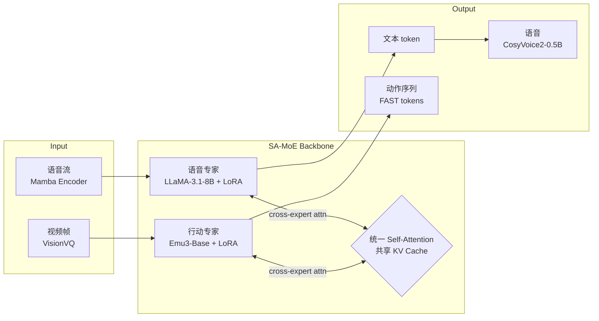

# End-to-end Listen, Look, Speak and Act

**会议**: ICLR 2026  
**代码**: [bytedance/SALMONN](https://github.com/bytedance/SALMONN)  
**领域**: 机器人 / 具身智能 · 多模态生成  
**关键词**: 全双工交互、SA-MoE、多模态 MIMO、VLA、具身对话

## 一句话总结

ELLSA 是首个真正意义上端到端全双工的多模态系统，通过 SA-MoE 架构将语音专家与行动专家用统一注意力连接，让机器人同时"听、看、说、动"，并支持打断、边说边动、上下文视觉问答等此前无法实现的交互行为。

## 研究背景与动机

**领域现状**：现有 AI 模型被分成两类孤立系统——全双工语音对话 LLM（如 Moshi、Freeze-Omni）能流畅听说，但不能操控物体；VLA 模型（如 π0、OpenVLA）能执行精密操作，但只接受文字指令、无法说话，是"哑巴"和"聋子"。**现有痛点**：语音对话模型是"无身观察者"，VLA 模型是"半双工执行者"，两者均无法处理真实人机交互中的打断、同步执行与语言交织。**核心矛盾**：多模态联合建模时，将语音、视觉、文本、行动强行塞入一个稠密模型会引发模态干扰，导致各任务性能相互拉低，且训练代价极高。**本文目标**：构建首个能够同时感知语音+视觉、生成语音+行动的端到端全双工模型。**核心 idea**：用 SA-MoE（Self-Attention Mixture-of-Experts）把两个预训练专家（语音专家、行动专家）通过统一的自注意力机制连接，让每个专家专注自己的模态以降低干扰，同时通过共享 KV Cache 实现跨模态信息融合。

## 方法详解

### 整体框架

ELLSA 由三个核心部件组成：**语音专家**（Streaming Mamba 编码器 + LLaMA-3.1-8B + LoRA）处理语音输入和文本输出，**行动专家**（UniVLA/Emu3-Base + FAST 动作分词器）处理视觉输入和机械臂动作输出，两者通过 **SA-MoE 主干**连接，并在末端挂接 CosyVoice2-0.5B 语音合成器实现端到端语音生成。系统以 1 秒为时间块滚动处理多模态交织序列，在每个时间块内同步接收语音帧、视觉帧，生成文本 token、动作序列和语音编码，天然支持全双工流式交互。

### 关键设计

**1. SA-MoE：通过注意力连接专家，而非强行合并**  
SA-MoE 的核心洞察是：不同模态的数据由各自的专家独立处理 QKV 投影和 FFN，但所有专家共享一个统一的 Self-Attention 过程——每个时间步的注意力查询可以看到整个序列的 KV Cache，包括另一个专家在过去时刻产生的 KV 值。从整体序列视角看，信息流等价于一个标准 Transformer；从单步视角看，不同模态的 Q/K/V 来自不同专家权重但通过统一注意力交互。这一设计灵感来自 π0（VLM 主干与行动专家通过注意力连接），ELLSA 将其推广到两个独立 LLM 骨干之间的全序列交互。结果是：语音专家虽从未在视觉数据上训练，却能通过 KV 共享理解视觉信息并回答上下文问题。

**2. 交织时间块序列：用序列结构实现全双工 MIMO**  
全双工流式交互的关键挑战是"如何让模型自己决定何时说、何时停"。ELLSA 用极简的序列设计解决：在每个 1 秒时间块内，将语音输入、图像输入、文本输出、动作输出按固定顺序排列，用模态边界 token `<bos>/<eos>/<boi>/<eoi>/<bot>/<eot>/<boa>/<eoa>` 分隔。模型只需在文本 token 位置输出 `<silence>` 或实际内容，即可决定是否发言；在动作 token 位置输出 placeholder 或真实动作，即可决定是否执行。这使得打断（action barge-in）、边说边动（speaking-while-acting）等行为都化为普通的条件序列生成，无需任何额外控制模块。

**3. 三阶段训练策略：从专家到统一再到端到端**  
Stage 1 分别独立训练两个专家：语音专家在 ASR + 语音 QA 任务上训练（只解冻 connector + LoRA），行动专家直接使用预训练的 UniVLA（已经过 world-model 后训练和策略学习微调）。Stage 2 在 SA-MoE 框架下联合微调，训练任务涵盖基础能力（ASR、QA、语音条件操作）和高级能力（边说边动、指令拒绝、打断响应），两个专家的 LoRA 都参与更新。Stage 3 冻结 ELLSA 主干，只训练语音合成器的连接器，将 LLM 末层隐状态映射到 CosyVoice2 的 speech codec。这种渐进策略充分复用预训练专家的知识，同时最小化训练数据需求。

**4. 先进交互任务设计：边说边动与指令拒绝**  
ELLSA 额外定义了四类新型评测场景。Speaking-while-acting 要求模型在执行动作的同时回答口语问题；Context-grounded VQA 要求语音专家借助行动专家"看到"的视觉状态来回答"黑碗现在在哪里"这类与执行进度相关的问题；Defective instruction rejection 从视觉可行性、语义合理性、运动范围、场景关联四个维度构造缺陷指令，要求模型拒绝并语音解释；Action barge-in 在动作执行过程中注入"暂停"指令，考察全双工实时响应能力。这些任务不仅是评测，也是训练数据集的构建策略——缺陷指令和打断场景均通过合成方式大量扩充。

## 实验关键数据

### 主实验

| 任务 | 指标 | 本文 (ELLSA) | 最强 Baseline | Δ |
|------|------|------|----------|---|
| LIBERO 平均 | 成功率 | **89.4%** | π0-FAST 85.5% | +3.9% |
| LIBERO LONG | 成功率 | **84.4%** | π0-FAST 60.2% | +24.2% |
| TriviaQA S2S | Acc. | **41.7%** | Freeze-Omni 28.5% | +13.2% |
| AlpacaEval S2S | GPTScore | 2.80 | Freeze-Omni 2.46 | +0.34 |
| 对话轮转预测 | 成功率 | **100%** | Freeze-Omni 99.7% | - |

### 消融实验

| 配置 | 关键指标 | 说明 |
|------|----------|------|
| SA-MoE vs 单一稠密模型 | 显著优于 dense | 见 Table 7，证明专家架构优势 |
| 边说边动 vs 单任务 | QA 精度下降约 8-12% | 双任务分心导致，尤其在难 benchmark |
| Context VQA（Manual / Gemini） | 82.5% / 83.3% | 两种评估方式高度一致 |

### 关键发现

- ELLSA 在 LIBERO LONG（最难长序列任务）上以 **84.4%** 大幅超越 π0-FAST（60.2%），说明语音指令 + 全双工设计反而有助于长任务执行
- 对话轮转和行动轮转成功率均达 **100%**，而 Moshi 对话轮转仅 85%，说明较长时间块（1s vs 0.16s）更易学习全双工动态
- SA-MoE 使语音专家无需视觉训练数据即可理解视觉上下文（Context VQA 准确率 ~83%），说明 KV 共享实现了真正的跨专家知识迁移
- 边说边动性能下降主要集中在困难子任务，LIBERO LONG 从 84.4% 降至 73.2%，TriviaQA S2S 从 41.7% 降至 30.7%

## 亮点与洞察

- SA-MoE 提供了一种"专家互联而非合并"的多模态架构范式：各专家保留预训练能力，通过注意力 KV 共享实现软融合，是介于完全独立（无交互）和完全合并（干扰严重）之间的优雅中间路线
- 全双工设计天然支持打断，无需外挂 VAD 或状态机，仅靠序列建模即可实现"Action Cancelled"这类实时响应，大大简化工程复杂度
- 将 speaking-while-acting 和 action barge-in 定义为标准评测任务，为未来具身对话系统建立了评测框架

## 局限与展望

- 边说边动时两个任务相互干扰，性能有可见下降，说明注意力资源在并发任务间的分配仍未完全优化
- 时间块粒度固定为 1 秒，实时性和响应延迟未做精细分析；更细粒度的动态时间块可能提升体验
- 目前仅有两个专家（语音 + 行动），扩展到触觉、嗅觉等更多模态时，专家数量增长对计算和训练的影响尚待验证
- LIBERO 是桌面操作基准，未验证在真实世界机器人的迁移效果

## 相关工作与启发

- **vs Moshi / Freeze-Omni**：这两个模型是全双工语音 LLM 的代表，但无行动能力；ELLSA 通过 SA-MoE 在不牺牲语音性能的前提下添加了行动分支
- **vs π0 / OpenVLA**：VLA 模型的代表，ELLSA 借鉴了 π0 的"VLM 主干通过注意力连接行动专家"思路并推广到两个独立 LLM 骨干间；ELLSA 在 LIBERO 上超越 π0-FAST，且支持语音指令
- **vs Unified-IO 2**：早期尝试统一视觉、语言、音频、行动的自回归模型，但半双工 turn-based，ELLSA 是其全双工升级

## 评分

- 新颖性: ⭐⭐⭐⭐⭐ 首个端到端全双工 listen+look+speak+act 系统，SA-MoE 架构设计新颖，speaking-while-acting / action barge-in 等场景首次被系统研究
- 实验充分度: ⭐⭐⭐⭐ 覆盖语音 QA、机器人操作、轮转预测、打断响应、上下文 VQA 多个维度；SA-MoE vs 稠密模型消融到位
- 写作质量: ⭐⭐⭐⭐ 论文结构清晰，任务设计动机充分，图示直观；部分高级任务细节在附录，主文略显紧凑
- 价值: ⭐⭐⭐⭐⭐ 为具身 AI 的"自然人机交互"树立了新的系统范式，SA-MoE 可直接复用于其他多专家多模态场景

<!-- RELATED:START -->

## 相关论文

- [\[ICLR 2026\] LeRobot: An Open-Source Library for End-to-End Robot Learning](lerobot_an_open-source_library_for_end-to-end_robot_learning.md)
- [\[ICLR 2026\] RAVEN: End-to-end Equivariant Robot Learning with RGB Cameras](raven_end-to-end_equivariant_robot_learning_with_rgb_cameras.md)
- [\[CVPR 2026\] RoboTAG: End-to-end Robot Pose Estimation via Topological Alignment Graph](../../CVPR2026/robotics/robotag_end-to-end_robot_pose_estimation_via_topological_alignment_graph.md)
- [\[CVPR 2026\] End-to-End Language-Action Model for Humanoid Whole Body Control](../../CVPR2026/robotics/end-to-end_language-action_model_for_humanoid_whole_body_control.md)
- [\[NeurIPS 2025\] SutureBot: A Precision Framework & Benchmark for Autonomous End-to-End Suturing](../../NeurIPS2025/robotics/suturebot_a_precision_framework_benchmark_for_autonomous_end-to-end_suturing.md)

<!-- RELATED:END -->
