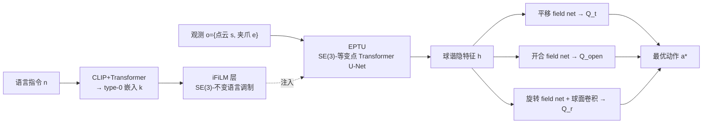

# EquAct: An SE(3)-Equivariant Multi-Task Transformer for 3D Robotic Manipulation

**会议**: ICLR 2026  
**OpenReview**: [https://openreview.net/forum?id=d1wuA8oIH0](https://openreview.net/forum?id=d1wuA8oIH0)  
**代码**: [github.com/ZXP-S-works/EquAct](https://github.com/ZXP-S-works/EquAct)  
**领域**: robotics（机器人操作 / 等变策略学习）  
**关键词**: SE(3)-等变, 多任务策略, 关键帧动作, 球谐傅里叶特征, 语言条件

## 一句话总结
EquAct 提出首个在单一统一模型里同时做到连续 SE(3) 等变（旋转+平移）的多任务、语言条件关键帧操作策略，通过等变点 Transformer U-Net + 球谐傅里叶特征 + SE(3)-不变的 iFiLM 语言调制层，在 18 个 RLBench 任务（含 SE(3) 扰动）和 4 个真机任务上达到 SOTA。

## 研究背景与动机
**领域现状**：主流多任务操作策略（PerAct、RVT、SAM2Act 等）依赖 Transformer 把语言、3D 观测、关键帧动作 tokenize 到共享嵌入空间，靠跨模态融合学策略。

**现有痛点**：tokenization 过程丢掉了底层 3D 几何结构，导致策略无法泛化到新颖的 3D 物体位姿——而真实任务（采摘不同朝向的果实、装管件到墙/天花板的夹具、装配到带角度的销钉）充满 SE(3) 位姿变化。现有方法只能靠海量机器人数据从头学几何先验。

**核心矛盾**：要么用共享嵌入空间获得强跨模态融合但破坏几何一致性，要么追求几何等变但已有等变方法都只能做**单任务**，或多任务方法只做到**平移等变**（不含旋转）。

**本文目标**：用单一统一模型实现连续 SE(3)（旋转+平移）等变的多任务语言条件策略，理论保证泛化到新 3D 场景变换，同时计算开销与非等变 baseline 持平。

**核心 idea**：把"观测↔动作"约束为 SE(3) 等变（$\pi(g\cdot o, n)=g\cdot a$），同时识别出"动作对语言指令应是 SE(3) 不变的"——指令不变时动作只随观测的刚体变换而变；用球谐傅里叶域里的等变架构实现前者，用不变 FiLM 层（iFiLM）实现后者。

## 方法详解

### 整体框架
EquAct 是一个隐式动作价值函数 $Q_a(o,n,a)\in\mathbb{R}$，给定观测 $o=\{s,e\}$（点云+夹爪状态）、语言目标 $n$、查询动作 $a$ 评估其价值。推理分三步：等变 U-Net 把观测编码为每点的球谐隐特征 $h$；iFiLM 层把 CLIP+Transformer 的语言嵌入作为 type-0 特征注入 U-Net；等变 field network 把 $h$ 的特征传播到任意查询动作，输出平移 $Q_t$、开合 $Q_\text{open}$、旋转 $Q_r$ 价值，取最高价值动作作为最终输出。训练把策略学习当分类问题，用交叉熵让策略从均匀采样的候选动作中选出专家动作。

### 关键设计
**1. 等变点 Transformer U-Net（EPTU）：在球谐傅里叶域里做多尺度几何推理** 相比非等变的 Point Transformer + U-Net，EPTU 用球谐傅里叶特征实现连续 SE(3) 等变。它在 EquiformerV2 的图注意力块之间插入两种新算子：**球谐傅里叶 maxpooling**——对每个点的 k 近邻，逐 degree $l$ 选出 2-范数最大的傅里叶系数 $c'_{l,x}=c_{l,p^*},\ p^*=\arg\max_{p\in knn(x)}\|c_{l,p}\|_2^2$，靠 Wigner D-矩阵的正交性保证 SE(3) 等变；**球谐傅里叶上采样**——按距离加权对 k 近邻系数做 softmax 插值 $c'_{l,x}=\text{softmax}_{p}(1/\|x-p\|)\,c_{l,p}$，基于 Schur 引理证等变。配合 skip connection 压缩-重建点云特征。相比之前的等变点 U-Net（如带缓存图的 smaxpool），EPTU 无需缓存图、实现更简单。

**2. 不变特征线性调制层（iFiLM）：让语言条件几何不变** 标准 FiLM 不保证等变/不变。iFiLM 接收球谐特征 $c$ 和 type-0 条件 $k$，先用 MLP 把 $k$ 投影成调制量：$\alpha_l,\beta,\gamma=\text{MLP}(k)$，然后对 $l>0$ 的特征只做缩放 $c'_l=\alpha_l c_l$，对 type-0 特征做仿射 $c'_0=\beta c_0+\gamma$。由于缩放因子与朝向无关，整层对 $k$ 是 SO(3)-不变、对输入特征 $c$ 是 SO(3)-等变（Schur 引理证），从而在保持几何等变的同时实现语义相关的语言调制。

**3. 等变 field network：在整个 SE(3) 位姿空间评估动作** 不同于把动作锚在点云每个点上，EquAct 在整个位姿空间 $A_T\subset SE(3)$ 评估动作，把动作分解为平移与旋转 $a_T=a_t\rtimes a_r$。**平移**：以 $h$ 为源、查询点 $a_t$ 为目的建图做 EquiformerV2 图注意力聚合特征，输出对旋转不变的 type-0 特征作为价值 $q_t(a_t,h)=q_t(a_t,g\cdot h)$，并用 coarse-to-fine 逐步细化采样（449 个平移候选）。**旋转**：先在预测平移 $a_t^*$ 处聚合得球谐特征 $\hat\phi$，再与可学习滤波 $\hat\psi$ 做球面卷积 $q_r(a_r,a_t,h)=(\phi\star\psi)[a_r]=\mathcal{F}^{-1}(\hat\phi\cdot\hat\psi)[a_r]$，在 36,864 个 HEALPix 旋转候选上一次性评估，避免欧拉角的万向锁/不连续与扩散迭代的高开销。

## 实验关键数据

### 主实验
18 个 RLBench 任务、249 条语言指令、25 episodes/任务；三种设置：2D/100（SE(2) 初始化 100 demo）、2D/10（SE(2) 10 demo）、3D/10（SE(3) 初始化 10 demo）。

| 任务设置 | 指标 | EquAct | SAM2Act | 3DDA | Δ vs 次优 |
|------|------|------|------|---|---|
| 2D/100（SE(2), 100 demo） | 平均成功率 | 89.4 | 86.8 | 81.3 | +2.6 |
| 2D/10（SE(2), 10 demo） | 平均成功率 | 60.1 | 52.2 | 50.3 | +6.2（vs SAM2Act） |
| 3D/10（SE(3), 10 demo） | 平均成功率 | 53.3 | 37.0 | 37.9 | +15.4（vs 3DDA） |
| 真机 4 任务（11 变体） | 平均成功率 | 65.0 | — | 12.5 | +52.5 |

设置越难，EquAct 领先越多——SE(3) 设置下超 baseline 达 15.4%，体现强样本效率与 3D 泛化。在 place_cups、sort_shape 等高精度任务上优势显著；训练/推理时间、显存与 baseline 持平（推理 0.7s，21GB）。

### 消融实验
10 demo 设置，4 个 RLBench 任务平均成功率：

| 配置 | 平均成功率 | 说明 |
|------|------|------|
| Ours（完整） | 52.8 | 完整 EquAct |
| aug. → no aug. | 50.5 | 去数据增强，略降（增强降低等变网络数值误差） |
| iFiLM → FiLM | 50.3 | 换标准 FiLM，高精度任务（place_cups 62→24）明显掉 |
| l=3 → 2 | 45.5 | 降球谐分辨率，掉 7.3，高阶系数对动作推理重要 |
| EPTU → VN | 22.0 | 换 VN-DGCNN（仅 type-1），掉 30+，高阶特征关键 |
| equ. → no equ. | 12.3 | 仅替换一层等变层即崩，几何结构最关键 |

### 关键发现
- 几何等变是核心：只替换一个等变层（equ.→no equ.）就导致最大幅度下降（52.8→12.3）。
- 高阶球谐特征（up to type-3）远胜仅 type-1 的 VN-DGCNN（+30%），分辨率 $l$ 越高动作推理越准。
- iFiLM 在高精度任务上优于 FiLM，但 FiLM 在动作近乎恒定的任务上易过拟合而偶尔更高。
- 真机：3DDA 常跳过关键帧动作导致失败，EquAct 从有限 demo 学到鲁棒 SE(3) 策略。

## 亮点与洞察
- 首个在单一统一模型里实现连续 SE(3)（旋转+平移）等变的多任务语言条件关键帧策略，并给出等变/不变性的数学证明。
- 识别出"语言指令对动作是 SE(3)-不变的"这一被忽视的对称性，并用极简 iFiLM 层落地，是把等变与自然语言条件结合的关键洞察。
- 用球谐傅里叶表示 + U-Net 风格池化/上采样，使等变模型计算开销与非等变 baseline 持平，破除"等变=慢"的刻板印象。
- 把动作评估放到整个 SE(3) 场而非点云锚点上，并用球面卷积一次性评估 3.6 万旋转候选，避免欧拉角离散化与扩散迭代。

## 局限与展望
- 在物体位姿固定的任务（如 sweep_to_dustpan）上反而略逊于非等变 baseline——等变归纳偏置对无位姿变化任务收益有限甚至有害。
- 数据增强仍能进一步提升，暗示等变网络存在数值误差，纯架构等变尚未完全严格。
- 关键帧动作公式依赖运动规划器生成轨迹，对接触丰富/连续控制任务的适配性未充分验证。
- 旋转候选 36,864 个的密集采样虽一次性评估，但 field network 的内存/扩展性在更大动作空间下的表现待考。

## 相关工作与启发
- **vs SAM2Act / RVT 等多视图法**：把 3D 场景投影到三正交图像平面再用 ViT，计算高效但牺牲几何保真，需巧妙策略才能投回 SE(3)/SO(3) 等变；EquAct 直接在 3D 球谐域做等变，几何一致性更强。
- **vs 3D Diffuser Actor（3DDA）**：用扩散捕捉多模态但旋转靠迭代去噪、开销大且易跳关键帧；EquAct 一次性评估、推理 0.7s。
- **vs 单任务 SE(3) 等变法（Simeonov 等）**：之前 SE(3) 等变策略都只能单任务；EquAct 用单一模型做多任务。
- **vs 等变多任务法（仅平移等变）**：之前多任务方法（如 PerAct 系）仅平移等变；EquAct 补上旋转等变。
- **启发**：把"对称性识别"从观测扩展到条件输入（语言）——任何对几何变换不变的条件信号都可用类 iFiLM 方式注入等变网络，可迁移到其他多模态等变任务。

## 评分
- 新颖性: ⭐⭐⭐⭐⭐ 首个单模型连续 SE(3) 多任务语言策略，iFiLM 识别语言不变性是原创洞察，球谐 U-Net 池化/上采样为新算子。
- 实验充分度: ⭐⭐⭐⭐ 18 任务×3 设置+4 真机+5 项消融+鲁棒性/等变误差测试，覆盖全面；但 baseline 仅 2 个、真机仅对比 3DDA。
- 写作质量: ⭐⭐⭐⭐ 动机清晰、命题与证明严谨、图示完整；个别拼写小错（rether/rether）不影响理解。
- 价值: ⭐⭐⭐⭐⭐ 在样本稀缺+SE(3) 泛化场景下大幅领先，且开销与非等变持平、开源，对真实机器人操作落地价值高。

<!-- RELATED:START -->

## 相关论文

- [\[CVPR 2026\] Structural Action Transformer for 3D Dexterous Manipulation](../../CVPR2026/robotics/structural_action_transformer_for_3d_dexterous_manipulation.md)
- [\[CVPR 2026\] DiffuView: Multi-View Diffusion Pretraining for 3D-Aware Robotic Manipulation](../../CVPR2026/robotics/diffuview_multi-view_diffusion_pretraining_for_3d_aware_robotic_manipulation.md)
- [\[ICLR 2026\] Cortical Policy: A Dual-Stream View Transformer for Robotic Manipulation](cortical_policy_a_dual-stream_view_transformer_for_robotic_manipulation.md)
- [\[ICCV 2025\] Resolving Token-Space Gradient Conflicts: Token Space Manipulation for Transformer-Based Multi-Task Learning](../../ICCV2025/robotics/resolving_token-space_gradient_conflicts_token_space_manipulation_for_transforme.md)
- [\[ICLR 2026\] OmniEVA: Embodied Versatile Planner via Task-Adaptive 3D-Grounded and Embodiment-aware Reasoning](omnieva_embodied_versatile_planner_via_task-adaptive_3d-grounded_and_embodiment-.md)

<!-- RELATED:END -->
