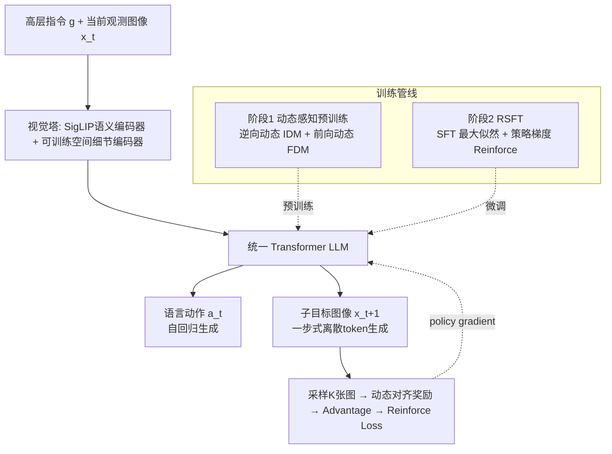

# EVLP: Learning Unified Embodied Vision-Language Planner with Reinforced Supervised Fine-Tuning

**会议**: ICLR 2026  
**OpenReview**: [https://openreview.net/forum?id=eJcCW9oNfH](https://openreview.net/forum?id=eJcCW9oNfH)  
**代码**: 待确认  
**领域**: 具身智能 / 机器人长程操作规划  
**关键词**: 具身规划, 统一多模态生成, 视觉-语言规划, 强化监督微调, 世界模型  

## 一句话总结
EVLP 用一个统一的多模态生成框架同时建模语言推理与视觉想象，配合"双向动态感知预训练 + 强化监督微调（RSFT）"，让模型从高层指令一步生成下一步语言动作和子目标图像，在长程操作任务上显著超越语言规划/视觉规划/多模态规划各类基线。

## 研究背景与动机
**领域现状**：具身长程操作的任务分解目前有两条主流路线——语言规划把"整理房间"拆成"捡起衣服→放进衣柜"这样的原子动作序列，回答"做什么（What）"；视觉规划则生成中间目标图像（如"衣服在衣柜里"的画面），回答"怎么做（How）"。新近的多模态规划（如 PERIA）试图同时产出语言动作与视觉目标，弥合"过程执行"与"目标达成"之间的鸿沟。

**现有痛点**：现有多模态规划方法没有采用统一的生成框架，语言侧用 LLM 规划、视觉侧外挂扩散模型渲染，两个模态各自为政，导致多模态规划之间不一致。更具体地说，把统一多模态架构用于具身规划面临三道坎：(1) 普通多模态模型只会"图文匹配"，认得"杯子在桌上"，却抓不住物体在空间中的精确位置，而抓取/搬运恰恰依赖这种空间定位；(2) 传统多模态任务（看图说话、视觉问答）是静态理解，缺少时序维度，无法推理"倒水"如何把场景从"杯子竖着"变成"杯子倾斜"这样的状态转移；(3) 常规最大似然训练对所有视觉细节一视同仁，但操作任务更在意功能一致性（衣服最终在衣柜里）而非视觉完美（衣服的褶皱阴影），现有范式缺乏机制去优先保证任务相关的部分。

**核心矛盾**：统一多模态生成模型（在单一 Transformer 内统一文本和图像生成）已经展现出跨模态协同能力，但**把它直接拿来做具身规划，会卡在"空间感知缺失、时序动态缺失、训练目标错配"三重错位上**——理解层面缺空间定位、任务层面缺状态转移建模、优化层面对任务无关细节过度约束。

**本文目标**：构建一个在单一多模态架构里无缝统一语言推理和视觉想象的长程操作规划器，让语言动作和子目标图像在同一分布里协同生成。

**核心 idea**：**统一生成 + 动态预训练 + 强化对齐**。用"双塔视觉模块（SigLIP 语义 + 可训练细节补偿器）+ 一步式离散图像生成"搭统一架构；用"前向/逆向动态预测"双任务预训练注入时序动态理解；再用 RSFT 在最大似然约束下，通过策略梯度专门强化语言动作与生成图像之间的空间逻辑一致性。

## 方法详解

### 整体框架
EVLP 在一个统一 Transformer 内同时处理逐步语言指令和视觉子目标图像，分三层：(1) **统一多模态生成模型**——视觉塔（理解 + 生成解耦）接到预训练 LLM，图像采用"一步生成"；(2) **动态感知预训练**——用逆向动态（看两帧推动作）和前向动态（给动作推下一帧）双任务，在统一特征空间里强化跨模态关联；(3) **强化监督微调（RSFT）**——SFT 联合监督动作 token 和图像 token 的整体分布，同时用策略梯度强化空间一致性。

### 关键设计

**1. 双塔视觉塔 + 一步式离散图像生成：补齐空间感知、绕开多步采样瓶颈。** 理解侧用冻结的 SigLIP 抽高层语义，但 SigLIP 会漏掉空间细节，于是并联一个用图像重建损失预训练的低层视觉编码器（空间细节补偿器，训练时参与更新），两路信号分别聚焦不同层级的视觉信息后经 adapter 喂给 LLM——这正面回应了"抓不住物体空间位置"的痛点。生成侧在 Open-MAGVIT2 框架内训练 lookup-free quantizer，码本规模 $K=262{,}144$，把 $256{\times}256$ 图像编码成 $16{\times}16$ 离散 token。关键在于生成方式：扩散模型建模 $x_{0:N}^{t-1}\sim p(\cdot|c,x_{0:N}^{t})$、自回归建模 $x_N\sim p(\cdot|c,x_{0:n-1})$，要采 $n$ 个样本分别需要 $n{\times}T$ 或 $n{\times}N$ 次前向；EVLP 引入一组可学习的 image tokens 连同条件一起输入，让 LLM **直接建模** $x_{0:N}\sim p(\cdot|c)$，一次前向就能采出 $n$ 个独立样本。这一步既不给图像强加多余的因果序列先验，又为后续 RL 的多样本采样消除了"计算开销随模型变大而爆炸"的瓶颈。

**2. 双向动态感知预训练：用逆向 + 前向动态把"时序状态转移"刻进统一特征空间。** 数据集由转移三元组 $T=\{x_t,a_t,x_{t+1}\}$ 组成（$x$ 是图像观测、$a$ 是语言动作）。**逆向动态任务（IDM）** 给定两帧问"中间发生了什么动作"，优化动作序列的条件对数似然 $L_{\text{IDM}}=-\mathbb{E}\big[\frac{1}{L}\sum_{i=1}^{L}\log P(a_t^{(i)}\mid a_t^{(<i)},x_t,x_{t+1};\theta)\big]$，在保持文本生成能力的同时增强图像理解与动态理解。**前向动态任务（FDM）** 给定当前帧和动作问"下一帧是什么"，优化图像 token 的条件对数似然 $L_{\text{FDM}}=-\mathbb{E}\big[\log P(x_{t+1}^{(0:N)}\mid x_t,a_t;\theta)\big]$，增强图像生成与动态推理。两个任务在同一份多模态数据上 co-train（双任务课程），形成统一处理多模态输入、协调输出的框架——这是模型涌现"世界模型"能力的基础，也正面回应了"缺时序维度"的痛点。

**3. 强化监督微调（RSFT）：在最大似然约束下用策略梯度专修空间逻辑一致性。** 纯 SFT 联合监督动作 token 和图像 token：$L_{\text{SFT}}=-\mathbb{E}\big[\frac{1}{L}\sum_i\log P(a_t^{(i)}\mid a_t^{(<i)},g,x_t;\theta)+\log P(x_{t+1}^{(0:N)}\mid g,x_t,a_{0:L}^t;\theta)\big]$，但最大似然有两个硬伤：**感知过度约束**（强行对齐桌面纹理等任务无关细节）和**因果约束不足**（不建模支配状态转移的物理动态）——这正是痛点(3)。EVLP 借助"一步多样本"能力在单次前向里采 $K$ 个样本 $x_k\sim P(x_{t+1}^{(0:N)}\mid g,x_t,a_{0:L}^t)$，用动态对齐奖励 $r=R(x)$ 衡量生成图像的动态是否与真实动态一致，batch 内归一化得到 advantage，构造强化损失 $L_{\text{RL}}=-\mathbb{E}\big[\frac{1}{K}\sum_{k=1}^{K}A_k\cdot\log P(x_{t+1}^k\mid g,x_t,a_{0:L}^t;\theta)\big]$。由于策略梯度方差高、单独训会崩，最终联合优化 $L=-\mathbb{E}[L_{\text{SFT}}+\lambda\cdot L_{\text{RL}}]$：前者用最大似然约束整体分布做全局语言-视觉对齐，后者用偏好感知采样提升动态一致性，既"能度量分布"又"能评估偏好"，实现稳定的偏好对齐。

## 实验关键数据

### 主实验：LoHoRavens 成功率（5 seed 均值±方差）

| Model | Stacking | Sort | Matching | Shape | Orders | Spell |
|---|---|---|---|---|---|---|
| CLIPort（端到端模仿） | 18.4 | 19.2 | 17.8 | 9.8 | 8.1 | 2.3 |
| PAR（语言规划） | 34.7 | 32.8 | 31.1 | 31.5 | 30.7 | 27.3 |
| EmbodiedGPT（语言规划） | 48.6 | 49.1 | 43.4 | 40.9 | 48.2 | 52.7 |
| SuSIE（视觉规划） | 34.1 | 32.6 | 33.2 | 37.8 | 35.2 | 34.1 |
| CoTDiffusion（视觉规划） | 47.9 | 44.3 | 56.6 | 46.1 | 53.9 | 44.8 |
| PERIA（多模态规划） | 63.9 | 65.0 | 72.3 | 60.6 | 65.2 | 71.1 |
| **EVLP (ours)** | **79.4** | **77.3** | **82.5** | **75.3** | **78.2** | **81.8** |

EVLP 在全部任务上夺得最优，相对最强基线 PERIA 在各任务普遍领先 10~16 个百分点；端到端 CLIPort 因缺乏中间引导垫底。

### 消融实验（Meeting Preparation 规划性能，Table 2）

| 变体 | SR↑ | LA↑ | LPIPS↓ | SSIM↑ |
|---|---|---|---|---|
| A. EVLP（完整） | 67.6 | 87.0 | 0.051 | 0.95 |
| B. w/o En（去空间编码器） | 56.5 | 82.9 | 0.092 | 0.92 |
| C. w/o Se（去 SigLIP） | 50.1 | 73.9 | 0.116 | 0.89 |
| D. w/o IDM（去逆向动态） | 63.9 | 83.6 | 0.052 | 0.95 |
| E. w/o FDM（去前向动态） | 26.8 | 72.1 | 0.192 | 0.84 |
| F. w/o RL（纯 SFT） | 62.2 | 87.4 | 0.054 | 0.95 |
| G. RL only（纯强化） | 0.0 | 14.0 | 0.712 | 0.29 |

图像生成消融（Table 3）：完整 EVLP LPIPS 0.046 / SSIM 0.95；去空间编码器（w/o En）LPIPS 升到 0.087；改用自回归生成（AR）LPIPS 暴涨到 0.197、且幻觉增多。

### 关键发现
- **双塔缺一不可**：去空间编码器图像生成质量明显下滑（缺位置上下文），去 SigLIP 则语言规划能力骤降（空间编码器缺语义、LLM 难处理），二者结合最优。
- **FDM 是多模态规划命脉**：去 FDM 后 SR 从 67.6 崩到 26.8、LPIPS 翻到 0.192；去 IDM 主要削弱语言规划，说明双向预训练对模态对齐缺一不可。
- **一步生成 > 自回归生成**：AR 变体保真度大降、幻觉增多，归因于强加非自然因果序列先验和自回归误差累积。
- **RSFT 需要 SFT 兜底**：纯 RL（RL only）直接训练崩溃（SR=0），RL 必须在最大似然约束下联合优化才有效；RSFT 相比 SFT 生成细节更精、动态一致性更好。

## 亮点与洞察
- **把"采样效率"做成了 RL 的赋能点**：直接建模 $p(\cdot|c)$ 让单次前向采多样本，既消除扩散/自回归的多步采样瓶颈，又零额外开销地支撑 advantage-weighted 策略梯度——架构选择和优化目标互相成就，设计很巧。
- **RSFT 是对"SFT vs RL"的一次干净调和**：SFT 能约束分布但不懂偏好、RL 懂偏好但易分布漂移/崩溃，RSFT 用 $L_{\text{SFT}}+\lambda L_{\text{RL}}$ 让二者各取所长，消融里 RL-only 直接归零有力佐证了这个 framing。
- **奖励函数对准"功能一致性"而非"视觉完美"**：动态对齐奖励直接奖励生成图像与真实动态是否一致，把训练信号从"像素逼真"导向"任务相关"，正面解决了操作任务的核心诉求。

## 局限与展望
- 核心动态对齐奖励 $R(\cdot)$ 的具体定义放在附录，正文未充分展开，奖励设计的鲁棒性与可迁移性需要更多检验。
- 评测主要在 LoHoRavens（Ravens 仿真）和自建 Meeting Preparation 仿真，外加少量真实场景可视化，缺乏大规模真机闭环执行的成功率验证。
- 低层策略执行被外包给独立 policy，规划与执行之间的误差耦合、以及 16×16 离散 token 对精细操作的分辨率上限，都可能成为瓶颈。
- $\lambda$、$K$ 等超参对联合优化稳定性的影响、以及方法在更长 horizon、更开放物体类别上的扩展性，有待进一步探究。

## 相关工作与启发
- **语言规划**（SayCan/PAR/EmbodiedGPT 系）回答 What、**视觉规划**（SuSIE/CoTDiffusion 系）回答 How、**多模态规划**（PERIA）试图兼顾两者但模态外挂、不统一——EVLP 的定位正是"在单一生成框架内统一三者"。
- **统一多模态生成**（如 SEED、Chameleon、Open-MAGVIT2、Show-o 等）提供了文本-图像统一 Transformer 的底座；EVLP 把这条线从"图文创作"迁移到"具身规划"，并指出直接迁移会卡在空间/时序/优化三重错位上。
- **启发**：把 RL 偏好对齐嵌进统一生成模型时，"一步多样本生成"是个被低估的杠杆——它让 RL 几乎零成本地接入；而"用最大似然给高方差策略梯度兜底"是把生成模型 RL 化时值得复用的稳定化范式。

## 评分
- **新颖性**: ⭐⭐⭐⭐ 把统一多模态生成、双向动态预训练、强化监督微调三者串成具身规划闭环，"一步生成赋能 RL""RSFT 调和 SFT/RL"两个 framing 有新意，但各组件多为已有思想的具身化组合。
- **实验充分度**: ⭐⭐⭐⭐ 主实验对比四类规划范式六个基线、消融覆盖视觉塔/生成架构/预训练/RSFT 各维度且结论清晰（RL-only 归零、去 FDM 崩盘很有说服力），略欠真机闭环与更大规模验证。
- **写作质量**: ⭐⭐⭐⭐ 三道技术难题—三大创新点的对应关系讲得清楚，图 2/图 3 把"多步采样瓶颈""SFT/RL/RSFT 三态"可视化到位；个别英文表述粗糙、核心奖励定义下放附录略影响自洽。
- **价值**: ⭐⭐⭐⭐ 为"用统一多模态生成模型做具身长程规划"提供了一个可观的范式样板，RSFT 与一步多样本的组合对生成模型 RL 化有较强的可迁移参考价值。

<!-- RELATED:START -->

## 相关论文

- [\[ICLR 2026\] UniVLA: Unified Vision-Language-Action Model](unified_vision-language-action_model.md)
- [\[ICLR 2026\] Embodied-R1: Reinforced Embodied Reasoning for General Robotic Manipulation](embodied-r1_reinforced_embodied_reasoning_for_general_robotic_manipulation.md)
- [\[ICLR 2026\] Cosmos Policy: Fine-Tuning Video Models for Visuomotor Control and Planning](cosmos_policy_fine-tuning_video_models_for_visuomotor_control_and_planning.md)
- [\[ICLR 2026\] Vision-Language-Action Instruction Tuning: From Understanding to Manipulation](vision-language-action_instruction_tuning_from_understanding_to_manipulation.md)
- [\[ICLR 2026\] MomaGraph: State-Aware Unified Scene Graphs with Vision-Language Models for Embodied Task Planning](momagraph_state-aware_unified_scene_graphs_with_vision-language_models_for_embod.md)

<!-- RELATED:END -->
