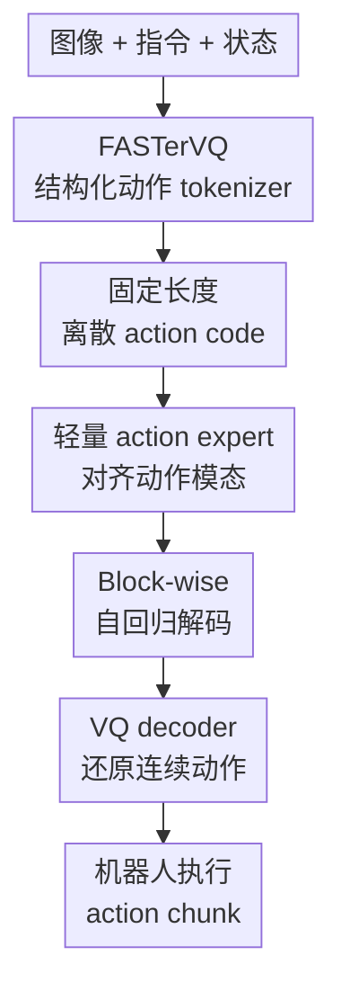

# FASTer: Toward Powerful and Efficient Autoregressive Vision-Language-Action Models with Learnable Action Tokenizer and Block-wise Decoding

**会议**: ICLR2026  
**OpenReview**: [https://openreview.net/forum?id=k6nTUFoqeT](https://openreview.net/forum?id=k6nTUFoqeT)  
**代码**: 暂未公开  
**领域**: 机器人 / 具身智能 / 高效 VLA  
**关键词**: 视觉语言动作模型, 动作 tokenizer, 残差向量量化, block-wise decoding, 机器人泛化  

## 一句话总结
FASTer 把连续机器人动作先压缩成结构化离散 action code，再用 block-wise 自回归 VLA 一次生成一块 action token，在保持高精度控制的同时显著降低自回归推理延迟，并在多种模拟和真实机器人上超过现有 VLA 基线。

## 研究背景与动机
**领域现状**：VLA 模型正在把预训练视觉语言模型迁移到机器人控制中，输入通常是多视角图像、语言指令和本体状态，输出是一段连续动作序列。当前主流路线大致分成两类：一类是 diffusion / flow matching 式的连续动作生成，另一类是把动作离散化后交给 Transformer 自回归预测。前者在精细操作上很强，后者更接近 VLM / LLM 的建模范式，天然更容易继承语言理解、视觉 grounding 和常识迁移能力。

**现有痛点**：自回归 VLA 的瓶颈集中在 action tokenization。若把每个动作维度逐个离散化，序列会很长，推理需要多次大模型前向；若用过强压缩，动作重建误差又会直接变成错误监督，让策略学到偏差动作。FAST / FAST+ 等方法已经证明动作 token 对 VLA 很关键，但论文指出它们仍存在 token 长度、重建质量、码本利用率和跨具身泛化之间的明显折中。

**核心矛盾**：机器人动作不是普通文本序列。它同时有时间维度和动作维度：时间上相邻动作平滑且有冗余，动作维度上又对应位置、姿态、夹爪、底盘、躯干等不同物理含义，分布差异很大。直接扁平化会浪费 token，粗暴压缩会破坏控制精度；而自回归模型每多一个 token 都会增加一次生成负担。

**本文目标**：论文想同时解决三个子问题：第一，学习一个高压缩率但近似无损的动作 tokenizer；第二，让 tokenizer 在单臂、双臂、全身控制和不同动作表示之间可复用；第三，让自回归 VLA 不必 token-by-token 慢慢生成，而是在保持动作结构的前提下并行生成局部 block。

**切入角度**：作者把机器人 action chunk 当成一种连续时序信号来编码，借鉴音频 codec 中的残差向量量化思路，同时利用动作维度的物理分组。这样做的关键观察是：早期残差码本可以捕捉粗粒度、低频动作趋势，后续码本再补高频细节；这个粗到细结构刚好也适合下游自回归 VLA 稳定生成。

**核心 idea**：用可学习的结构化 RVQ 动作 tokenizer 替代手工或弱压缩 action token，再用 block-wise 自回归解码减少生成步数，使 VLA 同时获得更短 token、更准动作和更快推理。

## 方法详解

### 整体框架
FASTer 由 FASTerVQ 和 FASTerVLA 两部分组成。FASTerVQ 先把一个长度为 $H$ 的连续动作片段按时间和物理动作维度 patchify，编码成固定形状的离散 code tensor；FASTerVLA 再把图像、语言、本体状态作为条件，用轻量 action expert 和 block-wise 自回归策略生成这些 code，最后由 VQ decoder 还原成连续动作。

这篇论文的重点不是简单缩短序列，而是把“动作压缩”和“动作生成”做成一致的结构：tokenizer 输出的 code 本身带有 codebook、时间 horizon、动作维度三维布局；VLA 的解码顺序和 block 划分也顺着这个布局走，因此模型看到的不是任意打散的 token，而是可被并行预测的动作结构。

### 关键设计
**1. 结构化动作 patchifier：先尊重动作的物理语义再压缩**

FASTerVQ 没有把动作序列简单摊平成一维向量，而是先在二维上切块：时间维度按固定长度 $h$ 分成 $m$ 组，动作维度则按物理含义非均匀分组，例如末端位置、旋转、夹爪、底盘、躯干等。这样得到的 patch 同时覆盖一小段时间和一组相近物理量，再被送入编码器。

这个设计针对的是机器人动作里很常见的分布不均衡问题。夹爪状态可能接近二值，底盘在桌面操作中大量为零，手臂位置却连续变化；如果把它们平等混在一个序列里，tokenizer 会被高频但低信息量的维度干扰。按物理语义分组后，每个 patch 内部更同质，压缩时既能利用时间冗余，也不会让少数特殊维度污染整段动作表示。

**2. Transformer Action AutoEncoder + RVQ：用粗到细残差码本换取高压缩和高保真**

FASTerVQ 的主体是一个 Transformer Action AutoEncoder，编码器把 patch 后的动作压到 latent $z \in R^{C_h \times C_a}$，再用 $N_c$ 层 residual vector quantization 逐层量化。第 $i$ 层量化当前残差 $r_i$，选择最近的 codebook entry，之后把残差更新为 $r_{i+1}=r_i-Q_i(r_i)$，最终量化表示为 $z_q=\sum_{i=1}^{N_c}Q_i(r_i)$。

这种 RVQ 结构的好处是很具体的：前几层 codebook 先表达低频、全局、粗动作趋势，后几层 codebook 只需要补剩余细节。对机器人控制来说，这比“一次性选一个离散 token”更稳，因为一个 token 出错不一定毁掉整段动作；同时，固定的 $N_c \times C_h \times C_a$ code tensor 也让下游 VLA 不再面对 FAST 那种较长且变长的 token 序列。

**3. 时域 + DCT 频域重建：不只拟合逐点误差，也保住动作趋势**

训练 tokenizer 时，FASTerVQ 同时优化时域 L1 重建和 DCT 频域 L1 重建，再加上 commitment loss。论文给出的目标可概括为：

$$
L = \|a_{t:t+H}-\hat a_{t:t+H}\|_1 + \|DCT(a_{t:t+H})-DCT(\hat a_{t:t+H})\|_1 + \lambda \|z-sg(z_q)\|_2^2
$$

时域 L1 保证每一步动作不能偏得太远，DCT 项则约束整段轨迹的低频趋势。这个组合比单纯最小化逐点 loss 更适合真实机器人数据，因为真实演示里常有传感器噪声或微小电机抖动；模型不需要复刻所有噪声，但必须保住能影响任务成功的运动形状。作者还用 EMA 更新码本并重置 dead code，避免大码本只激活少数 token。

**4. Block-wise 自回归 + action expert：减少生成步数而不放弃 AR 的结构优势**

FASTerVLA 保留 VLM 的常规结构：vision tower 编码图像，文本管线处理指令，本体状态离散后作为 token 输入；但它额外加入一个轻量 action expert，架构上和 VLM backbone 对齐，参数量更小，专门负责 action token 解码。这样做可以减少动作监督对预训练语言/视觉权重的干扰，也让动作生成有一条更贴近控制信号的路径。

推理效率来自 block-wise autoregression。普通 AR 对 $C=(c_1,\ldots,c_N)$ 逐 token 预测，FASTerVLA 则把 action code 切成 $J$ 个 block，每个 block 内的 $B$ 个 token 在一次前向中共同预测，训练目标变成 $p(c_{j,i}\mid C_{<j}, I_t, s_t, x)$。它用 block-wise causal mask 允许同一 block 内互相 attention，并用 `<BoBlk>` / `<EoBlk>` 在标准文本生成和 block 动作生成之间切换。

解码顺序也和 RVQ 结构对齐：模型先沿 horizon 生成某个 codebook 的 token，再进入下一个 codebook，而不是随意按扁平序列生成。这相当于让动作从粗到细逐步成形，前面的 codebook 决定整体趋势，后面的 codebook 修正残差细节。因为每个 block 可以并行输出，理论生成步数从 $N$ 降到约 $N/B$，在 LIBERO 等单臂设置中论文报告只需 3 个 BAR forward pass。

### 一个完整示例
假设机器人收到指令“把方块叠起来”，当前有两路相机图像、本体状态和语言指令。FASTerVQ 不让模型直接回归未来 20 步的 7 维连续动作，而是先把这段动作按时间和动作维度 patchify，例如把末端位移、旋转和夹爪状态分成不同物理组，再通过 TAAE + 3 层 RVQ 得到一个固定长度 action code。

FASTerVLA 推理时，VLM backbone 先读图像和指令，得到多模态上下文；action expert 看到 `<BoBlk>` 后，一次输出第一个 block 的若干 action code，而不是只吐一个 token。对于 LIBERO 这类设置，动作 code 可以理解为 3 层残差码本中的少量 block：第一层先确定“手靠近方块并移动到堆叠位置”的粗轨迹，后续层再补上夹爪闭合、末端姿态和局部修正。所有 code 生成后，VQ decoder 把离散 code 还原成连续 action chunk，机器人按这个 chunk 执行。

这个例子能看出 FASTer 的效率来源：它不是把动作预测任务改成更粗糙的低频控制，而是在 tokenizer 阶段保留细节，在 VLA 阶段减少自回归步数。换言之，压缩发生在结构化动作空间里，而不是靠牺牲控制精度换速度。

### 损失函数 / 训练策略
FASTerVQ 使用 AdamW 训练，论文实现中学习率为 $1\times10^{-4}$，weight decay 为 0.1，采用 cosine decay、1000 步 warmup、梯度裁剪和 bfloat16 混合精度。码本大小主要设为 $K=4096$，latent dimension 为 128，commitment cost 为 $\beta=0.25$；单臂 tokenizer 约 8M 参数，全身控制 tokenizer 约 13M 参数。

FASTerVLA 也使用 AdamW，学习率为 $2.5\times10^{-5}$，推理时用 top-k sampling，其中 $k=50$，temperature 为 0.8。BAR block size 在单臂设置中通常为 7，在双臂或全身控制中为 8；最终连续动作会 clip 到 $[-1,1]$。论文还加入 spacing augmentation：训练时扰动相邻 action token 的相对位置间隔，推理时恢复固定间隔，目的是减少模型对固定 token 位置的过拟合。

## 实验关键数据

### 主实验
论文先在 LIBERO 和 Simpler-Bridge 上比较完整 VLA 性能。FASTer 在 LIBERO 平均成功率达到 97.9%，高于 OpenVLA-OFT、π0.5、π0-FAST-D 等强基线；在 Simpler-Bridge 上平均成功率为 87.9%，比 π0-FAST-D 的 76.5% 和 π0 的 66.7% 更高。

| 基准 | 指标 | FASTer | 之前强基线 | 提升 |
|------|------|--------|------------|------|
| LIBERO average | 成功率 | 97.9 | OpenVLA-OFT 97.1 | +0.8 |
| LIBERO long | 成功率 | 95.4 | OpenVLA-OFT 94.5 | +0.9 |
| Simpler-Bridge average | 成功率 | 87.9 | π0-FAST-D 76.5 | +11.4 |
| Simpler-Bridge eggplant | 成功率 | 99.2 | π0 88.3 | +10.9 |

推理效率上，FASTer 的优势在 token 数较多时更明显。单臂 LIBERO 中，FASTer 总推理约 112 ms，快于 π0 的 176 ms，也显著快于 π0-FAST 的 197-556 ms；在 R1Lite whole-body control 中，FASTer 约 237 ms，和 π0 接近，但远低于 π0-FAST 的 1100-3000 ms。

| 环境 | FASTer | π0 | π0-FAST | 说明 |
|------|--------|----|---------|------|
| LIBERO | 112 ms | 176 ms | 197-556 ms | 单臂，20 步 action chunk |
| R1Lite-WBC | 237 ms | 225 ms | 1100-3000 ms | 21 DoF，全身控制 |
| FASTer action detokenization | 2.7-7 ms | 不适用 | 不适用 | tokenizer 本身不是主要瓶颈 |

### 消融实验
FASTerVQ 的消融显示，TAAE tokenizer、4096 码本和 3 层残差量化是比较均衡的配置。仅看 LIBERO policy success rate，TAAE 达到 97.9%，高于 CNN 和纯 Transformer 变体；码本从 512 增至 4096 时成功率上升，但 8192 反而下降，说明过大码本可能带来 collapse 或利用不足。

| 配置 | 关键指标 | 说明 |
|------|---------|------|
| CNN tokenizer | SR 96.2 / L1 0.0027 | 有局部建模，但整体不如 TAAE |
| Transformer tokenizer | SR 95.3 / L1 0.0036 | 全局建模强，但重建误差更高 |
| TAAE tokenizer | SR 97.9 / L1 0.0021 | 最终采用，兼顾局部和全局 |
| codebook 4096 | SR 97.9 / utilization 99.6 | 最佳码本规模 |
| 3 residual codebooks | SR 97.9 | 粗到细残差深度最合适 |

FASTerVLA 的消融进一步说明 action expert 和 BAR 都有价值。没有 action expert 时，LIBERO 成功率为 95.5；带预训练 action expert 后升到 97.9。在 Simpler-Widow 上，从头训练 action expert 会崩到 23.6，说明 action expert 需要先在机器人数据上形成可用动作先验。BAR 则把延迟从 token-wise AR 的 323 ms 降到 140 ms，同时成功率从 95.5 提到 96.7。

| 配置 | 关键指标 | 说明 |
|------|---------|------|
| No AE | LIBERO SR 95.5 | 无专门动作专家 |
| AE without pretrain | Simpler-Widow SR 23.6 | 动作专家从零学不稳定 |
| AE with pretrain | Simpler-Widow SR 87.9 | 预训练动作专家很关键 |
| Token-wise AR | SR 95.5 / 323 ms | 标准逐 token 解码 |
| Block-wise | SR 96.7 / 140 ms | 更快且更稳 |
| Block-wise + AE | SR 97.7 / 140 ms | 精度和速度最均衡 |

### 关键发现
- FASTerVQ 的核心价值不只是 token 更少，而是重建质量更高。论文提出 Valid Reconstruction Rate (VRR) 衡量重建动作是否落在物理可接受误差内，FASTer 在多个容差阈值、多个数据集上都优于 MiniVLA、VQ-VLA、FAST 和 FAST+。
- tokenizer 有明显 scaling trend。FASTer(S)、FASTer(L)、FASTer(XL) 随训练数据增大在 VRR 上持续改善，并能迁移到 joint velocity、absolute joint position、delta joint position 等不同动作表示。
- codebook 使用越均衡，VLA 泛化越好。Bridge 上 FASTer 使用 4096 个词表且 utilization 为 100%，normalized entropy 为 0.91，高于 FAST / FAST+；这与 Simpler-Bridge 和 Droid 零样本结果中的更强 task progress 相呼应。
- BAR 的收益依赖 action code 的稳定结构。FASTerVQ 输出固定、规则、带物理含义的 code tensor，BAR 才能安全地一次预测一块；如果 token 长度和语义过于漂移，block-wise 生成会更难稳定。

## 亮点与洞察
- FASTer 最巧妙的地方是把“动作 tokenizer 质量”提升到 VLA 系统设计的中心位置。它不是在已有 VLA 上做一点推理加速，而是从动作表示本身重构了 AR VLA 的瓶颈。
- RVQ 的粗到细性质和机器人控制高度契合。低频动作趋势决定“往哪儿去”，高频残差决定“怎么对齐、怎么抓稳”，这比单层离散化更符合动作生成的层次性。
- DCT 频域 loss 是一个很实用的 trick。真实动作数据里逐点噪声不一定重要，但轨迹形状很重要；用频域约束可以让 tokenizer 更关注执行效果相关的低频结构。
- BAR 说明自回归 VLA 不一定只能慢。只要 action token 的结构被设计好，模型可以在局部 block 内并行生成，同时保留跨 block 的因果顺序。
- 这篇论文也提醒多模态机器人模型的效率问题不能只看 backbone 大小。Table 2 显示 observation encoding 仍是主要耗时，action detokenization 很轻；因此未来高效 VLA 还需要同时优化视觉编码、动作生成和系统部署。

## 局限与展望
- FASTerVQ 仍需要大量机器人数据预训练。论文中的 FASTer(L) / FASTer(XL) 数据混合覆盖 LIBERO、Bridge、Kuka、Fractal、Droid、Galaxea 等数据源，小规模实验室或垂直场景未必容易复现这种覆盖。
- BAR 的 block size 和 code tensor 结构有关，虽然论文做了消融，但不同机器人自由度、控制频率、动作 horizon 下是否有稳定经验规则，还需要更多部署验证。
- 全身控制场景中 FASTer 已大幅快于 π0-FAST，但和 π0 的总延迟接近，说明当动作维度很高、BAR forward pass 增多时，自回归路线的速度优势会被部分抵消。
- 论文主要验证 manipulation、双臂和全身控制，尚未充分覆盖移动导航、灵巧手高频触觉控制、动态避障等更强闭环场景。FASTer 的 action chunk 预测在高反馈频率任务中是否足够稳，还值得继续研究。
- 未来可以把 FASTerVQ 做成更通用的 action foundation tokenizer，并研究在线自适应码本、跨机器人标定、以及和 diffusion / flow policy 的混合解码方式。

## 相关工作与启发
- **vs π0**: π0 采用 flow matching / 非自回归连续动作生成，在实时控制上很强；FASTer 则坚持自回归离散 action code 路线，优势是更贴近 VLM 架构和语言-视觉 token 建模范式，但需要设计好 tokenizer 和 BAR 才能解决速度问题。
- **vs π0-FAST / FAST+**: FAST 把动作变成 DCT+BPE token，是高效 action tokenization 的重要基线；FASTer 的区别在于 tokenizer 是可学习的 RVQ codec，输出固定结构 code，重建质量和码本利用率更好，也更适合 block-wise 解码。
- **vs MiniVLA / VQ-VLA**: 这些方法也用 VQ 表示动作，但论文实验显示它们在重建误差和 OOD 泛化上不足。FASTer 的改进来自动作维度 patchifier、TAAE 编解码器、残差码本和频域重建共同作用。
- **vs diffusion policy**: Diffusion policy 对连续精细控制友好，但通常较难直接继承 VLM 的语言推理和 token 级知识迁移。FASTer 的启发是：如果离散动作空间足够好，自回归方法也可以在速度和成功率上接近甚至超过 diffusion / flow 系列。
- **对后续研究的启发**: 机器人动作 token 不应只是工程压缩格式，而可以成为跨任务、跨具身的共享动作先验。未来做通用机器人模型时，先学一个高质量 action tokenizer，可能和 NLP 里先有好 text tokenizer 一样关键。

## 评分
- 新颖性: ⭐⭐⭐⭐⭐ 将 RVQ action codec、结构化动作 patchifier 和 block-wise VLA 解码组合得很完整，切中了 AR VLA 的核心瓶颈。
- 实验充分度: ⭐⭐⭐⭐⭐ 覆盖 tokenizer 指标、策略成功率、真实机器人、模拟环境、OOD 泛化、backbone 迁移和多组消融，证据链比较扎实。
- 写作质量: ⭐⭐⭐⭐ 方法主线清楚，图表信息丰富；但部分实验图的数值细节依赖附录和图像阅读，读者需要来回对照。
- 价值: ⭐⭐⭐⭐⭐ 对高效自回归 VLA 很有参考价值，尤其适合后续研究 action tokenizer、机器人 foundation policy 和低延迟部署。

<!-- RELATED:START -->

## 相关论文

- [\[CVPR 2026\] MoEActok: A MoE-based Action Tokenizer for Vision-Language-Action Models](../../CVPR2026/robotics/moeactok_a_moe-based_action_tokenizer_for_vision-language-action_models.md)
- [\[ICLR 2026\] Spatially Guided Training for Vision-Language-Action Model](spatially_guided_training_for_vision-language-action_model.md)
- [\[ICLR 2026\] Block-wise Adaptive Caching for Accelerating Diffusion Policy](block-wise_adaptive_caching_for_accelerating_diffusion_policy.md)
- [\[ICLR 2026\] Action-aware Dynamic Pruning for Efficient Vision-Language-Action Manipulation](action-aware_dynamic_pruning_for_efficient_vision-language-action_manipulation.md)
- [\[ICLR 2026\] VLM4VLA: Revisiting Vision-Language-Models in Vision-Language-Action Models](vlm4vla_revisiting_vision-language-models_in_vision-language-action_models.md)

<!-- RELATED:END -->
