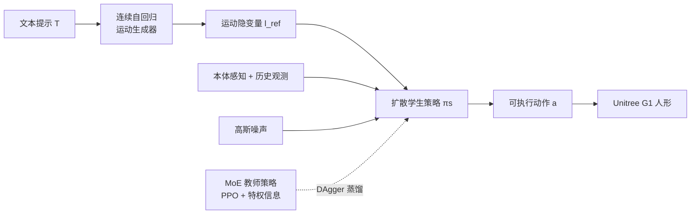

# From Language to Locomotion: Retargeting-free Humanoid Control via Motion Latent Guidance

**会议**: ICLR 2026  
**OpenReview**: [https://openreview.net/forum?id=k3Cyx3Uets](https://openreview.net/forum?id=k3Cyx3Uets)  
**代码**: 项目主页（论文中提及 Project Page，未给开源仓库）  
**领域**: 机器人 / 具身智能（语言驱动人形全身控制）  
**关键词**: 人形机器人、语言引导运动、retargeting-free、扩散策略、运动隐变量、MoE 教师策略  

## 一句话总结
RoboGhost 提出一个**免重定向（retargeting-free）**的语言驱动人形控制框架：让文本生成的"运动隐变量"直接作为条件去驱动一个扩散策略从噪声中去噪出可执行动作，绕开"解码运动→重定向到机器人→物理跟踪"这条易累积误差、高延迟的多阶段流水线，把从文本到部署的耗时从 17.85s 砍到 5.84s。

## 研究背景与动机
**领域现状**：用自然语言指挥人形机器人很直观——先用 text-to-motion（T2M）模型生成语义合理的人体运动，再部署到真机。但落地通常要走一条层级化流水线：从语言**解码**出人体运动 → **重定向（retarget）**到机器人形态 → 用基于物理的控制器**跟踪**这条轨迹。

**现有痛点**：这条看似可用的流水线有系统性缺陷。(1) 误差在解码、重定向、跟踪三段间**累积**，语义保真度和物理可行性都被磨损；(2) 多个串行阶段带来**高延迟**，难以做实时交互；(3) 语言与控制**耦合松散**——每段各自孤立优化而非端到端。近期改进（改解码器或改控制器）都是局部修补，整条流水线依旧脆弱低效。

**核心矛盾**：要语义精确就得显式解码出运动并精细重定向，但重定向本身既慢又引入误差、还受运动生成器能力上限制约；想要快和鲁棒就得牺牲这条"精确"链路。

**本文目标**：找到一条从语言到动作的**更直接路径**，干掉脆弱的中间环节，同时保住语义意图、做到快速反应式控制。

**核心 idea**：**把运动隐变量当作"一等公民"的条件信号**——不再把它解码成显式运动，而是直接拿隐变量去条件化一个扩散人形策略，让策略从噪声里去噪出可直接执行的动作。作者把框架命名为 RoboGhost，强调这些隐变量像"幽灵"一样不可见却强力驱动机器人行为。

## 方法详解

### 整体框架
RoboGhost 是两阶段设计。**阶段一**用一个连续自回归运动生成器 $G$，把文本提示 $T$ 编码成紧凑的运动隐变量 $l_{ref}=G(T)$（注意：到此为止**不解码成显式运动**）。**阶段二**训练策略：先用 PPO + 特权信息训一个 MoE 教师策略（oracle），再蒸馏出一个**扩散学生策略** $\pi_s$，它以 $l_{ref}$、本体感知状态、历史观测为条件，从高斯噪声去噪出可执行动作。部署时只跑"文本→隐变量→扩散学生策略→动作"，彻底免重定向、免特权信息、免显式参考运动。

### 关键设计

**1. 运动隐变量直驱、绕开重定向（retargeting-free latent driving）**：这是全文的灵魂。传统流水线把 $l_{ref}$ 解码成显式运动序列再重定向到机器人形态，每一步都丢精度、加延迟。RoboGhost 直接把 $l_{ref}$ 连同本体状态 $p_o$ 和历史观测 $o_{t-H:t}$ 一起喂给策略，输出 $a=\epsilon_\theta(\epsilon\mid l_{ref}, p_o, o_{t-H:t})$。这样既跳过了易错的解码与重定向，又缓解了"运动生成器能力有限导致显式运动质量差"的问题——因为策略并不盲目照搬生成器输出，而是由一个**可训练的隐变量编码器**把粗糙的隐变量"翻译"成可执行、稳定的指令，即便隐变量本身不够物理真实也能产出鲁棒动作。

**2. 扩散学生策略从噪声去噪出动作**：学生策略不像传统蒸馏那样用显式参考运动，而是把运动隐变量作为条件做扩散去噪。训练走 DAgger 式流程——在仿真里 rollout 学生策略、向教师查询最优动作 $\hat{a}_t$，并在教师动作上逐步注入高斯噪声构成前向加噪马尔可夫过程 $q(x_t\mid x_{t-1})=\mathcal{N}(x_t;\sqrt{1-\alpha_t}\,x_{t-1}, \alpha_t I)$。为可解性采用 $x_0$-prediction，用 MSE 损失 $L=\lVert a-\hat{a}_t\rVert_2^2$ 监督，其中 $a=\frac{x_t-\sqrt{1-\bar{\alpha}_t}\,\epsilon_\theta(x_t,t)}{\sqrt{\bar{\alpha}_t}}$。推理时为了流畅与低延迟，用 DDIM 加速采样并采用 MLP 形式的扩散模型，通过 AdaLN 把隐变量条件注入去噪过程。扩散策略天然能刻画多样的动作分布，因此面对噪声扰动和"不完美隐变量"都比 MLP 策略更鲁棒（实验显示其可容忍噪声尺度高达 0.33，而 MLP 仅 0.12）。

**3. MoE 教师策略提供高泛化监督信号**：文本天然开放，泛化才是关键。教师策略先在高多样性数据集 $D_0$ 上训初始策略 $\pi_0$，再用下半身误差度量 $e(s)=\alpha\cdot E_{key}(s)+\beta\cdot E_{dof}(s)$ 评估每条序列、过滤掉 $e(s)>0.6$ 的难收敛样本，在剩余数据上训通用教师。教师网络引入 Mixture-of-Experts：多个专家网络与一个门控网络各自接收机器人状态观测和参考运动，最终动作是各专家输出按门控概率的加权 $a=\sum_{i=1}^n p_i\cdot a_i$。MoE 增强了策略的表达力与泛化能力，从而给学生策略提供更精确的监督。

**4. 因果自适应采样（causal adaptive sampling）**：长时程运动各片段难度异质，均匀采样会过采样简单段、欠采样困难段，导致高方差、低样本效率。作者把序列切成 $K$ 个等长区间，并把"失败"归因到其**因果前驱**——假设在 $k_t$ 区间终止的失败往往源于前 $s$ 步的失误/碰撞。于是用指数衰减核 $\alpha(u)=\gamma^u$（$\gamma\in(0,1)$）给临近终止的时间步加权：$\Delta p_i=\alpha(t-i)\cdot p,\ i\in[t-s,t]$（区间外为 0），更新 $p'_i\leftarrow p_i+\Delta p_i$ 并归一化后用多项分布采样起始区间，再在区间内均匀选起始帧。这样把训练算力集中到高难度片段，提升样本效率、让教师能掌握更长更敏捷的动作。

## 实验关键数据

### 主实验表格
运动跟踪（MotionMillion 的 HumanML / Kungfu 子集，IsaacGym & MuJoCo，成功率为主指标）：

| 方法 | IsaacGym Succ↑ | Empjpe↓ | Empkpe↓ | MuJoCo Succ↑ | Empjpe↓ |
|------|----------------|---------|---------|--------------|---------|
| Baseline (MLP 师生) - HumanML | 0.92 | 0.23 | 0.19 | 0.64 | 0.34 |
| Ours-DDPM - HumanML | **0.97** | 0.12 | 0.09 | **0.74** | 0.24 |
| Ours-SiT - HumanML | **0.98** | 0.14 | 0.08 | 0.72 | 0.26 |
| Baseline - Kungfu | 0.66 | 0.43 | 0.37 | 0.51 | 0.58 |
| Ours-DDPM - Kungfu | **0.72** | 0.34 | 0.31 | **0.57** | 0.54 |

文本到运动生成（HumanML3D）：Ours-SiT 取得 R@1=0.641、FID=11.743，与 MoMask、MotionStreamer 等强基线相当甚至更优。

### 消融实验表格
免重定向 vs 显式重定向（Q1，HumanML/Kungfu）：

| 方法 | IsaacGym Succ↑ | Empjpe↓ | MuJoCo Succ↑ | 全流程耗时(s)↓ |
|------|----------------|---------|--------------|----------------|
| Ours-Explicit (含 PHC-1000 重定向+解码) | 0.93 | 0.21 | 0.66 | 17.85 |
| Ours-Implicit (本文) | **0.97** | **0.12** | **0.74** | **5.84** |

扩散 vs MLP 策略（Q2，未见子集泛化）：扩散策略 Succ=0.68 vs MLP 0.54，Empjpe 0.42 vs 0.48；扩散在未见运动上的泛化与鲁棒性明显占优。

扩散骨干（Q3）：DiT 仅在生成指标上微涨（FID 14.28 vs 11.71 反不如 MLP），跟踪成功率无提升却延迟更高（耗时 14.28s vs 5.84s），故默认用 16 层 MLP。

### 关键发现
- **隐变量直驱是核心增益来源**：免重定向把全流程从 17.85s 压到 5.84s（约 3×），同时成功率不降反升（0.93→0.97），证明重定向不仅慢还在拖累精度。
- **扩散策略的鲁棒性碾压 MLP**：在 0.2 噪声尺度下 MLP 策略把噪声映射成抖动动作导致机器人摔倒，扩散策略仍稳定跟踪；可容忍最大噪声尺度 0.33（MLP 仅 0.12）。
- **真机验证**：在 Unitree G1 上完成 backflip、跳跃、舞蹈等高动态动作的平滑、语义对齐执行，且跨 IsaacGym→MuJoCo→真机无需手工调参。

## 亮点与洞察
- **范式转变**：把"语义→隐变量→显式运动→重定向→跟踪"压缩成"语义→隐变量→直接去噪动作"，第一次提出由运动隐变量驱动的扩散人形策略。隐变量作为条件而非中间产物，既保语义又免误差累积。
- **"不盲从生成器"很关键**：可训练隐变量编码器让策略把不完美的隐变量当"软提议"而非"硬指令"，从根上解耦了"运动生成质量"与"控制质量"，这也是它在未见子集上仍鲁棒的原因。
- **因果归因式采样**很有巧思：把失败往前回溯 $s$ 步加权重采样，是对长时程稀疏失败信号的合理利用，对训敏捷动作很实用。
- **天然可扩展到多模态**：框架对条件来源不敏感，文本之外还可接图像、音频、音乐，给视觉-语言-动作（VLA）人形系统提供了参考架构。

## 局限与展望
- **仍依赖重定向数据集训教师**：阶段二教师策略训练用的是 retargeted dataset 与特权信息，"免重定向"只发生在部署/学生侧，训练管线本身没完全摆脱重定向。
- **Kungfu 等高动态场景成功率仍偏低**（MuJoCo 上 0.55~0.57），sim-to-real 在极端敏捷动作上余量有限。
- **隐变量可解释性弱**：作者自比"幽灵"，隐变量驱动虽有效但缺乏对失败的可解释诊断手段，调试与安全保证较难。
- **依赖预训练 T2M 生成器质量**：虽对不完美隐变量有鲁棒性，但生成器对某些语义/分布外指令的覆盖仍是上界约束。
- **展望**：把多模态条件（图像/音频/音乐）真正训通、引入闭环反馈与安全约束、在更大动作库与真机长时程任务上验证。

## 相关工作与启发
- **人体运动合成（T2M）**：离散 token 路线（T2M-GPT、MoMask）与扩散连续路线（MDM、MLD）。本文建立在连续自回归框架（MAR 类）之上，并借鉴 SiT/MARDM 把训练目标从噪声预测改为速度预测以提升运动质量。
- **人形全身控制（WBC）**：OmniH2O、HumanPlus、ExBody2、GMT、Hover 等在鲁棒性/泛化间各有取舍；语言引导的 LangWBC、RLPF、UH-1、LeVERB 各有局限（泛化弱、灾难性遗忘、依赖重定向与离散动作 token、不支持高动态）。RoboGhost 用"MoE oracle + 隐变量驱动扩散学生"同时改善泛化与部署成本。
- **启发**：对任何"多阶段中间表示→显式还原→再适配"的流水线，都值得反思能否让**中间隐表示直接驱动下游策略**，省掉脆弱的显式还原步骤；扩散策略对分布外/含噪条件的鲁棒性，是把"不完美上游信号"工程化落地的有力工具。

## 评分
- 新颖性: ⭐⭐⭐⭐ 首个由运动隐变量直驱的扩散人形策略，"免重定向"这一刀切得干净，范式层面有贡献（隐变量当一等条件）。
- 实验充分度: ⭐⭐⭐⭐ 覆盖生成+跟踪、两子集、两仿真器、真机 G1、噪声鲁棒性与多项消融，Q1-Q4 设计清晰；但缺与更多语言引导 WBC 方法的同台对比、真机数据偏定性。
- 写作质量: ⭐⭐⭐⭐ 动机-矛盾-方法逻辑顺畅，图表组织合理，公式与流程交代清楚；个别记号（如归一化式 $\sum_i p'_1=1$）有小笔误。
- 价值: ⭐⭐⭐⭐ 把语言到人形控制的延迟砍到约 1/3 且性能更好，对实时、可部署的人形 VLA 系统有直接工程价值与可扩展性。

<!-- RELATED:START -->

## 相关论文

- [\[ICLR 2026\] HWC-Loco: A Hierarchical Whole-Body Control Approach to Robust Humanoid Locomotion](hwc-loco_a_hierarchical_whole-body_control_approach_to_robust_humanoid_locomotio.md)
- [\[CVPR 2026\] Do You Have Freestyle? Expressive Humanoid Locomotion via Audio Control](../../CVPR2026/robotics/do_you_have_freestyle_expressive_humanoid_locomotion_via_audio_control.md)
- [\[NeurIPS 2025\] Adversarial Locomotion and Motion Imitation for Humanoid Policy Learning](../../NeurIPS2025/robotics/adversarial_locomotion_and_motion_imitation_for_humanoid_policy_learning.md)
- [\[ICLR 2026\] WholeBodyVLA: Towards Unified Latent VLA for Whole-Body Loco-Manipulation Control](wholebodyvla_towards_unified_latent_vla_for_whole-body_loco-manipulation_control.md)
- [\[CVPR 2026\] Iterative Closed-Loop Motion Synthesis for Scaling the Capabilities of Humanoid Control](../../CVPR2026/robotics/iterative_closed-loop_motion_synthesis_for_scaling_the_capabilities_of_humanoid_.md)

<!-- RELATED:END -->
