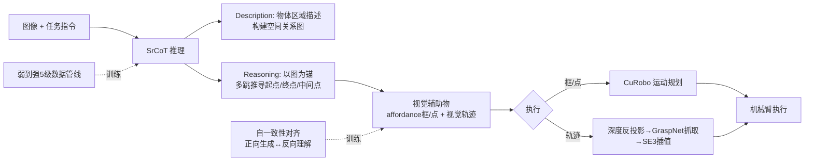

# From Seeing to Doing: Bridging Reasoning and Decision for Robotic Manipulation

**会议**: ICLR 2026  
**OpenReview**: [https://openreview.net/forum?id=yngvAamNQi](https://openreview.net/forum?id=yngvAamNQi)  
**代码**: 项目主页（论文提及，待确认仓库）  
**领域**: 机器人操作 / 具身智能 / VLA / 空间推理  
**关键词**: Vision-Language-Action, 空间推理, Visual Chain-of-Thought, 视觉辅助物, 零样本操作, Affordance  

## 一句话总结
FSD 把机器人操作里"预测抓取点/轨迹"的活儿改造成一个**显式空间推理过程**：先用空间关系图做视觉链式思考（SrCoT），再生成与具身无关的中间视觉辅助物（affordance 框/点 + 视觉轨迹），从而在不微调的情况下实现零样本操作，并在 8 个空间推理 benchmark 和真机任务上大幅超越 affordance 基线。

## 研究背景与动机

**领域现状**：主流做法是把在互联网数据上预训练的 VLM 接上大规模具身数据集，端到端微调成 VLA（OpenVLA、π0、RT 系列），指望 VLM 的泛化能力迁移到机器人控制上。

**现有痛点**：经验证明这条路在全新任务上的零样本表现很差，根因是具身数据的**稀缺性**与**异构性**——机器人数据量远不及语言/视觉数据，无法触发 scaling law；不同本体的动作空间和物理交互差异巨大，直接学"视觉→动作"映射既容易遗忘预训练知识又会任务冲突。社区尝试的几条替代路也各有短板：模块化方法（检测+抓取串联）级联误差大、推理慢、缺乏整体场景理解；affordance 方法（预测抓取点等视觉辅助物）则辅助信息不够全面，而且**直接吐原始坐标、没有显式推理过程**，难以把指令锚定到正确的语义实体上。

**核心矛盾**：泛化的关键不只是"能预测视觉辅助物"，而是要先在空间与语义上下文上做**显式推理**，产出一个有表达力、与具身无关的中间表示。直接把 RGB 图像和坐标点硬对齐容易过拟合，VLM 也很难一步把未来动作映射成图像坐标。

**本文目标**：让 VLM 通过结构化空间推理来"生成"视觉辅助物，得到一个既紧凑又信息丰富、可直接开环控制或作为分层闭环策略高层规划器的中间表示。

**核心 idea**：**[把视觉辅助物的生成当成推理任务而非预测任务]**——模仿人放菜进锅的认知过程（先定位物体、再依据相对位置规划路径、考虑可行性避障），用**空间关系图作为推理锚点**做多跳分析，把"难以直接映射的动作生成"转化为"基于已知物体关系的可推理问题"。

## 方法详解

### 整体框架

FSD 基于 LLaVA-1.5 式架构（冻结 CLIP-ViT-L 图像编码器 + Vicuna-13B + 可训练线性投影层，由 ASMv2 初始化），核心是把"看到（Seeing）→做到（Doing）"拆成三件套：用 **SrCoT** 把场景推理成结构化的视觉辅助物，用**弱到强分层数据管线**喂养这套推理能力，用**自一致性机制**把坐标空间和图像-文本模态对齐。所有视觉辅助物都定义在归一化图像坐标里（离散成 0–999 的整数文本），最后再经深度反投影/抓取匹配/运动规划落到真机执行。

### 关键设计

**1. 空间关系图锚定的视觉链式思考（SrCoT）：把生成拆成"先描述、再推理"两阶段。** 直接 SFT 让模型把图像对齐到坐标点容易过拟合，SrCoT 反其道而行——**Description 阶段**先生成以物体为中心的区域描述，建一张空间关系图：节点是带坐标的物体，边是相对关系（上/下/左/右/后等）；**Reasoning 阶段**则以这张图为锚点，先通过物体引用和自由空间推理确定起点/终点坐标，再带着显式逻辑（"先抬高避障，再移到锅上方，最后下放")逐点推导中间点。这样就给 VLM 规定了一条模板化推理路径，把"直接把未来动作映射到图像坐标"这个难题，转化为"基于已知物体关系做多跳类比推理"的简单问题。为了稳住推理路径、降幻觉，SrCoT 强制模型用 `<ref>` 标物体、`<point>`/`<box>` 标坐标，把每个物体严格绑定到其坐标，做物体中心推理。

**2. 弱到强的五级能力数据管线：逐层把推理拆解的能力一级级喂出来。** SrCoT 对 VLM 要求很高（精确 grounding、空间理解、复杂指令跟随），而主流模型在这些上都有短板，于是作者构建了 300K SFT 数据、覆盖 10+ 本体、按五级能力递进：① 区域 grounding（VLM 提名物体 + 视觉模型抠框）→ ② 空间关系理解（用 Metric3Dv2 + WildCamera 重建 3D 场景图推相对位置，只保留相对深度差 ≥20% 的物体对以保证质量）→ ③ 空间推理（基于 3D 场景图自动生成 Q&A）→ ④ 空间 affordance 生成（从终止帧抽操作物最终位置，结合参考物算出 affordance 区域再重渲染到首帧）→ ⑤ 视觉轨迹生成（自监督关键点抽取找抓取点 + Cotracker 抓时序动态，投影回首帧）。整条管线配严格规则过滤并对照人工标注集迭代调参。值得注意的是 SrCoT 作为通用视觉-空间推理机制，不止能服务视觉轨迹，还能泛化到一般空间推理任务。

**3. 自一致性对齐：用"反向理解"逼模型搞懂坐标的物理含义。** 高质量 SFT 数据能让模型"生成"视觉辅助物，但坐标空间从没出现在预训练里，模型其实不理解这些标注的物理意义。FSD 把生成任务反过来当成理解任务：正向是 $(X_v, X_q) \rightarrow \tau$（从图像和指令推视觉轨迹 $\tau$），就构造逆向 $(X_v, \tau) \rightarrow X_q$（给图像和轨迹反推可能的指令）。这种双向训练把坐标空间和图文模态对齐，让视觉辅助物同时作为理解信号和生成信号，进一步强化空间推理。训练分两阶段：先用 Level 1–3 数据 + 1.4M 通用 VQA/互联网数据混训防遗忘，培养核心空间推理；再用 Level 4–5 数据加自一致性专门训练视觉辅助物的生成与理解（生成视觉轨迹时固定预测 8 个点做简化）。

**4. 推理→决策的执行链路：把 2D 视觉辅助物落成真机 3D 动作。** FSD 可从初始或中间步推理，自由选用所需视觉辅助物：用框时采样中心作目标点，用点时直接采样；用视觉轨迹时先生成 2D 轨迹 $\tau$，结合深度相机按针孔相机模型做深度反投影得到 $\tau^{3d}=\{x^{3d}_t\}$，再依据首点 $x_1$ 查 GraspNet 候选抓取匹配最近抓取位姿 $G^*$，用基于梯度下降的插值优化路径生成 SE(3) 空间完整运动轨迹；只用 affordance 时则交给 CuRobo 做运动规划。与同样用视觉辅助物的 LLARVA、EmbodiedCoT 不同，FSD 把预测任务转成推理任务，更好地利用视觉-空间常识，无需场景特定微调。

## 实验关键数据

### 主实验

**通用空间推理（5 个 benchmark，15 个子任务，13B 开源模型对比）**：

| 模型 | 平均 Rank ↓ | 3D 深度 | 距离估计 | 空间关系 |
|------|------|------|------|------|
| GPT-4o（闭源参考） | — | 87.8 | 78.2 | 69.2 |
| RoboPoint-13B | 2.8 | 81.5 | 57.7 | 65.7 |
| ASMv2-13B | 3.1 | 68.9 | 68.9 | 65.0 |
| **FSD-13B** | **1.3** | **88.0** | **86.7** | **78.3** |

FSD 平均排名 1.3，大幅领先其他 13B 开源模型，可与闭源 GPT-4o 掰手腕。

**物体/自由空间引用**：FSD 在 RoboRefIt 上 56.7%（GPT-4o 仅 15.3%、RoboPoint 49.8%），Where2Place 上 45.8% 与 RoboPoint(46.0) 持平且远超其他模型。

**视觉辅助物生成（VABench，作者自建 300 题）**：

| 任务 | 指标 | GPT-4o | RoboPoint | RoboBrain | **FSD** |
|------|------|------|------|------|------|
| VABench-P | Acc↑ | 9.30 | 19.09 | 7.00 | **61.82** |
| VABench-V | RMSE↓ | 136.13 | — | 121.6 | **78.26** |
| VABench-V | LLM Score↑ | 4.37 | — | 4.5 | **6.21** |

affordance 点精度比 RoboPoint 高 3 倍多。

**零样本操作（SimplerEnv，WidowX，每任务 24 episode）**：

| 类型 | 模型 | Avg |
|------|------|------|
| 端到端 VLA | π0-fast | 48.3 |
| 端到端 VLA | OpenVLA-OFT | 41.8 |
| 端到端 VLA | OpenVLA | 5.2 |
| 模块化 | MOKA | 33.3 |
| Affordance | RoboPoint | 17.7 |
| Affordance | **FSD** | **40.6** |

FSD 零样本 40.6%，远超同为零样本基线的 RoboPoint(17.7%)；端到端 VLA 不微调时遇到背景/指令大变化会崩到接近 0。

**真机（xArm 6，8 个桌面任务）**：FSD 零样本 72% 成功率，比最强基线高 30%+，且能完成叠毛巾等需视觉轨迹生成的复杂任务（基线做不到）。

### 消融实验

| 模型 | VABench-P Acc↑ | VABench-V RMSE↓ | LLM Score↑ |
|------|------|------|------|
| **FSD（完整）** | **61.82** | **78.26** | **6.21** |
| w/o SrCoT | 26.21 | 99.53 | 5.07 |
| w/o Alignment | 55.92 | 80.48 | 5.92 |

### 关键发现
- **SrCoT 是核心**：去掉后 affordance 精度从 61.82 暴跌到 26.21，证明"先推理再生成"远胜纯数据驱动的直接预测。
- **自一致性对齐有效但增益较小**：去掉后各指标小幅下降，说明对齐主要起锦上添花、稳定坐标语义的作用。
- **推理型 affordance 路线在零样本上碾压端到端 VLA**：端到端 VLA 必须微调才能用，FSD 凭借具身无关的中间表示天然适配新场景。

## 亮点与洞察
- **把"动作生成"问题降维成"空间关系推理"问题**，是这篇最聪明的一招——绕开了具身数据稀缺/异构的死结，用通用视觉数据就能训出泛化能力。
- **物体中心而非智能体中心**的视觉轨迹定义，让中间表示与具体本体解耦，是跨本体迁移的关键。
- **生成↔理解双向自一致**这个思路很优雅：用反向任务逼模型真正"看懂"坐标，而不是死记硬背坐标-图像映射。
- VABench 填补了视觉轨迹预测无标准 benchmark 的空白，对后续工作有基础设施价值。

## 局限与展望
- 当前主要是**开环控制**，作者自己也指出未来应探索由视觉轨迹显式引导的**闭环策略 VLA**，把鲁棒规划和精确执行结合。
- 视觉轨迹生成固定预测 8 个点是简化处理，复杂长程任务可能不够精细。
- 执行链路依赖深度相机、GraspNet、CuRobo 等外部模块，整体系统较重，且 affordance/轨迹的物理可行性仍受这些下游模块精度制约。
- 自一致性对齐增益有限，说明坐标语义的真正对齐可能还需要更强的监督信号或预训练改造。

## 相关工作与启发
- **空间推理 VLM**（SpatialVLM、SpatialRGPT、SpatialBot）：FSD 用 SrCoT + 自一致性把空间推理推向复杂操作任务。
- **视觉链式思考**（Shikra、VoCoT、EmbodiedCoT）：FSD 独创用空间关系图作推理锚点，比单纯锚定视觉区域更结构化、更有据可循。
- **视觉辅助物驱动操作**（LLaRVA 的视觉轨迹、RoboPoint 的 affordance）：FSD 把它们的"预测"范式升级成"推理"范式，靠 VLM 的世界知识换来零样本泛化。
- 启发：在数据稀缺的具身领域，**与其堆 demo 学端到端映射，不如设计一个可推理的中间表示把通用预训练知识引流进来**——这个"先 Seeing 再 Doing、中间靠推理桥接"的思路对其他低资源决策任务同样有借鉴意义。

## 评分
- **新颖性**: ⭐⭐⭐⭐ — "把视觉辅助物生成当推理任务"+空间关系图锚定 CoT+生成/理解自一致，组合很新颖，切中 VLA 泛化痛点。
- **实验充分度**: ⭐⭐⭐⭐ — 覆盖 8 个 benchmark + 自建 VABench + SimplerEnv + 真机，消融到位；但闭环策略、长程任务、不同 LLM backbone 的探索留白。
- **写作质量**: ⭐⭐⭐⭐ — 动机—方法—执行链路叙述清晰，图示（关系图/推理过程）直观，五级数据管线讲得明白。
- **价值**: ⭐⭐⭐⭐ — 给数据稀缺下的机器人泛化提供了一条可落地的"推理桥接"路线，VABench 也有基础设施价值。

<!-- RELATED:START -->

## 相关论文

- [\[ICLR 2026\] Embodied-R1: Reinforced Embodied Reasoning for General Robotic Manipulation](embodied-r1_reinforced_embodied_reasoning_for_general_robotic_manipulation.md)
- [\[CVPR 2026\] Localizing, Structuring, and Rendering: Bridging 3D and 2D Vision-Language-Action Models for Robotic Manipulation](../../CVPR2026/robotics/localizing_structuring_and_rendering_bridging_3d_and_2d_vision-language-action_m.md)
- [\[ICLR 2026\] From Seeing to Experiencing: Scaling Navigation Foundation Models with Reinforcement Learning](from_seeing_to_experiencing_scaling_navigation_foundation_models_with_reinforcem.md)
- [\[CVPR 2026\] Action-Sketcher: From Reasoning to Action via Visual Sketches for Robotic Manipulation](../../CVPR2026/robotics/action-sketcher_from_reasoning_to_action_via_visual_sketches_for_robotic_manipul.md)
- [\[CVPR 2026\] Obstruction Reasoning for Robotic Grasping](../../CVPR2026/robotics/obstruction_reasoning_for_robotic_grasping.md)

<!-- RELATED:END -->
