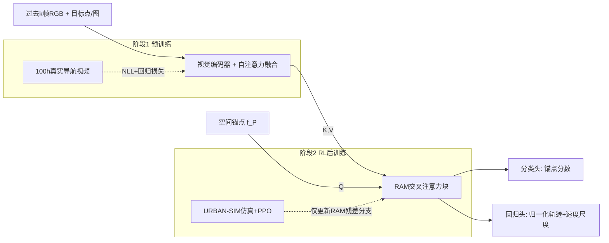

# From Seeing to Experiencing: Scaling Navigation Foundation Models with Reinforcement Learning

**会议**: ICLR 2026  
**OpenReview**: [https://openreview.net/forum?id=0c7nAZjyr5](https://openreview.net/forum?id=0c7nAZjyr5)  
**代码**: [https://vail-ucla.github.io/S2E](https://vail-ucla.github.io/S2E)（项目主页，代码待开源）  
**领域**: 机器人 / 具身导航 / 导航基础模型  
**关键词**: 导航基础模型, 强化学习后训练, 残差注意力, 锚点分布匹配, 3DGS 仿真 Benchmark  

## 一句话总结
S2E 提出"从看到到体验"的混合学习框架：先在 100 小时真实导航视频上用锚点引导的高斯混合分布做预训练，再用一个零初始化的残差注意力模块在仿真中做 RL 后训练，只更新交叉注意力分支即可注入避障/避人的反应式能力，让导航基础模型突破纯离线数据的 scaling 天花板，并零样本迁移到真实轮式与四足机器人。

## 研究背景与动机
**领域现状**：导航基础模型（GNM、ViNT、NoMaD、CityWalker 等）靠 web 规模视频和人类示范做被动视觉模仿学习，能在不同环境和本体间泛化。但它们**只学到了视觉统计相关性，没有学到物理因果**——视频告诉智能体"动作长什么样"，却没告诉它"环境变化时如何调整、恢复、推理反事实后果"。

**现有痛点**：纯离线训练的导航策略对周围环境反应迟钝，难以应对城市场景中的避障、避让行人等交互安全行为。论文用实验揭示了**离线数据 scaling 的边际递减**：把数据从 250k 扩到 750k，成功率只涨 2%。而 RL 虽然能交互学习，但单独用 RL 在狭窄合成环境训练采样效率低、缺乏归纳先验，无法泛化到真实世界。

**核心矛盾**：离线视频给出强泛化的视觉先验但缺交互能力；仿真 RL 给出交互能力但有严重的 sim-to-real 域差距，且全参数 RL 微调会**遗忘预训练能力（FPC）**并因仿真像素统计差异导致**观测域偏移**——编码器过拟合到仿真 RGB，部署到真实图像时特征漂移 $\Delta_\text{feat}=\|\mathbb{E}_{o\sim D_\text{real}}[\mathcal{F}^\text{sim}(o)]-\mathbb{E}_{o\sim D_\text{real}}[\mathcal{F}^\text{pre}(o)]\|$ 迅速增大。

**本文目标**：在保留离线预训练泛化表征的前提下，用仿真 RL 注入反应式交互能力，实现可 scale、可泛化、可跨本体部署的导航基础模型。

**核心 idea**：**(1) 预训练用锚点引导分布匹配（AGDM）** 学习多模态运动分布做稳定 backbone；**(2) RL 后训练用残差注意力模块（RAM）** 只微调交叉注意力的零初始化残差分支，既获反应行为又不毁预训练知识；**(3) NavBench-GS** 用 3DGS 重建带物理交互的真实场景做闭环评测。

## 方法详解

### 整体框架
S2E 是"预训练 + RL 后训练"的两阶段混合框架。模型接收过去 $k$ 帧 RGB 作为上下文、目标点/目标图作为引导、空间锚点作为查询。上下文经自注意力融合后作为 K/V，锚点特征 $f_P$ 作为 Q，经 RAM 块计算加权特征得到精炼的锚点特征，再由分类头和回归头解码出每个锚点的分数、归一化轨迹和速度尺度。预训练阶段端到端用 NLL + 回归损失训练全模型；微调阶段冻结主体、只用 PPO 策略梯度优化 RAM 块。

### 关键设计

**1. 锚点引导分布匹配（AGDM）：用结构化高斯混合捕捉多模态导航行为。** 机器人导航本质多模态——同一观测下"直行/转弯/避让"都是合法动作，而离散动作和单峰高斯表达力不足，扩散策略又过于灵活、难控制易产生碎片化轨迹。AGDM 在统一数据集上用 K-Means 生成 $M$ 个代表性意图点（锚点）$p_a\in\mathbb{R}^{M\times2}$，每个锚点对应混合模型中的一个高斯模态，把动作分布建为 $q(w_t|o_{t-k+1:t})=\sum_{m=1}^{M} q_m\cdot\mathcal{N}_m(w_x-\mu_x^m,\sigma_x^m;\,w_y-\mu_y^m,\sigma_y^m;\rho^m)$，其中 $q_m$ 是锚点被选中的分数，并额外预测每模态的速度尺度 $v$。锚点既是可解释的高层意图，又给出结构化的多模态分布，且因锚点均匀采样而天然支持跨本体部署。训练用 NLL 损失监督分类与轨迹头，并以"预测方向最贴近真值轨迹"的分配策略选中模态 $h$ 做优化：$\mathcal{L}_{nll}=-\log\mathcal{N}_h(\cdot)-\log(q_h)$，再加 L2 回归损失 $\mathcal{L}_{reg}=\|\hat v-v\|_2^2$ 优化速度尺度。这种结构化设计显著降低学习不确定性，给后续在线适配提供可靠 backbone。

**2. 残差注意力模块（RAM）：只动交叉注意力，零初始化门控实现"渐进课程"。** 全参数 RL 微调会引发遗忘和域偏移，因此需要更有选择性的微调。论文识别出**交叉注意力层**是理想目标——不同于处理原始场景纹理、对域偏移高度敏感的视觉编码器和自注意力，交叉注意力 $\text{Attn}(Q,K,V)=\text{softmax}(QK^\top/\sqrt{d})V$ 显式建模"智能体状态（轨迹 token 作 Q）与环境观测（作 K/V）"的关系结构，在外观变化下远比原始视觉特征稳定。RAM 冻结预训练交叉注意力参数 $\Theta_D$，复制一份可训练副本 $\Theta_l$，用零初始化线性层 $\mathcal{Z}$ 门控：$Q'=\psi_D(Q;K,V;\Theta_D)+\mathcal{Z}(\psi_D(\mathcal{Z}(Q);K,V;\Theta_l))$。零初始化保证微调初期残差分支贡献为零（$Q'=\psi_D(Q;K,V;\Theta_D)$），且回传到适配参数的梯度 $\nabla_{\Theta_l}\mathcal{L}\propto\frac{\partial\mathcal{L}}{\partial\mathcal{Z}}\cdot W_\mathcal{Z}$ 初始消失——适配分支在早期高方差探索阶段保持休眠，随门控权重逐渐离零才激活，形成"渐进注入交互动态"的结构化课程。同时因满足 $|\Delta\Theta_l|\ll|\Theta_0|$ 且跳过视觉编码器更新，既避开域偏移又大幅省参省算力。

**3. 渐进式奖励 + PPO 后训练：从基本目标到高层精修。** 奖励设计为 $R=R_G+R_R+R_H$：全局目标 $R_G$（含稠密/稀疏的到达奖励与碰撞惩罚）鼓励高效安全抵达；规则正则 $R_R$ 约束人行道居中与社会合规；类人性 $R_H$ 鼓励平滑自然的人类式导航。预训练输出的 10×2 路点轨迹经可微控制器 $F_d$ 转成速度指令喂给运动模块，**只微调 RAM 分支参数 $\Theta_r$**（上下文特征与锚点特征的梯度被截断），用带熵正则的 PPO 目标 $\min_{\Theta_r}\mathcal{L}_\text{ram}=-\mathcal{L}_\text{policy}+\alpha\mathcal{L}_\text{value}-\beta\mathcal{H}_\pi$ 优化，其中 $\mathcal{H}_\pi$ 是对 GMM 熵的简化近似（因 KL 散度无闭式解）。

**4. NavBench-GS：基于 3DGS 的闭环交互评测 Benchmark。** 既有评测靠离线 2D 视频做开环测试，无法评估反应式行为。NavBench-GS 在 Vid2Sim 的真实场景上用 3D 高斯泼溅重建出 26 个兼具照片级视觉外观和精确物理交互的场景，每个场景实例化为 4 类任务（空场景 / 随机静态障碍 / 移动行人 / 障碍+行人），用成功率 SR、路线完成度 RC、碰撞次数 CT 度量，标准化、可复现地评测导航模型的泛化性与安全性。

## 实验关键数据

### 主实验表格（NavBench-GS，4 类任务 SR↑/RC↑/CT↓）

| 方法 | 数据量 | 空场景 SR | 障碍 SR | 行人 SR | 障碍+行人 SR |
|---|---|---|---|---|---|
| GNM | 70h | 0.23 | 0.16 | 0.09 | 0.07 |
| ViNT | 80h | 0.28 | 0.13 | 0.07 | 0.08 |
| NoMaD | 100h | 0.15 | 0.11 | 0.09 | 0.08 |
| MBRA | 700h | 0.61 | 0.51 | 0.71 | 0.51 |
| CityWalker | 2000h | 0.66 | 0.43 | 0.56 | 0.37 |
| CityWalker* | 100h | 0.67 | 0.52 | 0.63 | 0.47 |
| **S2E** | **100h** | **0.82** | **0.57** | **0.74** | **0.51** |

S2E 仅用 100h 数据，在所有场景的 SR 和 RC 上全面超越用 2000h 数据训练的 CityWalker，空场景碰撞次数 CT 降到 0.00。

### 真实世界结果（轮式 + 四足机器人，SR↑/CT↓）

| 方法 | 轮式 SR | 轮式 CT | 四足 SR | 四足 CT |
|---|---|---|---|---|
| NoMaD | 0.25 | 0.76 | 0.26 | 0.75 |
| CityWalker | 0.28 | 0.78 | 0.31 | 0.79 |
| S2E-BC | 0.32 | 0.78 | 0.34 | 0.91 |
| **S2E-Full** | **0.51** | **0.60** | **0.55** | **0.62** |

仿真 RL 学到的交互能力零样本迁移到真实双平台，S2E-Full 比纯 BC 版本成功率近乎翻倍。

### 消融实验表格

| 微调策略（NavBench-GS-Obstacle） | SR↑ | CT↓ |
|---|---|---|
| PPO（全参数 RL） | 0.02 | 2.37 |
| SFT | 0.49 | 0.77 |
| DecFT-RL（仅微调解码层） | 0.39 | 0.91 |
| **Ours（RAM）** | **0.57** | **0.69** |

- 全参数 PPO 几乎完全崩溃（SR 0.02），印证遗忘 + 域偏移问题；RAM 在有限模块适配下达到最高 SR、最低 CT。
- 锚点引导的多模态匹配（S2E-BC）相比单模态版本（S2E-BC-Single）在障碍场景 SR +11%、CT −0.64。

### 关键发现
- **RL 突破离线 scaling 天花板**：纯 BC 从 250k→750k 仅涨 2%，而不加任何离线数据、仅靠仿真 RL 就比预训练模型 SR 提升 15%。
- **RL 比 SFT 更省样本、更抗过拟合**：训练成本增加时 RL 维持/提升成功率，SFT 严重过拟合（OOD 测试上尤其明显）。

## 亮点与洞察
- 把 LLM 后训练里"RL vs SFT"的讨论第一次系统搬进机器人导航 scaling，并给出"RL 缓解离线 scaling 边际递减"的实证证据，立意清晰。
- RAM 的"冻结主干 + 零初始化残差门控交叉注意力"是把 ControlNet/Flamingo 式残差适配思想用到 RL 后训练的巧妙落点：精准定位"交叉注意力对域偏移更鲁棒"这一归纳偏置，一举同时解决遗忘、域偏移和算力三个问题。
- NavBench-GS 用 3DGS 把"照片级外观 + 物理交互 + 可复现"三者合一，解决了机器人端到端评测难以复现真实环境的长期痛点，是有独立价值的工程贡献。

## 局限与展望
- **缺 3D 感知**：纯视觉方案没有显式 3D 结构，即便 S2E 偶尔仍会撞上障碍，是 vision-only 导航的固有难题；作者提议引入深度/占据预测补 3D 线索。
- 仿真 RL 仍依赖 URBAN-SIM/Vid2Sim 等特定仿真器，奖励项（社会合规、类人性）需人工设计，跨城市/跨文化的导航规范迁移性未充分验证。
- 代码尚未开源（截至论文），可复现性有待社区验证。

## 相关工作与启发
- **导航基础模型**：GNM/ViNT/NoMaD/CityWalker 走"大规模视频被动模仿"路线，本文指出其缺因果交互，用 RL 补足。
- **预训练 + RL 微调范式**：延续 AlphaGo/AlphaStar 的"监督预训练 + RL 精调"和 LLM/VLM 的 RLHF 思路，但论证了机器人领域后训练 paradigm 仍待探索。
- **参数高效残差适配**：RAM 借鉴 ControlNet、Flamingo、LoRA 等冻结主干 + 旁路分支的思想，启发是"在 RL 后训练里选对要微调的子模块比微调多少参数更关键"。
- 对后续工作的启发：把"结构化多模态动作表示（锚点 GMM）"和"对域偏移鲁棒的模块选择性微调"结合，可能是具身基础模型 sim-to-real 后训练的通用配方。

## 评分
- **新颖性**: ⭐⭐⭐⭐ 锚点 GMM + 零初始化残差交叉注意力的组合在导航 RL 后训练里是新颖落点，把 LLM 的 RL/SFT scaling 讨论引入机器人导航有概念贡献，单点技术多为已有思想的巧妙迁移。
- **实验充分度**: ⭐⭐⭐⭐ 自建 3DGS Benchmark + 仿真 4 任务 + 双真实机器人平台 + RL/SFT scaling 曲线 + 多组消融，证据链完整；但缺与更多 RL 后训练 baseline 的对比、奖励项消融。
- **写作质量**: ⭐⭐⭐⭐ 动机叙事（seeing→experiencing）清晰，FPC/域偏移的问题分析与公式推导到位，图表组织合理。
- **价值**: ⭐⭐⭐⭐ 给出"RL 突破离线 scaling 天花板"的实证 + 可复现的端到端评测 Benchmark + 真机零样本迁移，对导航基础模型与具身后训练社区有较强实践价值。

<!-- RELATED:START -->

## 相关论文

- [\[ICLR 2026\] Embodied Navigation Foundation Model](embodied_navigation_foundation_model.md)
- [\[ICLR 2026\] Policy Contrastive Decoding for Robotic Foundation Models](policy_contrastive_decoding_for_robotic_foundation_models.md)
- [\[ICLR 2026\] BFM-Zero: A Promptable Behavioral Foundation Model for Humanoid Control Using Unsupervised Reinforcement Learning](bfm-zero_a_promptable_behavioral_foundation_model_for_humanoid_control_using_uns.md)
- [\[ICLR 2026\] From Seeing to Doing: Bridging Reasoning and Decision for Robotic Manipulation](from_seeing_to_doing_bridging_reasoning_and_decision_for_robotic_manipulation.md)
- [\[ICLR 2026\] Ground Slow, Move Fast: A Dual-System Foundation Model for Generalizable Vision-Language Navigation](ground_slow_move_fast_a_dual-system_foundation_model_for_generalizable_vision-la.md)

<!-- RELATED:END -->
