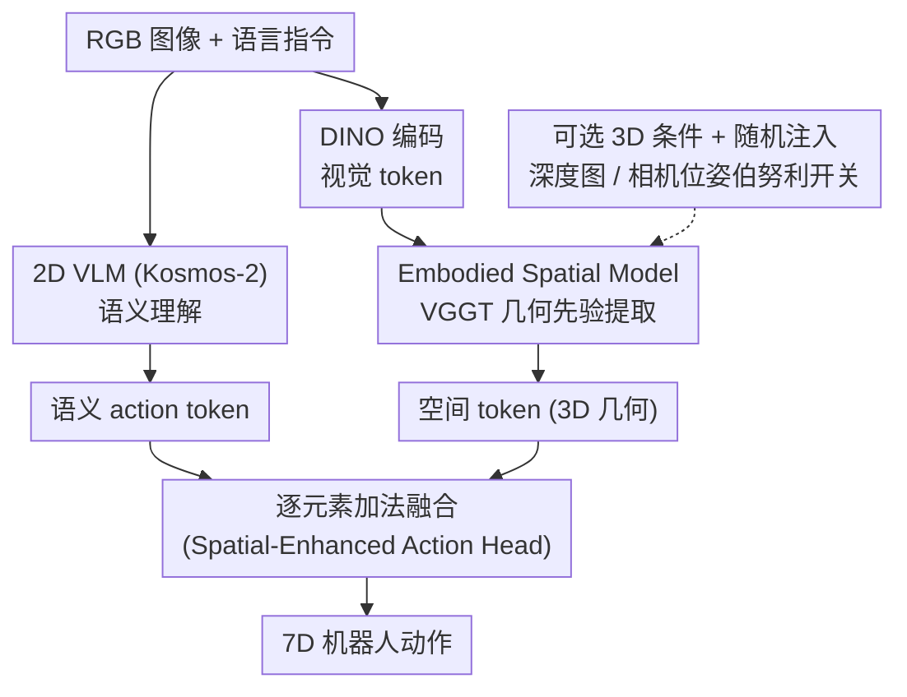

# From Spatial to Actions: Grounding Vision-Language-Action Model in Spatial Foundation Priors

**会议**: ICLR 2026  
**arXiv**: [2510.17439](https://arxiv.org/abs/2510.17439)  
**代码**: [有](https://falcon-vla.github.io/)  
**领域**: 机器人  
**关键词**: VLA模型, 3D空间理解, 空间基础模型, 模态可迁移性, 机器人操控  

## 一句话总结

提出 FALCON（From Spatial to Action），通过将空间基础模型的丰富 3D 空间 token 注入到 Action Head 而非 VLM 主干中，实现了 VLA 模型的强 3D 空间感知，同时保持仅 RGB 到 RGB-D 的灵活模态切换，在仿真和真实世界任务中均达到 SOTA。

## 研究背景与动机

现有 VLA 模型大多构建于 2D 编码器之上，但需要在 3D 物理世界中执行操控任务，这造成了关键的空间推理鸿沟。具体有三个层面的问题：

**空间表示不足**：2D VLM 缺乏显式 3D 感知，难以泛化到涉及几何、深度和空间关系推理的场景

**模态可迁移性差**：现有 3D 增强方法要么依赖特定传感器（点云/深度图），传感器不可用时直接失效；要么注入弱 3D 线索（如伪深度估计），信号不足以捕获鲁棒的 3D 先验

**对齐困难**：将空间 embedding 与文本 token 拼接会破坏原有的视觉-语言对齐，3D 数据稀缺使得重新对齐困难，导致零样本泛化退化

## 方法详解

### 整体框架

FALCON 把 VLA 拆成「大脑皮层 + 小脑」两条通路：2D VLM（Kosmos-2，~1.6B）负责读懂图像和语言指令，吐出语义 action token $\hat{\mathbf{t}}_{\text{act}}$；空间侧由 Embodied Spatial Model（ESM，基于空间基础模型 VGGT，~1.0B）从 RGB 中抽出富含几何的 3D 空间 token $\mathbf{T}_{\text{spl}}$，期间可选地把深度图 / 相机位姿当作随机注入的额外条件。两路表示不在 VLM 输入端拼接，而是汇到 Spatial-Enhanced Action Head 做逐元素加法融合，再生成机器人动作，全模型约 2.9B 参数。这种「空间信息绕开 VLM、只在动作头注入」的拓扑，是后续所有设计的出发点。

### 关键设计

**1. Embodied Spatial Model：用空间基础模型当几何先验提取器**

VLA 的 3D 短板根源在于 2D 编码器看不到深度和几何关系。FALCON 不自己从头学 3D，而是直接借用预训练好的 VGGT：输入图像先经 DINO 编码成视觉 token $\mathbf{T}_{\text{vis}}$，与一个可学习相机 token $\mathbf{t}_{\text{cam}}$ 拼接后送进空间编码器（交叉注意力 + 自注意力堆叠），输出空间 token $\mathbf{T}_{\text{spl}} \in \mathbb{R}^{M \times D_s}$。由于 VGGT 本身是为多视图重建（深度、点云、位姿）训练的，它的 token 天然携带稠密几何信息，比伪深度估计这类弱线索强得多，也免去了 3D 数据稀缺下从零对齐的麻烦。

**2. 可选 3D 条件 + 随机注入：一个模型吃下任意传感器组合**

真实部署里深度图和相机位姿时有时无，为每种配置单独训一个模型代价太高。FALCON 把这两路做成可插拔条件：相机位姿 $P \in \mathbb{R}^7$ 经 MLP 编码为 GT camera token $\mathbf{t}_{\text{gt-cam}}$，替换掉那个可学习 camera token；深度图 $D_t$ 归一化后与有效性掩码拼接，过一个 14×14 卷积得到 $\mathbf{T}_{\text{dpt}}$，逐元素加到图像 token 上。关键在于训练时这两路是否注入由两个伯努利开关 $b_d, b_p \sim \text{Bernoulli}(p)$ 随机决定：

$$(\mathbf{T}_{\text{spl}}, \hat{\mathbf{t}}_{\text{cam}}) = \mathcal{E}_{\text{spl}}(\mathbf{T}_{\text{vis}} + b_d \mathbf{T}_{\text{dpt}}, b_p \mathbf{t}_{\text{gt-cam}} + (1-b_p)\mathbf{t}_{\text{cam}})$$

这样同一组权重在「纯 RGB」「RGB-D」「带位姿」之间都见过训练信号，测试时缺哪路都不会崩，有哪路就能顺势增强，模态可以灵活切换。

**3. 在 Action Head 用逐元素加法融合：保护 VLM，零额外参数**

把空间 embedding 直接拼进 VLM 输入会冲掉预训练好的视觉-语言对齐，零样本泛化随之退化——这是现有 3D 增强方法的通病。FALCON 干脆让空间信息绕过 VLM，只在动作头汇合：空间 token 先经 max-pooling 压成单一向量 $\mathbf{t}_{\text{spl}}$，再过一个轻量 MLP 适配器投影进 VLM 特征空间 $\widetilde{\mathbf{t}}_{\text{spl}} = \mathcal{D}(\mathbf{t}_{\text{spl}})$，然后与语义 action token 直接相加 $\mathbf{f}_{\text{fused}} = \hat{\mathbf{t}}_{\text{act}} + \widetilde{\mathbf{t}}_{\text{spl}}$，送入动作预测器（MLP 或 LSTM）输出 7D 动作序列。逐元素加法不引入新参数，消融里却胜过交叉注意力和 FiLM-Gated，原因正是它最不破坏 VLM 既有表示，把语义和几何当作可叠加的互补信号。

### 损失函数 / 训练策略

动作监督把 7 维拆开处理：前 6 维连续位姿用 MSE，第 7 维离散夹爪开合用 BCE，在动作块长度 $C$ 上累加：

$$\mathcal{L} = \sum_{i=t}^{t+C-1} \text{MSE}(\hat{a}_{i,\text{pose}}, a_{i,\text{pose}}) + \lambda \cdot \text{BCE}(\hat{a}_{i,\text{gripper}}, a_{i,\text{gripper}})$$

ESM 一侧沿用 VGGT 的深度 / 点云图 / 位姿多任务空间重建监督，保住几何先验不退化。后训练分两阶段以避免一上来就扰动预训练权重：Stage 1 冻结所有预训练组件、只训轻量适配器，让空间 token 先和 VLA 特征空间粗对齐；Stage 2 再解冻 VLM 与适配器联合微调（其余仍冻结），让 VLM 隐式吸收空间线索。整个训练在 32 块 A100 上完成。

## 实验关键数据

### 主实验

**CALVIN 长序列操控（ABCD→D）**：

| 方法 | 1任务 | 2任务 | 3任务 | 4任务 | 5任务 | 平均长度↑ |
|------|-------|-------|-------|-------|-------|-----------|
| RT-1 | 84.4 | 61.7 | 43.8 | 32.3 | 22.7 | 2.45 |
| RoboVLM | 96.7 | 93.0 | 89.9 | 86.5 | 82.6 | 4.49 |
| **FALCON** | **97.2** | **93.3** | **90.3** | **88.0** | **84.0** | **4.53** |

**CALVIN 零样本迁移（ABC→D）**：

| 方法 | 平均长度↑ |
|------|-----------|
| 3D Diffuser Actor (用GT点云) | 3.35 |
| RoboVLM | 4.25 |
| **FALCON (仅RGB)** | **4.40** |

**SimplerEnv WidowX 机器人**：

| 方法 | Put Spoon | Put Carrot | Stack Block | Put Eggplant | 平均 |
|------|-----------|------------|-------------|--------------|------|
| SpatialVLA | 16.7% | 25.0% | 29.2% | 100% | 42.7% |
| **FALCON** | **62.5%** | **41.7%** | 20.8% | 100% | **56.3%** |

**SimplerEnv Google 机器人**：

| 方法 | Pick Coke | Move Near | Open/Close | Drawer Apple | 平均 |
|------|-----------|-----------|------------|--------------|------|
| RT-2-X (55B) | 78.7% | 77.9% | 25.0% | 3.7% | 46.3% |
| SpatialVLA | 86.0% | 77.9% | 57.4% | 0.0% | 55.3% |
| **FALCON (2.9B)** | **90.7%** | **79.2%** | 39.8% | **41.7%** | **62.9%** |

### 消融实验

**空间 token 注入位置**：

| 注入方式 | ABCD→D Avg.Len | ABC→D Avg.Len |
|----------|----------------|---------------|
| 注入VLM (FALCON_VLM-tokens) | 4.00 | 3.79 |
| **注入Action Head (FALCON)** | **4.08** | **3.91** |

**融合策略比较（CALVIN ABC→D）**：

| 策略 | Avg.Len↑ |
|------|----------|
| Cross-Attention | 3.68 |
| FiLM-Gated | 3.76 |
| **Element-wise Addition** | **3.91** |

**模态输入消融（CALVIN ABC→D）**：

| 配置 | Avg.Len↑ |
|------|----------|
| Kosmos-VLA (仅RGB, 无ESM) | 3.48 |
| Kosmos-VLA (RGB-D, 点云编码器) | 3.98 |
| FALCON (仅RGB) | 3.91 |
| FALCON (RGB-D) | **3.97** |
| FALCON (训练用RGB-D, 测试去掉D) | 3.95 |

### 关键发现

1. **Action Head 注入 >> VLM 注入**：将空间 token 注入 VLM 会破坏预训练语义表示，导致泛化退化（3.91 → 3.79）；注入 Action Head 则保持 VLM 完整性
2. **最简单的融合最优**：逐元素加法优于交叉注意力和 FiLM-Gated，0 额外参数且效果最好
3. **仅 RGB 超越显式 3D 输入**：FALCON 仅用 RGB 即超越了使用 GT 点云的 3D Diffuser Actor（4.40 vs 3.35）
4. **模态灵活切换**：训练时加入深度/位姿，测试时移除仍保持高性能（3.97 → 3.95），反之亦然
5. **真实世界空间理解显著领先**：在需要不同物体大小/高度感知的任务中，FALCON 成功率远超基线
6. **少样本适应能力强**：在 Few-shot 设置中比第二名高出 27%

## 亮点与洞察

1. **大脑分工类比精准**：VLM 负责高级语义（大脑皮层），Action Head 负责精细运动控制并整合空间信息（小脑），这个设计直觉简单但效果显著
2. **随机条件策略优雅**：通过 Bernoulli 随机开关在训练时随机注入/不注入深度和位姿，单一模型实现多模态灵活切换，避免了为每种传感器配置训练不同模型
3. **空间基础模型的新应用**：首次将 DUSt3R/VGGT 系列的空间重建 token 用作 VLA 的几何先验，打通了重建与控制
4. **仅 RGB 超越 GT 点云**：说明空间基础模型学到的隐式 3D 表示比显式点云更适合作为策略网络的输入

## 局限与展望

1. **静态相机假设**：ESM 处理第三视角静态相机图像，对于移动基座机器人自身视角变化的场景适用性有待验证
2. **桌面操控为主**：实验聚焦于桌面操控任务，导航和全身运动控制场景未涉及
3. **ESM 的 1B 参数开销**：总 2.9B 参数中 ESM 占 1B，对边缘部署的实时性影响需评估
4. **空间基础模型的替换性**：当前基于 VGGT，未来更好的空间基础模型能否即插即用替换有待验证
5. **Open X-Embodiment 预训练数据缺乏 3D 标注**：随机条件策略虽然缓解了这个问题，但有对齐 3D 标注的数据集可能进一步提升性能

## 相关工作与启发

- **与 SpatialVLA 的区别**：SpatialVLA 将可学习空间 embedding 拼入 VLM 输入，信号弱且破坏对齐；FALCON 将丰富的空间基础模型 token 直接注入 Action Head，避免了对齐问题
- **与 PointVLA/GeoVLA 的区别**：这些方法直接消费显式 3D 输入（点云），传感器不可用时失效；FALCON 仅 RGB 就能工作且支持可选的 3D 增强
- **与 3D-VLA 的区别**：3D-VLA 将 3D 特征嵌入 VLM，需要昂贵的 embodied instruction tuning 来恢复性能；FALCON 解耦空间处理与 VLM
- **启发**：空间基础模型（DUSt3R 系列）作为通用几何先验注入器，可以推广到其他需要 3D 理解的下游任务（如导航、场景理解）

## 评分

- 新颖性: ⭐⭐⭐⭐ — Action Head 注入 + ESM 随机条件策略的组合设计具有原创性
- 实验充分度: ⭐⭐⭐⭐⭐ — 三仿真基准 + 11 个真实任务 + 完善的消融研究，覆盖极为全面
- 写作质量: ⭐⭐⭐⭐ — 动机清晰、三个limitation对应三个设计贡献的结构清晰
- 价值: ⭐⭐⭐⭐⭐ — 实用性极强，仅 RGB 即可部署，有传感器时进一步增强

<!-- RELATED:START -->

## 相关论文

- [\[CVPR 2026\] Learning Surgical Robotic Manipulation with 3D Spatial Priors](../../CVPR2026/robotics/learning_surgical_robotic_manipulation_with_3d_spatial_priors.md)
- [\[ICML 2026\] Spatial Memory for Out-of-Vision Manipulation in Vision-Language-Action](../../ICML2026/robotics/spatial_memory_for_out-of-vision_manipulation_in_vision-language-action.md)
- [\[ICLR 2026\] Theory of Space: Can Foundation Models Construct Spatial Beliefs through Active Exploration?](theory_of_space_can_foundation_models_construct_spatial_beliefs_through_active_e.md)
- [\[ICLR 2026\] UniVLA: Unified Vision-Language-Action Model](unified_vision-language-action_model.md)
- [\[ICLR 2026\] Embodied Navigation Foundation Model](embodied_navigation_foundation_model.md)

<!-- RELATED:END -->
