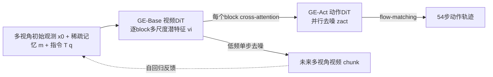

# Genie Envisioner: A Unified World Foundation Platform for Robotic Manipulation

**会议**: ICLR 2026  
**OpenReview**: [https://openreview.net/forum?id=fHLtSxDFKC](https://openreview.net/forum?id=fHLtSxDFKC)  
**代码/主页**: [https://genie-envisioner.github.io](https://genie-envisioner.github.io)  
**领域**: 机器人操作 / 世界模型 / 视频生成策略学习  
**关键词**: World Model, Robotic Manipulation, Video Diffusion, VLA, Flow Matching, Cross-Embodiment  

## 一句话总结
GE 把"多视角视频世界模型 (GE-Base)"和"轻量并行动作解码器 (GE-Act)"统一进一个视频生成框架，让动作分支逐块对齐地直接读取视频 DiT 的多尺度全分辨率潜表征，再配合慢-快异步推理，做到在单张 RTX 4090 上 200ms 内生成 54 步动作轨迹，并能用 1 小时遥操作数据迁移到全新机器人本体。

## 研究背景与动机
**领域现状**：机器人操作的主流路线是 VLA (Vision-Language-Action) 模仿学习，把视觉观测压缩成低带宽语义嵌入，再接策略头输出动作；近年又兴起"视频中心世界模型"，把范式从「vision→language」转成「language→future video」，用未来视频显式编码运动、接触演化等细粒度线索。

**现有痛点**：纯语义嵌入的 VLA 擅长高层理解但无法显式建模未来动态，难支撑精细运动控制；而把 VLM 与扩散策略硬拼又会让连续动作损失盖过语言目标、破坏预训练权重。已有的视频策略方法多为**单视角**生成（与真机多视角第一人称感知不符），且采用**串行**的 video→action 管线——必须先把视频潜变量压缩再解码动作，既慢又丢掉关键的细粒度空间与接触线索。

**核心矛盾**：要让世界模型既保留高保真的细粒度视觉表征（利于精确控制），又能满足实时闭环控制的低延迟需求——而串行压缩管线恰恰在两者之间做了错误的权衡。

**本文目标**：构建一个统一闭环生成架构，把第一人称多视角视觉世界建模与策略学习放进同一框架，既保住细粒度潜表征又能实时运行，并能跨本体泛化。

**核心idea**：**[并行块对齐]** 动作分支不等视频解码，而是与视频生成器并行运行、在每个 DiT block 通过 cross-attention 直接读取全分辨率多尺度潜特征；**[慢-快异步]** 重的视频分支低频单步去噪、轻的动作分支高频多步去噪，把算力花在刀刃上。

## 方法详解

### 整体框架
GE 由两部分构成：**GE-Base**（大规模指令条件多视角视频扩散世界模型，基于 LTX-Video 2B，自回归逐 chunk 预测未来头部视角+腕部视角视频）和 **GE-Act**（160M 参数的轻量并行动作解码器，与 GE-Base 逐块对齐，用 flow-matching 把潜表征映射成可执行动作轨迹）。GE-Base 在 AgiBot-World-Beta 约 100 万条双臂操作 episode（3000 小时）上预训练，GE-Act 再以三阶段流水线从中派生策略，最后用慢-快异步推理满足实时控制。

**1. 多视角自回归视频生成与跨视角一致性：让生成对齐真机第一人称本体。** GE-Base 在自回归步 $t$ 预测 $N$ 帧 chunk $x^t_{1:N} = W(x_0, m_{0:t-1}, T(q))$，条件是初始多视角观测 $x_0$、指令嵌入 $T(q)$ 和长程稀疏记忆 $m_{0:t-1}$（从历史 chunk 稀疏采关键帧得到，保留扩展时序上下文）。每个视角 $i$ 的 token 由共享视频编码器编码后，叠加 3D 旋转位置编码与可学习视角嵌入 $\tilde{v}^i = \text{RoPE}(t,h,w) + v^i + e^i_{view}$，所有视角 token 拼接后送入 DiT。为保证视角间几何与运动一致，只在**部分** block 引入 cross-view attention——把多视角 token 临时合并成一条序列让彼此互相 attend，其余 block 各视角独立处理，在多视角一致性与算力间取平衡。训练用 latent diffusion 速度预测目标，且仅对未来帧（用条件掩码 $M$）监督：$L_{video} = w(\tau)\lVert (v_\theta - (\epsilon - l)) \odot (1-M)\rVert^2_2$。

**2. 多阶段机器人自适应预训练：把通用视频先验逐步对齐到具身动态。** 直接拿通用视频模型做机器人世界模型会水土不服，GE-Base 用两阶段预训练弥合：**Stage I 多分辨率时序自适应 (GE-Base-MR)** 在 3–30Hz 采样的 57 帧 clip 上训练（含 4 帧稀疏记忆，压成 8 帧 latent），让表征对采样率不变、暴露在多样运动速度和部分观测下；**Stage II 低频策略对齐 (GE-Base-LF)** 再在 5Hz 采样的 9 帧 clip 上微调（再加 4 帧记忆，编码成 2 个 latent 帧，只更新生成组件），把时序粒度对齐到下游动作步，为动作模型预训练打基础。数据管线刻意把稀疏记忆帧随机从历史采样，提高预测难度、增强对时序扰动的鲁棒性。

**3. GE-Act 并行块对齐动作解码：绕开串行压缩、直取高分辨率潜特征。** 这是 GE 区别于传统 VLA 的核心。GE-Act 镜像 GE-Base 的 DiT 深度但用更小隐藏维度。在每个 block，GE-Base 产出视觉特征 $v_i = B^{vis}_i(v_{in}, T(q))$，GE-Act 的动作 token 从高斯噪声 $z_{act}$ 初始化、经动作 DiT block 在**匹配深度**上 cross-attend 对应的多尺度视觉特征 $a_i = B^{act}_i(z_{act}, \text{CrossAttn}(z_{act}, v_i))$。因为是逐块对齐而非只读最后一层 latent，GE-Act 能贯穿生成过程地利用高分辨率空间线索和跨视角对应关系，保住传统压缩 VLA 丢掉的几何/运动/接触细节。值得注意的是 GE-Act 的记忆直接采自机器人真实历史观测（而非 GE-Base 生成的帧），确保动作以准确的真实感知历史为条件。策略解码同样用速度匹配损失：$\tilde{u} = (1-\sigma_\tau)u + \sigma_\tau\epsilon$，$L_{act} = w(\tau)\lVert v^{act}_\theta - (\epsilon - u)\rVert^2_2$。

**4. 慢-快异步推理：用两种异步把重视频模块的算力压下来又不牺牲控制精度。** GE-Act 训练分动作空间预训练 + 任务自适应（视频自适应→动作专化）两阶段；推理时引入两种异步：**扩散步异步**——视频 DiT 每次刷新视觉潜特征只做**单步**去噪，而动作解码器仍做**多步**去噪以保证精细控制的稳定性；**频率异步**——视频分支低频更新（5Hz），动作分支高频更新（30Hz）。对应两种模式：GE-Act Slow 两分支同频，GE-Act Fast 视频 5Hz / 动作 30Hz。这种"稀疏视频刷新 + 稠密动作生成"让 54 步预测窗口下能在 RTX 4090 上 200ms 内执行 30 个动作步，实现视频世界建模与实时动作执行的融合。

## 实验关键数据

### 主实验：策略性能与视频生成
- **实时性**：GE-Act 在单张 commodity GPU (RTX 4090) 上 200ms 内生成 54 步力矩轨迹，端到端低延迟闭环控制。
- **真机策略 (AgiBot G1，5 任务)**：与 π0、UniVLA、GR00T N1 在相同微调数据与协议下对比，GE-Act 在 Step-wise SR 与 End-to-End SR 上全面领先；异步模式在延迟敏感任务（如动态跟踪）上与同步相当甚至更优，在短程任务（如装洗涤剂）上显著超过标准模式。
- **跨本体泛化**：仅用约 1 小时（250 条）遥操作数据微调，即可迁移到 Dual Franka、Agilex Cobot Magic、RoboTwin 仿真器等**预训练未见**本体，全面超越同样微调的 task-specific baseline；即便 π0/GR00T N1 用大规模 Franka 数据训练，GE-Act 仍更强；在可变形物体（叠衣/叠盒）等复杂精细任务上，UniVLA/GR00T N1 常 0% 成功，GE-Act 仍可靠完成。
- **视频生成 (EWMBench)**：相较 Kling、Hailuo、OpenSora、LTX、COSMOS 等 7 个 SOTA 视频模型，GE-Base 在场景/运动/语义层级聚合得分最高（综合 4.7010 vs 次优 3.8698），尤以时序对齐与动态一致性见长。

### 消融实验：预训练的作用 (AgiBot-G1 红圆柱抓取，305 demo，40k 步)

| VidAW (GE-Base 初始化) | VidAda (任务视频自适应) | E2E (w/ S) | E2E (w/o S) | SR (w/ S) | SR (w/o S) |
|---|---|---|---|---|---|
| ✗ | ✗ | 0.15 | 0.30 | 0.05 | 0.11 |
| ✗ | ✓ | 0 | 0.05 | 0 | 0 |
| ✓ | ✗ | 0.81 | 0.49 | 0.64 | 0.26 |
| ✓ | ✓ | **0.89** | 0.37 | **0.76** | 0.37 |

（'S' = 是否输入机器人状态；从零训练或仅用通用视频模型 LTX-Video 初始化几乎 0 成功。）

### 关键发现
- **域内具身预训练是基石**：仅 in-domain 预训练即达 64 SR / 81 E2E，叠加通用视频预训练进一步升到 76% / 89%；通用视频先验单独几乎无效，必须配合机器人域适配。
- **机器人状态输入有增益但有前提**：在具身预训练模型上加 state 输入带来提升；但若直接加到通用视频预训练模型上，会因 short-cut learning 反而掉点。
- **并行块对齐 > 串行压缩**：直取全分辨率多尺度潜特征带来的细粒度保留，是 GE-Act 在精细/可变形任务上拉开差距的根因。

## 亮点与洞察
- **统一闭环架构**：世界生成与策略学习共享一个视频生成框架，而非把 VLM 和扩散策略硬拼，从根上避开了"动作损失盖过语言目标"的训练失稳问题。
- **并行块对齐设计巧妙**：用 cross-attention 在匹配深度逐块取特征，既绕过串行压缩的延迟瓶颈，又保住了串行管线必然丢失的细粒度空间/接触线索——这是"既要保真又要实时"矛盾的优雅解法。
- **慢-快异步是工程与认知的结合**：重感知低频刷新、轻控制高频响应，符合"世界变化慢于动作执行"的直觉，落地价值高。
- **数据与可迁移性**：100 万真机 episode 预训练 + 1 小时数据跨本体迁移，展示了世界基础模型路线在机器人上的 scaling 潜力。

## 局限与展望
- **依赖大规模真机数据**：GE-Base 预训练需 AgiBot-World-Beta 这种 3000 小时级私有数据集，复现门槛高，开放性受限。
- **联合训练的任务干扰**：RoboTwin 上 all-in-one 联合微调在 lift pot 任务略逊于 task-specific baseline，提示多任务联合训练存在干扰，需更好的任务解耦或路由。
- **多视角与本体假设**：方法围绕双臂多视角（头+双腕）设定，迁移到单臂/异构传感器布局或非视觉模态时的有效性尚待验证。
- **评测以真机定性/成功率为主**：主实验多以柱状图与成功率呈现，缺乏更细粒度的轨迹误差/接触力等量化分析，长程记忆任务的系统化基准也较有限。

## 相关工作与启发
- **VLA 策略**（RT-2、OpenVLA、π0 等）擅长语义 grounding 但缺乏对动态的显式生成式 rollout；GE 用语言条件的生成式世界模型保留通往控制的直接路径，同时具备预测性仿真能力。
- **具身视频世界模型**（COSMOS、UniPi 系列、各类 latent/pixel 世界模型）是 GE 的直接思想来源；GE 的差异在于多视角第一人称生成 + 并行块对齐动作解码，针对性解决单视角与串行压缩两大短板。
- **启发**：当"保真度"与"实时性"冲突时，与其压缩信息，不如改变信息流的拓扑（并行 vs 串行）+ 异步调度算力；这一思路对其他需要重感知 backbone 又要实时决策的系统（自动驾驶、交互式生成）有借鉴意义。

## 评分
- **新颖性**: ⭐⭐⭐⭐⭐ 并行块对齐 + 慢-快异步的统一世界基础模型设计，对串行压缩 VLA 范式提出了有说服力的替代，思路新颖且针对性强。
- **实验充分度**: ⭐⭐⭐⭐ 覆盖真机多任务、4 类本体跨本体迁移、视频生成基准与预训练消融，证据链完整；但主结果以成功率/柱状图为主，细粒度量化与公开可复现性偏弱。
- **写作质量**: ⭐⭐⭐⭐ 动机清晰、架构图与训练流水线讲解到位，方法与异步推理的工程细节交代充分。
- **价值**: ⭐⭐⭐⭐⭐ 提供了可实时部署、跨本体泛化的机器人世界基础平台，对具身智能的 scaling 路线有重要推动与落地参考价值。

<!-- RELATED:START -->

## 相关论文

- [\[ICLR 2026\] Ctrl-World: A Controllable Generative World Model for Robot Manipulation](ctrl-world_a_controllable_generative_world_model_for_robot_manipulation.md)
- [\[ICLR 2026\] Policy Contrastive Decoding for Robotic Foundation Models](policy_contrastive_decoding_for_robotic_foundation_models.md)
- [\[ICLR 2026\] WholeBodyVLA: Towards Unified Latent VLA for Whole-Body Loco-Manipulation Control](wholebodyvla_towards_unified_latent_vla_for_whole-body_loco-manipulation_control.md)
- [\[CVPR 2026\] From Manuals to Actions: A Unified VLA Model for Chain-of-Thought Manual Generation and Robotic Manipulation](../../CVPR2026/robotics/from_manuals_to_actions_a_unified_vla_model_for_chain-of-thought_manual_generati.md)
- [\[ICLR 2026\] RoboInter: A Holistic Intermediate Representation Suite Towards Robotic Manipulation](robointer_a_holistic_intermediate_representation_suite_towards_robotic_manipulat.md)

<!-- RELATED:END -->
