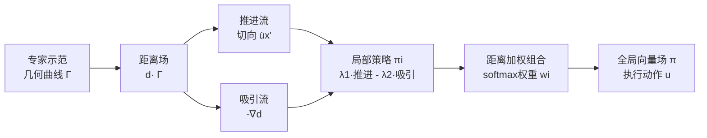

# Geometry-Aware Policy Imitation

**会议**: ICLR 2026  
**OpenReview**: [https://openreview.net/forum?id=ggofj6tyr3](https://openreview.net/forum?id=ggofj6tyr3)  
**代码**: [项目主页](https://yimingli1998.github.io/projects/GPI/)  
**领域**: 机器人 / 模仿学习  
**关键词**: 模仿学习, 距离场, 流场控制, 非参数策略, 多模态, 动力系统  

## 一句话总结
GPI 把专家示范看作状态空间里的几何曲线而非状态-动作样本集，从曲线诱导出的距离场中导出"推进流 + 吸引流"两个互补的控制原语，组合成一个非参数、可解释的向量场直接驱动机器人，在比扩散策略成功率更高的同时推理快 20–100×、内存省两个数量级。

## 研究背景与动机
- **领域现状**: 模仿学习是机器人从专家示范获取技能的主流路径。现有方法分三大家族：显式策略（状态→动作的监督回归，推理快但难处理多模态）、隐式策略（学状态-动作能量函数，难训练、部署时优化慢）、生成式策略（扩散/流匹配，擅长多模态但计算重、对分布漂移脆弱）。
- **现有痛点**: 三类方法都把示范压缩成**参数模型**——加入新数据必须重训，且往往丢弃了专家行为背后的几何结构。生成式策略尤其昂贵：扩散去噪要多步迭代，部署时延高、内存大。
- **核心矛盾**: 模仿的本质其实很朴素——(i) 沿专家运动方向前进，(ii) 尽量贴近专家状态。但主流做法却用重型参数模型去拟合一个本可以"几何推理"直接得到的策略。
- **本文目标**: 让模仿学习更直接、可解释、高效——去掉参数策略拟合，把"度量学习"与"行为合成"解耦，做成模块化、免训练（状态输入下）、天然支持多模态与增量组合的框架。
- **核心 idea**: **几何重述模仿** —— 一条示范是带切向（专家动作）标注的几何曲线，它诱导一个距离场；距离场的负梯度给出"吸引"、轨迹切向给出"推进"，二者叠加即得到一个渐近收敛到示范的稳定一阶动力系统，无需训练任何策略网络。

## 方法详解

### 整体框架
给定 $N$ 条示范 $\mathcal{D}=\{\Gamma^{(i)}\}$，每条轨迹 $\Gamma^{(i)}=\{(x_t,u_t)\}$ 被视为状态空间中的几何曲线。每条曲线诱导一个距离场 $d(x_o\mid\Gamma^{(i)})$，由它导出两个互补控制原语并叠加成局部策略，再用基于距离的权重把多条示范的局部策略组合成全局策略。整个推理只需"算距离 + 加权平均"，无参数拟合。

### 关键设计

**1. 距离场诱导的双流策略：把模仿拆成"前进"与"纠偏"。** 这是 GPI 的地基。对每条示范，先把状态 $x$ 投影到机器人可控的**驱动子空间** $x'=P(x)$（关节角、末端位姿等），控制只施加在这里；环境变量（物体位姿、图像）不可直接驱动，只参与示范相似度比较。距离场据此给出两股流：**推进流**取最近示范点的切向动作 $u^{(i)}_{\kappa(x_o)}=\dot{x}'^{(i)}$，让状态沿专家轨迹前进；**吸引流**取距离场对驱动坐标的负梯度 $-\nabla_{x'_o}d(x_o\mid\Gamma^{(i)})$，把偏离的状态拉回轨迹。二者线性叠加成局部策略

$$\pi_i(x_o)=\lambda_1(x_o)\,u^{(i)}_{\kappa(x_o)}-\lambda_2(x_o)\,\nabla_{x'_o}d(x_o\mid\Gamma^{(i)}),$$

其中 $\kappa(x_o)=\arg\min_t d(x_o,x^{(i)}_t)$ 是最近示范点，权重 $\lambda_1,\lambda_2\ge0$ 调成"远离示范时吸引主导、靠近时推进主导"。若用样条等连续函数表示离散轨迹，该策略被证明是渐近收敛到示范曲线的稳定一阶动力系统，因而行为可预测、对扰动鲁棒。作者还点破：扩散策略之所以好用，正是因为去噪步骤隐式地诱导了一个"吸引流"，而非只靠推进——GPI 把这层隐式机制显式化了。

**2. 跨示范的距离加权组合：天然多模态又免平均坍塌。** 单条示范只能覆盖局部，全局策略对查询状态取 $K$ 个最近示范，用 softmax 温度权重组合：

$$\pi(x_o)=\sum_{i=1}^{K} w_i(x_o)\,\pi_i(x_o),\qquad w_i(x_o)=\frac{\exp(-\beta\,d(x_o\mid\Gamma^{(i)}))}{\sum_j \exp(-\beta\,d(x_o\mid\Gamma^{(j)}))}.$$

温度 $\beta$ 控制选择的锐度。这种基于距离的检索式组合保证动作只从"最相关"的示范里取，因而在 Y 形分叉等多模态场景中，策略会平滑地分支到最近的示范模式，而不是把冲突动作平均成无意义的中间值——这正是显式回归策略的老毛病。增量加入新示范也只是往距离场里"加一个吸引盆地"，不需重训。

**3. 度量学习与行为合成解耦：低维高维一套框架打通。** 距离度量被拆成机器人项 $d_{\text{rob}}$ 与环境项 $d_{\text{env}}$，二者角色不同：$d_{\text{env}}$ 只影响示范的相似度排序与权重，$d_{\text{rob}}$ 还额外塑造驱动子空间里的吸引流。低维量直接用欧氏距离 $\|x_1-x_2\|_2$，末端朝向用四元数测地距离 $2\arccos(|\langle x_1,x_2\rangle|)$ 尊重旋转几何；高维观测（图像）则映到隐空间 $z=\Psi(x)$ 比距离，$\Psi$ 可以是轻量任务专用头、自监督 VAE，或 SAM/DINO/CLIP 等预训练编码器，甚至 PCA。因为 GPI 只需要一个"能算距离"的状态表示，而非直接拟合完整策略函数，学习问题比生成模型简单得多，轻量编码器通常就够，训练快、推理快。

## 实验关键数据

### 主实验表格（Push-T，状态/视觉输入）

| 方法 | 状态版 Avg./Max. (%) | 训练/推理时间 | 内存 | 视觉版 Avg./Max. (%) | 训练/推理时间 | 内存 |
|------|------|------|------|------|------|------|
| DDPM (100步) | 82.3 / 86.3 | 1.0 h / 641 ms | 252 MB | 80.9 / 85.5 | 2.5 h / 647 ms | 353 MB |
| DDIM (10步) | 81.5 / 85.1 | 1.0 h / 65 ms | 252 MB | 79.1 / 83.1 | 2.5 h / 67 ms | 353 MB |
| FMP | 77.6 / 80.2 | 1.0 h / 58 ms | 251 MB | 75.1 / 79.3 | 2.5 h / 60 ms | 352 MB |
| SFP | 83.1 / 87.8 | 0.8 h / 51 ms | 240 MB | 77.5 / 81.2 | 2.0 h / 55 ms | 341 MB |
| **GPI (本文)** | **85.8 / 89.0** | **0 h / 0.6 ms** | **0.7 MB** | **83.3 / 86.9** | **0.3 h / 3.3 ms** | **44 MB** |

GPI 成功率全面最高，状态版推理 0.6 ms（约 100× 快于扩散）、内存 0.7 MB（省两个数量级、且免训练）；视觉版用 ResNet-18 仅作特征提取，训练 0.3 h、推理 3.3 ms。

### 泛化与表示消融

| Robomimic/Adroit | Lift | Can | Square | Door | Pen | Hammer | Relocate |
|------|------|------|------|------|------|------|------|
| DP | 1.00 | 0.94 | **0.87** | 1.00 | 0.89 | 0.83 | 0.91 |
| **GPI** | 1.00 | **0.96** | 0.82 | 1.00 | **0.95** | **0.88** | 0.91 |

视觉表示消融（Push-T Avg. Score）：任务专用头 87% / VAE **88%** / ResNet+PCA 84% / Diffusion Policy 85% / BYOL 67% / 预训练 SAM（零微调）41%。

### 关键发现
- **效率断层式领先**: 状态输入下完全免训练、推理 0.6 ms，比扩散策略快 20–100×，内存省两个数量级。
- **对超参不敏感**: 邻居数 $K=1,3,5,10$ 曲线几乎重合；规划 horizon 到 16 仍稳定（既可纯反应式、也可后退视界）；对软最大温度 $\beta$ 也鲁棒。
- **数据可扩展性**: 示范从 1K→20K 成功率持续上升后饱和，可当"需要多少示范"的诊断工具；相对（物体中心）状态在数据稀缺时略优于绝对状态。
- **多模态与可控随机性**: 向查询状态注入高斯噪声 $\mathcal{N}(0,\sigma^2)$ 即可在性能与轨迹多样性间权衡，$\sigma=0.2$ 时已现多模态。
- **控制原语可调**: 调节 $(\lambda_1,\lambda_2)$ 可在"速度型(推进主导)"与"位置型(吸引主导)"控制间插值，大范围权重下分数都很稳。
- **真机验证**: 在 Franka 单臂与 Aloha 双臂上完成翻箱等接触丰富任务，对视觉扰动鲁棒并展现多模态行为。

## 亮点与洞察
- **视角转换最有价值**: 把"拟合参数策略"重述为"距离/曲率/组合上的几何推理"，一举拿下效率、可解释、多模态、增量组合四个好处，而且各自有清晰的几何解释。
- **对扩散策略的一句话洞察**: 扩散之所以能模仿，是因为去噪隐式产生了"吸引流"；GPI 把这层显式拆出来，于是不再需要多步去噪。
- **解耦带来真正的模块化**: 度量与合成分离，使同一框架既能吃低维控制向量，也能吃原始图像（换编码器即可），且编码器可跨任务复用。
- **VAE > BYOL 的解释很到位**: VAE 重建目标保留并平滑参数化场景几何，正好契合距离场与流；BYOL 强调增广不变性，反而丢了几何信息。

## 局限与展望
- **依赖距离度量质量**: 在高维视觉下性能强烈取决于隐空间是否"几何友好"——预训练 SAM 零微调只有 41%，说明并非任意编码器都管用。
- **存储随示范线性增长**: 非参数意味着要存所有示范，超大规模示范集下内存/检索成本需关注（虽然目前仍远小于大网络）。
- **接触/动力学隐含假设**: 收敛性证明建立在状态-动作连续、用连续函数（样条）表示轨迹之上；强不连续接触下的理论保证仍有待延伸。
- **未来方向**: 自动学习"几何友好"的度量、更强的近邻检索加速、把加速度/力矩控制与真机动力学更紧地结合。

## 相关工作与启发
- **生成式策略**（Diffusion Policy、Flow Matching、Streaming Flow Policy）是直接对标对象——GPI 用几何推理替掉了重型生成头。
- **非参数模仿**（VINN/Pari et al. 用 BYOL 做最近邻策略）思路相近，但 GPI 加入了距离场梯度构成的吸引流与可证收敛的动力系统。
- **动力系统式模仿**（Calinon、Li & Calinon 的稳定 DS）是理论根基，本文把它推广到高维感知输入与多示范组合。
- 启发：当任务的"专家行为"本身带强几何结构（轨迹、流形）时，先想清楚能否用几何场直接构造策略，往往比硬上参数生成模型更省、更稳、更可解释。

## 评分
- **新颖性**: ⭐⭐⭐⭐⭐ 把模仿学习从"拟合参数策略"重述为"距离场+流场的几何推理"，视角清新且自洽，并解释了扩散策略好用的本质。
- **实验充分度**: ⭐⭐⭐⭐ 覆盖 Push-T、Robomimic、Adroit、真机 Franka/Aloha，含丰富消融（K、horizon、噪声、表示、数据规模），扎实；接触动力学下的理论边界稍欠探讨。
- **写作质量**: ⭐⭐⭐⭐⭐ 动机递进清晰，几何直觉、公式与图示配合到位，可读性高。
- **价值**: ⭐⭐⭐⭐⭐ 用两个数量级的效率/内存优势换来更高成功率，免训练、可增量、可解释，对真机部署极具吸引力。

<!-- RELATED:START -->

## 相关论文

- [\[ICLR 2026\] Translating Flow to Policy via Hindsight Online Imitation](translating_flow_to_policy_via_hindsight_online_imitation.md)
- [\[ICLR 2026\] Difference-Aware Retrieval Policies for Imitation Learning](difference-aware_retrieval_policies_for_imitation_learning.md)
- [\[ICLR 2026\] HAMLET: Switch Your Vision-Language-Action Model into a History-Aware Policy](hamlet_switch_your_vision-language-action_model_into_a_history-aware_policy.md)
- [\[CVPR 2026\] GA-VLN: Geometry-Aware BEV Representation for Efficient Vision-Language Navigation](../../CVPR2026/robotics/ga-vln_geometry-aware_bev_representation_for_efficient_vision-language_navigatio.md)
- [\[CVPR 2026\] GeoDexGrasp: Geometry-aware Generation for Data-efficient and Physics-plausible Dexterous Grasping](../../CVPR2026/robotics/geodexgrasp_geometry-aware_generation_for_data-efficient_and_physics-plausible_d.md)

<!-- RELATED:END -->
