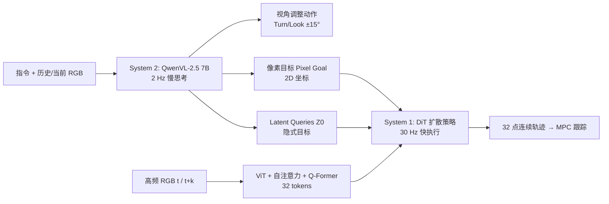

# Ground Slow, Move Fast: A Dual-System Foundation Model for Generalizable Vision-Language Navigation

**会议**: ICLR 2026  
**OpenReview**: [https://openreview.net/forum?id=GK4rznYwhn](https://openreview.net/forum?id=GK4rznYwhn)  
**代码**: [InternNav (InternVLA-N1)](https://github.com/InternRobotics/InternNav)  
**领域**: 具身导航 / 视觉语言导航 (VLN) / 双系统 VLA  
**关键词**: Vision-Language Navigation, Dual-System, Diffusion Policy, Pixel Goal, Flow Matching  

## 一句话总结
DualVLN（InternVLA-N1）把视觉语言导航拆成「慢系统」7B VLM 做像素目标 grounding + 「快系统」轻量扩散策略生成连续轨迹，两系统异步运行，在 VLN-CE / VLN-PE 上全面刷新 SOTA 并实现真机动态避障。

## 研究背景与动机
**领域现状**：视觉语言导航（VLN）从早期离散目标规划，演进到连续动作空间（VLN-CE），再到带物理控制器的真实仿真（VLN-PE）。大 VLM 的引入让导航系统获得了对多样指令和环境的强泛化能力，成为当前主流路线。

**现有痛点**：现有 VLA 导航模型几乎都是「端到端紧耦合」范式——把视觉语言输入直接映射成短时程离散动作（如「前进 0.25 米」）。这带来三个硬伤：(1) 动作破碎不自然，每一步都要调用大 VLM，**执行延迟高**；(2) 把视觉语言推理、全局规划、局部控制全揉进一条 pipeline，**层级间缺乏显式协调**；(3) 难以满足敏捷控制和动态障碍物避让等真实部署需求。

**核心矛盾**：大 VLM 推理强但慢（高延迟、低频），而真实导航需要高频、平滑、能实时反应动态障碍的局部控制——**推理能力与控制敏捷性在单一模型里无法兼得**。

**本文目标**：构建首个双系统 VLN 基础模型，把 VLM 的推理强项与实时控制所需的敏捷性显式桥接起来，既保留泛化能力又支持高频动态避障。

**核心 idea**：**「慢思考 + 快执行」解耦**——System 2（7B VLM，2 Hz）做慢而稳健的「像素目标 grounding」，System 1（轻量扩散 Transformer，30 Hz）把目标转成连续轨迹快速执行；二者通过**显式像素目标 + 隐式 latent 目标**双通道连接，并**解耦顺序训练**以保住 VLM 泛化。

## 方法详解

### 整体框架
DualVLN 由异步运行的两个系统组成。System 2 接收一段第一视角 RGB 序列和语言指令，迭代地决定「调整视角」还是「输出像素目标」，把下一个中期 waypoint 预测为图像上的 2D 像素坐标；同时通过可学习 latent queries 抽取紧凑的隐式目标特征。System 1 是一个多模态条件扩散 Transformer（DiT），同时吃 System 2 的低频 latent 目标和自身的高频 RGB，用 flow matching 生成 32 个稠密轨迹点。慢系统 2 Hz、快系统 30 Hz 异步推理，保证任意时刻都有新轨迹可用，从而平滑连续导航。

### 关键设计

**1. 最远像素目标 grounding + 自主视角调整：让 VLM「先看清再指路」**。System 2 基于 Qwen-VL-2.5（7B）的空间 grounding 能力，把高层规划重新表述成「最远像素目标 grounding」问题：模型输出图像中下一个最优 waypoint 的 2D 坐标。训练样本由 3D 轨迹投影到 2D 第一视角得到——用深度图加相机-点距离判断可见性，凡是距离超过对应深度值的点判为遮挡丢弃，再据此把 VLN-CE 轨迹切成像素目标样本。但单纯投影会出问题：视角太高时地面点被遮挡、人为抬高又造成深度歧义，朝向不对时下一个 waypoint 干脆落在视野外。借鉴人类导航「先环顾、低头看地面再选路」的行为，System 2 用离散动作（`Turn Left/Right 15°`、`Look Up/Down 15°`）**自主决定何时扫描环境、调整相机角度**，在信息充分的视角下再预测像素目标。

**2. 显式像素目标 + 隐式 latent 目标双通道连接**。如果只用 2D 像素目标做 System 1 的引导，等于把双系统退化成松散的模块化 pipeline，没有充分利用 VLM 丰富的隐藏特征；而只用 latent 又失去可解释性。本文两者并用：先用像素 grounding 任务训好 System 2 并**冻结其权重**，再附加一组随机初始化的可学习 latent queries $Z$，通过 prompt tuning 优化。把上下文序列 $X$（指令、历史/当前图像、视角动作、像素目标）与 $Z$ 拼成 $[X; Z]$ 过 VLM，让 $Z$ 注意并抽取 $X$ 中的任务相关语义，得到中间隐式目标 $Z_0$。这样像素目标提供可解释、可泛化的显式锚点，latent 目标在其之上提供更丰富自适应的引导，让 System 1 自动从 VLM 异构隐藏态中挑出对局部规划有用的表征。

**3. 多模态条件扩散 Transformer + 异步陈旧目标补偿**。System 1 是紧凑 DiT（隐维 384、12 层、6 头），用两路条件生成轨迹：低频 latent 目标 $Z_0$（从 3584 线性投影到 768 再与 DiT 交叉注意力）和高频 RGB。难点在于异步推理下 $t$ 时刻生成的 latent 目标到 $t+k$ 已**过时**——System 1 必须据此估计已走过的距离并适应动态变化。做法是同时编码 System 2 在 $t$ 时刻的末帧 RGB 和当前 $t+k$ 观测，先用 ViT（DepthAnythingV2-Small）提特征，再用自注意力跨两个时刻融合，最后 Q-Former 压成 32 个 token 作为高频视觉条件。

**4. Flow Matching 轨迹生成**。给定真值轨迹 $X_0$ 与两路条件 $(Z_0, F)$，采样扩散时刻 $u\sim U(0,1)$ 和噪声 $\epsilon\sim N(0,I)$，构造带噪轨迹 $X_u=\alpha_u X_0+\sigma_u\epsilon$（$\alpha_u$ 递减、$\sigma_u$ 递增）。DiT 预测速度场 $\hat{\dot{X}}_u=f_\theta(X_u, u, Z_0\oplus F)$，训练目标为速度的均方误差 $L_{flow}=\mathbb{E}_{u,X_0,\epsilon}\big[\|\hat{\dot{X}}_u-\dot{X}_u\|_2^2\big]$。推理时 System 1 用 TensorRT 在 0.03 s 内并行生成 32 条轨迹，配合 System 2 的 KV-cache 复用（轨迹 token 推理 1.1 s→0.7 s）实现近实时。

## 实验关键数据

### 主实验表格（VLN-CE R2R / RxR Val-Unseen）

| 方法 | R2R SR↑ | R2R SPL↑ | R2R NE↓ | RxR SR↑ | RxR nDTW↑ |
|------|---------|----------|---------|---------|-----------|
| NaVid | 37.4 | 35.9 | 5.47 | – | – |
| NaVILA | 54.0 | 49.0 | 5.22 | 49.3 | 58.8 |
| UniNaVid | 47.0 | 42.7 | 5.58 | 48.7 | – |
| StreamVLN | 56.9 | 51.9 | 4.98 | 52.9 | 61.9 |
| **DualVLN** | **64.3** | **58.5** | **4.05** | **61.4** | **70.0** |

仅用第一视角 RGB，DualVLN 在 R2R SR 上超过最强基线 StreamVLN **+7.4 个点**，且全面优于多传感器、VLM-free、Video-LLM 三类基线。

VLN-PE（物理控制器，零样本迁移自 VLN-CE）：DualVLN R2R Val-Unseen SR **51.60**、SPL 42.49，而同为零样本的 NaVid 仅 21.58、CMA 16.93——即便没在 VLN-PE 上微调也碾压在 VLN-PE 上训练的基线。

### 消融实验表格
目标表征消融（Figure 7，VLN-CE R2R Val-Unseen）：

| 变体 | SR↑ | SPL↑ | OS↑ | NE↓ |
|------|-----|------|-----|-----|
| **DualVLN（完整）** | **64.3** | **58.5** | **70.7** | **4.05** |
| w/o Sys.2 Train（一阶段联合训练） | 55.2 | 51.5 | 60.9 | 4.98 |
| w/o Pixel Goal（去显式像素目标） | 62.2 | 55.8 | 68.0 | 4.22 |
| w/o Latent Goal（仅用冻结 VLM 隐藏态） | 60.9 | 55.1 | 67.7 | 4.26 |

局部规划器对比（Table 4，VLN-PE flash controller，R2R Val-Unseen）：

| Local Planner | SR↑ | SPL↑ | NE↓ |
|---------------|-----|------|-----|
| iPlanner | 47.07 | 41.09 | 4.91 |
| NavDP | 58.72 | 50.98 | 4.22 |
| **System 1** | **63.62** | — | **3.90** |

### 关键发现
- **解耦顺序训练最关键**：一阶段联合训练（w/o Sys.2 Train）SR 暴跌 9.1 点，扩散策略收敛显著变慢且 VLM 泛化退化——证明中间像素目标对高效学习和保住 VLM 推理力都不可或缺。
- **显式 + 隐式缺一不可**：去掉像素目标降 2.1 点、去掉 latent 目标降 3.4 点，二者互补；latent queries 让 System 1 主动选择该用哪些隐藏态作条件，而非被动消费固定特征。
- **Social-VLN 新基准**：本文基于 R2R-CE + Habitat 3.0 humanoid 构建首个 Social-VLN，引入 Human Collision Rate (HCR)。动态场景下 DualVLN SR 37.2 仍优于 StreamVLN 31.4，但相比静态 VLN 下降约 27%，说明社会感知导航仍有大量改进空间。
- **真机跨本体**：在轮式（Turtlebot4）、四足（Go2）、人形（G1）三平台零样本部署，office/canteen/street/便利店均能选对像素目标、平滑避障、过楼梯避行人。

## 亮点与洞察
- **首个异步双系统 VLN 基础模型**：把「慢思考-快执行」从桌面操作首次扩展到长时程跨楼栋导航，异步推理打破了大 VLM 高延迟的瓶颈。
- **像素目标 grounding 这个中间表征选得巧**：既是 System 2 可解释的输出、又是切分训练数据的天然监督信号、还作为 System 1 的显式锚点，一举三得。
- **自主视角调整富有「拟人」直觉**：让模型像人一样「先低头看地面、环顾再决定方向」，优雅地解决了 3D→2D 投影的遮挡与视野外难题。
- **工程落地扎实**：KV-cache 复用 + TensorRT + MPC 跟踪，给出 2 Hz/30 Hz/200 Hz 的清晰频率分层，配套开源 InternNav / InternVLA-N1 / InternData-N1。

## 局限与展望
- **Social-VLN 远未解决**：动态场景 SR 仅 37.2，HCR 仍高达 35.4，人群密集时避障与任务恢复能力有限。
- **依赖远程算力**：完整模型跑在 RTX 4090 远程服务器（20 GB），机器人需实时回传 RGB-D，对网络与算力有要求，未做端侧轻量化。
- **像素目标对相机外参敏感**：自主视角调整缓解了部分问题，但 grounding 质量仍受相机高度/俯角影响（真机统一下倾 15°）。
- **System 2 仍是 2 Hz**：高层重规划频率受限，极快速动态变化（如突然横穿）下中期目标可能滞后于环境。

## 相关工作与启发
- **导航 VLA**：NaVid / UniNaVid / NaVILA / StreamVLN 把动作当 next-token 预测；UniVLA / TrackVLA 把 VLM latent 直接映射到连续轨迹但同步框架限制高频决策；RoboPoint / NaviMaster 用像素 grounding 但需额外执行模块——DualVLN 是首个支持长时程、异步、跨楼栋的双系统。
- **双系统 slow-fast**：FigureAI / 相关工作探索慢快推理但聚焦桌面操作，本文首次解决长时程规划与跨楼栋导航。
- **视觉导航策略**：传统模块化（DWA / RRT / MPPI）有累积误差与调参负担；GNM / ViNT / NoMaD / NavDP 等学习式提升零样本泛化——System 1 是 RGB-only、以 VLM latent 为条件的扩散导航策略。
- **启发**：双系统解耦 + 异步推理是把「大模型推理」落到「实时控制」的通用范式，对操作、移动操作（mobile manipulation）等需要高频闭环的具身任务都有借鉴价值。

## 评分
- **新颖性**: ⭐⭐⭐⭐⭐ 首个异步双系统 VLN 基础模型，像素目标 grounding + 显隐双目标 + 自主视角调整的组合设计原创性强。
- **实验充分度**: ⭐⭐⭐⭐⭐ VLN-CE/VLN-PE/Social-VLN 三基准 + 三平台真机 + 完整消融与局部规划器对比，覆盖全面。
- **写作质量**: ⭐⭐⭐⭐ 动机清晰、两个「Why」设问点题到位，方法图与频率分层讲解流畅；公式与实现细节交代充分。
- **价值**: ⭐⭐⭐⭐⭐ 全面刷新 SOTA、开源完整栈（模型/数据/代码）、提出 Social-VLN 新基准，对具身导航社区落地价值高。

<!-- RELATED:START -->

## 相关论文

- [\[ICLR 2026\] SpikePingpong: Spike Vision-based Fast-Slow Pingpong Robot System](spikepingpong_spike_vision-based_fast-slow_pingpong_robot_system.md)
- [\[ICLR 2026\] Embodied Navigation Foundation Model](embodied_navigation_foundation_model.md)
- [\[ICLR 2026\] Genie Envisioner: A Unified World Foundation Platform for Robotic Manipulation](genie_envisioner_a_unified_world_foundation_platform_for_robotic_manipulation.md)
- [\[CVPR 2026\] Towards Open Environments and Instructions: General Vision-Language Navigation via Fast-Slow Interactive Reasoning](../../CVPR2026/robotics/towards_open_environments_and_instructions_general_vision-language_navigation_vi.md)
- [\[ICLR 2026\] JanusVLN: Decoupling Semantics and Spatiality with Dual Implicit Memory for Vision-Language Navigation](janusvln_decoupling_semantics_and_spatiality_with_dual_implicit_memory_for_visio.md)

<!-- RELATED:END -->
