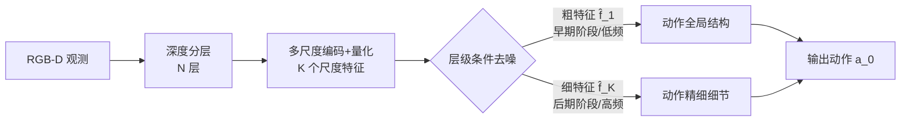

# H$^3$DP: Triply-Hierarchical Diffusion Policy for Visuomotor Learning

**会议**: ICLR 2026  
**OpenReview**: [https://openreview.net/forum?id=Q1CP0iAmOb](https://openreview.net/forum?id=Q1CP0iAmOb)  
**代码**: [https://h3-dp.github.io/](https://h3-dp.github.io/)  
**领域**: 机器人 / 视觉运动策略 / 扩散策略  
**关键词**: 扩散策略, 视觉运动学习, 层级建模, 深度分层, 多尺度表征, 机器人操作  

## 一句话总结
H3DP 在视觉运动扩散策略里同时引入「输入分层（按深度切片 RGB-D）+ 表征分层（多尺度视觉特征）+ 动作分层（粗到细的层级条件去噪）」三重层级结构，把视觉感知与动作生成显式耦合起来，在 44 个仿真任务上相对基线平均提升 +27.5%、真实双臂任务提升 +72.4%。

## 研究背景与动机
**领域现状**：视觉运动策略学习（visuomotor policy learning）已成为机器人操作的主流范式，近年来普遍采用扩散模型、自回归模型等生成式方法来建模动作分布（如 Diffusion Policy、DP3）。

**现有痛点**：这些方法各自只在「视觉表征侧」或「动作生成侧」单独发力——要么换更强的点云/图像编码器，要么改去噪/推理流程，却**忽视了感知与动作之间的紧耦合**。即便已有 Dense Policy、CARP、ARP 等工作引入层级思想，它们也只对**动作生成过程**做了层级建模，没有把层级贯穿到整条「视觉→动作」管线。

**核心矛盾**：人类决策本身是从感知到动作的层级化处理（视觉皮层分层抽取特征→层级推理→产生结构化运动行为），而现有策略把视觉编码和动作生成当作两个解耦模块，特征与动作之间缺少对应关系，导致在杂乱、遮挡、长程场景下表现脆弱。此外朴素的 RGB-D 直接拼接被反复验证收益有限。

**本文目标**：构建一个把层级结构贯穿「输入—表征—动作」三个阶段的视觉运动框架，让动作生成在语义上扎根于多尺度感知特征。

**核心 idea**：**三重层级耦合** —— 输入层按深度把 RGB-D 切成若干层，表征层把每层编码成多尺度离散特征，动作层利用扩散模型「先低频后高频」的固有归纳偏置，用粗特征引导早期去噪生成动作全局结构、用细特征引导后期去噪精修细节，从而在同一层级上对齐视觉与动作。

## 方法详解

### 整体框架
H3DP 沿「视觉输入 → 深度分层 → 多尺度表征 → 层级动作生成」一条管线串起三重层级。给定 RGB-D 观测，先按深度把图像离散成 N 个互不重叠的层（区分前景/背景、压制干扰与遮挡）；每层独立编码并量化成 K 个尺度的离散特征（粗尺度抓全局、细尺度抓局部细节）；动作侧把扩散去噪的 T 步切成 K 个阶段，阶段 $k$ 由对应尺度的特征 $\hat f_k$ 条件去噪，实现粗到细的动作生成。

### 关键设计

**1. 深度感知分层（Depth-Aware Layering）：把场景按深度切片再编码。** 现实操作高度依赖 3D 结构，但 RGB 与 depth 简单拼接往往无效。H3DP 设定一组深度边界 $\{d_0=d_{\min}, d_1, \dots, d_N=d_{\max}\}$，第 $m$ 层只保留落在 $[d_{m-1}, d_m)$ 区间内的像素：掩码 $M_m^{(i,j)} = \mathbb{I}[d_{m-1}\le D^{(i,j)} < d_m]$，分层图像 $I_m = I \odot M_m$。每层独立编码，使策略能选择性地关注不同深度平面，显式区分前景/背景并抑制干扰物与遮挡。消融显示 $N=3$ 或 $4$ 最优——层数太少回退到普通 RGB-D，太多会过度切碎、削弱表征容量。

**2. 多尺度视觉表征（Multi-Scale Visual Representation）：用 VQ 码本把每层压成不同粒度的离散特征。** 现有方法常把图像特征压成单一分辨率向量，丢掉空间结构与语义。H3DP 对每个分层图像 $I_m$ 编码成 $K$ 个尺度的特征图 $\{f_{m,k}\in\mathbb{R}^{h_k\times w_k\times C}\}$，并借鉴 VQ-VAE 把每个特征向量量化到可学习码本 $Z_m$ 中的最近邻：$f_{m,k}^{(i,j)}\leftarrow \arg\min_{z\in Z_m}\|z - f_{m,k}^{(i,j)}\|_2$，再经插值+轻量卷积得到 $\hat f_{m,k}$。训练用一致性损失 $L_{\text{consistency}}=\sum_{m,k}(\|\hat f_{m,k}-\mathrm{sg}(f_m)\|_2^2 + \beta\|f_m-\mathrm{sg}(\hat f_{m,k})\|_2^2)$ 约束各尺度与原特征对齐（$\mathrm{sg}$ 为停梯度）。尽管理论最优解会让各尺度特征趋同，但码本容量受限+下采样使粗尺度自然保留全局上下文、细尺度保留局部细节，构成后续动作生成的归纳偏置。整个编码器参数量 < 0.7M，比换 DINOv2 高效得多。

**3. 层级条件动作生成（Hierarchical Action Generation）：让去噪阶段与视觉尺度同频对齐。** 这是把视觉与动作真正耦合的关键。扩散去噪天然「先重建低频、后补高频」，H3DP 据此把 $T$ 步去噪划成 $K$ 个阶段 $\cup_{k=1}^{K}(\tau_{k-1},\tau_k]$：当 $t\in(\tau_{k-1},\tau_k]$ 时，去噪网络以对应尺度特征 $\hat f_k$ 和机器人位姿 $q$ 为条件预测噪声 $\epsilon_t=\epsilon_\theta^{(t)}(a_t|\hat f_k, q)$，再由 $a_{t-1}=\alpha_t a_t + \beta_t \epsilon_t + \sigma_t \tilde\epsilon_t$ 逐步把高斯噪声 $a_T$ 还原成无噪动作 $a_0$。早期阶段（高噪声）用粗特征塑造动作全局结构（低频），后期阶段（低噪声）用细特征精修细节（高频）。训练时只需对最终特征 $\hat f_K$ 用标准扩散损失 $L_{\text{diffusion}}=\mathbb{E}\|\epsilon_\theta^{(t)}(a_t|\hat f_K, q)-\epsilon\|^2$，梯度即可回传穿过整个层级编码器、隐式优化所有尺度，兼顾一致性与训练效率。作者还用 DFT 频谱分析验证了动作确实呈现「去噪早期出低频、晚期补高频」的演化规律，从机理上支撑了这一设计。

## 实验关键数据

### 主实验表格
5 个仿真基准、共 44 个任务（成功率 %，3 seed）：

| 方法 | MetaWorld(Med 11) | MetaWorld(Hard 5) | MetaWorld(Hard++ 5) | ManiSkill(Deform 4) | ManiSkill(Rigid 4) | Adroit(3) | DexArt(4) | RoboTwin(8) | 平均(44) |
|---|---|---|---|---|---|---|---|---|---|
| DP | 78.2 | 52.6 | 58.0 | 22.3 | 27.5 | 79.0 | 44.3 | 22.8 | 48.1±23.1 |
| DP (w/ depth) | 77.7 | 57.2 | 71.2 | 44.5 | 40.8 | 76.0 | 42.0 | 12.6 | 52.8±22.2 |
| DP3 | 89.1 | 52.6 | 88.4 | 26.5 | 33.5 | 84.0 | 54.8 | 45.9 | 59.3±24.9 |
| **H3DP** | **98.3** | **87.8** | **95.8** | **59.3** | **65.3** | **87.3** | 53.3 | **57.4** | **75.6±18.6** |

H3DP 仅用单相机原始 RGB-D（无需点云分割/预处理）即超过需要多视角+人工分割的 DP3，相对平均提升 +27.5%。真实双臂任务（Clean Fridge / Pour Juice / Sweep Trash / Place Bottle）相对提升 +72.4%，且只用 20% 专家数据仍超过基线。实例泛化（换不同尺寸/形状物体）相对提升 +21.0%（66.2 vs DP 42.2 / DP3 54.7）。

### 消融实验表格
三重层级各组件消融（MW/MS/RT 三基准均值）：

| 配置 | MW | MS | RT | 平均 |
|---|---|---|---|---|
| **H3DP** | **65.7** | **68.0** | **45.0** | **59.6** |
| w/o 深度分层 | 55.0 | 52.5 | 32.0 | 46.5 |
| w/o 层级动作 | 57.0 | 50.0 | 40.0 | 49.0 |
| w/o 多尺度表征 | 53.7 | 52.5 | 40.0 | 48.7 |
| DP (w/ depth) | 46.7 | 47.5 | 32.0 | 42.1 |

层数 $N$ 消融：$N=1\to46.5$、$N=2\to50.2$、$N=3\to59.6$、$N=4\to59.5$、$N=5\to54.6$、$N=6\to49.0$，$N=3{\sim}4$ 最佳。

### 关键发现
- 三个层级组件各自都比 DP(w/depth) 更强，三者叠加才有质变，说明「贯穿全管线的层级」而非单点改进是性能来源。
- DFT 频谱分析证实动作生成与图像一样具有「低频先行、高频后补」的扩散归纳偏置，为层级条件去噪提供机理依据。
- H3DP 编码器 < 0.7M 参数，比给 DP 换 DINOv2 在更少开销下取得更大提升；推理还用异步设计获得约 2 倍速度。

## 亮点与洞察
- **把「层级」从动作侧扩展到整条感知-动作管线**：以往层级策略只管动作生成，H3DP 第一次让输入分层、表征尺度、去噪阶段三者一一对应、同频耦合，思路干净且可解释。
- **借扩散的频率归纳偏置做动作的粗到细生成**：用粗特征管低频全局、细特征管高频细节，并用 DFT 实证动作的频率演化，把「扩散先画轮廓后填细节」这一图像直觉迁移到动作生成，理论联系扎实。
- **训练只条件最终尺度即可隐式优化全层级**：避免逐尺度多目标训练的复杂度，工程上轻量。
- **只用单相机 RGB-D 即超过点云方法**：免去 DP3 的多视角采集与人工分割，部署友好，对杂乱真实场景鲁棒。

## 局限与展望
- 深度边界 $\{d_m\}$ 的设定依赖启发式（见附录），对深度噪声/透明物体的鲁棒性、跨场景自适应分层仍待验证。
- 层数 $N$、尺度数 $K$ 为人工超参，$N$ 过大反而掉点，缺少自动选层机制。
- 真实实验局限于 Galaxea R1 单一双臂平台与 4 个任务，泛化到更多本体/更长程任务的可扩展性有待考察。
- 量化码本可能在极精细操作（亚毫米对齐）下损失高频信息，离散表征与连续精度之间的权衡值得进一步探讨。

## 相关工作与启发
- **扩散策略基线**：Diffusion Policy（用扩散建模多模态动作分布）、DP3 / 3D-Actor（点云输入强化场景理解）、Consistency Policy / ManiCM（加速推理）——H3DP 与它们的区别在于显式耦合感知与动作。
- **层级动作建模**：Dense Policy（双向扩展的层级动作预测）、ARP（多抽象层级动作序列）、CARP（借鉴 VAR 用多尺度 VQ-VAE + GPT 自回归生成残差动作）——这些只建模动作层级，H3DP 进一步把视觉表征层级纳入。
- **多尺度/量化表征**：VQ-VAE、VAR（多尺度量化自回归图像生成）、U-Net 的多尺度特征——H3DP 把这套粗到细的多尺度思想接到扩散去噪阶段上。
- **启发**：层级对齐是把生成式模型的内在归纳偏置（频率演化）与感知粒度挂钩的有效手段，这一「同频耦合」范式或可推广到其他条件生成任务（如视频生成、轨迹规划）。

## 评分
- **新颖性**: ⭐⭐⭐⭐ 把层级结构从动作侧首次贯穿到「输入-表征-动作」全管线，并用扩散频率归纳偏置做粗到细动作生成，组合新颖、动机清晰。
- **实验充分度**: ⭐⭐⭐⭐ 5 基准 44 仿真任务 + 4 真实双臂任务 + 实例泛化 + 三重层级/层数/编码器多组消融 + DFT 频谱实证，覆盖全面。
- **写作质量**: ⭐⭐⭐⭐ 三重层级的逻辑层层递进，图示与机理分析（DFT）相互印证，易读。
- **价值**: ⭐⭐⭐⭐ 仅单相机 RGB-D、轻量编码器即超过点云方法，部署友好且数据高效，对机器人操作社区有实用价值。

<!-- RELATED:START -->

## 相关论文

- [\[ICML 2026\] Sample from What You See: Visuomotor Policy Learning via Diffusion Bridge with Observation-Embedded Stochastic Differential Equation](../../ICML2026/robotics/sample_from_what_you_see_visuomotor_policy_learning_via_diffusion_bridge_with_ob.md)
- [\[ICLR 2026\] Block-wise Adaptive Caching for Accelerating Diffusion Policy](block-wise_adaptive_caching_for_accelerating_diffusion_policy.md)
- [\[ICLR 2026\] Cosmos Policy: Fine-Tuning Video Models for Visuomotor Control and Planning](cosmos_policy_fine-tuning_video_models_for_visuomotor_control_and_planning.md)
- [\[ICML 2026\] Online Self-Training for Co-Adaptation in Hierarchical Diffusion Policies](../../ICML2026/robotics/online_self-training_for_co-adaptation_in_hierarchical_diffusion_policies.md)
- [\[ICLR 2026\] Rethinking Policy Diversity in Ensemble Policy Gradient in Large-Scale Reinforcement Learning](rethinking_policy_diversity_in_ensemble_policy_gradient_in_large-scale_reinforce.md)

<!-- RELATED:END -->
