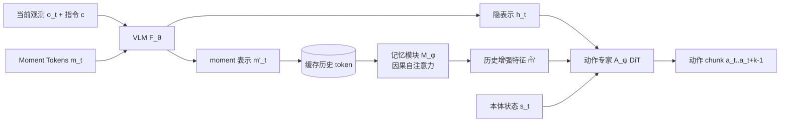

# HAMLET: Switch Your Vision-Language-Action Model into a History-Aware Policy

**会议**: ICLR 2026  
**OpenReview**: [https://openreview.net/forum?id=KcJ9U0x6kO](https://openreview.net/forum?id=KcJ9U0x6kO)  
**代码**: [https://myungkyukoo.github.io/hamlet/](https://myungkyukoo.github.io/hamlet/)  
**领域**: 机器人 / 具身智能 (VLA, 历史感知策略)  
**关键词**: Vision-Language-Action, 历史感知, moment token, 时间对比学习, 记忆模块, 长时序操作  

## 一句话总结
HAMLET 通过给预训练 VLA 追加少量可学习的 moment token（用时间对比学习初始化）和一个轻量记忆模块，让"只看当前帧"的 VLA 以即插即用、近乎零开销的方式获得历史感知能力，在真实长时序任务上把成功率从 29.2% 拉到 76.4%。

## 研究背景与动机
- **领域现状**：当前主流 VLA（OpenVLA、π0、GR00T、CogACT 等）大多采用"单帧假设"——每一步动作只依赖当前观测，借助大规模 VLM 先验做机器人控制。
- **现有痛点**：机器人操作任务本质上是**历史依赖（非马尔可夫）**的。例如"把方块放在桌上"，是该抬起还是放下取决于之前是否已抓取；物体被遮挡时单帧根本无法判断下一步。单帧 VLA 在这类长时序任务上频繁混乱。
- **核心矛盾**：最直接的补救——把过去若干帧拼进 VLA 输入（multi-frame）——代价极高。论文实测仅追加 4 帧就让前向慢约 35%、峰值显存涨约 3.6×，且会因学到虚假时序相关（causal confusion）反而**掉点**（RoboCasa 100-demo 掉 3.3%，LIBERO 掉 8.8%）。
- **本文目标**：在**不重新大规模预训练**的前提下，给预训练 VLA 注入历史感知，且开销要小、要能跨 backbone 即插即用。
- **核心 idea**：**用"压缩"代替"堆帧"**——每个时刻不存原始观测，而是存一组紧凑的 moment token；再用一个轻量记忆模块跨时刻**选择性聚合**这些 token，产出历史增强特征喂给动作专家。

## 方法详解

### 整体框架
HAMLET 在标准 VLA 流水线（VLM backbone $F_\theta$ 编码观测 + 指令得到隐表示 $h_t$，再由动作专家 $A_\psi$ 预测动作 chunk）之上挂两个组件：(i) **moment token**——每个时刻附加到 VLM 输入、把该时刻信息压成紧凑表示；(ii) **记忆模块**——把历史各时刻的 moment token 跨时间聚合成历史增强特征 $\tilde{m}'$，再与 $h_t$ 拼接送入动作专家。整套以标准动作预测损失端到端训练，但仍只输入单帧，历史信息全靠"外挂记忆"承载。

### 关键设计

**1. Moment token：把每个时刻压成紧凑摘要而非堆原始帧。** 直接保留每个时刻的原始观测 $o_t$ 既贵又含大量冗余静态背景，对决策无益。HAMLET 在每个时刻 $t$ 给 VLM 输入序列追加一组可学习 token $m_t \in \mathbb{R}^{n_m \times d}$，与观测、指令一起送入编码器：$[h_t; m'_t] = F_\theta([o_t, c; m_t])$。借助 VLM 的因果注意力，moment token 会主动 attend 当前视觉观测和指令，从而把整个时刻"摘要"成 $m'_t$，作为后续被存储和聚合的压缩单元。默认每时刻只用 4 个 token，所以历史的代价从"多张图"降到"几个向量"。

**2. 时间对比学习初始化：让 token 抓住随时间变化的判别性线索。** 若 moment token 随机初始化，容易学到对所有时刻无差别的平庸表示。HAMLET 借鉴 time-contrastive network，先冻结 VLM 单独预热 token：对每个时刻取当前观测为 anchor，用同一观测的图像增强视图（光度/模糊/噪声/遮挡扰动）作正样本 $z_t^+$，用同一轨迹内**不同时刻** $t'\neq t$ 作硬负样本 $z_t^-$，优化
$$\mathcal{L}_{\mathrm{TCL}} = -\sum_{t} \log \frac{\exp(\mathrm{sim}(z_t, z_t^+)/\tau)}{\exp(\mathrm{sim}(z_t, z_t^+)/\tau) + \exp(\mathrm{sim}(z_t, z_t^-)/\tau)}.$$
这逼着 token 在同时刻内对齐、跨时刻可区分，于是它学会强调随时间变化的任务相关区域（夹爪、目标物），压制静态背景——可视化中注意力确实集中在 gripper 和关键物体上。冻结 VLM 是为了不让对比损失破坏其预训练表示。

**3. 记忆模块：用浅层 Transformer 选择性聚合而非平均对待历史。** 论文观察到"简单拼接所有 moment token"几乎无收益——因为并非每个时刻都同等重要，等权处理反而引入冗余、淹没关键线索。HAMLET 把最近 $T$ 个时刻的 moment token 堆成历史矩阵 $M' = [m'_{t-k(T-1)}; \dots; m'_{t-k}; m'_t] \in \mathbb{R}^{L \times d}$（$k$ 为动作 chunk 长度，$L = T \cdot n_m$），再用带因果掩码 $C$ 的标准自注意力聚合：
$$H = \mathrm{softmax}\!\left(\frac{QK^\top}{\sqrt{d}} + C\right)V.$$
输出投影后取最后 $n_m$ 行作为历史增强表示 $\tilde{m}'_t$。这让记忆模块能针对当前语境**挑出最相关的历史时刻**——例如 Cover-and-Stack 任务里，方块被杯子盖住后要决定先够哪个杯，记忆模块会把高注意力分给"蓝方块此前可见"的那一过去时刻。

**4. 与动作预测的集成：纯外挂、单帧输入不变。** 历史增强特征与原 VLM 表示拼接后送入动作专家：$[a_t, \dots, a_{t+k-1}] = A_\psi([h_t; \tilde{m}'], s_t)$。整个流水线沿用各 backbone 原本的微调配置（学习率、优化器、是否冻结 VLM），不做启发式调参。由于 VLM 端始终只看单帧、历史走外部记忆通道，HAMLET 在拿到历史信息的同时保住了单帧 VLA 的泛化性，也因此能 backbone-agnostic 地插到 GR00T、CogACT 等不同模型上。

## 实验关键数据

### 主实验
真实世界三项手工长时序任务（每任务 24 次试验，GR00T N1.5 为 backbone）：

| 方法 | 历史? | Pick-and-Place Twice (Success) | Cover-and-Stack (Success) | Swap Cubes (Success) | Avg. |
|------|------|------|------|------|------|
| π0 | ✗ | 25.0 | 58.3 | 12.5 | 31.9 |
| GR00T N1 | ✗ | 25.0 | 33.3 | 33.3 | 30.6 |
| GR00T N1.5 | ✗ | 12.5 | 37.5 | 37.5 | 29.2 |
| + Multi-frame | ✓ | 45.8 | 33.3 | 58.3 | 45.8 |
| **+ HAMLET** | ✓ | **66.7** | **79.2** | **83.3** | **76.4** |

通用仿真基准（GR00T N1.5）：

| 方法 | RoboCasa 100-demo | LIBERO Avg. |
|------|------|------|
| GR00T N1.5 | 64.1 | 95.6 |
| + Multi-frame | 60.8 (掉点) | 86.8 (掉点) |
| **+ HAMLET** | **66.4** | **97.6** |

跨 backbone（CogACT, SimplerEnv-Bridge）：HAMLET 把平均 full success 从 52.1% 提到 **63.5%**，而 multi-frame 仅 47.9%。

### 消融实验

组件消融（RoboCasa 100-demo，逐项启用）：

| Moment Token | TCL | Memory Module | Avg. |
|------|------|------|------|
| ✗ | ✗ | ✗ | 62.6 |
| ✓ | ✗ | ✗ | 63.1 |
| ✓ | ✓ | ✗ | 63.4 |
| ✓ | ✗ | ✓ | 64.8 |
| ✓ | ✓ | ✓ | **65.4** |

记忆架构对比：No Memory 62.6 / Moment Concat. 62.7 / RNN 64.5 / LSTM 65.0 / GRU 64.3 / **Transformer 65.4**。Moment token 长度 4→8 升到 66.4，再大（32/64）反而掉到 62.x。

效率（A100，per-timestep）：

| 方法 | History | Latency | Peak Mem |
|------|------|------|------|
| GR00T N1.5 | 1 | 80.5ms (1.00×) | 289MB (1.00×) |
| + Multi-frame | 8 | 193.0ms (2.40×) | 2023MB (7.00×) |
| **+ HAMLET** | 8 | **85.8ms (1.07×)** | **578MB (2.00×)** |

### 关键发现
- **记忆模块是最大功臣**：去掉它掉点最多；而"简单拼接 moment token"几乎无增益，说明"选择性聚合"才是关键。
- **multi-frame 会掉点**：堆原始帧因 causal confusion + 对动态观测泛化差，在通用基准上反而劣于单帧 baseline，HAMLET 因保留单帧输入而避开此坑。
- **记忆可跨 embodiment 迁移**：在 LIBERO 上预训练的记忆模块迁到 RoboCasa 仍带来增益。

## 亮点与洞察
- **"压缩而非堆帧"的视角转换**：把历史感知从"输入更多像素"重构为"存几个语义 token"，几乎零开销地绕过 multi-frame 的算力/显存墙。
- **即插即用、backbone-agnostic**：在 GR00T N1.5 与 CogACT（两种不同动作头）上都一致涨点，无需大规模重训，工程上极易落地。
- **时间对比学习用得巧**：把自监督表示学习直接用于初始化历史 token，让 token 天然偏向"会动的、任务相关的"区域，可视化证据清晰。

## 局限与展望
- **真实任务为手工设计的三项 tabletop 任务**，规模有限，更复杂、更开放的长时序场景泛化性仍待验证。
- 历史长度、moment token 数等超参存在明显甜点（token 32/64 反而掉点），更长时序下记忆模块的容量/选择能力是否够用未充分探讨。
- 与"从头训练的类人记忆系统"（并发工作 Shi et al. 2025）相比缺少直接对照，外挂记忆 vs 内生记忆的上限差异尚不清楚。
- 通用基准（LIBERO）已近饱和（95.6%→97.6%），提升空间小，历史感知的收益主要体现在专门设计的历史依赖任务上。

## 相关工作与启发
- **VLA 谱系**：从离散动作 token（RT-2, OpenVLA）到 diffusion/flow-matching 动作头（π0, GR00T, CogACT），HAMLET 聚焦后者并为其补上"历史"短板。
- **记忆架构**：呼应 RL 中的循环策略/Transformer-XL、NLP 中的 memory network 与检索增强，但首次系统地为**大规模预训练 VLA**设计轻量记忆。
- **启发**：对任何"单帧/单步"基础模型，"加少量可学习 token + 轻量聚合器"或许是注入时序/上下文能力的通用低成本范式，值得迁移到视频理解、流式决策等场景。

## 评分
- **新颖性**: ⭐⭐⭐⭐ — moment token + 时间对比初始化 + 选择性记忆模块的组合在 VLA 历史感知上是清晰且未被充分探索的切入点，视角转换有价值。
- **实验充分度**: ⭐⭐⭐⭐ — 覆盖真实世界 + 三大仿真基准 + 两种 backbone，组件/架构/长度/效率消融完整，仅真实任务规模偏小。
- **写作质量**: ⭐⭐⭐⭐ — 动机与方法叙述清晰，图表（注意力可视化、效率表）有说服力，个别句子有笔误。
- **价值**: ⭐⭐⭐⭐ — 即插即用、近零开销、跨 backbone 一致涨点，对 VLA 社区有很强的实用落地价值。

<!-- RELATED:START -->

## 相关论文

- [\[ICLR 2026\] WMPO: World Model-based Policy Optimization for Vision-Language-Action Models](wmpo_world_model-based_policy_optimization_for_vision-language-action_models.md)
- [\[ICLR 2026\] HybridVLA: Collaborative Diffusion and Autoregression in a Unified Vision-Language-Action Model](hybridvla_collaborative_diffusion_and_autoregression_in_a_unified_vision-languag.md)
- [\[ICLR 2026\] UniVLA: Unified Vision-Language-Action Model](unified_vision-language-action_model.md)
- [\[ICLR 2026\] Action-aware Dynamic Pruning for Efficient Vision-Language-Action Manipulation](action-aware_dynamic_pruning_for_efficient_vision-language-action_manipulation.md)
- [\[ICLR 2026\] Geometry-Aware Policy Imitation](geometry-aware_policy_imitation.md)

<!-- RELATED:END -->
