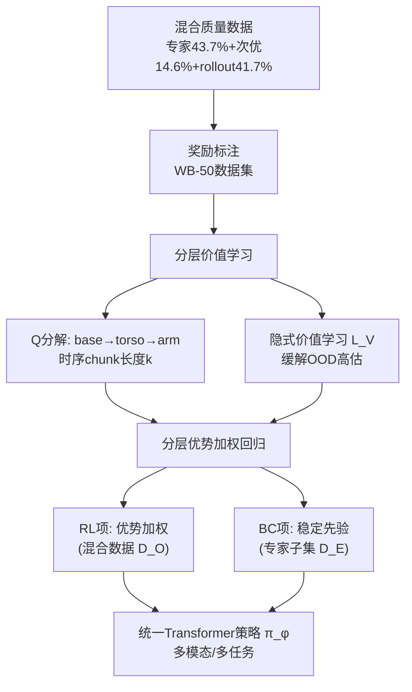

# Hierarchical Value-Decomposed Offline Reinforcement Learning for Whole-Body Control

**会议**: ICLR 2026  
**OpenReview**: [https://openreview.net/forum?id=eSkDNIGbcd](https://openreview.net/forum?id=eSkDNIGbcd)  
**代码**: [https://github.com/LAMDA-RL/HVD](https://github.com/LAMDA-RL/HVD)  
**领域**: 机器人 / 具身智能、离线强化学习  
**关键词**: 全身控制、高自由度、离线 RL、价值分解、模仿学习、Galaxea R1、不完美数据  

## 一句话总结
针对高自由度全身机器人专家数据稀缺的问题，HVD 把离线 RL 的价值函数沿机器人运动学结构（base/torso/arm）做分层分解，从大量不完美数据中做价值筛选，配合时序 chunking 实现细粒度信用分配，在真实 21-DoF 人形机器人五项任务上显著超过模仿学习基线。

## 研究背景与动机
**领域现状**：模仿学习（BC、Diffusion Policy、VLA 等）已成为机器人策略学习的主流范式，靠专家示范直接习得复杂技能。但要扩展到**高自由度全身机器人**（whole-body control，多关节协调运动），专家数据采集的成本会急剧上升。

**现有痛点**：①**专家数据稀缺**——通过遥操作采集高质量全身示范在认知和体力上都极其昂贵，大规模专家监督不现实；②与之相对，遥操作和策略 rollout 会自然产生**大量次优数据**（部分成功、纠错、失败），这些数据可扩展但鱼龙混杂；③标准离线 RL 难以扩展到带多模态观测的结构化全身系统。

**核心矛盾**：高 DoF 控制带来两个交织的难题——如何从混杂的不完美轨迹里**提取有用信号**（次优数据里好坏行为混在一起），以及如何在高维长程设定下**做好信用分配**。论文还从理论上指出，BC 的专家样本复杂度与策略类的对数覆盖数 $\log N_{\text{pol}}(\Pi,\varepsilon)$ 成正比、随动作空间膨胀而爆炸，并用 21-DoF 全身 vs 7-DoF 单臂的实验验证：相同 50 条专家示范下全身策略成功率普遍远低于单臂策略。

**本文目标**：让高 DoF 策略学习不再依赖完美示范，而是从**充裕的不完美数据**里通过结构化学习涌现出有效策略。

**核心 idea**：**离线 RL 做数据筛选 + 价值分层分解做信用分配**——离线 RL 框架按价值优先高质量行为、抑制有害行为；分层价值分解则把学习沿机器人运动学结构组织，降低高 DoF 系统的学习复杂度。

## 方法详解

### 整体框架
HVD（Hierarchical Value-Decomposed Offline RL）建立在 IDQL（隐式扩散 Q 学习）之上，把价值函数沿机器人物理结构做**空间分解**，整个管线分三个阶段：(1) 数据构建与奖励标注（产出 WB-50 数据集）；(2) 分层价值学习（运动学分解的 Q 函数 + 时序 chunking）；(3) 通过分层优势加权回归（AWR）做策略提取。骨干网络是 Transformer，可处理 RGB 图像、点云、语言指令、本体感知等多模态输入，支持多任务学习。

### 关键设计
**1. 沿运动学结构的 Q 值分层分解：把信用分配落到"哪个肢体该负责"** 与传统对策略做分解（task-space control）不同，HVD 直接在 **Q 值函数**上引入层级。全身动作空间按物理结构拆成三层 $A = A_{\text{base}} \times A_{\text{torso}} \times A_{\text{arm}}$（下肢移动、躯干姿态、手臂操作），并对长度为 $k$ 的时序动作 chunk $a_{h:h+k}$ 定义**逐级累积**的 Q 值：$Q^{h:h+k}_{\text{base}} = Q_\theta(s_h, a^{h:h+k}_{\text{base}})$，$Q^{h:h+k}_{\text{torso}} = Q_\theta(s_h, a^{h:h+k}_{\text{base}}, a^{h:h+k}_{\text{torso}})$，$Q^{h:h+k}_{\text{arm}}$ 再叠加手臂动作。每个 Q 值对应机器人的一个部件，形成层级化的价值结构，让信用分配能精确到关节级——例如在 Basket Carry 任务"起身抱篮"那一帧，HVD 会给 arm 和 torso 分配更高权重，而共享 Q 版本对所有部件给出几乎一致的高权重、无法区分子部件的贡献。

**2. 多级 TD 学习 + 时序 chunking：让每个部分价值对齐自己的回报** 训练时用多级 TD 损失把每个部分 Q 值与其估计回报对齐：$L^h_i(\theta) = \mathbb{E}[(r(s_h, a_{h:h+k}) + V_\psi(s_{h+k+1}) - Q^{h:h+k}_i)^2]$，其中 $i \in \{\text{base, torso, arm}\}$，chunk 奖励 $r(s_h, a_{h:h+k}) = \sum_{j=h}^{h+k} r(s_j, a_j)$ 是对子片段内逐步奖励的聚合。总 Q 损失把三个层级求和 $L_Q(\theta) = \frac{1}{H}\sum_h (L^h_{\text{base}} + L^h_{\text{torso}} + L^h_{\text{arm}})$。时序 chunking 把 $k$ 步动作打包估计，缓解了稀疏奖励下长程信用分配的困难，让高维全身控制更样本高效、动作更协调。

**3. 隐式价值学习抑制 OOD 高估：给各层 Q 头套上软下界** 离线 RL 的老问题是策略会查询数据支撑之外的动作（OOD），导致价值高估。HVD 借鉴 in-sample 学习范式，对每个层级的 Q 头施加隐式价值损失 $L_V(\psi) = \frac{1}{H}\sum_h \mathbb{E}\big[\sum_i \alpha\exp(Q^{h:h+k}_i - V_\psi(s_h)) - \alpha(Q^{h:h+k}_i - V_\psi(s_h))\big]$，其中 $\alpha>0$ 控制约束强度。优化该损失等价于对所有层级 Q 估计建立一个软下界，保证肢体级价值预测与全身的全局目标保持一致，避免某个 Q 头被 OOD 动作带偏。

**4. 分层优势加权回归 + BC 正则：从不完美数据里学好策略** 策略网络 $\pi_\phi$ 用 AWR 的分层变体训练，按估计优势给动作 chunk 加重要性权重，而非均匀模仿所有数据。逐层优势权重为 $\omega^{h:h+k}_i = \alpha\frac{\exp(\alpha(Q^{h:h+k}_i - V_\psi(s_h))) - 1}{|Q^{h:h+k}_i - V_\psi(s_h)|}$，让高优势动作获得指数级增大的权重，同时在决策边界附近仍保留梯度流。最终损失组合两项：在混合数据集 $D_O$ 上按优势加权的 RL 项 $L^{\text{RL}}_\pi$、在小规模专家集 $D_E$ 上的 BC 项 $L^{\text{BC}}_\pi$ 作为稳定先验，$L_\pi(\phi) = L^{\text{RL}}_\pi(\phi) + \beta L^{\text{BC}}_\pi(\phi)$，$\beta$ 权衡 RL 探索与专家模仿。算法分两阶段：先做分层价值学习更新 $V_\psi$、$Q_\theta$，再做策略提取训练 $\pi_\phi$。

**5. WB-50：保留真实瑕疵的奖励标注数据集** 为支持真实评测与训练，论文构建了 WB-50——一个 50 小时的全身机器人数据集，刻意混入三类来源以反映真实分布：专家示范（43.7%）、不完美遥操作（14.6%）、策略 rollout（41.7%），后两者占多数，刻意还原"完美监督稀缺"的现实。每条轨迹在子任务级标注、并打上离散奖励信号，保留了部分成功、纠错、失败等天然瑕疵。

## 实验关键数据
实验在真实世界 **Galaxea R1**（21-DoF 轮式人形机器人）上进行，遥操作用 JoyLo 接口，设计了 5 个办公室整理任务（Pen Insert、Cup Upright、Wipe Board、Basket Carry、Trash Dispose），时长从 40 秒单臂到 120+ 秒多步双臂协调，每个策略每任务评测 50 次独立 rollout。基线为 π0（VLA）、WB-VIMA（3D 输入）、Diffusion Policy（DP）——基线在专家子集上训练，HVD 在全量混合数据上训练。

### 主实验表格（任务级成功率，IL/HVD）

| 方法 | Pen Insert | Cup Upright | Wipe Board | Basket Carry | Trash Dispose | Avg SR (IL/HVD) |
|------|-----------|-------------|------------|--------------|---------------|-----------------|
| π0 | 0.64/**0.86** | 0.82/**0.90** | 0.18/**0.32** | 0.26/**0.44** | 0.28/**0.36** | 0.44/**0.58** |
| WB-VIMA | 0.52/**0.78** | 0.58/**0.82** | 0.12/**0.26** | 0.10/0.10 | 0.20/**0.32** | 0.30/**0.46** |
| DP | 0.54/**0.64** | 0.66/**0.72** | 0.00/0.00 | 0.00/**0.08** | 0.08/**0.16** | 0.26/**0.32** |

HVD 在三种基线架构上一致提升平均成功率，在 Wipe Board、Basket Carry 这类对初始状态鲁棒性和部分可观测性要求高的难任务上提升尤其明显。

### 消融实验表格（去掉分层后成功率变化 Avg Diff）

| 方法 | Pen Insert | Cup Upright | Wipe Board | Basket Carry | Trash Dispose | Avg Diff |
|------|-----------|-------------|------------|--------------|---------------|----------|
| DP | -0.02 | 0.00 | 0.00 | -0.08 | -0.06 | -0.03 |
| WB-VIMA | -0.02 | 0.00 | -0.12 | -0.08 | -0.12 | -0.07 |
| π0 | +0.04 | -0.02 | -0.14 | -0.10 | -0.04 | -0.05 |

去掉分层分解（共享 Q 值，HVD w/o hierarchy）在多数任务上一致掉点，证明增益不仅来自离线 RL 训练范式，更来自分层价值结构本身。

### 关键发现
- **增益来自结构而非仅范式**：相同混合数据、相同超参下，移除分层使各基线平均掉 0.03~0.07，验证了分层价值分解的独立贡献。
- **更准的信用分配**：Basket Carry 关键帧的优势权重可视化显示，HVD 能针对"起身抱篮"动态地给 arm/torso 加权，而共享 Q 版本对所有部件给出均匀高权重，无法区分子部件。
- **缓解多任务负迁移**：单策略训全部 5 任务时，标准 IL 出现负迁移（π0 平均 0.44→0.36），而 HVD 抑制了干扰、在多个任务上甚至超过单任务专家策略，增益主要来自更鲁棒的躯干控制和更可泛化的抓取行为。
- **逐阶段更可靠**：HVD 在几乎所有子任务上都取得更高的归一化阶段分数，说明改善的不只是最终成功率，而是整条执行轨迹的可靠性。

## 亮点与洞察
- **把"价值分解"从多智能体借到单体高 DoF 控制**：QMIX 式的价值分解原本用于多智能体信用分配，HVD 创造性地把它映射到单个机器人的运动学层级（base/torso/arm），是个漂亮的视角迁移。
- **在 Q 值而非策略上引入层级**：传统全身控制做策略/任务空间分解，HVD 保持统一策略网络、只在价值侧分层，既得到部件级细粒度评估、又不牺牲端到端策略的协调性。
- **数据观的转变**：核心叙事"有效策略可以从充裕的不完美数据涌现，而非依赖完美示范"，对正面临数据采集瓶颈的具身智能很有现实意义。
- **真机 + 真数据集**：在真实 21-DoF 人形机器人上跑通，并开源 50 小时保留天然瑕疵的 WB-50，比纯仿真结论更有说服力。

## 局限与展望
- **绝对成功率仍偏低**：Wipe Board、Basket Carry、Trash Dispose 这些难任务即便用 HVD 也只有 0.08~0.44，距离可部署还有距离，说明高 DoF 长程任务远未解决。
- **分层粒度是固定先验**：base/torso/arm 三层是按人形机器人物理结构人工设定的，对不同形态机器人是否需要重新设计、能否自动学出层级，论文未讨论。
- **依赖奖励标注**：WB-50 的离散奖励是子任务级人工/规则标注的，标注质量与可扩展性会直接影响价值筛选效果，自动奖励标注是潜在方向。
- **评测规模有限**：5 个任务、单一机器人平台，跨形态/跨场景的泛化性有待验证。

## 相关工作与启发
- **离线 RL 基础**：建立在 IQL / IDQL（隐式扩散 Q 学习）之上，用 in-sample 学习和优势加权回归（AWR）规避 OOD 高估，是把成熟离线 RL 工具迁移到机器人控制的范例。
- **价值分解**：思想上呼应多智能体 RL 的 value decomposition（如 VDN/QMIX），但应用到单体机器人的空间结构。
- **全身/VLA 策略**：基线涵盖 π0（VLA）、WB-VIMA（3D 全身模仿）、Diffusion Policy，HVD 把它们作为可插拔骨干说明方法的通用性。
- **启发**：对其它高维结构化控制问题（多指灵巧手、多足机器人），"按物理结构分解价值 + 时序 chunking + 从不完美数据筛选"是一条值得复用的范式。

## 评分
- **新颖性**: ⭐⭐⭐⭐ 把多智能体的价值分解思想迁移到单体高 DoF 全身控制、并落在 Q 值而非策略上，配合时序 chunking 做信用分配，组合新颖且动机清晰。
- **实验充分度**: ⭐⭐⭐⭐ 真机 21-DoF 平台、5 任务、3 种基线、每任务 50 次 rollout，含分层消融、信用分配可视化、多任务设定，较为扎实；扣分在任务数量有限、单一机器人平台。
- **写作质量**: ⭐⭐⭐⭐ 理论（BC 样本复杂度）+ 实证动机清晰，方法公式完整、框架图直观；部分实现细节放在附录。
- **价值**: ⭐⭐⭐⭐ 直面具身智能数据瓶颈，开源 WB-50 数据集与代码，"从不完美数据学全身控制"对社区有实用与示范价值。

<!-- RELATED:START -->

## 相关论文

- [\[ICLR 2026\] HWC-Loco: A Hierarchical Whole-Body Control Approach to Robust Humanoid Locomotion](hwc-loco_a_hierarchical_whole-body_control_approach_to_robust_humanoid_locomotio.md)
- [\[ICLR 2026\] WholeBodyVLA: Towards Unified Latent VLA for Whole-Body Loco-Manipulation Control](wholebodyvla_towards_unified_latent_vla_for_whole-body_loco-manipulation_control.md)
- [\[ICLR 2026\] Cross-Embodiment Offline Reinforcement Learning for Heterogeneous Robot Datasets](cross-embodiment_offline_reinforcement_learning_for_heterogeneous_robot_datasets.md)
- [\[CVPR 2026\] End-to-End Language-Action Model for Humanoid Whole Body Control](../../CVPR2026/robotics/end-to-end_language-action_model_for_humanoid_whole_body_control.md)
- [\[ICLR 2026\] Scalable Exploration for High-Dimensional Continuous Control via Value-Guided Flow](scalable_exploration_for_high-dimensional_continuous_control_via_value-guided_fl.md)

<!-- RELATED:END -->
