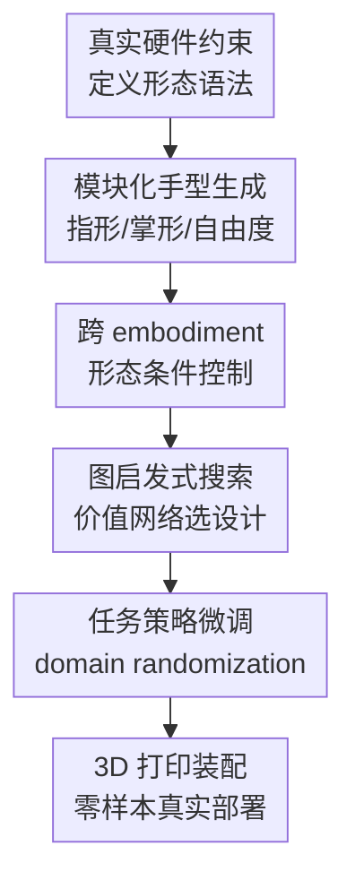

# House Of Dextra : Cross-Embodied Co-Design for Dexterous Hands

**会议**: ICLR2026  
**OpenReview**: [https://openreview.net/forum?id=k8ovuXEQQu](https://openreview.net/forum?id=k8ovuXEQQu)  
**代码**: 有，作者称完整框架与硬件设计开源，具体入口见论文项目页  
**领域**: 机器人 / 灵巧手 / 具身智能  
**关键词**: 灵巧手设计、形态控制协同优化、跨 embodiment 控制、sim-to-real、手内旋转  

## 一句话总结
House of Dextra 提出一个面向灵巧手的跨 embodiment 协同设计框架，把可制造的模块化手型语法、形态条件控制策略和图启发式搜索连起来，在仿真中筛选并微调手型，最终把 3 指、4 指、5 指等多种设计零样本部署到真实硬件上完成盲手内旋转。

## 研究背景与动机
**领域现状**：灵巧操作通常被拆成两条线推进：一条线改控制，让固定硬件上的策略学会抓取、旋转、翻转等接触丰富的动作；另一条线改硬件，设计更多自由度、更像人手或者更适合某类任务的机械结构。过去很多强化学习工作默认硬件已经给定，例如 LEAP、Allegro 或其他 anthropomorphic hand，然后把主要难点放在策略训练和 sim-to-real 上。

**现有痛点**：这种“先定手，再训控制”的流程会把硬件形态当成外生条件。问题是，灵巧操作的上限往往直接被形态卡住：手指数量、手指长度、掌宽、指尖形状、每根手指自由度都会改变接触模式和可实现的 gait。另一方面，传统 co-design 方法虽然试图同时搜索形态和控制，但常停留在仿真里，原因是搜索空间过大、每个设计单独训练策略太慢，而且许多自动生成的形态并不对应真实可打印、可装配、可驱动的硬件。

**核心矛盾**：本文抓住的矛盾是，灵巧手 co-design 既需要足够大的形态空间，才能发现非人形、任务特化的结构；又必须让每个候选设计能被快速评估并真实制造。只扩大设计空间会导致评估成本爆炸，只做可制造模板又容易把搜索限制在少数手工设计上。

**本文目标**：作者希望建立一条端到端 pipeline：先在真实硬件约束下生成大量候选灵巧手，再用一个能够跨不同 embodiment 工作的控制策略快速评估候选，随后用搜索算法找到适合具体任务的形态，最后把选出的设计直接 3D 打印、装配并部署到真实世界。

**切入角度**：论文的关键观察是，候选手型虽然很多，但它们不是完全无关的。不同手型可以共享一部分控制经验，只要策略知道当前形态有哪些手指、关节和几何参数，就可以在一个 family 内学习跨 embodiment 的操作规律。这样，co-design 的外层搜索不必为每个新手型从零训练完整 PPO，而可以用 morphology-conditioned policy 作为快速评估器。

**核心 idea**：用“可制造语法生成手型 + 形态条件控制策略评估 + 图价值网络引导搜索”的方式，把灵巧手硬件设计和控制策略训练合成一个可落地的闭环。

## 方法详解

### 整体框架
House of Dextra 把问题写成双层优化：外层选择手的形态 $G$，内层为该形态学习策略 $\pi_G$，目标是在任务奖励 $J(\pi, G)$ 上同时找到好的硬件和好的控制。直接解这个问题太贵，所以作者先在大量随机手型上训练一个跨 embodiment 基础策略，再让搜索算法用它快速评估候选形态，最后对最优设计做 fine-tuning 和真实部署。

具体来说，框架先用模块化语法生成具备真实碰撞体、关节限制和制造约束的候选手；然后用形态编码条件化控制策略，在不同手指数量、关节配置和几何尺度之间共享控制；接着用 GNN 设计编码器和设计价值网络预测候选形态表现，指导图启发式搜索；最后将排名靠前的设计转成 3D 打印部件和 Dynamixel 舵机装配方案，在没有视觉和触觉、只有本体感知的条件下部署盲策略。

### 关键设计
**1. 可制造形态语法：让搜索空间里的每只手都能真正造出来**

很多 co-design 方法的问题不是不会生成形态，而是生成的形态和真实硬件之间隔着一层很厚的 reality gap。本文把形态空间直接建立在模块化硬件上：每只手表示为一个固定拓扑的属性图 $G=(V,E,X_v)$，包含一个 palm node 和最多五个 finger-slot node，边是从掌心到手指槽位的星形连接。节点属性记录手指是否存在、servo 数量、segment-scale grammar code、指尖类型、active / terminal 状态和手指索引等。

这个表示看起来比任意图生成更受限，但它有一个很重要的好处：每个图都能映射到可打印部件。语法允许 3 到 5 根手指、每根手指 2 或 3 个关节配置、不同长度堆叠、不同指尖、不同掌形和手指位置；同时预先计算碰撞几何、关节限制和 actuator 规格。这样，仿真中的形态不是抽象连杆，而是和后续 3D 打印、Dynamixel 装配、PID 调试对齐的真实设计。

**2. 形态条件控制：用一个策略跨大量手型做快速评估**

如果每生成一个候选手就单独训练 PPO，co-design 基本跑不动。论文因此训练 morphology-conditioned cross-embodiment policy。对于固定形态 $G$，任务是一个 MDP $M_G=(S,A,T,R,\gamma)$，状态包含机器人关节状态 $q$、物体姿态 $p_o$ 和形态编码 $m(G)$；策略输出所有可能 actuator 的位置命令，再用动作掩码 $M(G)$ 屏蔽当前形态不存在的 actuator：$a_t=\pi_\theta(s_t)\odot M(G)$。

这个设计的重点不是“多加一个 one-hot”这么简单，而是把不同自由度的手放进同一个控制接口里。策略在 2000 到 8000 个同 family 的手型上预训练，学到的是“给定这只手有哪些可用关节，该怎么让接触序列产生旋转/抓取/翻转”的共享规律。这样搜索阶段可以用预训练策略直接评估大量候选，而不必等待每个设计从零学会基本动作。

**3. 图启发式搜索：用已评估设计反过来教搜索往哪里走**

形态空间仍然很大，随机搜索会浪费大量仿真预算。本文用 GNN 编码形态图，得到 $y(G)=f_\phi(G)$，再训练设计价值网络 $V_{design}(y(G))$ 预测某个形态在任务上的表现。每轮搜索生成 $K$ 个候选形态，用跨 embodiment 策略在并行仿真中评估，得到真实任务分数后更新 lookup table $T:D\rightarrow R$ 和价值网络，损失为 $L_{design}=\mathbb{E}_{d\sim D_{evaluated}}[(V_{design}(y(G_d))-T(d))^2]$。

搜索的构造过程是逐根手指扩展：从随机 palm layout 和 finger base 开始，对尚未 terminal 的手指枚举合法参数，用 GNN 预测 successor design 的分数，并加入 Gumbel noise 保持探索。最高分 successor 被保留，直到所有手指都完成。lookup table 不只记录完整设计，也把 partial ancestor 的分数纳入 credit assignment；同时用对称布局里的手指置换、anthropomorphic 布局里的 thumb slot 等等价关系减少重复。随着 epsilon 从 0.4 退火到 0.05，搜索从探索逐渐转向利用。

**4. 面向真实部署的盲策略微调：把 co-design 从仿真闭环拉到硬件闭环**

论文最后一步不是只展示仿真 best design，而是把选出的形态直接制造出来。最优设计经过 actuator、contact、friction、object pose 等 domain randomization 微调；真实部署时，作者进一步移除物体状态输入，训练 blind policy，使观测只包含形态编码和舵机 encoder 的关节位置。本体感知闭环比带物体 pose 的仿真策略更难，但更接近论文实际硬件：没有相机，没有触觉，也不给物体类别和位置。

制造流程也和语法保持一致：设计图被转换为模块化硬件规格，掌部加安装接口，关节和连杆 3D 打印，Dynamixel actuator 按规格装配，再在真实硬件上调 PID。正因为生成空间从一开始就遵守可制造部件和物理约束，作者才能声称从设计、训练、打印、装配到部署一只新手能在 24 小时内完成。

### 一个完整示例
以手内旋转任务为例，系统首先在语法空间里采样大量候选手：有的 3 指径向对称，有的 5 指对称，有的接近人形，有的 4 指且带薄指尖。跨 embodiment policy 已经在同类形态上预训练，因此每个候选手不需要单独从零训练，就可以在 2048 个随机化仿真环境中评估它能否持续旋转多个随机物体。

第一轮搜索可能发现某些 anthropomorphic 设计能抓住物体，但旋转时容易卡在手指 gait 之间；某些薄指尖设计能翻动或抬起物体，但手内旋转时更容易造成物体位移。lookup table 把这些完整设计及其部分构造路径的分数记录下来，GNN 价值网络开始偏向生成更短掌宽、更合适手指长度、标准指尖和 3 指径向布局的候选。若某个 3 指设计在仿真中达到 1.85 rad/s，fine-tuning 后达到 3.3 rad/s，它就进入制造阶段。真实测试时，这只手只看自己的关节位置和形态编码，在粉色多边形、网球、魔方、绿色方块等未见物体上尝试连续转满 360 度。

### 损失函数 / 训练策略
控制策略采用 PPO 风格的 clipped objective，并把 morphology vector $m(G)$ 输入策略网络；不存在的 actuator 通过 action mask 屏蔽。论文强调每个 morphology family 分开训练，family 内覆盖数千个手型变体，让策略学习共享控制但不强迫差异过大的结构共用同一套细粒度动作模式。

设计价值网络用已评估形态的任务分数做监督回归，配合 L2 正则和 gradient clipping。搜索时每轮 40 个设计、共 50 轮；候选在 2048 个随机化仿真环境中并行评估。真实迁移前，策略用 object mass / size / pose、关节位置噪声、关节速度噪声、动作噪声、摩擦和 actuator 参数等 domain randomization 增强鲁棒性。部署版策略去掉 object-state input，变成只依赖 proprioception 的 blind controller。

## 实验关键数据

### 主实验
论文评估三个灵巧操作任务：手内连续旋转、桌面抓取和绕 $z$ 轴翻转。其中手内旋转既做仿真对比，也做真实硬件零样本部署。每轮搜索 40 个候选设计，跑 50 轮；每个 evaluation cycle 在 2048 个随机化仿真环境中测试候选。真实部署使用 17 个未见物体，覆盖不同摩擦、柔顺性、形状、质量和表面纹理。

| 方法 | 运行时间 | 连续角速度 | 说明 |
|------|----------|------------|------|
| House of Dextra | 6.48 h | 3.3 rad/s | 搜索后对最优设计 fine-tune |
| House of Dextra w/o fine tuning | 5.18 h | 1.85 rad/s | 仅用跨 embodiment 策略评估得到的设计 |
| House of Dextra w/ MPPI | 20.0 h | 0.62 rad/s | 同一框架中改用 MPPI 控制 |
| LEAP, single cube w/ vision | 2.0 h | 0.47 rad/s | LEAP 默认环境与单物体视觉策略 |
| RoboGrammar | 23.0 h | 0.26 rad/s | 图语法设计基线 |
| Monte Carlo | 15.2 h | 0.20 rad/s | 树搜索/随机 rollout 风格基线 |
| Blind LEAP Hand | 2.0 h | 0.0 rad/s | 在随机物体盲策略设定下失败 |

这个表的关键信息是，本文不是只比传统设计搜索快，而是在长期、稀疏奖励、接触丰富的旋转任务上把“可控性”也保住了。RoboGrammar 找到的最好设计只有 0.26 rad/s，Monte Carlo 的 time-to-fall 也只有 2.71 秒；本文不 fine-tune 的设计已经达到 1.85 rad/s，并且在三分钟评估窗口内没有掉落。

| 流水线组件 | 时间 |
|------------|------|
| 3D 打印 | 12.0 h |
| 设计算法 | 6.48 h |
| 装配 | 0.8 h |
| Sim-to-real 准备 | 2.0 h |

端到端时间表支撑了论文的另一个卖点：这不是一个只能在仿真里跑几天的设计器，而是一条能在一天内产出新硬件并部署策略的 workflow。这里的 3D 打印仍然是最长瓶颈，算法部分约 6.48 小时。

### 消融实验
| 配置 / 设计 | 关键指标 | 说明 |
|-------------|----------|------|
| Full model + fine tuning | 3.3 rad/s | 最优 3 指设计经过任务微调后的连续旋转速度 |
| w/o fine tuning | 1.85 rad/s | 仍明显高于所有外部基线，说明形态搜索本身贡献很大 |
| w/ MPPI | 0.62 rad/s | 简单规划控制难以维持长时域稳定接触，容易 jitter 或抛物体 |
| 单形态 PPO | 单个 5 指对称手约 0.56 rad/s | 附录报告跨 embodiment 策略在同形态无 fine-tuning 时提升约 65%，且评估 2000 个设计只需 5.18 h |
| 3 指最优真实手 | 17 个物体中仅 2 个失败 | 在真实盲旋转中显著优于 4 指、5 指和人形基线 |
| 4 指 / 人形真实手 | 17 个物体中仅约 3 个成功 | 容易卡在 finger gait 或造成物体位移，和仿真排名一致 |

真实部署表更有说服力：3 指最优手在多个物体上 360 度旋转用时很短，例如粉色多边形 9 秒、网球 13 秒、魔方 9 秒、绿色方块 9 秒、紫色球 5 秒、黄色方块 6 秒；5 指手在网球、绿色方块、紫色球、粉色盘、罐头等少数物体上能成功，但失败更多；4 指和 anthropomorphic hand 只在很少物体上成功。论文还提到 3 指手能让网球持续旋转超过 10 分钟，而其他设计更容易造成位移或无法从盲本体感知中推断物体状态。

### 关键发现
- 形态不是“锦上添花”的超参数，而是手内旋转成败的主因。作者在 LEAP hand 上对 12 类硬件/物理参数做 1200 次 PPO 训练采样，发现 finger body length scale 与旋转表现正相关最强，$r=0.748$；palm width scale 强负相关，$r=-0.729$，说明更宽的掌部会阻碍灵巧旋转。
- 不同任务偏好的形态并不一样。抓取任务更偏向 5 指、全自由度、薄指尖，能够在半秒内稳定抓起；手内旋转偏向 3 指和标准指尖，薄指尖反而不稳定；翻转任务需要一侧 wedge / thin fingertip 帮助抬起物体，另一侧标准指尖负责可控 reset。
- 跨 embodiment 策略解决的是 co-design 的评估瓶颈。附录中单个设计 PPO 平均需要 26 小时以上，实际只能评估 20 个设计；本文跨 embodiment 评估 2000 个设计只需 5.18 小时，运行时间加速约 400 倍，并且没有明显牺牲表现。
- 真实部署采用 blind policy 是一个很强的设定。没有视觉、没有触觉、没有物体状态，策略只能从 joint position 和 morphology encoding 间接感知接触状态；3 指手还能泛化到松果、软物体、异形物体，说明形态和 gait 的配合确实减小了控制难度。

## 亮点与洞察
- 最有价值的地方是把 co-design 做成了“能造出来”的系统。论文不是在连续参数里微调一个抽象 gripper，而是把语法、碰撞体、舵机、3D 打印部件和真实部署统一起来，这让仿真搜索结果有硬件闭环验证。
- Cross-embodiment learning 在这里不是为了泛化到所有机器人，而是作为设计搜索的加速器。这个定位很实用：策略不需要成为万能控制器，只要能在一个 family 内足够可靠地区分好手和坏手，就能大幅降低 co-design 成本。
- 论文对“人形手是否一定更好”给了一个很直接的反例。对于盲手内旋转，任务特化的 3 指径向对称手明显优于 anthropomorphic baseline，这提醒后续灵巧手研究不要把人手形态当作默认最优。
- 形态参数分析很有启发性。finger length、palm width、damping、dynamic friction 这几个参数的相关性说明，很多控制难题可能不是单靠策略容量能解决的，而应该回到机械结构和 actuator dynamics 一起看。
- 这个框架可以迁移到其他具身硬件设计任务，例如软夹爪、工具使用末端执行器、移动操作底盘。关键不是照搬 3 指手，而是复用“可制造语法 + 跨 embodiment 快速评估 + 真实部署闭环”的组织方式。

## 局限与展望
- 当前形态空间仍然是模块化预定义的。论文自己也承认，它主要重新计算 palm geometry，其他部件仍是预定义模块；因此它探索的是“可快速制造的组合空间”，不是完整自由形态设计空间。
- 每个设计偏向特定任务。3 指手很适合盲手内旋转，但不一定同时适合抓取、翻转、工具操作和多技能组合。未来需要 multi-task design averaging 或任务权重机制，否则 co-design 可能得到一批很强但很窄的专用手。
- 真实部署虽然很漂亮，但仍主要围绕旋转任务。抓取和翻转部分更多是在仿真和设计分析中展示，缺少同等规模的真实世界多任务验证。
- 感知设定一方面严格，另一方面也限制了任务范围。blind proprioception 能证明形态作用，但许多真实灵巧操作需要视觉、触觉或力觉反馈；把这些传感器也纳入 co-design，可能会改变最优形态。
- 搜索和策略都依赖仿真 reward。论文提到 MPPI 容易出现短视的抛掷动作，也提到一开始没有方向一致性奖励会导致来回运动，这说明 reward shaping 对设计结论仍有影响。
- 材料、柔顺性和 actuation scheme 还没有充分搜索。作者的参数分析发现材料属性影响较小，但这建立在当前硬件和仿真建模范围内；软体手、腱驱动或可变刚度结构可能会改变结论。

## 相关工作与启发
- **vs RoboGrammar**: RoboGrammar 用图语法和局部搜索做机器人形态设计，优势是结构化生成，但在本文的灵巧操作任务上控制和 sim-to-real 都不足。House of Dextra 保留程序化语法的可组合性，同时加入跨 embodiment RL 作为评估和控制核心，因此在连续手内旋转上显著更强。
- **vs LEAP Hand**: LEAP 是低成本 anthropomorphic hand，常被用作固定硬件平台。本文不是在 LEAP 上继续堆策略，而是问“是否存在更适合任务的手”。结果显示 blind LEAP 在随机物体旋转中失败，而任务特化 3 指手能在真实世界泛化到大多数未见物体。
- **vs 单形态 PPO / 固定硬件 RL**: 固定硬件 RL 能在给定平台上学到精细控制，但对设计选择无能为力，而且每个候选手都单独训练会让搜索成本不可接受。本文用形态条件策略把许多手型放进同一个训练分布里，使策略既能控制又能服务于外层搜索。
- **vs 传统 sim-to-real manipulation**: 常规 sim-to-real 主要随机化动力学参数和物体属性，硬件本体不变。House of Dextra 的难点在于硬件也在变，因此它必须从语法层就保证仿真形态与真实部件一致，这比单纯迁移一个策略更接近“设计-控制共同迁移”。

## 评分
- 新颖性: ⭐⭐⭐⭐⭐ 把可制造模块化灵巧手、跨 embodiment 控制和图启发式形态搜索组合成真实可部署 pipeline，问题设定和系统完整度都很强。
- 实验充分度: ⭐⭐⭐⭐ 有仿真多任务、主基线、真实零样本部署和参数分析，但真实世界主要集中在手内旋转，其他任务的硬件验证还不够展开。
- 写作质量: ⭐⭐⭐⭐ 论文主线清楚，图和系统流程有帮助；部分实验段落和附录文字略粗糙，个别表述需要读者自己对齐。
- 价值: ⭐⭐⭐⭐⭐ 对灵巧手研究很有启发，尤其是证明了任务特化非人形手可以在真实盲操作中超过 anthropomorphic baseline，也给 co-design 走向真实硬件提供了可复用模板。

<!-- RELATED:START -->

## 相关论文

- [\[ICLR 2026\] Accelerated co-design of robots through morphological pretraining](accelerated_co-design_of_robots_through_morphological_pretraining.md)
- [\[ICLR 2026\] DexMove: Learning Tactile-Guided Non-Prehensile Manipulation with Dexterous Hands](dexmove_learning_tactile-guided_non-prehensile_manipulation_with_dexterous_hands.md)
- [\[ICLR 2026\] DemoGrasp: Universal Dexterous Grasping from a Single Demonstration](demograsp_universal_dexterous_grasping_from_a_single_demonstration.md)
- [\[ICLR 2026\] MetaVLA: Unified Meta Co-Training for Efficient Embodied Adaptation](metavla_unified_meta_co-training_for_efficient_embodied_adaptation.md)
- [\[ICLR 2026\] RFS: Reinforcement Learning with Residual Flow Steering for Dexterous Manipulation](rfs_reinforcement_learning_with_residual_flow_steering_for_dexterous_manipulatio.md)

<!-- RELATED:END -->
