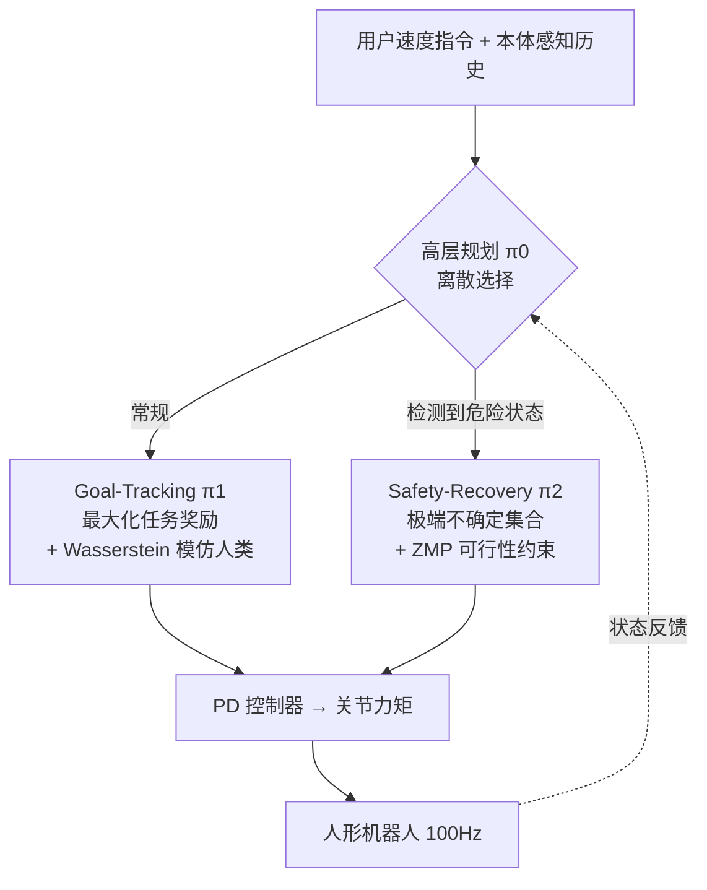

# HWC-Loco: A Hierarchical Whole-Body Control Approach to Robust Humanoid Locomotion

**会议**: ICLR 2026  
**OpenReview**: [https://openreview.net/forum?id=3UE3Aatcjy](https://openreview.net/forum?id=3UE3Aatcjy)  
**代码**: 待确认  
**领域**: 机器人 / 具身智能（Humanoid Locomotion）  
**关键词**: 人形机器人, 全身控制, 鲁棒强化学习, ZMP 约束, 分层策略, Sim2Real  

## 一句话总结
HWC-Loco 把人形机器人运动控制重写为「鲁棒优化」问题，用一个高层规划器在「目标跟踪」与「安全恢复」两个底层策略之间动态切换，从而在保证 ZMP 稳定性的同时不牺牲任务性能，在多地形、多扰动、多本体的真机与仿真上都拿到 SOTA。

## 研究背景与动机
- **领域现状**：人形机器人控制从早期 model-based 优化转向基于 RL 的端到端策略，后者只需本体感知 + 人类示范就能跨地形行走，可扩展性远好于需要精确动力学建模的传统方法。
- **现有痛点**：RL 策略几乎都在仿真里训练，部署到真机时存在巨大的 Sim2Real gap。常见缓解手段——加正则约束动作、或做 domain randomization——要么过度约束牺牲控制效率，要么是「无结构」的随机化，捕捉不到真实世界里真正致命的安全关键模式（外力冲击、硬件故障、传感器噪声）。
- **核心矛盾**：把问题写成标准 robust RL 的 max-min（最坏情况控制），策略会变得**过度保守**，为了保证最坏动力学下的安全而牺牲了跟踪指令的能力；但完全不管鲁棒性又会在真机摔倒。安全性与任务性能之间存在难以静态权衡的 trade-off。
- **本文目标**：学一个能在不同部署环境里**动态**求解「任务性能 ↔ 安全维稳」trade-off 的控制策略，而不是固定一个保守程度。
- **核心 idea**：**【鲁棒优化 + 分层切换】**把策略学习重写为「在误设动力学下保证最坏情况可行性约束」的鲁棒优化——只对任务奖励做最大化，把安全与人类行为风格交给从人类动作数据集学到的约束；再用高层规划器在「专注任务的 goal-tracking 策略」和「专注 ZMP 稳定的 safety-recovery 策略」间实时切换，让 trade-off 随场景自适应。

## 方法详解

### 整体框架
HWC-Loco 把鲁棒运动控制目标（式 4：在误设动力学集合 $\mathcal{P}^L_\alpha$ 上 max-min，同时受人类模仿约束 $D_f$ 和可行性约束 $\phi$ 限制）拆成两阶段、三策略训练：**阶段一**分别训练 goal-tracking 策略 $\pi_1$（在学习环境动力学下最大化任务奖励 + 模仿人类）和 safety-recovery 策略 $\pi_2$（在极端 case 不确定集合上保证 ZMP 可行性）；**阶段二**冻结两个底层策略，训练高层离散策略 $\pi_0$ 学会何时切换。部署时 VAE 估计器从历史观测推断特权信息，整套以 100 Hz 输出底层动作。

### 关键设计

**1. 鲁棒优化重写：把安全从「最坏情况控制」改成「最坏情况可行性」。** 标准 robust RL 用 $\max_\pi \min_{M} J(\pi,M)$ 在不确定集合上做最坏控制，代价是策略整体保守、跟不上指令。本文转而只让**可行性约束**承担最坏情况：把误设动力学建模为不确定集合 $\mathcal{P}^L_\alpha = \{\alpha P^L_T + (1-\alpha)\bar{P}_T\}$（$\alpha$ 控制 mismatch 尺度，可同时刻画传感器高斯噪声、地形投影变化等），目标变为 $\max_\pi \min_{\hat{P}_T \in \mathcal{P}^L_\alpha} \mathbb{E}[\sum \gamma^t r_T]$ s.t. $D_f(\rho^{\pi_E}\|\rho^\pi)\le\epsilon_f$ 且 $\mathbb{E}[\phi(\tau)]\le\epsilon_\phi$。直觉是：奖励最大化与人类模仿都在学习环境动力学 $P^L_T$ 上做，只有可行性（安全）才要求在所有误设动力学上都满足，从而既不过度保守又有最坏情况安全保证。

**2. 用 Wasserstein 距离把「人类风格」从硬正则换成可学约束。** 传统做法靠手工正则约束上/下肢姿态，既任务相关又难调。本文把风格约束写成模仿学习的占用度量距离 $D_f(\rho^{\pi_E}\|\rho^{\pi})$，并用 Wasserstein-1 距离在 Kantorovich-Rubinstein 对偶下实现：$D_f = \sup_{\|f_d\|_L\le1} \mathbb{E}_{\rho^{\pi_E}}[f_d] - \mathbb{E}_{\rho^\pi}[f_d]$，其中判别器 $f_d$ 通过带梯度惩罚 $(\|\nabla f_d\|_2 - 1)^2$ 的对抗目标学习（保证 Lipschitz 连续，比 KL/JS 更稳、在分布无重叠时也不失效）。由于该约束 RL 问题有零对偶间隙，可转成无约束拉格朗日形式 $\max_{\pi_1}\mathbb{E}[\sum\gamma^t(r_T - \lambda f_d(s_d))]$，用 PPO 交替更新策略与判别器；专家数据来自 CMU MoCap（站、走、跑）retarget 到机器人。这一步彻底免掉了对人形上下肢姿态的人工正则。

**3. ZMP 可行性约束：给安全恢复一个物理可解释的稳定性指标。** 双足机器人可建模为线性倒立摆，零力矩点（ZMP）一旦逸出支撑多边形机器人就会快速失衡。本文把可行性指标实现为 $\phi(s,a) = \|p_{ZMP}(s,a) - p_{ac}\|_2$，其中 $p_{ZMP} = p_{CoM} - \frac{z_{CoM}}{g}\ddot{p}_{CoM}$（质心位置减去与质心高度、重力、质心加速度相关的项），$p_{ac}$ 为支撑多边形中心。它能实时反映机器人稳定性、随支撑相变化，让机器人用全身协调去满足 ZMP 约束。safety-recovery 策略 $\pi_2$ 正是在「极端 case 不确定集合」（多尺度外力/力矩、本体感知与 PD 增益高强度噪声、恶意速度指令重采样、domain randomization 四类扰动构造）上优化这一约束，专门学会从失衡中恢复。

**4. 高层规划器：用一个轻量离散策略动态调度 trade-off。** 两个底层策略各有所长，关键是何时用谁。高层策略 $\pi_0$ 在离散动作空间（one-hot 选 $\pi_1$ 或 $\pi_2$）上优化 $\max_{\pi_0}\mathbb{E}[\sum\gamma^t(r_T(s_t,\bar{a}_t) - \mathbb{1}(\bar{a}_{t-1}\ne\bar{a}_t) - \alpha\mathbb{1}(s_t))]$，三项分别是任务奖励、抑制过频切换的连续性惩罚、防止任务失败的终止惩罚。其中 $\alpha$ 是关键旋钮：调大 $\alpha$ 让规划器对失败更敏感、更偏安全。实验发现 $\alpha\in\{0,20,50\}$ 时 $\pi_1$ 占主导、$\pi_2$ 很少被唤起；而 $\alpha=200$ 会因终止奖励稀疏使训练不稳、行为过度保守——这给从业者提供了一个直接调安全/任务平衡的接口。部署时还用 VAE 估计器 $P(e_t,z_t|o^H_t)$ 推断特权信息（含 ZMP 特征），并对 $\phi$ 做频率编码以捕捉细微变化。

## 实验关键数据

### 主实验表格
仿真（Isaac Gym）多地形成功率 / 目标跟踪 / 人类相似度（↓ 越像），高速场景节选：

| 方法 | 坡道 成功率↑ | 楼梯 成功率↑ | 楼梯 目标跟踪↑ |
|------|------|------|------|
| DreamWaQ | 90.46 | 60.58 | 1.06 |
| AHL | 97.36 | 67.48 | 1.09 |
| Goal-tracking（去恢复） | 98.51 | 72.60 | 1.11 |
| HWC-Loco-l（低 α） | 99.95 | 78.92 | 1.10 |
| **HWC-Loco** | **100.0** | **84.34** | 1.07 |

低速场景下 HWC-Loco 在坡道/楼梯成功率均达 ~100%（楼梯 99.98%），全面领先。

### 消融实验表格
扰动鲁棒性（成功率↑ / ZMP 逸出比例↓），低频外力 / 低冲量 / 低载荷节选：

| 方法 | 外力 成功率↑ | 外力 ZMP↓ | 冲量 成功率↑ | 载荷 成功率↑ |
|------|------|------|------|------|
| DreamWaQ | 85.92 | 5.94 | 85.24 | 67.63 |
| AHL | 87.15 | 6.42 | 85.87 | 79.29 |
| Goal-tracking | 90.00 | 7.64 | 88.90 | 78.34 |
| **HWC-Loco** | **best** | **lowest** | **94.84** | **best** |

恒定强扰动下 HWC-Loco 成功率 75.95% / ZMP 6.61%；高冲量推搡下 81.27% / ZMP 7.90%，差距随扰动强度拉大。

### 关键发现
- **去掉安全恢复策略**（仅 Goal-tracking），高速楼梯成功率从 ~85% 跌到 ~60%，证明分层切换是鲁棒性主来源。
- 高速楼梯下 HWC-Loco 目标跟踪略降但成功率大涨，说明策略在安全关键场景（如楼梯腾空）**主动牺牲速度换稳定**，而非死守高速。
- 载荷扰动里手上加 +10kg 这类**未训练过的条件**仍保持最高成功率 + 低 ZMP，体现对未见扰动的泛化。
- 真机上推/拉/踢连续扰动时能即时切到恢复策略调整姿态步态，稳定后平滑切回跟踪；可爬 15cm 楼梯、20° 坡，户外草地/坡面均可行走。

## 亮点与洞察
- **把 trade-off 从「静态调参」变成「在线决策」**：传统做法靠一次性调正则/随机化强度，本文用高层策略让保守程度随场景实时变化，且 $\alpha$ 给了人类可解释的安全旋钮。
- **「最坏情况可行性」而非「最坏情况控制」** 是化解 robust RL 过度保守的关键 insight——只让安全约束承担鲁棒性，奖励仍在名义动力学上优化。
- **物理先验（ZMP）+ 学习（Wasserstein 模仿）混搭**：稳定性用可解释的力学指标兜底，风格用对抗模仿免掉手工正则，两者各司其职。
- 工程完整：仿真 + 真机、多本体、多地形、多扰动四维度系统评估，落地说服力强。

## 局限与展望
- **依赖特权信息估计**：ZMP、外力、地形高度等部署时不可得，靠 VAE 估计器推断，估计误差对安全约束的影响未深入分析。
- **ZMP 线性倒立摆假设**在高度动态/腾空动作（如奔跑、跳跃 parkour）下未必成立，论文场景以行走/爬坡爬梯为主。
- **离散两策略切换**粒度较粗，复杂任务可能需要更多专长策略或连续混合；高层 $\alpha$ 过大（200）会训练不稳，鲁棒性区间需手调。
- 未引入外感（视觉/LiDAR），纯本体感知限制了对复杂地形的前瞻规划。

## 相关工作与启发
- **学习型腿足运动**：四足/双足 RL 已成熟，但人形高 DOF、复杂结构使其难直接迁移；本文延续纯本体感知路线并补上安全机制。
- **人形全身控制**：HumanPlus/H2O/OmniH2O 等靠人类动作先验模仿复杂动作，但依赖精细 reward shaping 且难跨本体；本文用 Wasserstein 模仿 + 约束 RL 减少手工调参。
- **鲁棒 RL / Sim2Real**：相对 DreamWaQ 的 domain randomization、AHL 的两阶段历史感知扩展，本文的「最坏情况可行性 + 分层切换」提供了一个把安全与性能解耦的新范式，对其它高维安全关键控制（机械臂、外骨骼）有借鉴意义。

## 评分
- **新颖性**: ⭐⭐⭐⭐ 把人形控制重写为「最坏情况可行性」鲁棒优化 + 高层动态切换的组合较新颖，ZMP + Wasserstein 模仿的解耦设计有 insight，但各组件（PPO 模仿、domain randomization、ZMP）多为已有工具的巧妙整合。
- **实验充分度**: ⭐⭐⭐⭐ 仿真 + 真机、多地形/多扰动/多本体四维度评估，消融清晰证明分层切换贡献；不足是缺对 VAE 估计误差与失败案例的深入分析。
- **写作质量**: ⭐⭐⭐⭐ 问题建模（POMDP → 约束 RL → 鲁棒优化）层层递进、公式严谨，框架与目标拆解清楚。
- **价值**: ⭐⭐⭐⭐ 面向真机部署的安全人形运动控制有很强实用价值，$\alpha$ 旋钮和解耦范式对工程落地友好。

<!-- RELATED:START -->

## 相关论文

- [\[ICLR 2026\] WholeBodyVLA: Towards Unified Latent VLA for Whole-Body Loco-Manipulation Control](wholebodyvla_towards_unified_latent_vla_for_whole-body_loco-manipulation_control.md)
- [\[ICLR 2026\] Hierarchical Value-Decomposed Offline Reinforcement Learning for Whole-Body Control](hierarchical_value-decomposed_offline_reinforcement_learning_for_whole-body_cont.md)
- [\[ICLR 2026\] From Language to Locomotion: Retargeting-free Humanoid Control via Motion Latent Guidance](from_language_to_locomotion_retargeting-free_humanoid_control_via_motion_latent_.md)
- [\[CVPR 2026\] End-to-End Language-Action Model for Humanoid Whole Body Control](../../CVPR2026/robotics/end-to-end_language-action_model_for_humanoid_whole_body_control.md)
- [\[CVPR 2026\] Beyond Mimicry: Learning Whole-Body Human-Humanoid Interaction from Human-Human Demonstrations](../../CVPR2026/robotics/beyond_mimicry_learning_whole-body_human-humanoid_interaction_from_human-human_d.md)

<!-- RELATED:END -->
