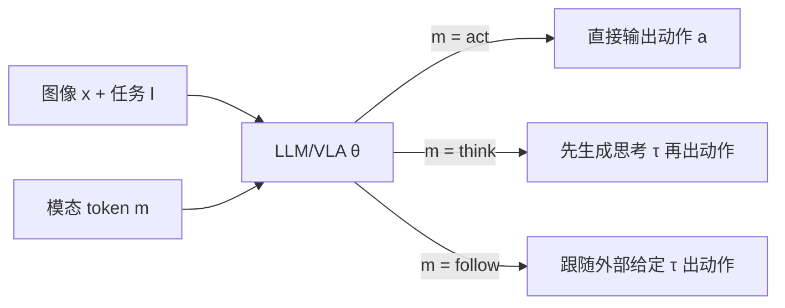

# Hybrid Training for Vision-Language-Action Models

**会议**: ICLR 2026  
**OpenReview**: [https://openreview.net/forum?id=IBJtOltTbx](https://openreview.net/forum?id=IBJtOltTbx)  
**代码**: 待确认  
**领域**: 机器人 / 具身智能 (VLA)  
**关键词**: Vision-Language-Action, Embodied Chain-of-Thought, 混合训练, 推理加速, 模态变量  

## 一句话总结
本文提出 **Hybrid Training (HyT)**：让 VLA 在训练时同时从「思维链(CoT)」和「动作」数据中学习，但在推理时通过一个「模态变量」直接输出动作、跳过费时的思维生成，从而既拿到 CoT 带来的性能增益，又保持标准 VLA 的高控制频率。

## 研究背景与动机
- **领域现状**：在 VLA(视觉-语言-动作模型)中引入具身思维链(Embodied CoT, ECoT)——即在输出动作前先用语言生成「计划/子任务/物体位置/运动方向」等中间思考——已被证明能显著提升机器人操作性能，并增强可解释性(人类可读取并干预智能体意图)。
- **现有痛点**：思维链是**长语言序列**，token 数远多于动作本身。在真实机器人执行中，每一步都先生成思考会让动作推理频率大幅下降——ECoT 比标准 VLA 慢 3×，分层 VLA(HiRobot)慢 4×。而操作任务需要长序列动作，延迟严重损害可用性。
- **核心矛盾**：**性能(靠 CoT) ↔ 推理速度(靠不生成 CoT)** 二者难以兼得。
- **本文目标**：回答「生成长思维链是否是获得性能增益的**必要前提**？」并设计一个既快又强的训练方案。
- **核心 idea**：**「技能化直觉」假说** —— 借鉴 Kahneman 的 System I/II 双系统理论，作者假设 CoT 训练的主要收益**不来自测试时生成的思考本身，而来自模型通过「预测思考 + 思考条件化动作」内化的知识**。因此一个充分训练过的 VLA 应能在**没有中间思考**的情况下，凭内化的「直觉」直接、更准确地预测动作。

## 方法详解

### 整体框架
HyT 把标准 VLA、ECoT(思考型)、分层 VLA(跟随型)统一进**单一模型、单组参数 θ** 的混合目标里。关键是引入一个**模态变量 $m$**(以 `<act>` / `<think>` 等文本 token 形式存在)：训练时通过蒙特卡洛采样让模型见到三类「输入-输出」组合，学会三种条件动作分布；推理时只需把模态 token 设为 `<act>`，模型即直接吐动作，推理开销与标准 VLA 相同。

### 关键设计

**1. 混合训练目标：用模态变量边缘化统一三种 VLA。** 出发点是把动作分布写成对思考 $\tau$ 与模态变量 $m$ 的边缘化：$p(a_t|x_t,l)=\sum_i\sum_j p_\theta(a_t,\tau^i|x_t,l,m^j)p(m^j)$。在此框架下，作者具体实例化三种条件分布：$p(a_t|x_t,l)=\underbrace{p_\theta(a_t|x_t,l,m_a)}_{\text{act}}+\underbrace{p_\theta(a_t|x_t,l,\tau_t)p_\theta(\tau_t|x_t,l,m_\tau)}_{\text{think}}+\underbrace{p_\theta(a_t|x_t,\tau_t,m_f)}_{\text{follow}}$。其中 **act** 模仿标准 VLA(令 $p_\theta(\tau=\varnothing|m_a)=1$，无思考直接出动作)；**think** 模仿 ECoT(先思考再动作)；**follow** 模仿分层系统的低层策略(给定外部思考/指令后只管执行)。这一统一视角让一个模型同时具备「快、慢、跟随」三种行为，而非训练三个独立模型。

**2. 蒙特卡洛采样实现，而非加权求和损失。** 总目标是三项负对数似然的加权和 $\min_\theta \mathcal{L}_{hyt}=w_a\mathcal{L}_{act}+w_\tau\mathcal{L}_{think}+w_f\mathcal{L}_{follow}$。但若对每个样本直接算三项加权和，会让同一批次里重复出现同样的思考和动作，降低 batch 多样性。作者的做法是把权重 $\{w_a,w_\tau,w_f\}$ 重新解释为**采样概率**：每次构造 batch 时，按这些概率为每个数据点随机抽取一种(模态 token, 思考, 动作)组合。本文取 $\{w_a{:}0.25,\ w_\tau{:}0.5,\ w_f{:}0.25\}$，即一半样本走 think 模式喂思考、四分之一走 act、四分之一走 follow。这样模型在一次次随机暴露中同时学会三种分布。

**3. 推理时用模态 token 一键切换、无额外开销。** 测试时默认设 $m_a=\langle act\rangle$，强制模型直接预测动作——此时模型能调用训练中从思考里内化的知识，却**不付出任何额外 token 生成成本**，控制频率与标准 VLA 持平(~3Hz)。若需要可解释性或细粒度指令跟随，则切到 $\langle think\rangle$(读取智能体意图)或 follow 模式(注入人类/oracle 给定的思考来覆盖意图)。作者观察到 HyT 训练后的模型会「忠实地」服从模态 token 生成对应输出，且各模式性能相近，故模态变量在任务开始时设定、episode 内不动态切换(动态切换留作未来工作)。

## 实验关键数据

### 主实验：LIBERO 基准(成功率 %，越高越好)

| 方法 | Spatial | Object | Goal | Long | Avg. |
|------|---------|--------|------|------|------|
| OpenVLA | 84.7 | 88.4 | 79.2 | 53.7 | 76.5 |
| CoT-VLA | 87.5 | 91.6 | 87.6 | 69.0 | 81.1 |
| π0-FAST | 96.4 | 96.8 | 88.6 | 60.2 | 85.5 |
| MolmoAct | 87.0 | 95.4 | 87.6 | 77.2 | 86.6 |
| VLA-OFT | 94.2 | 97.8 | 91.4 | 84.8 | 92.1 |
| **HyT (ours)** | 94.0 | 97.2 | **96.2** | **89.4** | **93.7** |

HyT 与 OFT 配方结合后总均分 SOTA，且在最难的 **Goal / Long** 长程套件上提升最明显。

### 真实世界实验(UFactory xArm 6，成功率 %)

| 任务类别 | OpenVLA | HyT |
|----------|---------|-----|
| In-distribution | 52 ±10 | **72 ±9** |
| Out-of-distribution | 29 ±9 | **54 ±10** |
| **Overall** | 41 ±7 | **63 ±7** |

OOD 上提升尤为显著(29→54)，HyT 到达抓取/放置位置更精准，且从不抓错物体。

### 关键发现
- **ClevrSkills(9 任务, 300–3000 demos)**：HyT 在**所有数据规模**上不仅超过标准 VLA，还普遍优于 ECoT 与 HiRobot；ECoT 次优，分层 VLA 在 ≥1500 demos 后反被标准 VLA 超过。对**更复杂、更长程**任务收益更大。
- **推理速度**：HyT 与标准 VLA 同为 ~3Hz；ECoT 慢 3×，HiRobot 慢 4×。HyT 实现「ECoT 级性能 + 标准 VLA 级速度」。
- **模式等价性**：无 oracle 思考时，HyT 在 act 与 think 模式性能相近——印证「测试时生成思考可能并非必要」。给 oracle 思考(follow/think 模式)能进一步提升各方法性能。
- **饱和情形**：若从已充分 robotics 预训练的 OpenVLA 出发微调，HyT 与 baseline 都接近饱和(~95.3%)，说明 HyT 的增益主要在**补偿预训练不足或微调数据稀缺**。

## 亮点与洞察
- **「思考的价值在训练而非推理」** 这一假说被系统验证，给「快慢思考」之争提供了干净的反例式答案：可以只在训练吃 CoT 的红利。
- 用**单一模型 + 模态变量**统一了标准/思考/分层三种 VLA 范式，工程上优雅，且推理零额外成本。
- 把损失权重**重解释为采样概率**的小技巧，简单地解决了 batch 多样性问题，可复用于其他多目标模仿学习。
- 三种推理模式带来「速度-可解释性-可干预性」的灵活权衡，follow 模式天然支持人类/oracle 注入细粒度指令。

## 局限与展望
- 「act 与 think 模式性能相近」是在所评测任务上的结论；**对需要更复杂具身推理的任务是否仍成立**，作者明确表示需进一步验证。
- 模态变量在 episode 内**固定不变**，未探索执行中**动态切换**快慢系统的机制(可能在难步骤切 think、简单步骤切 act)。
- 思考的提取依赖 oracle/模拟器标注或 LLM 生成(LIBERO)，真实场景下高质量思考标注的获取成本未充分讨论。
- 采样系数 $\{0.25,0.5,0.25\}$ 为经验设定，跨任务的鲁棒最优配比仍待研究。

## 相关工作与启发
- **ECoT (Zawalski et al., 2024)**：本文的直接对照与思想来源，证明具身思考能提升性能但推理慢；HyT 在其基础上「去掉推理时思考」。
- **DualFormer (Su et al., 2025)**：语言模型上系统性丢弃推理痕迹训练，与 HyT 的「思考 dropout」精神相通。
- **RFST / 分层 VLA (HiRobot, Shi et al., 2025)**：用判别器或两级模型在快慢系统间切换；HyT 用单模型 + 模态变量替代显式分层。
- **并发工作 (Chen et al., 2025)**：同样发现推理预训练/共训练/dropout 能通过改善表征提升 VLA，佐证本文「CoT 主要改善表征」的解释。
- **启发**：「在训练中蒸馏慢思考、推理时退化为快直觉」是一个可推广到通用 agent 的范式；模态 token 作为低成本的行为开关也值得借鉴。

## 评分
- 新颖性: ⭐⭐⭐⭐ —— 用统一边缘化 + 模态变量把三种 VLA 范式合一并实现「训练吃 CoT、推理不出 CoT」，视角清晰且实用；思想上与 DualFormer/CoT dropout 有承接，非完全原创但落点扎实。
- 实验充分度: ⭐⭐⭐⭐ —— 覆盖 ClevrSkills(数据规模扫描)、LIBERO(SOTA 对比)、真实 xArm 6(含 OOD)三类设定，并报告推理速度与多模式分析；部分关键消融(系数)放在附录。
- 写作质量: ⭐⭐⭐⭐ —— 以「CoT 是否必要」的问题驱动，假说-方法-验证逻辑连贯，图表与问答式小标题易读。
- 价值: ⭐⭐⭐⭐ —— 直击 VLA 落地的「性能 vs 速度」核心痛点，方法即插即用可叠加 OFT 等现有配方，对实机部署有直接意义。

<!-- RELATED:START -->

## 相关论文

- [\[ICLR 2026\] VLM4VLA: Revisiting Vision-Language-Models in Vision-Language-Action Models](vlm4vla_revisiting_vision-language-models_in_vision-language-action_models.md)
- [\[ICLR 2026\] villa-X: Enhancing Latent Action Modeling in Vision-Language-Action Models](villa-x_enhancing_latent_action_modeling_in_vision-language-action_models.md)
- [\[CVPR 2026\] QuantVLA: Scale-Calibrated Post-Training Quantization for Vision-Language-Action Models](../../CVPR2026/robotics/quantvla_scale-calibrated_post-training_quantization_for_vision-language-action_.md)
- [\[ICML 2026\] Test-Time Training for Visual Foresight Vision-Language-Action Models](../../ICML2026/robotics/test-time_training_for_visual_foresight_vision-language-action_models.md)
- [\[ICLR 2026\] Action-aware Dynamic Pruning for Efficient Vision-Language-Action Manipulation](action-aware_dynamic_pruning_for_efficient_vision-language-action_manipulation.md)

<!-- RELATED:END -->
