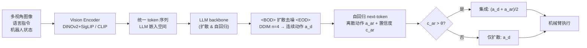

# HybridVLA: Collaborative Diffusion and Autoregression in a Unified Vision-Language-Action Model

**会议**: ICLR 2026  
**OpenReview**: [https://openreview.net/forum?id=H1KDMNOKQn](https://openreview.net/forum?id=H1KDMNOKQn)  
**代码**: 待确认  
**领域**: 机器人 / 具身智能 (VLA)  
**关键词**: Vision-Language-Action, 扩散策略, 自回归, 统一模型, 协同集成  

## 一句话总结
HybridVLA 让同一个 LLM backbone 在同一条 token 序列里同时承担扩散去噪和自回归动作预测两种范式，并用基于置信度的协同集成自适应融合两者，仿真和真机分别比 SOTA 提升 17% 和 19%。

## 研究背景与动机
- **领域现状**：VLA 模型把 VLM 的推理与生成能力迁移到机器人操作上，目前主要分两条技术路线——自回归把连续动作离散化成 bin 当 token 预测（如 OpenVLA），扩散则在 VLM 后挂一个 diffusion head 预测连续动作（如 π0、CogACT）。
- **现有痛点**：自回归的离散化破坏了动作位姿的连续性，难以精细控制；而扩散路线的 diffusion head 是个独立外挂模块，只把 VLM 当成多模态特征提取器，**没有把预训练好的 LLM 当作迭代生成的"动作专家"来用**，浪费了互联网规模的预训练知识。
- **核心矛盾**：两种范式各有所长——扩散擅长精细/动态物体的连续控制，自回归继承 VLM 的生成范式、学得快且更懂灵活指令与未见物体——但现有工作只能二选一，无法在一个模型里兼得。
- **本文目标**：构造一个统一的 VLA 模型，用同一个 LLM backbone 同时跑自回归和扩散两种动作生成，让二者互相强化并按场景自适应取长补短。
- **核心 idea**：**统一序列内的协同生成**——把扩散的 Markov 去噪步骤嵌入 LLM 的 next-token 预测过程，每个去噪步当作一次推理迭代，再用动作集成机制按自回归 token 置信度融合两路输出。

## 方法详解

### 整体框架
所有多模态输入（多视角图像、语言、机器人状态、扩散 timestep 与噪声动作、自回归动作）都被编码进 LLM 嵌入空间，组织成一条精心设计的统一 token 序列。LLM 先在 `<BOD>`…`<EOD>` 包裹的扩散区段里迭代去噪出连续动作，再以这些连续条件为前缀自回归生成离散动作 token；推理时按自回归置信度自适应集成两路动作驱动机械臂。

### 关键设计

**1. 统一 token 序列编排：用 marker 把两种范式无冲突地串进一条序列**
论文系统对比了 4 种序列排布（Table 1），最终选定 Type 4。机器人状态不再被离散化拼进语言 query，而是用可学习 MLP 直接映射成连续向量 $f_r \in \mathbb{R}^{B\times 1\times 4096}$ 注入嵌入空间以增强时序一致性；扩散的 timestep 与噪声动作同样经 MLP 投成连续向量，并用 `<BOD>`(Beginning of Diffusion) 和 `<EOD>`(End of Diffusion) 两个特殊 token 把扩散区段包起来。这个边界设计的关键作用在于厘清两种生成的界限、避免 next-token 预测时混淆（如扩散 token 直接去预测离散 mask token）。更微妙的是**摆放顺序**：自回归训练时 question 和答案（含离散动作 GT）都可见，若把自回归放在扩散之前，这些 GT 会作为扩散的条件造成动作泄漏（Type 3）；因此论文把扩散 token 放在前面，既为后续 token 提供连续 latent 条件，又因扩散本身作用于噪声而天然规避了信息泄漏。

**2. 协同训练配方：把扩散去噪嵌进 next-token 预测，两路联合优化同一动作分布**
两种范式共享 LLM 并联合优化一个混合目标。扩散侧沿用 diffusion policy 的去噪 MSE：$L_{dif}=\mathbb{E}_{a,i,c}\lVert \epsilon - \epsilon_\pi(a_t^i, i, c)\rVert^2$，其中 $\epsilon\sim\mathcal{N}(0,1)$、$c$ 为条件上下文；自回归侧最小化离散动作的交叉熵 $L_{ar}$，合成 $L_{hybrid}=L_{dif}+L_{ar}$。由于动作数据被统一归一化到 $[-1,1]$、离散动作只是该分布的量化表示，两个分支实际在逼近同一条件动作分布，因而能互相强化（PCA 与消融均验证）。推理时扩散用 DDIM、采样步数低至 $n=4$ 即可兼顾性能与速度，且每步只把当前噪声样本喂进 LLM 预测下一步噪声、序列不保留历史噪声，每步即一次"推理迭代"；为加速还引入 KV cache，首步处理完视觉/语言 token 后，后续步只前传更新的 timestep 与噪声、复用缓存的 K/V，大幅减少冗余计算。

**3. 协同动作集成：以自回归置信度为信号自适应融合两路输出**
作者观察到两个现象——不同动作类型在不同任务上各有胜负；自回归 token 的置信度是动作质量的可靠指标（>80% 成功样本里自回归 token 平均置信度超 0.96）。据此设计集成规则：用自回归 token 的平均置信度 $c^{ar}_{t+1}$ 引导，若超过阈值 $\theta=0.96$ 则认为自回归动作足够准，与扩散动作取平均 $a_{t+1}=(a^d_{t+1}+a^{ar}_{t+1})/2$；否则只信扩散动作 $a_{t+1}=a^d_{t+1}$。这种"高置信度才融合、低置信度回退到扩散"的策略让控制更鲁棒。

此外，模型用预训练 Prismatic VLM 初始化，分两阶段训练：先在 Open X-Embodiment、DROID、RoboMIND 等 35 个数据集、760K 轨迹（33M 帧、>10K A800 GPU 小时）上大规模预训练，再在自采仿真与真机数据上微调；提供 7B(LLaMA-2) 和 2.7B(Phi-2) 两个规模。

## 实验关键数据

### 主实验表格（RLBench 10 任务多任务设定，成功率 S.R.↑）

| 方法 | Mean S.R. | 推理速度 |
|---|---|---|
| ManipLLM (7B) | 0.38 | 2.2 Hz |
| OpenVLA (7B) | 0.41 | 6.3 Hz |
| OpenVLA-OFT (7B) | 0.45 | 13.4 Hz |
| π0 (2.6B) | 0.61 | 13.8 Hz |
| CogACT (7B) | 0.60 | 9.8 Hz |
| HybridVLA-ar (7B) | 0.65 | 6.3 Hz |
| HybridVLA-dif (7B) | 0.72 | 9.4 Hz |
| **HybridVLA (7B)** | **0.78** | 6.1 Hz |
| HybridVLA (2.7B) | 0.67 | 12.3 Hz |

HybridVLA(7B) 比自回归 SOTA(OpenVLA) 和扩散 SOTA(π0) 分别高 37% 和 17%；即便单看扩散分支 HybridVLA-dif 也比 CogACT/π0 高 12%/11%，说明共享 LLM 比外挂 diffusion head 更能释放扩散潜力。

### 消融实验表格（Table 3，10 RLBench 任务）

| 配置 | 训练损失 | LSP | Mean ↑ |
|---|---|---|---|
| Ex1 仅 AR | $L_{ar}$ | ✓ | 0.57 |
| Ex2 仅 AR | $L_{hybrid}$ | ✓ | 0.65 |
| Ex3 仅 Dif | $L_{dif}$ | ✓ | 0.65 |
| Ex4 仅 Dif | $L_{hybrid}$ | ✓ | 0.72 |
| **Ex5 AR+Dif+CAE** | $L_{hybrid}$ | ✓ | **0.78** |
| Ex6 AR+Dif+CAE | $L_{hybrid}$ | ✗ | 0.22 |

- Ex1→Ex2、Ex3→Ex4：换成混合目标后单分支也涨（0.57→0.65、0.65→0.72），证明两范式联合训练彼此增益；
- Ex5 协同集成达到 0.78，优于任一单分支；
- Ex6 去掉大规模预训练骤降到 0.22，说明跨本体预训练是性能基石。

### 关键发现
- 序列排布很关键：Type 4 在扩散/自回归两种推理下均最优（Dif 0.72 / AR 0.65），错误排布会引发 GT 泄漏或 token 混淆。
- 真机：单臂与双臂任务上比 SOTA 平均提升 19%，并对未见物体/背景/空间布局/光照展现强泛化。
- 自回归分支可替换为语言任务规划而不损害扩散动作稳定性（该设定仍达 74%）。

## 亮点与洞察
- **范式融合的"优雅解"**：不是把扩散和自回归各跑一遍再拼，而是把扩散去噪解释为 LLM 的一种 next-token 推理迭代，二者共享 backbone、逼近同一分布，互相强化而非简单堆叠。
- **置信度即质量信号**：发现自回归 token 置信度与动作正确性强相关，把它当作集成开关，简单却有效。
- **工程细节扎实**：KV cache 让扩散步推理提速，DDIM 仅 4 步即可，保证统一模型的推理速度仍可与单范式基线相当。

## 局限与展望
- 集成阈值 $\theta=0.96$ 是经验值，跨任务/本体是否需要重调、对阈值敏感性虽有附录分析但仍是潜在脆弱点。
- 7B 模型推理 6.1 Hz，对高频闭环控制（如灵巧手）可能偏慢；2.7B 提速但精度下降。
- 预训练成本高（>10K A800 小时），复现门槛大；消融也显示去掉预训练性能崩塌，方法对大规模数据依赖强。
- 动作仍是 SE(3) 末端位姿（7/14-DOF），对更高自由度或接触丰富的操作尚未验证。

## 相关工作与启发
- **自回归 VLA**：RT-2、OpenVLA、ManipLLM、FAST 把动作离散成 token，效率高但牺牲连续性。
- **扩散 VLA**：π0/π0.5、CogACT、DiVLA、TinyVLA 在 VLM 后加扩散/flow-matching head，精细但把 LLM 当特征提取器。
- **启发**：本文提示"统一序列内多范式协同"是一条值得探索的路径——与其用双系统（慢推理 + 快控制）解耦，不如让同一 backbone 学会在一条序列里切换生成方式；置信度引导的自适应集成思路也可迁移到其他多专家/多头预测场景。

## 评分
- **新颖性**: ⭐⭐⭐⭐ 首次把扩散去噪嵌入 LLM 的 next-token 预测、在统一 token 序列里融合两种生成范式，序列排布与防泄漏设计有巧思。
- **实验充分度**: ⭐⭐⭐⭐ 仿真(RLBench/SimplerEnv)+真机单/双臂、SOTA 对比、组件消融、序列排布消融、泛化测试齐全，760K 轨迹规模可观。
- **写作质量**: ⭐⭐⭐⭐ 动机清晰、框架图与表格到位，方法叙述层次分明。
- **价值**: ⭐⭐⭐⭐ 提供了 VLA 范式融合的一个强 baseline 与可复用设计思路，仿真/真机均显著提升，对具身操作社区有实用价值。

<!-- RELATED:START -->

## 相关论文

- [\[ICLR 2026\] UniVLA: Unified Vision-Language-Action Model](unified_vision-language-action_model.md)
- [\[ICLR 2026\] Unified Diffusion VLA: Vision-Language-Action Model via Joint Discrete Denoising Diffusion Process](unified_diffusion_vla_vision-language-action_model_via_joint_discrete_denosing_d.md)
- [\[ICLR 2026\] CoNavBench: Collaborative Long-Horizon Vision-Language Navigation Benchmark](conavbench_collaborative_long-horizon_vision-language_navigation_benchmark.md)
- [\[ICLR 2026\] HAMLET: Switch Your Vision-Language-Action Model into a History-Aware Policy](hamlet_switch_your_vision-language-action_model_into_a_history-aware_policy.md)
- [\[ICLR 2026\] Hybrid Training for Vision-Language-Action Models](hybrid_training_for_vision-language-action_models.md)

<!-- RELATED:END -->
