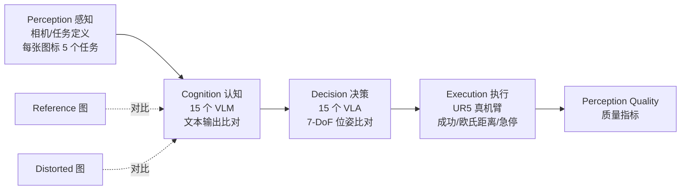

# Image Quality Assessment for Embodied AI

**会议**: ICLR 2026  
**OpenReview**: [https://openreview.net/forum?id=azj53PLJRL](https://openreview.net/forum?id=azj53PLJRL)  
**代码**: [https://github.com/aiben-ch/EmbodiedIQA](https://github.com/aiben-ch/EmbodiedIQA)  
**领域**: 具身智能 / 图像质量评估 / 数据集与基准  
**关键词**: Embodied AI, Image Quality Assessment, VLM, VLA, Robot Perception, Benchmark  

## 一句话总结
首次把图像质量评估（IQA）从"预测人眼偏好"扩展到"预测机器人能否用这张图把任务干成"，基于 Mertonian 系统搭出 **感知-认知-决策-执行（Perception-Cognition-Decision-Execution）** 四步流水线，构建了含 36.9k 失真图像对、5.53M 细粒度标注（15 个 VLM + 15 个 VLA + 1.5k 真机实验）的 Embodied-IQA 数据库，并用 15 种主流 IQA 方法证明：现有为人眼设计的质量指标在具身场景下严重失效。

## 研究背景与动机

**领域现状**：具身智能（Embodied AI）近年发展飞快，但大多还停在实验室里。一旦进入真实世界，镜头抖动、噪声、压缩、光照变化等各种失真就会让"在实验室调通的抓取任务"突然失败。一个自然的诉求是：能否像流媒体里用 IQA 给图像打分一样，给具身场景的每张图打一个"机器人可用性"分数，提前把低质量图像过滤掉？

**现有痛点**：传统 IQA 都是 **human-oriented**——收集人类对失真图像的主观偏好，再训练客观指标去拟合。但人眼视觉系统（HVS）、通用机器视觉系统（MVS）和机器人视觉系统（RVS）三者的敏感点完全不同：(1) HVS 对噪声/压缩敏感，但这些对机器的下游任务几乎无影响，而亮度/对比度恰好相反；(2) 通用机器的"感知质量"只取决于检测/分割这类**认知**任务的表现，但机器人在认知之后还有**决策**和**执行**两步——上一步保真不代表下一步成功。

**核心矛盾**：HVS 和 MVS 都可看作 **Newtonian 系统**（给定状态和控制就能精确预测下一步），而 RVS 是 **Mertonian 系统**——认知里差一个字，决策的位姿可能天差地别；决策里偏 1 厘米，执行就可能撞上障碍物。这种"逐级不可预测"的放大效应，使得已有任何 IQA 方法都无法直接迁移到具身场景。

**本文目标**：第一次正式提出 "IQA for Embodied AI" 这一课题，给未来具身场景提供可靠的感知质量指标。

**核心 idea**：**用机器人下游任务的成功率来定义图像质量**——把失真对认知、决策、执行三步的负面影响逐级量化，并用大规模 VLM/VLA/真机标注把这套主观分数固化成数据库，验证现有 IQA 的失效程度。

## 方法详解

### 整体框架

本文不是提出一个新 IQA 模型，而是**建立一套主观打分体系 + 数据库 + 基准**。核心是借用社会学里的 Mertonian Law，把具身智能的视觉链路拆成 Perception→Cognition→Decision→Execution 四步，并为每一步指定一个"打分主体"：Perception 对应相机（任务定义），Cognition 对应 VLM（人脑），Decision 对应 VLA（小脑），Execution 对应机械臂（运动系统）。一张失真图的质量 = 它在这条链路上把任务"带偏"了多少。

整条链路的打分逻辑都建立在 **reference/distorted 图像对** 上：同一任务，分别喂参考图和失真图给同一个主体，比对两者输出的差异——差异越大，说明这种失真对机器人危害越大，图像质量越低。

### 关键设计

**1. Mertonian 系统下的四步流水线：为什么机器人需要单独的 IQA。** 本文最根本的设计是论证 RVS 不能复用 HVS/MVS 的评价范式。HVS 和 MVS 之所以能用现成 IQA，是因为它们是 Newtonian 的——决策和执行过程鲁棒、可预测。但机器人的决策与执行**并不完全跟随认知**：认知层一个字符的偏差会被决策层放大成位姿的剧变，决策层 1cm 的路径偏移会让执行层撞到障碍。正因这种逐级放大的不可预测性，必须把 Cognition、Decision、Execution 三步**分开打分**，而不能像通用机器 IQA 那样只看认知层的检测/分割精度。这一理论框架是后续整个数据库设计的根。

**2. Embodied-IQA 数据库与失真体系。** 收集 1,230 张高质量参考图（先用 Q-Align 过滤掉本身就有失真的图），覆盖 Sim2Real（真实/仿真）、第一/第三人称视角、5 类主体 × 5 类背景，保证多样性。对每张参考图施加 **30 种失真、归并为 7 大类**（Blur 模糊、Luminance 亮度、Chrominance 色度、Noise 噪声、Compression 压缩、Spatial 空间局部、Others），每种失真设 5 个强度等级（强度按 HVS 感知降质对齐），最终生成 **36,900 张失真图**。每张参考图人工标注 5 个难度递增的自然语言任务（动词限定在 Cover/Insert/Move/Pick/Place/Pour/Press/Pull/Push/Twist），所有打分都围绕这些任务展开。

**3. Cognition 打分：VLM 文本输出的三维比对。** 认知对应人脑，用 15 个参数量 <8B 的主流 VLM（InternVL 系列、Qwen2.5-VL、Phi 系列、Ovis 系列等，控制在 8B 以下以保证实时推理）来完成。要求每个 VLM 用约 10 个词解答预设任务，然后比对参考图与失真图两份输出句子的差异。差异从 **accuracy、recall、semantics** 三个维度刻画，分别用 BLEU、ROUGE、CIDEr 三个经典指标的均值实现。直觉：失真往往在字符层而非语义层影响 VLM（语义分掉得最少，Precision 掉得最多），更容易让模型多吐冗余文本而非丢信息。

**4. Decision 打分：VLA 的 7-DoF 位姿拆解。** 决策对应小脑，用 15 个 VLA（OpenVLA 系列、Pi0 系列、Octo、CogACT、RT-X-1 等）输出动作。本文首次把 VLA 引入 IQA，把动作质量拆成 7-DoF 的三个维度：前 3 维 **position**（平移，mm）、中 3 维 **rotation**（旋转，rad）、最后 1 维 **state**（夹爪开合，$[0,1]$）。位置分基于参考/失真结果坐标点的空间距离打分（双臂只取运动幅度更大的臂，丢弃深度等 7-DoF 外信息以对齐不同 VLA）。实验发现三者敏感度不同：State 受失真影响最小，Position 居中，Rotation 最易被破坏——说明失真主要伤的是机械臂的前 6-DoF 而非末端夹爪。

**5. Execution 打分：真机三态评分。** 执行对应运动系统，用 UR5 机械臂 + Robotiq 2F-140 夹爪（工作半径 85cm）真机跑任务，分三种情形给分：**Success** 直接给 100；**Failure** 按执行末端位姿与参考结果的欧氏距离、以厘米为单位扣分；**Emergency stop**（撞到桌面/墙壁触发中断）直接给 0。考虑真机不可控因素，只执行 5 个难度中最简单的那个任务，确保失败原因来自失真而非任务本身太难。这一步用 1.5k 真机实验把"内在现实"（VLM/VLA 推理）和"外在现实"（真机执行）连起来，验证 5M+ 标注的可靠性。

## 实验关键数据

### 主实验：15 种 IQA 方法预测 Decision 分（SRCC，节选 Position / 视角维度）

| 组别 | 方法 | Position SRCC↑ | Rotation SRCC↑ | State SRCC↑ | First 视角 | Third 视角 |
|---|---|---|---|---|---|---|
| Zero-shot | PSNR | 0.2762 | 0.2594 | 0.2284 | 0.4059 | 0.3949 |
| Zero-shot | SSIM | 0.4862 | 0.4246 | 0.3607 | 0.5834 | 0.5478 |
| Zero-shot | Q-Align | 0.5325 | 0.5387 | 0.3791 | 0.6658 | 0.5854 |
| **FR** | AHIQ | 0.7481 | 0.6454 | 0.6465 | 0.8011 | 0.7989 |
| **FR** | **TOPIQ-FR** | **0.7748** | 0.6428 | **0.6684** | **0.8307** | **0.8322** |
| NR | **TOPIQ-NR** | 0.7496 | 0.5981 | 0.7036 | 0.7791 | 0.8269 |
| NR | CLIPIQA | 0.1784 | 0.0708 | 0.1348 | 0.0048 | 0.2155 |

- **Rotation 最难预测，Position 最易**；FR 整体优于 NR（NR 普遍 <0.6）。最佳的 TOPIQ-FR 也仅 SRCC≈0.75，而同样方法在传统 HVS IQA 上能到 ~0.9——**断崖式下滑直接证明现有指标不适配具身场景**。

### 关键发现与消融

| 维度 | 结论 |
|---|---|
| 模型间一致性（SRCC） | VLM 间约 **0.3**、VLA 间约 **0.25**，远低于 HVS 的 >0.6——单一模型当主体远远不够，必须聚合多模型偏好 |
| 冻结指标失效 | LPIPS / DISTS / CLIPIQA 主参数基于 HVS 冻结，**训练后甚至不如 zero-shot baseline**，反向印证 HVS↔RVS 鸿沟 |
| 失真等级 | 5 个绝对失真等级下 IQA 性能几乎不变——说明按 HVS 划等级不合理，应按 RVS 自身的 JND 划分 |
| 跨库验证 | 在 VLA 决策分上微调后，HVS 能力崩塌（LIVE 上 SRCC<0.4）；但能预测 VLM 认知分（AHIQ 达 0.7），揭示认知↔决策内在关联 |
| 真机相关性 | **Cognition↔Execution SRCC<0.5；Decision↔Execution SRCC>0.6（0.671）**——决策能一定程度代表执行，但真机实验仍不可替代 |

## 亮点与洞察
- **问题定义本身就是最大贡献**：把"图像好不好看"重定义为"机器人能不能用它把任务干成"，给 IQA 开了一个全新的、面向具身智能的子领域。
- **Mertonian vs Newtonian 的类比很到位**：用"自由意志/逐级放大不可预测"一句话点破了机器人 IQA 与人/通用机器 IQA 的本质差异，为"必须分认知-决策-执行三步打分"提供了理论依据。
- **首次把 VLA 引入 IQA**，并给出 7-DoF 位姿的可操作打分方案；也是 IQA 领域**首次做真机执行实验**，把"内在推理"和"外在执行"用 SRCC 量化连接。
- **大规模 + 多主体**：36.9k 图像对、5.53M 标注、15 VLM + 15 VLA + 真机，规模和标注维度都超过既有质量库。

## 局限与展望
- **没给出新 IQA 模型**：本文是"提出问题 + 数据库 + 基准"，证明现有方法失效，但 Embodied IQA 该怎么做仍是开放问题（最好的 SRCC 才 ~0.75）。
- **执行只跑最简单难度**：为保证可控，真机只测 5 难度里最简单的一档，更复杂任务下的结论尚未验证。
- **第一人称结果远差于第三人称**，说明 VLA 训练数据里很少整合采样工具与执行器本体，本身是数据偏置而非单纯图像质量问题。
- **真机相关性仍不够高**（Decision↔Execution 0.671），意味着仿真/推理替代不了真机，规模化标注成本仍是瓶颈。

## 相关工作与启发
- **传统 IQA 数据库**（LIVE、TID2013、KADID-10K、NTIRE 等）都是 human-oriented、单主体；少量机器导向库（MPD、EPD）也只覆盖认知层。Embodied-IQA 是首个同时覆盖 Cognition/Decision/Execution 三层、以机器人为主体的库。
- **机器导向 IQA**（IQA for Machine）此前只关注检测/分割等认知任务，本文把它向下游的决策与执行推进了两步。
- **启发**：(1) 评价范式要跟着"使用者"走——给机器人用的指标必须用机器人的下游成功率来定义；(2) 多模型聚合是低一致性场景的必需品；(3) JND 应按主体（RVS）自身重新划分，而非沿用 HVS 的等级。可延伸方向包括：设计认知-决策-执行联合预测的端到端具身 IQA 模型、把质量指标接入 VLA 训练做数据过滤、以及探索 RVS 专属的失真分级标准。

## 评分
- **新颖性**: ⭐⭐⭐⭐⭐ 首次提出 IQA for Embodied AI，问题定义全新，Mertonian 框架 + VLA/真机打分体系都是原创。
- **实验充分度**: ⭐⭐⭐⭐ 36.9k 图、5.53M 标注、15+15 模型 + 真机，基准覆盖三维度/视角/Sim2Real/失真等级/跨库，相当扎实；扣分在执行只跑最简难度。
- **写作质量**: ⭐⭐⭐⭐ 动机层层递进（HVS→MVS→RVS），图表丰富；个别小节因图数据密集略显零碎。
- **价值**: ⭐⭐⭐⭐⭐ 为具身智能的真实世界落地提供了急需的质量评价基础设施，开辟了一个可持续研究的新子领域。

<!-- RELATED:START -->

## 相关论文

- [\[ICLR 2026\] D2E: Scaling Vision-Action Pretraining on Desktop Data for Transfer to Embodied AI](d2e_scaling_vision-action_pretraining_on_desktop_data_for_transfer_to_embodied_a.md)
- [\[ICLR 2026\] Grounding Generative Planners in Verifiable Logic: A Hybrid Architecture for Trustworthy Embodied AI](grounding_generative_planners_in_verifiable_logic_a_hybrid_architecture_for_trus.md)
- [\[ICLR 2026\] Interleave-VLA: Enhancing Robot Manipulation with Image-Text Interleaved Instructions](interleave-vla_enhancing_robot_manipulation_with_image-text_interleaved_instruct.md)
- [\[ACL 2026\] Limited Linguistic Diversity in Embodied AI Datasets](../../ACL2026/robotics/limited_linguistic_diversity_in_embodied_ai_datasets.md)
- [\[ICLR 2026\] Planning with an Embodied Learnable Memory](planning_with_an_embodied_learnable_memory.md)

<!-- RELATED:END -->
