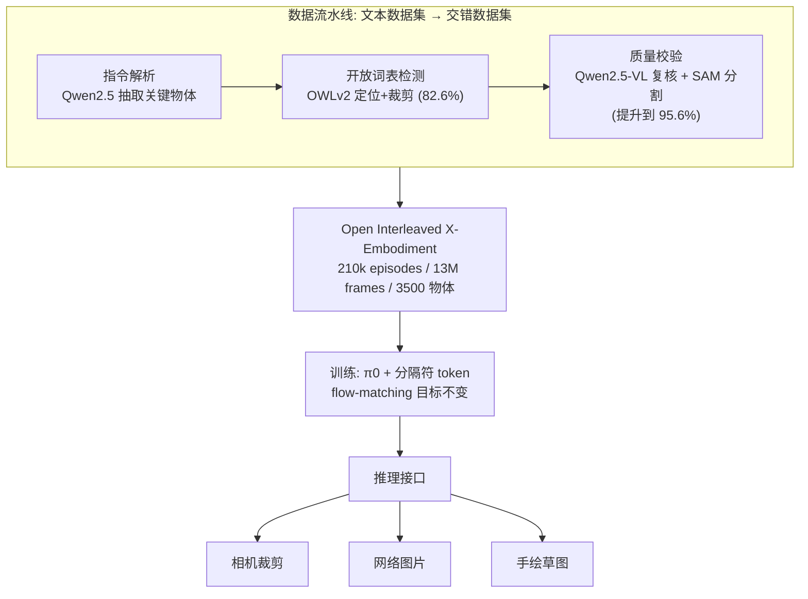

# Interleave-VLA: Enhancing Robot Manipulation with Image-Text Interleaved Instructions

**会议**: ICLR 2026  
**OpenReview**: [https://openreview.net/forum?id=ULTWUuGhC3](https://openreview.net/forum?id=ULTWUuGhC3)  
**代码**: 项目主页开源（210k episodes 数据集 + 代码）  
**领域**: 机器人操作 / 视觉-语言-动作模型 (VLA)  
**关键词**: Interleaved Instruction, VLA, Out-of-Domain Generalization, In-Context Visual Grounding, Open X-Embodiment  

## 一句话总结
本文提出 Interleave-VLA：一个模型无关、几乎不改架构的范式，让现有 VLA 接受"图文交错"指令（把文本里的目标物体替换成它的图像），并配套一条自动化流水线把 Open X-Embodiment 改造成 21 万条交错指令数据集，使机器人对未见物体的域外泛化提升约 2×，并涌现出对手绘草图、网图等指令的零样本理解能力。

## 研究背景与动机
- **领域现状**：基础模型让"通用机器人策略"成为可能，主流做法是把 VLM 扩展成 VLA（视觉-语言-动作），用文本指令 + 视觉观测直接生成连续动作（如 π0、OpenVLA、RT-2）。但几乎所有现代 VLA 仍停留在**纯文本指令**范式（作者称之为 Text-VLA）。
- **现有痛点**：纯文本指令在域外场景容易**含糊或繁琐**——当用户想说"拿起这个长得像这样的东西"时，文本很难精确描述独特形状/颜色的物体。作者把由此导致的泛化失败归结为三类**注意力幻觉 (attentional hallucination)**：① **注意力偏置**（attention bias，焦点错误落到显著的干扰物上）；② **注意力扩散**（diffused attention，注意力无焦点地铺满全场，表示模型不确定）；③ **注意力泄漏**（attention leakage，认对了目标但焦点散逸到无关背景）。它们源于**语义歧义**（"toy dinosaur" 旁边放着相似形状的玩具大象就乱选）和**训练分布偏置**（"redbull" 罕见词被切成 "red"+"bull"，过度关注 "red" 而误把可口可乐当红牛）。
- **核心矛盾**：数字世界的 VLM 早已能处理**任意图文交错**输入并因此获得更强泛化，而物理世界的 VLA 却还没吃到这个红利；VIMA 虽是交错指令的概念先驱，但局限在 2D 风格化仿真的高层规划，没验证真实世界低层动作的可行性与泛化收益。
- **本文目标**：把"图文交错指令"从数字世界搬到物理世界的连续动作生成，且要做到**自然、灵活、模型无关、改动最小**，并系统性验证交错指令相对纯文本的真实收益。
- **核心 idea**：**(1) 用图像替代文本里的歧义物体描述**，提供"少偏置"的在场视觉锚定（in-context visual grounding），直接缓解由歧义引发的幻觉；**(2) 自动造数据**——设计流水线把现成纯文本机器人数据集自动转成交错指令，解决"没有交错训练数据"这一最大瓶颈；**(3) 极简适配**——只往 tokenizer 加分隔符、改输入处理，核心架构不动，让 SOTA VLA 即插即用。

## 方法详解

### 整体框架
Interleave-VLA 把状态形式化为三元组 $s_t = (I_t, q_t, \mathcal{I})$：当前视觉观测 $I_t$、本体感知 $q_t$、以及一段**交错指令序列** $\mathcal{I} = (u_1,\dots,u_M)$，其中每个 token $u_j \in V_{\text{text}} \cup V_{\text{img}}$ 要么是文本 token、要么是图像 token；策略 $a_t \sim \pi_\theta(\cdot \mid s_t)$ 据此采样连续动作。当所有 $u_j$ 都是文本时即退化为标准 Text-VLA。整个范式由三块拼成——**适配模块**（让现成 VLA 看懂交错格式）、**可扩展训练**（在 21 万条交错数据上训练，不改超参和目标）、**通用推理接口**（测试时接受相机裁剪/网图/草图）；外加一条**自动数据生成流水线**把 Open X-Embodiment 转成交错数据。

### 关键设计

**1. 极简适配模块：只加分隔符，架构零改动。** Interleave-VLA 不动 VLA 的主干网络，只往 base 模型的 tokenizer 里引入**特殊分隔符 token**（如 `<BOI>`/`<EOI>` 标记图像段的起止），并升级输入处理器去支持"文本-图像-文本"交错排布。一个典型指令从纯文本 `Place [the blue spoon near microwave] into [silver pot on towel]` 变成 `Place [image1] into [image2]`——把歧义的名词短语直接换成物体裁剪图。论文主要把它套在 π0 上（其 Paligemma 底座本不支持交错输入，适配后即可），并验证同样能套到架构和训练目标都不同的 OpenVLA，证明"模型无关"不是空话。这种"最小侵入"是它能即插即用、且不破坏预训练能力的关键。

**2. 自动化交错数据流水线：三阶段把纯文本数据"图像化"。** 由于现实机器人数据集只有文本指令，作者用三步把它们自动转成交错数据：① **指令解析**用 Qwen2.5 从语言指令里抽关键物体名词（比 SpaCy 等规则工具更能适配多样表述、还能概括长指令）；② **开放词表检测**用 OWLv2 按关键词在轨迹帧里定位并裁剪目标物体，单此一步准确率 82.6%；③ **数据质量校验**针对 OWLv2 失败的难例，用 Qwen2.5-VL 复核检测结果，必要时给出关键点交给 Segment Anything 做更精细分割，把整体准确率拉到 **95.6%**。该流水线整合了 Open X-Embodiment 中 11 个子数据集（RT-1、Bridge、Jaco Play、Language Table 等），产出 **21 万 episodes、1300 万帧、3500 类物体**的真实世界交错数据集。为增加指令多样性，还随机混入互联网图片替换原物体图。

**3. 三种训练模态消融，定位收益来源——格式 + 内容双管齐下。** 为厘清"交错"为何有效，作者切了三个变体：**Text-VLA**（训练/测试都用文本）、**Interleave-VLA (Partial)**（交错训练、文本测试）、**Interleave-VLA (Full)**（交错训练 + 交错测试）。结果表明：Partial 仅靠交错数据的多模态性就已超过纯文本（缓解过拟合），而 Full 借助测试时的显式视觉锚定把语义域外泛化再翻一倍——说明收益既来自**数据/模态多样性**（缓解分布偏置导致的幻觉），也来自**交错格式本身提供的在场视觉信息**（缓解歧义导致的幻觉）。进一步的 prompt 图像消融显示，**任务图 + 网图混合**比任一单独来源都好（域内 71.0 vs 单一 59~67），说明 prompt 图的多样性也是 scaling 的一个维度。

**4. 通用推理接口：训练没见过的指令模态零样本可用。** 推理时同时支持纯文本和交错指令，且交错图可来自相机裁剪、网图甚至手绘草图——即使风格与训练数据迥异。正是因为模型学的是"用图像在场锚定目标"这一通用能力，而非记忆特定图像风格，才涌现出对**裁剪图/网图/草图**的零样本理解，配合 GUI 让人机交互更直观（"画个简笔画就能指挥机器人"）。

## 实验关键数据

### 主实验：SimplerEnv（WidowX / BridgeData V2）
4 个域内任务 + 3 个域外套件（Visual / Novel Object / Novel Category），3 个 seed，单位为成功率。

| 模型 | 范式 | 训练/测试模态 | In-Domain | Visual | Novel Object | Novel Category | Avg |
|------|------|------|-----------|--------|--------------|----------------|-----|
| RT-1-X | Text-VLA | Text/Text | 1.1 | 0.0 | 3.5 | 5.8 | 3.2 |
| Octo | Text-VLA | Text/Text | 17.4 | 12.5 | 10.8 | 8.2 | 10.5 |
| Spatial-VLA | Text-VLA | Text/Text | 38.4 | 19.6 | 17.1 | 17.6 | 18.0 |
| π0.5 | Text-VLA | Text/Text | 57.2 | 53.9 | 50.9 | 41.8 | 49.0 |
| π0 | Text-VLA | Text/Text | 68.1 | 72.4 | 26.0 | 19.3 | 39.5 |
| π0 | Interleave (Partial) | Interleave/Text | 70.1 | 76.8 | 35.8 | 20.9 | 43.6 |
| **π0** | **Interleave (Full)** | **Interleave/Interleave** | **70.5** | 73.2 | **53.8** | **57.3** | **60.6** |

- 域内基本持平（70.5 vs 68.1），说明交错指令不损伤熟悉任务；**域外语义泛化 Novel Object 26.0→53.8、Novel Category 19.3→57.3，约 2× 提升**，且超过额外用物体接地/检测 VQA 预训练的 π0.5。

### 真实机器人（FANUC LRMate 200iD/7L，每物体 20 条遥操作演示）
PT 表示在交错数据集上预训练（注意：预训练数据**不含 FANUC**，仍能跨本体迁移）。

| 范式 | PT | In-Domain (Succ Avg) | Out-of-Domain (Succ Avg) |
|------|----|----------------------|--------------------------|
| Interleave-VLA | ✗ | 6 / 19 | 0 / 0 |
| Text-VLA | ✓ | 39 / 50 | 13 / 21 |
| **Interleave-VLA** | ✓ | **67 / 47** | **71 / 38** |

- 低数据场景下直接 finetune π0 几乎失败；**预训练后 Interleave-VLA 域外比 Text-VLA 高 2-3×**，体现跨本体迁移降低了数据采集负担。

### 消融与关键发现
- **跨架构验证（VIMA-Bench / OpenVLA）**：把范式直接套到 OpenVLA，在 L1-L4 四个泛化级别上全面领先，且**比 Text-VLA 高约 2×**，无需任务特定设计。
- **零样本指令模态（Table 4）**：对训练从未见过的手绘草图、用户裁剪图、网图，成功率/准确率多在 70-80%+ 且 Acc 常达 100%。
- **prompt 图像多样性（Table 5）**：Internet-only 59.2/69.1、Task-specific-only 67.5/67.1、**Mixed 71.0/71.7** 最优。
- **格式 vs 内容（Table 6）**：视觉目标线索主要驱动域外泛化（提供显式图像信息），交错格式带来互补增益、尤其能消解 "Move Near" 这类欠定指令的歧义。

## 亮点与洞察
- **把"交错"这个数字世界已验证的红利第一次系统性落到真实世界低层动作**，并用 2×/2-3× 的域外提升把"交错有用"从直觉变成定量结论。
- **"注意力幻觉"三分类（偏置/扩散/泄漏）是很漂亮的失败分析框架**：把 Text-VLA 的泛化失败拆成可视化、可归因的注意力模式，再用 attention map 直接展示交错指令如何让焦点收敛回目标，论证链条完整。
- **数据流水线是真正的工程贡献**：用"LLM 解析 + 开放词表检测 + VLM/SAM 校验"的协作把准确率从 82.6% 拉到 95.6%，把 Open X-Embodiment 自动转成 21 万条交错数据并开源，复用价值高。
- **模型无关 + 改动最小**：只加分隔符 token 就能让 π0 和 OpenVLA 这两类架构都升级，落地门槛极低。

## 局限与展望
- **依赖检测/分割质量**：流水线 95.6% 的准确率意味着仍有约 5% 噪声交错样本，对小物体、遮挡、密集杂乱场景的裁剪质量可能成为瓶颈。
- **物体级锚定为主**：交错指令目前主要替换"名词物体"，对空间关系、动作副词、抽象目标（如"整理整齐"）这类难以用单张图表达的指令收益有限。
- **本体与任务仍有限**：真实实验集中在单臂抓取/摆放（FANUC + 食物/厨具），更长程、多步骤、双臂或灵巧手任务尚未验证。
- **草图/网图的鲁棒性边界**：附录提到草图存在失败模式，零样本能力对极端抽象或歧义的手绘仍可能退化。
- 展望：把交错锚定从物体扩展到区域/轨迹/关系，结合更强的开放词表分割与在线纠错，有望进一步逼近"指哪打哪"的通用操作接口。

## 相关工作与启发
- **交错 VLM**（Flamingo、Qwen-VL、InternVL 等）：数字世界从图文对走向任意交错序列以吃到 web 语料红利；本文把这条路径延伸到动作模态。
- **VLA 模型**（RT-2、OpenVLA、π0、Octo、GR00T N1）：主流仍是文本指令 + 视觉观测；本文是少数把交错指令引入真实低层动作的工作。
- **VIMA**：交错机器人指令的概念先驱，但停在 2D 仿真高层规划；本文补上"真实世界 + 低层动作 + 大规模数据 + 泛化收益"的缺口。
- **启发**：① "把歧义文本替换成在场图像"是一种通用的降幻觉手段，可推广到导航、移动操作等其他具身任务；② 用现成 VLM/检测器自动改造已有数据集，是低成本造多模态训练数据的可复制范式。

## 评分
- **新颖性**: ⭐⭐⭐⭐ — 交错图文指令本身非首创（VIMA 在先），但"真实世界 + 低层连续动作 + 模型无关极简适配 + 自动数据流水线 + 注意力幻觉归因"的组合是首次系统性打通，定位清晰。
- **实验充分度**: ⭐⭐⭐⭐ — 覆盖仿真（SimplerEnv）、真机（FANUC）、跨架构（OpenVLA/VIMA-Bench）、零样本模态、多维消融，证据链完整；真机任务种类与本体多样性偏窄。
- **写作质量**: ⭐⭐⭐⭐ — 问题定义清楚，三类幻觉的可视化分析和定量表格有说服力，图示直观。
- **价值**: ⭐⭐⭐⭐ — 开源 21 万条交错数据集 + 即插即用范式，复用门槛低、泛化收益显著，对 VLA 社区有实际推动力。

<!-- RELATED:START -->

## 相关论文

- [\[ICLR 2026\] Image Quality Assessment for Embodied AI](image_quality_assessment_for_embodied_ai.md)
- [\[ICLR 2026\] WholeBodyVLA: Towards Unified Latent VLA for Whole-Body Loco-Manipulation Control](wholebodyvla_towards_unified_latent_vla_for_whole-body_loco-manipulation_control.md)
- [\[CVPR 2026\] SIR: Structured Image Representations for Explainable Robot Learning](../../CVPR2026/robotics/sir_structured_image_representations_for_explainable_robot_learning.md)
- [\[ICLR 2026\] villa-X: Enhancing Latent Action Modeling in Vision-Language-Action Models](villa-x_enhancing_latent_action_modeling_in_vision-language-action_models.md)
- [\[ICLR 2026\] Ctrl-World: A Controllable Generative World Model for Robot Manipulation](ctrl-world_a_controllable_generative_world_model_for_robot_manipulation.md)

<!-- RELATED:END -->
