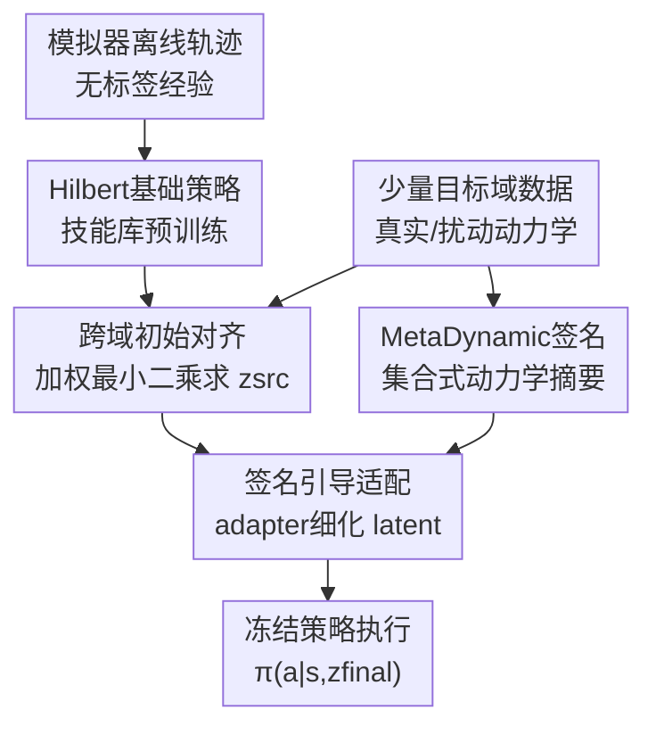

# Latent Adaptation of Foundation Policies for Sim-to-Real Transfer

**会议**: ICLR 2026  
**OpenReview**: [https://openreview.net/forum?id=yn9dzttHvT](https://openreview.net/forum?id=yn9dzttHvT)  
**论文**: [OpenReview Forum](https://openreview.net/forum?id=yn9dzttHvT)  
**代码**: 论文称实现与实验可用，但缓存中未给出具体仓库链接  
**领域**: 机器人 / Sim-to-Real / Foundation Policies  
**关键词**: sim-to-real迁移、基础策略、离线强化学习、隐空间适配、机器人运动控制

## 一句话总结
这篇论文提出 Found-adapt：先在模拟器离线轨迹上预训练可复用的 latent-conditioned foundation policy，再在部署时只用少量目标域数据修正隐变量 $z$，从而在不重训策略网络的情况下缓解机器人运动控制中的动力学 sim-to-real gap。

## 研究背景与动机
**领域现状**：机器人强化学习常见的部署路径仍然是先在模拟器中训练策略，再把策略迁移到真实世界或另一个高保真环境中。为了缩小模拟器和真实环境之间的差距，已有方法通常会做 domain randomization、domain adaptation、system identification、grounded action transformation 或 deployment-time policy adaptation，让策略在训练时见过更多动力学扰动，或者在部署时继续调整策略/动作映射。

**现有痛点**：这些方法的问题在于适配和任务策略本身绑得太紧。遇到新任务时，传统 sim-to-real 流程往往要先训练一个任务专属策略，再针对目标环境做适配；遇到新的摩擦、重力、执行器响应或传感噪声时，又要重新跑一轮昂贵的在线数据收集、系统辨识或策略更新。对真实机器人而言，这不仅消耗算力和时间，也会增加部署风险。

**核心矛盾**：sim-to-real 的根本矛盾不只是“模拟器不够准”，而是当前策略表示缺少可复用的中间层。一个会走路的人换到湿滑地面时，不会重新学习“走路”这个技能，而是调整步态和发力；传统 RL 策略却常常把技能学习和环境适配揉在同一个网络更新里，导致每换一个任务或动力学条件都像从头再来。

**本文目标**：作者希望把问题拆成两层：第一层是在源模拟器的大量无标签离线轨迹中学习一套长时程技能库，也就是 foundation policy；第二层是在目标环境中只用少量交互数据估计当前动力学差异，并把差异反映到隐变量上，而不是改动整个策略网络。

**切入角度**：论文借用了 Hilbert representation foundation policy 的结构：编码器 $\phi$ 把状态映射到 latent space，策略 $\pi(a|s,z)$ 由隐变量 $z$ 条件化，不同的 $z$ 对应不同技能方向。既然下游任务本来可以通过选择 $z$ 来 prompt 策略，那么 sim-to-real 也可以被看成“在目标动力学下重新选择和细调 $z$”的问题。

**核心 idea**：用少量目标域轨迹在隐空间里修正 foundation policy 的任务 latent，把昂贵的 policy retraining 变成轻量的 latent adaptation。

## 方法详解

### 整体框架
Found-adapt 的整体流程可以分成离线技能学习和部署时隐空间适配两段。离线阶段，方法用模拟器 $E_{sim}$ 中的无标签轨迹学习状态编码器 $\phi$ 和 latent-conditioned policy $\pi(a|s,z)$，让策略拥有一组可由 $z$ 调用的可复用运动技能；部署阶段，面对目标环境 $E_{tar}$ 的重力、摩擦等动力学变化，方法不更新 $\pi$，而是用少量目标域样本先求一个跨域对齐 latent $z_{src}$，再提取目标域 dynamics signature $\eta$，最后通过小型 adapter 得到 $z_{final}$。

这个框架的关键点是所有适配都围绕 latent 展开。策略网络和状态编码器在部署时保持冻结，目标域数据只用来求解和修正条件变量 $z$，因此它比重新训练一个任务策略或重新训练 sim-to-real module 更轻量，也更容易在多个任务之间复用。

### 关键设计
**1. Hilbert基础策略：把任务技能压进可求解的隐变量**

传统策略通常直接学习 $\pi(a|s)$，换任务时需要重训或 fine-tune；本文采用的 foundation policy 写成 $\pi(a|s,z)$，其中 $z$ 是控制策略行为方向的 latent。编码器 $\phi:S\rightarrow Z$ 把状态嵌入 Hilbert space，使 $\|\phi(s)-\phi(g)\|$ 近似反映状态到目标的时间距离。然后策略用内在奖励训练：$r(s,z,s')=\langle \phi(s')-\phi(s),z\rangle$，也就是鼓励状态转移沿着 latent direction 前进。

这样做的好处是，策略不再只对应一个任务，而是对应一族可由 $z$ 选择的行为原语。给定一个下游任务，只要找到能让转移特征 $\phi(s')-\phi(s)$ 拟合任务奖励的 $z^*$，就能得到一个 task-ready controller。论文把这个求解写成最小二乘：$z^*=\arg\min_z \mathbb{E}[(R(s,a,s')-\langle \phi(s')-\phi(s),z\rangle)^2]$。在矩阵形式下，令 $\Phi=[\phi(s'_1)-\phi(s_1),\ldots]^\top$、$r=[r_1,\ldots]^\top$，即可得到 $\hat z=(\Phi^\top\Phi)^{-1}\Phi^\top r$，再归一化为单位方向。这个封闭解是后续高效适配的基础。

**2. 跨域初始对齐：用目标域样本修正最小二乘的偏置**

直接把模拟器里求出的 $z$ 部署到真实环境会失败，因为转移分布变了。论文把这个问题明确写成特征矩阵的偏移：模拟器下有 $\Phi_{sim}$，目标动力学下变成 $\Phi_{real}=\Phi_{sim}+\Delta\Phi$；如果仍用 $\Phi_{sim}$ 求 latent，就会得到 $\hat z_{sim}$，而目标环境真正需要的是 $\hat z_{real}$。这说明 sim-to-real gap 会在 latent solution 层面表现为 $\Delta z=\hat z_{real}-\hat z_{sim}$。

Found-adapt 的第一步不是重训编码器 $\phi$，而是在固定 $\phi$ 的情况下，把源域样本和少量目标域样本放进一个加权联合回归：$\min_z \|\Phi_{sim}z-r_{sim}\|_2^2+\lambda\|\Phi_{tar}z-r_{tar}\|_2^2$。其中 $\lambda>1$ 让解更偏向目标域数据，但仍保留源域基础技能的先验。这个问题仍然有闭式解：把 $\Phi_{sim}$ 和 $\sqrt{\lambda}\Phi_{tar}$ 堆叠成 $A$，把奖励向量堆叠成 $b$，即可得到 $z_{src}=(A^\top A)^{-1}A^\top b$。这一步给出一个已经部分跨域校正的 latent，成本基本是一次小规模回归。

**3. MetaDynamic签名：用无序目标样本描述更高阶动力学差异**

只做加权最小二乘只能对齐一阶的转移-奖励关系，却不一定捕捉状态访问分布、轨迹结构和动力学模式的高阶变化。比如同样是 reward 拟合误差接近，强重力环境和摩擦扰动环境可能需要完全不同的 gait 调整；如果只看一个回归 latent，这些结构信息会被压得太粗。

为此，论文引入 MetaDynamic 网络，把目标域状态编码集合 $\{\phi(\tilde s_j)\}_{j=1}^M$ 压成 dynamics signature $\eta\in\mathbb{R}^K$。它采用 DeepSet 风格结构：每个状态编码先过一个 MLP，再做 mean pooling，最后用 projector 输出 $K=64$ 维签名。这里 permutation-invariant 很重要，因为目标域小批量数据本质上是一组采样状态，不应该因为样本顺序不同就改变环境描述。MetaDynamic 在模拟器的多种 gravity、friction、actuator-strength 扰动上预训练，损失由动力学类别交叉熵和 NT-Xent 对比损失组成，部署时冻结，只负责把当前目标环境的统计形状转成 $\eta$。

**4. 签名引导适配：只更新小 adapter，不动基础策略**

有了 $z_{src}$ 和 $\eta$ 后，Found-adapt 用一个小型参数化 adapter $g_\theta: \mathbb{R}^D\times\mathbb{R}^K\rightarrow\mathbb{R}^D$ 来细化 latent。这个 adapter 初始化成近似 identity，使一开始 $g_\theta(z_{src},\eta)\approx z_{src}$，避免一上来把已对齐的技能方向破坏掉。然后它只用目标域数据优化少量步，最小化 $L(\theta)=\frac{1}{M}\sum_j\|\Phi_{tar,j}g_\theta(z_{src},\eta)-\tilde r_j\|_2^2$。

最终 latent 写成 $z_{final}=\sqrt{D}\frac{g_{\theta^*}(z_{src},\eta)}{\|g_{\theta^*}(z_{src},\eta)\|}$，再送入冻结策略 $\pi(a|s,z_{final})$ 执行。这个设计把“适配目标动力学”限制在一个低容量、低风险的 latent correction 里：$z_{src}$ 提供任务和源域技能先验，$\eta$ 提供目标环境结构线索，adapter 负责把两者校准成当前环境真正可用的行为条件。

### 一个完整示例
以 Walker 的 walk 任务为例，基础策略已经在默认模拟器重力和摩擦下学会了多种运动技能。现在目标环境把重力从 $-9.8$ 改到 $-24$ 或 $-34$，直接用源域 latent 时，脚步节奏和身体姿态会明显失配，return 从模拟器内的高分落到较低水平。

Found-adapt 会先用少量目标域 rollouts 构造 $D_{tar}$。每个转移 $(\tilde s_j,\tilde a_j,\tilde s'_j,\tilde r_j)$ 经过冻结编码器后形成目标域特征行 $\Phi_{tar,j}=\phi(\tilde s'_j)-\phi(\tilde s_j)$。第一步把源域和目标域样本一起做加权回归，得到一个偏向当前重力条件的 $z_{src}$。第二步把目标域状态集合送进 MetaDynamic，得到“这是一个重力偏强、状态分布被压缩/扭曲的环境”的签名 $\eta$。第三步 adapter 根据 $z_{src}$ 和 $\eta$ 做几十到几百步小更新，把 latent 从 $z_{src}$ 平滑推到 $z_{final}$。论文的可视化显示，这个 latent shift 是连续稳定的；在一个案例里，目标环境 return 从使用 $z_{src}$ 的 383.51 提升到使用 refined latent 的 553.86。

### 损失函数 / 训练策略
预训练阶段分两部分。首先，状态编码器 $\phi$ 在模拟器离线轨迹上学习 Hilbert 表示，使状态间距离能表达长时程可达性或时间距离；其次，latent-conditioned policy 通过内在奖励 $r(s,z,s')=\langle\phi(s')-\phi(s),z\rangle$ 学到沿不同 latent direction 行动的技能族。实验设置中，foundation model 预训练使用 2,000,000 episodes， replay buffer 容量为 1,000,000 transitions，作为源域数据 $D_{src}$。

适配阶段不再训练策略 $\pi$。目标域数据来自预训练策略在目标环境中的少量交互，论文设置为 5,000 rounds。跨域初始对齐通过加权最小二乘得到 $z_{src}$；MetaDynamic 在模拟器的 12 种动力学变化上离线预训练，训练损失为 $L=L_{CE}+\alpha L_{NTXent}$，其中 $\alpha=0.1$；部署时 MetaDynamic 冻结。adapter 用目标域投影误差更新少量步，主表里的在线适配时间约 6 秒量级，明显低于需要任务专属训练或小时级代价的方法。

## 实验关键数据

### 主实验
论文采用 sim-to-sim 作为可复现实验协议：默认动力学作为 $E_{sim}$，通过改变 Walker 环境的 gravity 和 friction 构造 $E_{real}$。主比较包括 Direct-Transfer、Vanilla-GAT、UGAT、PAD 和 Found-adapt。表中括号内是相对源模拟器性能的 sim-to-real gap，数值越接近 0 越好。

| 设置 | 任务 | Direct-Transfer | PAD | Found-adapt | 观察 |
|------|------|-----------------|-----|-------------|------|
| G1 | Stand | 494.24 (-393.37) | 557.03 (-330.58) | 562.72 (-202.27) | Found-adapt return 最高，gap 最小 |
| G1 | Walk | 318.93 (-446.06) | 448.50 (-316.49) | 472.25 (-292.74) | Found-adapt 优于 PAD 和动作校准类方法 |
| G2 | Stand | 222.49 (-665.12) | 273.16 (-614.45) | 231.75 (-655.86) | 强扰动下 PAD 略高，但需要任务专属预训练 |
| G3 | Stand | 213.15 (-674.46) | 262.21 (-625.40) | 322.06 (-565.55) | Found-adapt 在更强重力下明显缩小 gap |
| G4 | Walk | 33.03 (-731.96) | 37.13 (-727.86) | 42.57 (-722.42) | 最难设置中提升较小但仍高于直接迁移 |

| 方法 | G1 Stand 时间 | G2 Stand 时间 | G3 Stand 时间 | G4 Stand 时间 | 备注 |
|------|---------------|---------------|---------------|---------------|------|
| Direct-Transfer | 5.06 s | 5.36 s | 5.14 s | 5.28 s | 无显式适配，性能 gap 大 |
| Vanilla-GAT | 7.59 s | 7.56 s | 7.71 s | 7.61 s | 训练动作 grounding 模块，波动较大 |
| UGAT | 9.15 s | 9.10 s | 9.10 s | 8.63 s | 加入不确定性拒绝机制，但不稳定 |
| PAD | - | - | - | - | 论文标注为 hour-scale，不直接可比 |
| Found-adapt | 6.22 s | 6.11 s | 6.08 s | 6.12 s | 只做 latent/adapter 级适配，代价接近直接迁移 |

摩擦扰动实验覆盖 F1 到 F6，并从 stand 扩展到 run。论文图 3 的趋势是：随着摩擦难度增加，所有方法的绝对 return 都下降，但 Found-adapt 相比直接迁移仍保持正向提升；图 4(b) 的二维响应面也显示，在 gravity 和 friction 同时变化时，Found-adapt 的红色表面基本位于 direct transfer 蓝色表面之上，尤其在强重力和中等摩擦组合下收益更明显。

### 消融实验
| 配置 | 使用组件 | 关键结果 | 说明 |
|------|----------|----------|------|
| F(init) | 只有跨域初始对齐 $z_{src}$ | easy stand 上可取得较好表现，但其他任务方差较大 | 只修正一阶转移拟合，不足以描述高阶动力学变化 |
| F(dyna) | 只有 MetaDynamic 签名 $\eta$ | 整体表现偏弱 | 单靠环境签名难以直接生成有效任务 latent |
| F(init+dyna) | 简单合并 $z_{src}$ 与 $\eta$，无 adapter | 在部分设置中最差 | 未校准的任务 latent 和环境签名混合后互相干扰 |
| F(all) | $z_{src}$ + $\eta$ + adapter | 在 friction 和 gravity 消融中整体最好 | adapter 把签名变成对 latent 的可用修正，降低 bias 和 variance |

### 关键发现
- Found-adapt 不是在所有单元格都绝对第一，但在多种 gravity 和 friction 扰动下稳定处于 top-2，且比 Direct-Transfer 明显缩小 sim-to-real gap；这对“多任务 + 多动力学，不重训策略”的目标更重要。
- PAD 在某些重力设置下能接近或超过 Found-adapt，但它需要任务专属预训练，更新也和下游行为绑定；Found-adapt 的优势是用同一个 foundation representation 覆盖 stand、walk、run、flip 等任务。
- 数据质量实验显示，目标域数据少并不一定致命：drop corruption 在低于 50% 时只造成轻微下降，说明 dynamics signature 和 adapter 对样本稀疏有一定鲁棒性；相比之下，mask 把缺失值填 0 会较早崩溃，因为它向平方损失注入系统性偏置。
- 噪声在重腐蚀时会持续伤害性能，尤其对 run/flip 这类接触和时序更敏感的技能影响更大；实践上，论文建议宁可丢弃可疑数据，也不要用零填充伪造完整轨迹。
- adapter loss 和目标域性能改善存在显著单调相关。论文在 stand 任务中记录 60 个适配步骤，发现 $-loss$ 增大时 sim-to-real improvement 也随之上升，说明 Eq. 5 的投影误差确实和真实部署回报相关，而不只是一个离线拟合指标。

## 亮点与洞察
- 把 sim-to-real 重新表述成 latent solution mismatch 是这篇论文最清楚的技术切口。它没有笼统说“真实环境分布变了”，而是指出 $\Phi_{real}=\Phi_{sim}+\Delta\Phi$ 会让最小二乘求出的 $z$ 发生偏移，从而把动力学差异落到一个可优化的变量上。
- 方法充分利用了 foundation policy 的结构优势。既然 Hilbert foundation policy 已经能通过 $z$ 做 task prompting，那么把环境适配也放到 $z$ 上，是一个自然且工程上省成本的延伸。
- MetaDynamic 的 permutation-invariant 设计很实用。目标域数据往往是少量、无固定顺序的 rollouts 片段，把它们当作集合而不是时间序列，可以让环境签名更关注分布统计而非采样排列。
- 消融结果给出了一个有价值的警示：环境签名不是越多越好，直接拼接 $z_{src}$ 和 $\eta$ 甚至会变差；必须有 adapter 这种校准层，把“当前环境是什么样”转成“latent 应该往哪里挪”。
- 这个范式可以迁移到其他机器人任务。只要底层策略能表示成 latent-conditioned controller，并且任务奖励能在转移特征上做近似线性投影，就可以尝试用小批量目标域数据做 latent-level adaptation，而不是直接 fine-tune 大策略。

## 局限与展望
- 论文主要采用 sim-to-sim 评估，而不是真实机器人硬件实验。虽然这种协议可控、可复现，也常用于 sim-to-real 方法验证，但真实传感噪声、接触不确定性、延迟和安全约束可能带来更复杂的 gap。
- Found-adapt 的收益随环境和任务变化而波动。在最难重力设置 G4 上，walk 的绝对提升仍然有限，说明当目标动力学严重超出基础策略技能覆盖范围时，只调 latent 可能不够。
- 方法依赖目标域数据的质量。drop 相对可接受，但 mask 和 heavy noise 会显著伤害 adapter；真实机器人采集的数据如果存在传感器漂移、奖励误标或接触异常，需要额外的数据清洗、鲁棒损失或 uncertainty-aware objective。
- 加权回归里的 $\lambda$、adapter 更新步数、MetaDynamic 的动力学扰动覆盖范围都会影响表现。作者也承认不同任务可能需要仔细调参，未来可以考虑自适应权重、正则化到 $z_{src}$ 的 latent refinement，或把不确定性加入适配目标。
- 目前方法基于状态特征，距离视觉机器人部署还有一步。若要面向真实移动机器人或机械臂，需要把视觉编码器、视觉噪声和部分可观测状态纳入 foundation policy 与 MetaDynamic 签名。

## 相关工作与启发
- **vs Domain Randomization**: Domain randomization 试图在训练阶段覆盖足够宽的动力学分布，让策略部署时自然泛化；Found-adapt 则先学一个可复用技能库，部署时根据少量目标域数据调整 latent。前者训练成本和覆盖范围压力更大，后者在目标域变化时更轻量，但依赖基础策略和 latent 表示质量。
- **vs Grounded Action Transformation / UGAT**: GAT 类方法通过 forward/inverse model 校准动作，让源策略输出的动作更适合目标环境；Found-adapt 不直接修动作，而是修条件策略的 latent，因此更接近“换一种技能调用方式”。实验中 GAT/UGAT 在若干设置下方差较大，说明动作级校准不一定能稳定处理多任务 foundation policy。
- **vs Rapid Motor Adaptation / UP-OSI**: RMA 和 UP-OSI 也会从近期观测推断隐式动力学变量，但通常和任务策略共同训练，适合特定任务的在线适配。Found-adapt 的差别在于策略先作为 task-agnostic foundation policy 预训练，后续只做 latent-level correction，更强调跨任务复用。
- **vs PAD**: PAD 在部署时自监督更新策略以适应目标环境，某些设置下性能很强，但需要任务专属预训练且代价更高。Found-adapt 的目标不是在单任务上压过所有 deployment adaptation，而是在不为每个任务重训的条件下获得足够稳定、快速的 sim-to-real 改善。
- **启发**: 对大规模机器人策略而言，未来的 sim-to-real 不一定都要 fine-tune policy backbone。一个更可扩展的方向是预训练丰富的技能 latent space，再为每个硬件、场地或动力学状态学习轻量的 latent adapter，这和语言/视觉基础模型中的 prompt/adaptor 思路非常接近。

## 评分
- 新颖性: ⭐⭐⭐⭐☆ 把 Hilbert foundation policy 的 task prompting 扩展到 sim-to-real latent adaptation，思路自然但问题表述很清晰。
- 实验充分度: ⭐⭐⭐⭐☆ 覆盖 gravity、friction、多任务、消融和数据质量分析，但仍缺少真实硬件验证。
- 写作质量: ⭐⭐⭐⭐☆ 方法公式和组件关系较完整，个别实验图表的具体数值没有全部展开，读者需要结合图理解。
- 价值: ⭐⭐⭐⭐☆ 对机器人 foundation policy 部署很有启发，尤其适合需要快速跨动力学适配、又不希望反复重训策略的场景。

<!-- RELATED:START -->

## 相关论文

- [\[CVPR 2026\] GeCo-SRT: Geometry-aware Continual Adaptation for Cross-Task Sim-to-Real Transfer](../../CVPR2026/robotics/geco-srt_geometry-aware_continual_adaptation_for_cross-task_sim-to-real_transfer.md)
- [\[ICLR 2026\] D-REX: Differentiable Real-to-Sim-to-Real Engine for Learning Dexterous Grasping](d-rex_differentiable_real-to-sim-to-real_engine_for_learning_dexterous_grasping.md)
- [\[ICLR 2026\] RobotArena ∞: Scalable Robot Benchmarking via Real-to-Sim Translation](robotarena_infty_scalable_robot_benchmarking_via_real-to-sim_translation.md)
- [\[CVPR 2026\] Opening the Sim-to-Real Door for Humanoid Pixel-to-Action Policy Transfer](../../CVPR2026/robotics/opening_the_sim-to-real_door_for_humanoid_pixel-to-action_policy_transfer.md)
- [\[NeurIPS 2025\] Generalizable Domain Adaptation for Sim-and-Real Policy Co-Training](../../NeurIPS2025/robotics/generalizable_domain_adaptation_for_sim-and-real_policy_co-training.md)

<!-- RELATED:END -->
