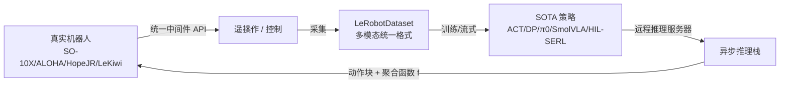

# LeRobot: An Open-Source Library for End-to-End Robot Learning

**会议**: ICLR 2026  
**OpenReview**: [https://openreview.net/forum?id=CiZMMAFQR3](https://openreview.net/forum?id=CiZMMAFQR3)  
**代码**: [https://github.com/huggingface/lerobot](https://github.com/huggingface/lerobot)  
**领域**: 机器人学习 / 具身智能 / 开源基础设施  
**关键词**: robot learning, open-source library, imitation learning, VLA, asynchronous inference, LeRobotDataset  

## 一句话总结
LeRobot 是 Hugging Face 推出的端到端机器人学习开源库，从底层电机中间件、统一多模态数据集格式、解耦异步推理栈到一系列 SOTA 策略实现一体打通，把分散、闭源、各自为政的机器人学习工具栈整合成一个可复现、低门槛的垂直集成平台。

## 研究背景与动机
**领域现状**：机器人学正从依赖刚体运动学、接触建模、规划等解析"显式模型"的经典范式，转向用数据学习"隐式模型"——直接把观测映射到动作的单体策略。这一转向的核心红利是**可扩展性**：性能随数据量和算力增长而提升，与视觉、语言、多模态领域的 scaling 趋势一脉相承。低成本遥操作硬件（SO-10X、ALOHA-2 等可低至工业臂的零头）和大规模开放数据集进一步加速了这一进程。

**现有痛点**：机器人学习生态**严重碎片化**，把研究者的精力从科学问题大量转移到系统集成上。具体表现为三处割裂——（1）**中间件割裂**：高到低层控制接口往往为特定机器人定制，难以迁移，团队被迫各自造适配层；（2）**数据格式割裂**：数据散落在 TensorFlow Datasets、ROS bag、各种 JSON 布局里，缺乏统一的富模态 schema，无法把异构数据集聚合成更大的混合数据；（3）**学习框架割裂**：算法、数据处理、评估管线的细微实现差异会导致结果显著波动，再叠加硬件差异，复现性雪上加霜。

**核心矛盾**：机器人学习方法本身在快速进步，但**支撑这些方法落地的工具栈却分散、闭源、不可复现**，抬高了入门门槛，拖慢了整个领域的迭代速度。

**本文目标**：提供一个端到端、开放、可扩展的库，统一硬件接口、数据采集/存储/流式、策略训练与部署，把工程开销降到最低。

**核心 idea**：**【垂直集成】**——不做某一个子模块的"更好版本"，而是横跨整个机器人学习栈（中间件→数据→推理→算法）做统一抽象，以**可访问性、可扩展性、开放性**三原则降低进入门槛，并强调"随数据和算力直接变好"的可扩展学习路线而非手工技巧。

## 方法详解

### 整体框架
LeRobot 不是一个算法，而是一套覆盖完整栈的库，由四块垂直集成的组件拼成：底层是**统一机器人中间件**（直接对接 FeeTech / Dynamixel 等低成本舵机 SDK，向上暴露一致的 Python API）；中间是 **LeRobotDataset** 这一统一多模态数据格式（采集、存储、流式）；再上是**解耦异步推理栈**（把动作预测和动作执行在物理与逻辑两个层面分开）；最顶层是一批纯 PyTorch 实现的 **SOTA 策略**（覆盖 RL 与模仿学习多个范式）。

### 关键设计
**1. 统一机器人中间件：一套 API 适配多种本体。** LeRobot 用一层共享中间件把 SO-100/101、Koch-v1.1、ALOHA-2、Hope-JR 人形臂、Stretch-3、LeKiwi、Reachy-2 等异构平台统一到一致的 Python 接口下。它直接对接 FeeTech 和 Dynamixel 两大低成本舵机厂商的底层 SDK，向上则封装成高层抽象，既能"读 leader 机器人的关节配置写到 follower 上"实现遥操作，也能让学习到的策略直接控制 follower。中间件刻意设计成**可扩展、可组合**，新增本体只需补适配而不必重写上层。配套的低成本硬件（SO-100 约 225 美元、LeKiwi 约 230 美元，对比 ALOHA 约 2.1 万、工业 Franka 臂更贵）让大规模去中心化数据采集成为可能。

**2. LeRobotDataset：可扩展的统一多模态数据 schema。** 针对数据格式碎片化，LeRobot 定义了一套自包含的多模态格式，统一容纳高频本体感知读数、多路相机流、遥操作状态信号，并内嵌任务文本描述（支持语言条件策略与过滤）、机器人本体规格、FPS、传感器类型等元数据。设计的首要原则是**可扩展性**——架构面向潜在含数百万条专家轨迹的大规模仓库优化，并与 PyTorch 生态无缝衔接。关键的**流式能力**让用户无需下载整个语料就能处理远端托管的大规模数据集（`StreamingLeRobotDataset` 顺序 `.next()` 取帧），进一步降低门槛。截至 2025 年 9 月，已有 2.2K+ 贡献者通过该格式公开共享 16K+ 数据集，其中 SO-10X 平台贡献了 50%+ 的数据集数量。

**3. 解耦异步推理栈：把"预测"和"执行"在物理与逻辑两层拆开。** 现代策略越来越多地预测**动作块** $a_{t:t+H-1}$ 而非单步控制，LeRobot 据此设计了一套解耦推理栈。**物理解耦**让推理跑在通过网络连接机器人底层控制器的远程机器上，从而用上远超机载算力的高端计算资源，而控制端仍以期望频率逐步执行收到的动作。**逻辑解耦**采用异步生产者-消费者模式：推理进程以前瞻视界 $H$ 并行预测动作序列，控制进程则以固定频率消费动作；重叠的预测通过一个用户可自定义的广义聚合函数 $f$ 合并，保证动作队列非空、机器人不空转，把动作预测和动作执行叠在一起跑。这套设计对部署的鲁棒性和运行时动态适应至关重要。

**4. 纯 PyTorch 的 SOTA 策略库：从零训练与复用预训练并重。** LeRobot 提供多范式参考实现作为可复现 baseline：RL 侧有 HIL-SERL、TD-MPC；模仿学习单任务侧有 ACT、Diffusion Policy、VQ-BET；多任务侧有 π0、SmolVLA 等 VLA 模型。所有策略均为纯 PyTorch，配套可组合的"recipe"，**从零训练一个模型不到 100 行代码、部署一个模型不到 40 行代码**。库覆盖从轻量单任务（ACT 仅 52M，凭 50 条真实轨迹就能训出可用策略）到大规模多任务（π0 达 3.5B，靠语言条件控制真实机器人）的不同算力档位，兼顾"从真实演示从零训练"和"直接复用开放预训练模型"两条路径。

## 实验关键数据
本文是系统/库论文，"实验"以系统度量（内存、延迟）和生态统计（下载量、数据集数）为主，而非传统的精度对比。

### 主实验表格（推理延迟，100 次前向平均，ms）

| 模型 | 参数量 | CPU(M1) | MPS | RTX 4090 | A100 |
|---|---|---|---|---|---|
| ACT | 52M | 182.3±40.8 | 42.7±10.1 | 5.01±0.06 | 13.77±0.45 |
| Diffusion Policy | 263M | (100% 超时) | 3453.8±39.3 | 369.8±0.2 | 613.9±10.2 |
| π0 | 3.5B | (100% 超时) | (100% 超时) | 209.4±2.8 | 569.0±2.9 |
| SmolVLA | 450M | 2028.5±302.6(2%超时) | 721.8±57.7 | 99.2±1.2 | 278.8±1.9 |

注：扩散/流模型推理用 10 步去噪，硬超时 5000ms。

### 消融实验表格（峰值内存，fp32）

| 模型 | 参数量 | CPU | MPS | RTX 4090 | A100 |
|---|---|---|---|---|---|
| ACT | 52M | 817.4MB | 462MB | 211.2MB | 211.2MB |
| Diffusion Policy | 263M | 1.22GB | 224MB | 1.12GB | 1.12GB |
| π0 | 3.5B | 4.13GB | 97MB | 13.32GB | 13.32GB |
| SmolVLA | 450M | 1.69GB | 555MB | 1.75GB | 1.75GB |

### 关键发现
- **小模型可端侧实时**：ACT 在 RTX 4090/A100 上达约 100-200Hz 推理，MPS 后端也高效；而 π0 这类基础模型在低端设备上甚至无法在 5s 内完成一次前向，凸显机器人基础模型落地的真实挑战。
- **生态规模即贡献**：截至 2025-09，16K+ 数据集、2.2K+ 贡献者，SO-10X 贡献过半数据集，印证"低成本硬件 + 统一格式 → 去中心化大规模采集"的飞轮。
- **下载量分布**：Franka Panda（187 万次）、xArm（110 万次）等研究型集中采集平台下载量领先，而 SO-10X 在去中心化社区努力中数据集数量激增，两种模式共存。
- 还原生支持 LIBERO 与 Meta-World 两大仿真基准，用于策略的系统化评测（库的核心仍是真实数据训练，仿真主要服务于算法评估）。

## 亮点与洞察
- **"整合"本身就是贡献**：在一个方法层快速迭代但工具层支离破碎的领域，把整条栈做成可复现、低门槛的统一平台，对社区的杠杆效应远超又一个 SOTA 算法。
- **可访问性是第一性原理**：从 200 美元级 3D 打印硬件、流式数据集到"<100 行训练、<40 行部署"的 recipe，每一处设计都在压低进入门槛，并由此驱动去中心化数据飞轮。
- **解耦推理栈直面真实部署痛点**：动作块预测 + 物理/逻辑双解耦 + 可自定义聚合函数 $f$，把"机载算力不足"和"推理-控制速率不匹配"两个工程难题系统性地化解。
- **诚实的系统度量**：用内存/延迟表直接暴露 π0 等大模型在低端设备上的不可用性，而非粉饰，为从业者提供了真实的部署参考。

## 局限与展望
- **机器人覆盖仍不完整**：2025 年从 3 种本体扩到 8 种，但相对庞大的硬件生态仍远非穷尽，arm/gripper/sensor/controller 的支持是个持续工程。
- **算法覆盖非穷尽**：跨关键范式提供了强 baseline，但更多算法的纳入仍是未来工作。
- **缺底层推理优化**：量化、图编译等能进一步压低延迟的低层优化目前尚未纳入，大模型实时部署仍受限。
- 作者以开源精神把这些都视为"可被社区贡献填补"的具体、可行的方向。

## 相关工作与启发
- **方法栈**：模仿学习侧承接 ACT（CVAE）、Diffusion Policy（扩散）、π0/SmolVLA（Flow Matching VLA）；RL 侧承接 SAC、RLPD、HIL-SERL、TD-MPC，把多范式收进同一库。
- **硬件/数据生态**：建立在 SO-10X、ALOHA-2、Koch 等低成本开源硬件之上，与 Open X-Embodiment、DROID 等集中式大规模采集形成"集中 vs 去中心化"互补。
- **启发**：(1) 在一个被碎片化拖慢的领域，一个设计良好的统一开源库可能是最高 ROI 的研究基础设施投入；(2) "硬件可访问性 → 数据飞轮 → 模型生态"是可被工具设计主动放大的正反馈；(3) 解耦异步推理的思路对任何"重推理 + 实时控制"的具身系统都有借鉴价值。

## 评分
- 新颖性: ⭐⭐⭐⭐ — 单看每个组件并非首创，但"垂直整合整条机器人学习栈 + 统一数据格式 + 解耦异步推理"的系统性整合在开源生态中独此一家，且已形成规模化社区影响。
- 实验充分度: ⭐⭐⭐⭐ — 作为系统论文，内存/延迟跨四平台度量扎实、生态统计翔实；但缺少跨库的策略精度横向对比。
- 写作质量: ⭐⭐⭐⭐ — 动机清晰、结构工整、图表丰富，把"为什么需要整合"讲得很透。
- 价值: ⭐⭐⭐⭐⭐ — 已成为机器人学习社区的事实标准基础设施之一，对降低入门门槛和提升复现性具有长期、广泛的实际价值。

<!-- RELATED:START -->

## 相关论文

- [\[ICLR 2026\] RAVEN: End-to-end Equivariant Robot Learning with RGB Cameras](raven_end-to-end_equivariant_robot_learning_with_rgb_cameras.md)
- [\[ICLR 2026\] End-to-end Listen, Look, Speak and Act](end-to-end_listen_look_speak_and_act.md)
- [\[CVPR 2026\] RoboTAG: End-to-end Robot Pose Estimation via Topological Alignment Graph](../../CVPR2026/robotics/robotag_end-to-end_robot_pose_estimation_via_topological_alignment_graph.md)
- [\[CVPR 2026\] End-to-End Language-Action Model for Humanoid Whole Body Control](../../CVPR2026/robotics/end-to-end_language-action_model_for_humanoid_whole_body_control.md)
- [\[NeurIPS 2025\] SutureBot: A Precision Framework & Benchmark for Autonomous End-to-End Suturing](../../NeurIPS2025/robotics/suturebot_a_precision_framework_benchmark_for_autonomous_end-to-end_suturing.md)

<!-- RELATED:END -->
