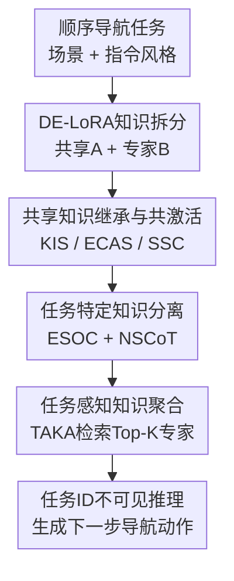

# Lifelong Embodied Navigation Learning

**会议**: ICLR2026  
**OpenReview**: [https://openreview.net/forum?id=PaYo96rjij](https://openreview.net/forum?id=PaYo96rjij)  
**代码**: https://github.com/WangXudongSIA/Uni-Walker  
**领域**: 机器人 / 具身导航 / 终身学习  
**关键词**: 具身导航, 终身学习, 灾难性遗忘, LoRA专家, 导航推理  

## 一句话总结
本文提出 Lifelong Embodied Navigation Learning 任务和 Uni-Walker 框架，让 LLM 驱动的具身导航代理按顺序学习 VLN、OLN、DUN 等多类导航任务时，既能吸收新场景和新指令风格，又能显著降低旧任务遗忘。

## 研究背景与动机
**领域现状**：具身导航正在从单一任务走向通用导航代理。早期 VLN 主要要求 agent 按照一步步自然语言指令在室内环境中移动；OLN 更强调根据简短目标描述寻找远处物体；DUN 则要求 agent 从多轮对话里推断用户真正想去哪里。近年的 NaviLLM、SAME、OctoNav 等方法把视觉编码器和大语言模型结合起来，用多任务联合训练获得更通用的导航能力。

**现有痛点**：这些通用导航代理通常假设训练数据一次性可见，或者至少任务分布相对固定。真实机器人部署时更像连续上线：今天进入新房间，明天遇到物体定位指令，后天又要理解用户对话。如果直接顺序微调，模型会把早期场景和指令风格忘掉；如果每个任务单独存一套 LoRA，又很难复用旧任务里已经学到的通用导航知识。

**核心矛盾**：终身导航里的难点不是简单地“多学几个任务”，而是要同时满足两件互相牵制的事。一方面，新任务需要快速吸收新场景布局和新指令风格；另一方面，旧任务中已经学到的路线跟踪、目标定位、视觉-语言对齐等知识不能被覆盖。现有 MoE-LoRA 或 HydraLoRA 类方法可以做专家化适配，但通常专家数量固定，且并没有针对导航任务里的场景相似性、指令风格相似性和测试时任务 ID 不可见这几个问题专门设计。

**本文目标**：作者把这个问题 formalize 为 Lifelong Embodied Navigation Learning，要求 agent 顺序学习多个导航任务，每个任务由一个不重叠的 3D 场景和一种用户指令风格组成；训练时知道任务编号，测试时不知道任务编号；最终所有旧任务和未见场景都要一起评估。目标是在低额外存储开销下构建一个会持续进化的通用导航代理。

**切入角度**：本文的观察是，导航知识可以拆成两类：一类是跨任务共享的知识，例如视觉观察如何与语言目标对齐、如何根据历史轨迹判断当前位置；另一类是任务特有的知识，例如某个场景的布局、某类指令风格下应该怎么组织推理。Uni-Walker 围绕这个拆分来设计参数空间：共享知识放进公共子空间，任务特有知识放进逐步扩展的专家子空间。

**核心 idea**：用可扩展的 Decoder Extension LoRA 把导航知识拆成共享子空间 $A$ 和任务专家子空间 $B_t$，再用知识继承、专家共激活、正交约束、导航专用 CoT 和任务感知检索，把“学新任务”和“少忘旧任务”合成同一个终身导航流程。

## 方法详解
### 整体框架
Uni-Walker 以 NavLLM 风格的多模态导航代理为底座：视觉观察由 CLIP/EVA-CLIP 编码，语言指令输入 LLM，模型自回归生成下一步动作。不同之处在于，本文不把每个新任务当成一次孤立微调，而是在每次遇到新任务时扩展一个新的 LoRA decoder expert，并让它和共享 encoder 子空间、旧专家、任务检索索引一起工作。

整个流程可以分成训练和推理两条线。训练时，任务 $T_t$ 到来后，系统新增专家 $B_t$，用同指令风格的旧专家初始化它，同时通过共激活旧专家和稳定共享子空间来迁移旧知识；推理时，测试样本没有任务 ID，TAKA 会先用指令和观察检索最相关的旧任务，再激活 Top-K 专家完成导航。

### 关键设计
**1. DE-LoRA知识拆分：把“会导航”和“会这个任务”放到不同子空间**

普通 LoRA 在每一层学习一个低秩更新 $\Delta W = BA$，本文把这个结构重新解释为一个知识分解器：共享子空间 $A$ 负责跨任务共用的导航能力，每个任务扩展一个 decoder expert $B_t$ 负责当前任务特有的知识。第 $t$ 个任务的前向更新可以写成 $y = W_0x + \sum_{n=1}^{K} B_{t,n}Ax$，其中被激活的多个 $B$ 专家和共享 $A$ 共同组成适配权重。

这个设计针对的是“单任务 LoRA 太孤立、固定专家 MoE 又不适合终身扩展”的问题。新任务到来时只新增一个 $B_t$，共享 $A$ 不断被精炼，因此模型不是简单地堆一串互不相干的适配器，而是在一个稳定骨架上逐步长出新专家。作者还估算了存储成本：每个任务约增加 $2.1$ MB 的 LoRA expert 和同等大小的 Fisher 矩阵，即使超过 $100$ 个任务，总额外存储也约 $0.4$ GB，对 7B/13B 级导航 LLM 来说相对可控。

**2. 共享知识继承与共激活：让新任务从相似旧经验起步，而不是从零起步**

KIS 解决的是新专家初始化问题。若当前任务的指令风格与若干旧任务相同，作者把这些旧专家参数展平成向量，构成矩阵 $M=[\theta_i,\ldots,\theta_j]$，再用 PCA 找到主要变化方向。新专家不只取旧专家均值 $\mu$，还沿 top-$r$ 主成分方向移动，初始化为 $B_t \leftarrow \text{mat}(\mu + \frac{1}{r}\sum_{k=1}^{r}u_k)$。直观地说，同为 VLN 的旧任务会告诉新 VLN 任务“怎样跟踪逐步指令”，同为 OLN 的旧任务会告诉新 OLN 任务“怎样从目标描述推断搜索方向”。

ECAS 和 SSC 则分别处理“训练时怎么用旧专家”和“共享子空间怎么别乱漂”。ECAS 在训练当前任务时共激活 Top-K 相关专家，其中新专家 $B_t$ 可训练，旧专家只参与前向计算但参数冻结，让模型能借用旧知识而不直接改坏旧知识。SSC 用 Fisher Information Matrix 标出共享子空间 $A$ 中对上一任务重要的参数，并惩罚 $A'$ 相对旧 $A$ 的大幅偏移，形式为 $L_{ssc,t}=\lambda_{ssc}\|F_{A,t-1}\odot(A'-A)\|_F^2$。这样共享空间仍能学习新规律，但在旧任务关键方向上移动更谨慎。

**3. 任务特定知识分离：用正交专家和导航专用 CoT 避免指令风格混在一起**

如果所有专家都学到相似方向，扩展专家数量并不会真正带来任务专长。ESOC 因此约束当前专家 $B_t$ 与旧专家尽量正交：先把专家归一化到单位球面，再最小化 $L_{esoc,t}=\lambda_{esoc}\sum_{i=1}^{t-1}|\text{tr}(\tilde B_i^T\tilde B_t)|$。这里的正交不是为了数学洁癖，而是为了让新专家把容量花在旧专家没有覆盖的场景布局、目标类型或指令模式上。

NSCoT 进一步把“任务特定”落实到推理提示。VLN 的 CoT 重点是跟踪用户给出的逐步路线，OLN 的 CoT 重点是根据当前观察和历史轨迹推断目标物体位置，DUN 的 CoT 则先从对话历史里解析用户意图，再决定导航动作。这个设计对 LLM 导航很关键，因为同样一句“turn left”在路线跟随、物体搜索和对话纠错语境里承担的推理角色不同；统一模板会让模型忽略指令风格中的结构差异。

**4. TAKA任务感知聚合：测试时不知道任务 ID，也能找回该用的专家**

LENL 的测试条件比普通 continual learning 更贴近真实部署：模型不能被告知当前属于第几个任务。TAKA 为每个已学任务保存两类检索嵌入：场景观察嵌入 $E_{S,t}$ 和指令嵌入 $E_{I,t}$。推理时，当前观察 $O_q$ 和指令 $I_q$ 分别经 CLIP 视觉/文本编码器得到 $E_o$ 与 $E_i$，先用指令相似度生成 mask，再在被 mask 保留的候选里按观察相似度选择 Top-K 专家。

这个两阶段匹配比只看指令或只看观察更稳。只看指令容易把不同房间里的同类目标混在一起，只看观察又可能忽略“逐步路线、找物体、理解对话”之间的风格差异。TAKA 的 mixed matching 本质上先问“这像哪类用户意图”，再问“这像哪个场景经验”，因此能在任务 ID 不可见和未见场景泛化时复用最相关的专家。

### 一个完整示例
假设 agent 之前已经依次学过若干 VLN、OLN 和 DUN 任务，现在进入一个新 OLN 场景，用户只说“find a white double bed in the bedroom on the right”。训练阶段会为这个场景新增专家 $B_t$，并从历史 OLN 专家中抽取同指令风格的主成分来初始化它，而不是从随机矩阵开始。

在一次导航决策中，视觉编码器看到当前全景候选方向，文本编码器读取“white double bed”和“bedroom on the right”。TAKA 先发现这条指令更像 OLN，而不是逐步路线跟随；随后它再用当前观察与历史场景嵌入比较，激活与当前房间布局最相关的 $K=2$ 个专家。前向时，新专家负责吸收当前场景特有信息，旧 OLN 专家提供目标搜索经验，NSCoT 则引导 LLM 先推断目标房间和物体，再从候选视角中选择下一步动作。

如果换成 DUN，用户可能说“A: I am at the stairs, do I climb up or turn left? B: Go up the stairs...”。这时 TAKA 会因为指令/对话嵌入切换到 DUN 相关专家，NSCoT 也会从“对话里谁在描述目标、谁在给建议、最终意图是什么”开始推理，而不是把它当作普通逐步路线照读。

### 损失函数 / 训练策略
Uni-Walker 的训练目标由三部分组成。第一部分是导航动作的自回归生成损失，给定当前观察 $O$ 和指令 $I$，最大化标注动作序列的概率；第二部分是共享平滑巩固损失 $L_{ssc,t}$，用 Fisher 矩阵保护对旧任务重要的共享子空间参数；第三部分是专家正交损失 $L_{esoc,t}$，减少当前专家与旧专家的知识重叠。

总损失写作 $L_t = -\lambda\sum_{n=1}^{N}\log P_t(A_n,\hat P_n|I,O)+L_{ssc,t}+L_{esoc,t}$。实验中 LoRA rank 为 $r=16$，Top-K 激活专家数为 $K=2$，指令相似度阈值 $\mu=0.5$，$\lambda_{ssc}=0.1$，$\lambda_{esoc}=0.1$，Fisher 平滑系数 $\omega=0.9$。底座使用 Vicuna-7B-v0 和 EVA-CLIP-02-Large，训练 $2000$ steps，batch size 为 $64$。

## 实验关键数据

### 主实验
作者构建了一个 LENL benchmark，基于 Matterport3D simulator，包含 $18$ 个顺序任务、$18$ 个互不重叠场景和三种指令风格。前 $15$ 个任务用于终身学习，后 $3$ 个任务用于未见场景泛化；测试时任务 ID 不提供。指标包括 SR、SPL、OSR 以及对应的遗忘率 SR-F、SPL-F、OSR-F。

| 方法 | Avg SR ↑ | Avg SR-F ↓ | Avg SPL ↑ | Avg SPL-F ↓ | Avg OSR ↑ | Avg OSR-F ↓ |
|------|----------|------------|-----------|-------------|-----------|-------------|
| Seq-FT | 12 | 85 | 8 | 88 | 24 | 73 |
| HydraLoRA | 27 | 63 | 19 | 72 | 37 | 57 |
| BranchLoRA | 30 | 58 | 20 | 70 | 41 | 53 |
| O-LoRA + TAKA | 58 | 17 | 37 | 44 | 77 | 9 |
| SD-LoRA + TAKA | 59 | 16 | 38 | 42 | 79 | 7 |
| Uni-Walker | 66 | 5 | 61 | 7 | 81 | 5 |

这张表最关键的信息是遗忘率的变化。Seq-FT 的 Avg SR 只有 $12\%$，SR-F 达到 $85\%$，说明顺序微调几乎只记住后面的任务。SD-LoRA + TAKA 已经是很强的动态组合基线，但 Uni-Walker 仍把 Avg SR 从 $59\%$ 提到 $66\%$，同时把 SR-F 从 $16\%$ 压到 $5\%$。SPL 的提升更明显，从 $38\%$ 到 $61\%$，说明它不只是偶尔到达目标，路径效率也更好。

| 方法 | S16 未见 VLN | S17 未见 OLN | S18 未见 DUN | Avg SR ↑ |
|------|--------------|--------------|--------------|----------|
| HydraLoRA | 18 | 14 | 16 | 16.0 |
| BranchLoRA | 28 | 20 | 15 | 21.0 |
| O-LoRA + TAKA | 65 | 53 | 36 | 51.3 |
| SD-LoRA + TAKA | 68 | 55 | 48 | 57.0 |
| Uni-Walker | 74 | 61 | 51 | 62.0 |

未见场景泛化也支持同一结论。Uni-Walker 在 S16/S17/S18 三个保留任务上分别达到 $74\%$、$61\%$、$51\%$ SR，平均 $62\%$，比 SD-LoRA + TAKA 高 $5$ 个点。由于这些任务没有参与终身训练，这说明 DE-LoRA 学到的共享知识和 TAKA 的专家检索确实能跨场景迁移，而不只是记住训练场景。

### 消融实验
| 配置 | SR ↑ | SR-F ↓ | SPL ↑ | SPL-F ↓ | OSR ↑ | OSR-F ↓ | 说明 |
|------|------|--------|-------|---------|-------|---------|------|
| Baseline | 55.7 | 21.1 | 37.0 | 45.0 | 76.7 | 8.7 | 不使用共享知识探索组件 |
| w/o KIS | 60.3 | 14.2 | 50.2 | 23.9 | 77.6 | 7.7 | 新专家缺少同风格旧知识初始化 |
| w/o SSC | 59.7 | 15.1 | 44.7 | 30.6 | 77.9 | 7.3 | 共享子空间更容易被新任务拉偏 |
| w/o ECAS | 58.1 | 17.4 | 44.7 | 32.3 | 78.3 | 6.9 | 训练当前任务时不能充分借用旧专家 |
| Uni-Walker | 67.3 | 4.3 | 62.3 | 5.7 | 81.3 | 3.5 | 完整共享知识建模 |

共享知识组件的消融显示，KIS、ECAS 和 SSC 都不是装饰项。去掉 ECAS 后 SR 从 $67.3\%$ 降到 $58.1\%$，说明旧专家在训练新任务时参与前向计算很重要；去掉 SSC 后 SPL-F 从 $5.7\%$ 升到 $30.6\%$，说明共享子空间如果没有 Fisher 约束，会严重牺牲路径效率上的旧知识。

| 配置 | SR ↑ | SR-F ↓ | SPL ↑ | SPL-F ↓ | OSR ↑ | OSR-F ↓ | 说明 |
|------|------|--------|-------|---------|-------|---------|------|
| Baseline | 49.0 | 29.2 | 33.9 | 45.0 | 72.3 | 14.0 | 不使用任务特定知识探索组件 |
| w/o ESOC | 63.5 | 9.8 | 60.6 | 8.2 | 79.7 | 5.3 | 专家子空间可能重叠 |
| w/o NSCoT | 51.1 | 27.3 | 35.5 | 46.3 | 75.3 | 10.5 | 所有指令风格共用固定推理模板 |
| Uni-Walker | 67.3 | 4.3 | 62.3 | 5.7 | 81.3 | 3.5 | 完整任务特定知识建模 |

任务特定组件里，NSCoT 的影响最大。去掉 NSCoT 后 SR 从 $67.3\%$ 掉到 $51.1\%$，几乎退回 baseline，说明 LLM 导航代理确实需要按 VLN、OLN、DUN 区分推理过程。ESOC 的影响相对小，但仍能把 SR-F 从 $9.8\%$ 降到 $4.3\%$，有助于专家之间保持分工。

| TAKA 匹配方式 | SR ↑ | SR-F ↓ | SPL ↑ | SPL-F ↓ | OSR ↑ | OSR-F ↓ |
|---------------|------|--------|-------|---------|-------|---------|
| 仅指令匹配 IM | 35.0 | 50.1 | 23.2 | 65.0 | 46.6 | 49.5 |
| 仅观察匹配 OM | 65.1 | 9.6 | 62.7 | 7.5 | 80.1 | 5.5 |
| 混合匹配 MM | 67.3 | 4.3 | 62.3 | 5.7 | 81.3 | 3.5 |

TAKA 的消融很有意思：只用观察匹配已经相当强，只用指令匹配则明显失败。这说明在室内导航里，视觉场景相似性是选择专家的强信号；但混合匹配能进一步降低遗忘率，尤其 SR-F 从 $9.6\%$ 降到 $4.3\%$，证明指令风格 mask 对避免选错专家仍有帮助。

### 关键发现
- Uni-Walker 的主要收益不只是平均成功率更高，而是遗忘率大幅下降。Avg SR-F 从最强非本文基线的 $16\%$ 降到 $5\%$，这正对应 LENL 的核心目标。
- NSCoT 是 LLM 导航场景里最关键的任务特定组件，去掉后 SR 下降 $16.2$ 个点，说明“按指令风格组织推理”比单纯扩展专家更基础。
- TAKA 的 mixed matching 让模型在测试时不需要任务 ID。相比只看 observation，混合匹配对平均 SR 提升不大，但明显降低遗忘率，体现它更像一个稳态路由器。
- 论文还与 NaviLLM、ScaleVLN、SAME 等通用导航代理比较，Uni-Walker 的 Avg SR/SPL/OSR 为 $66/61/81$，高于 SAME 的 $55/45/62$，说明终身学习路线能补上大规模联合训练在持续适配上的短板。

## 亮点与洞察
- 把具身导航的终身学习问题定义得比较清楚：任务序列同时变化场景和指令风格，测试时还不给任务 ID，这比普通 continual learning 更接近机器人部署环境。
- DE-LoRA 的设计把 LoRA 的 $B$ 和 $A$ 重新赋予“任务专家”和“共享知识”的含义，改动不算复杂，但和 LENL 的知识拆分需求对得很准。
- KIS 用 PCA 从同指令风格专家里提取初始化方向，这个细节比简单复制最近专家更合理，因为它试图保留一类任务的共同变化模式，而不是某一个旧场景的偶然偏差。
- NSCoT 的价值在实验里非常突出。它提醒我们，LLM-based embodied agent 的持续学习不应只看参数适配，还要看 prompt/reasoning protocol 是否随着任务语义变化。
- TAKA 的“先指令 mask、再观察 Top-K”可以迁移到其他具身任务，例如语言引导操作、室内巡检或多轮人机协作，因为这些任务同样存在任务 ID 不可见和场景/意图双重相似性。

## 局限与展望
- 实验完全基于 Matterport3D simulator，真实机器人会遇到传感器噪声、动力学误差、动态障碍物和失败恢复问题，当前框架还没有验证 sim-to-real 鲁棒性。
- 任务类型主要覆盖 VLN、OLN、DUN 三种导航指令风格，虽然已经比单一 VLN 更丰富，但还没有覆盖主动探索、交互式问答、长期记忆地图构建等更复杂的具身能力。
- KIS 依赖“同指令风格旧专家”这一结构化信息。真实部署时任务边界和风格标签可能并不清楚，需要进一步研究无标签或软标签的专家初始化。
- TAKA 保存每个任务的场景和指令检索嵌入，存储量相对专家很小，但隐私风险更明显；如果导航发生在家庭、医院或办公空间，视觉嵌入也可能泄露环境信息。
- 论文强调低参数开销，但训练和测试仍基于较重的 Vicuna-7B 与 EVA-CLIP，大规模机器人在线学习时的延迟、能耗和边缘部署成本还需要进一步评估。

## 相关工作与启发
- **vs NaviLLM / SAME / OctoNav**: 这些方法通过多任务联合训练构建通用导航代理，重点是一次性覆盖多种导航任务；Uni-Walker 则假设任务按时间顺序到来，重点是持续吸收新任务并保留旧能力。前者适合离线大规模训练，后者更贴近长期部署。
- **vs HydraLoRA**: HydraLoRA 也使用共享 $A$ 和多个 $B$ 的结构，但它不是为具身导航的终身任务序列专门设计。Uni-Walker 在此基础上加入动态专家扩展、知识继承、共激活和任务感知聚合，更强调“新任务到来时怎么长出新专家”。
- **vs BranchLoRA / MoE-LoRA**: BranchLoRA 和 MoE-LoRA 关注专家路由和多任务适配，但通常专家数量或任务集合较固定。Uni-Walker 的优势是每个新任务可增量扩展专家，并在测试时通过 TAKA 处理任务 ID 不可见。
- **vs EWC / LwF 类 continual learning**: EWC 和 LwF 主要通过正则或蒸馏保护旧任务，容易把“防忘”做成保守更新。Uni-Walker 不只限制参数变化，还主动复用旧专家和同风格知识，所以在学习新任务时不只是少动，而是会借力。
- **对其他具身任务的启发**: 如果把“导航动作”换成“机械臂操作动作”，DE-LoRA + TAKA 的结构仍有潜力：共享空间学通用视觉-语言-动作对齐，专家空间学具体物体、场景或用户偏好，推理时根据观察和指令检索专家。

## 评分
- 新颖性: ⭐⭐⭐⭐☆ 首次把终身学习系统化引入多风格具身导航，并给出专门 benchmark 与任务 ID 不可见设定，问题定义有价值。
- 实验充分度: ⭐⭐⭐⭐☆ 主实验、泛化、共享知识、特定知识和路由消融都比较完整，但真实机器人实验缺失。
- 写作质量: ⭐⭐⭐⭐☆ 整体逻辑清楚，公式和组件对应较完整，不过部分符号和图号存在小混乱，例如正文对 Figure 3/4 的引用不够整齐。
- 价值: ⭐⭐⭐⭐⭐ 对长期部署型导航代理很有参考意义，尤其是把参数高效微调、专家路由和导航推理模板结合到终身学习框架中。

<!-- RELATED:START -->

## 相关论文

- [\[CVPR 2026\] Arcadia: Toward a Full-Lifecycle Framework for Embodied Lifelong Learning](../../CVPR2026/robotics/arcadia_toward_a_full-lifecycle_framework_for_embodied_lifelong_learning.md)
- [\[ICLR 2026\] All-day Multi-scenes Lifelong Vision-and-Language Navigation with Tucker Adaptation](all-day_multi-scenes_lifelong_vision-and-language_navigation_with_tucker_adaptat.md)
- [\[ICLR 2026\] Embodied Navigation Foundation Model](embodied_navigation_foundation_model.md)
- [\[CVPR 2025\] Think Small, Act Big: Primitive Prompt Learning for Lifelong Robot Manipulation](../../CVPR2025/robotics/think_small_act_big_primitive_prompt_learning_for_lifelong_robot_manipulation.md)
- [\[NeurIPS 2025\] MindForge: Empowering Embodied Agents with Theory of Mind for Lifelong Cultural Learning](../../NeurIPS2025/robotics/mindforge_empowering_embodied_agents_with_theory_of_mind_for_lifelong_cultural_l.md)

<!-- RELATED:END -->
