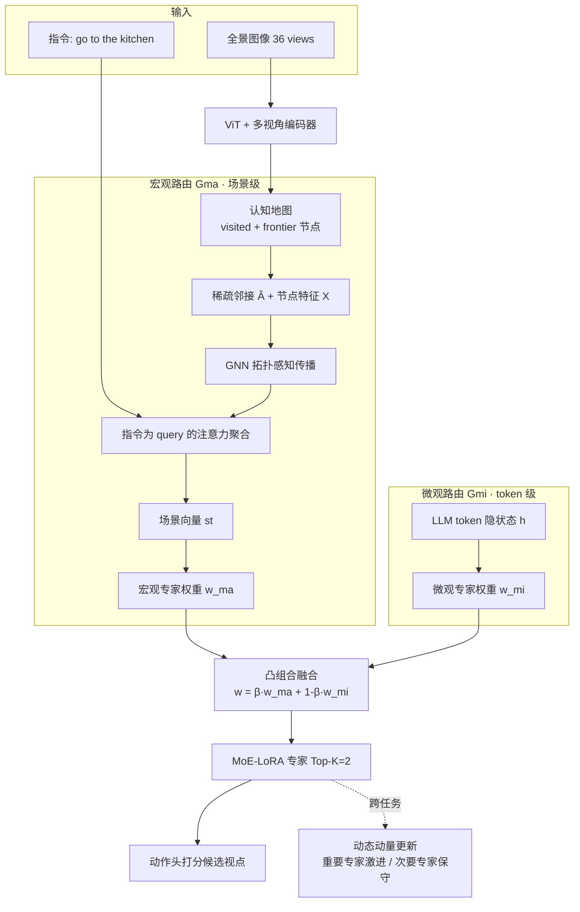

# M³E: Continual Vision-and-Language Navigation via Mixture of Macro and Micro Experts

**会议**: ICLR 2026  
**OpenReview**: [https://openreview.net/forum?id=pFh5ygjN3V](https://openreview.net/forum?id=pFh5ygjN3V)  
**代码**: [https://yongliangjiang.top/m3e](https://yongliangjiang.top/m3e)  
**领域**: 视觉语言导航 / 持续学习 / 具身智能  
**关键词**: VLN, Continual Learning, Mixture-of-Experts, Replay-free, Catastrophic Forgetting, MoE-LoRA  

## 一句话总结
M³E 把 LLM 导航智能体的 FFN 层换成"宏观+微观"双路由的 MoE-LoRA 层——宏观路由用 GNN 在认知地图上做拓扑感知的场景级专家选择，微观路由按 token 隐状态做指令级专家选择——再配一个动态动量更新策略冻结/激进更新不同专家，从而在**不存任何历史轨迹（replay-free）**的前提下实现跨环境持续学习，在 R2R / REVERIE 上同时改善导航成功率和抗遗忘能力。

## 研究背景与动机
**领域现状**：视觉语言导航（VLN）要求具身智能体跟随自然语言指令在真实室内场景中到达目标，需要紧密融合视觉感知、语言落地与序列决策。近年从跨模态对齐、记忆/拓扑地图，发展到把 LLM 作为策略核心做端到端微调（NaviLLM、NaVid 等），泛化能力显著提升。

**现有痛点**：绝大多数 VLN 系统在静态数据集上训练，部署到新环境往往需要昂贵的全量重训，且会引发**灾难性遗忘**。VLN 的持续学习研究稀少，已有方法几乎都依赖**回放缓冲区（rehearsal）**——存历史轨迹反复回放，带来存储/算力开销与隐私顾虑。而 VLN 又比分类任务更难：部分可观测下的序列规划、细粒度指令落地，使分类领域的 replay-free 方法（如做 VQA 的 CL-MoE）无法直接搬过来。

**核心矛盾**：跨环境抗遗忘 vs. 不存历史数据。作者主张关键在于**解耦"高层场景推理"与"低层感知对齐"**——场景级理解（办公室 vs. 住宅的布局规律）跨域可迁移，token 级落地（局部决策线索）则需随上下文快速适配；把两者混在一起会导致策略脆弱、迁移差。

**本文目标**：定义 VLN 持续学习（VLNCL）设定与评测协议，并提出首个面向该设定的 replay-free MoE 框架。

**核心 idea**：**[双层路由解耦]** 用宏观路由管"全局场景策略"、微观路由管"局部 token 语义"，两路融合后驱动稀疏 MoE 专家；**[动量分级巩固]** 按专家对当前任务的贡献度差异化更新动量，重要专家激进适配、次要专家保守保留，从而在无回放下兼顾可塑性与稳定性。

## 方法详解

### 整体框架
M³E 建立在可训练的 LLM-based 导航智能体之上（ViT 场景编码器 + 7B 解码器 LLM 策略核心），核心改造是把 LLM 主干里标准的 FFN 层替换为 **M³E 层**：每层是一组 MoE-LoRA 专家，由"宏观路由（场景级）+ 微观路由（token 级）"融合后激活。训练时通过**动态 MoE 动量更新**在任务流上巩固知识。整体由两大件构成：Macro–Micro MoE（§4.1）负责"选谁来算"，Dynamic Momentum Update（§4.2）负责"跨任务怎么更新"。

### 关键设计

**1. 宏观路由 TATF：先看懂"我在哪"再聚焦"任务要什么"。** 宏观路由 $G_{ma}$ 的目标是捕捉环境的全局结构规律并对齐高层任务意图，作者称之为 Topology-Aware, Task-Focused（拓扑感知 + 任务聚焦）路由。它不是简单池化视觉特征，而是分四步走：从当前认知地图（含已访问节点和已发现但未探索的 frontier 节点）按节点间距离阈值化构造稀疏邻接 $\hat{A}_t$，每个节点初始化为融合了全景视觉、空间位置、时间步、导航状态的特征向量 $x_v$，堆成 $X\in\mathbb{R}^{N\times d}$；随后用 GNN 做消息传递学到拓扑感知表示 $H_{gnn}=\mathrm{GNN}(\hat{A}_t,X)$；接着以指令嵌入 $\mathrm{Emb}_{Ins}$ 作 query 在节点上做注意力聚合 $\alpha_v=\mathrm{softmax}_v(h_v^\top \mathrm{Emb}_{Ins})$、$s_t=\sum_v \alpha_v h_v$，得到既懂结构又聚焦当前任务的场景向量；最后过路由头 $w_{ma}=\mathrm{Softmax}(\mathrm{MLP}(s_t))\in\mathbb{R}^n$ 产出场景级专家权重。值得强调的是认知地图是在线从探索历史构建的，而非依赖任何预设全局地图。

**2. 微观路由：让每个 token 自己挑专家。** 与宏观的"整图一票"不同，微观路由 $G_{mi}$ 在 token 粒度工作，对每个导航步 token 的隐状态 $h$ 走标准 MoE 门控 $w_{mi}=\mathrm{Softmax}(\mathrm{MLP}(h))\in\mathbb{R}^n$。它捕捉的是指令流内部的细粒度语义——比如"go to the kitchen"里动词 token "go" 倾向动作推理专家、名词 token "kitchen" 倾向物体/场景理解专家——从而实现上下文敏感的专家专精。该路由直接在当前任务数据 $D_t$ 上训练。

**3. 双路由凸组合融合：全局先验 × 局部适配。** 两路权重通过凸插值合并：$w=\beta\,w_{ma}+(1-\beta)\,w_{mi}\in\mathbb{R}^n$，其中 $\beta$（实验取 0.3）平衡"宏观给的全局/结构先验"与"微观给的 token 级细粒度判断"。融合后的 $w$ 用于在 MoE-LoRA 层做 Top-K=2 的稀疏专家激活，既保留战略意识又保留细粒度适配，且计算稀疏高效。

**4. 动态 MoE 动量更新：按贡献度分级冻结。** 这是 replay-free 抗遗忘的关键。对每个 MoE 层，先把当前任务 $D_t$ 所有 token 的融合路由权重累加成每专家工作量 $u=\sum_{x\in D_t} w(x)$，归一化得贡献分布 $I_t(E_i)=u[i]/\sum_j u[j]$；按 $\mathrm{TopK}$ 选出 $K$ 个重要专家 $E^{imp}_t$、其余为 $E^{non}_t$。设 $\Theta_{t-1}$ 为历史巩固参数、$\Phi_t$ 为在 $D_t$ 上微调（从 $\Theta_{t-1}$ 初始化）所得参数，给每个专家分配动量系数 $\lambda_i=\gamma$（重要专家，$\gamma\in[0,0.5)$）或 $1-\gamma$（次要专家），最终按元素插值巩固 $\Theta_t=\Lambda\odot\Theta_{t-1}+(1-\Lambda)\odot\Phi_t$。由于 $\gamma<0.5$，重要专家 $\lambda$ 小、更偏向新任务 $\Phi_t$（激进适配），次要专家 $\lambda$ 大、更偏向旧参数 $\Theta_{t-1}$（保守保留），由此在不存历史数据的情况下同时获得快速适配与抗遗忘。

## 实验关键数据

### 主实验表格

R2R 域增量持续学习（同训练预算；Reg=正则化 / Reh=回放 / RF=replay-free）：

| 方法 | 策略 | AvgSR%↑ | AvgSPL%↑ | AvgNE↓ | BWT↑ | FWT↑ |
|------|------|---------|----------|--------|------|------|
| Finetune | RF | 63.28 | 59.08 | 3.72 | -5.42 | -2.41 |
| L2 | Reg | 58.78 | 56.20 | 4.23 | -5.10 | -3.43 |
| EWC | Reg | 64.15 | 60.21 | 3.60 | -3.50 | -2.80 |
| ER | Reh | 66.35 | 62.10 | 3.45 | -1.50 | 0.50 |
| PerR | Reh | 67.05 | 62.93 | 3.38 | -1.35 | 0.62 |
| ESR | Reh | 68.12 | 63.88 | 3.25 | -1.10 | 0.85 |
| Dual-SR | Reg+Reh | 70.25 | 65.40 | 3.05 | -0.45 | 1.85 |
| **M³E (ours)** | **RF** | **71.92** | **66.96** | **2.95** | **0.04** | **2.15** |

REVERIE 域增量（目标导向、物体锚定，更难）：

| 方法 | SR%↑ | SPL%↑ | BWT↑ | FWT↑ |
|------|------|-------|------|------|
| Finetune | 50.12 | 39.86 | -16.91 | -10.26 |
| **M³E (ours)** | **51.23** | **48.30** | **-5.91** | **-8.09** |

### 消融实验表格

R2R 上三组件（Micro / Macro / Momentum）全组合（节选）：

| Micro | Macro | Momentum | AvgSR%↑ | BWT↑ | FWT↑ |
|:---:|:---:|:---:|---------|------|------|
| × | × | × (Finetune) | 63.28 | -5.42 | -2.41 |
| × | × | ✓ (≈EMA) | 61.52 | -2.15 | — |
| ✓ | × | × | 65.51 | 严重 | — |
| × | ✓ | × | — | 严重 | +1.80 |
| × | ✓ | ✓ | — | — | +1.92 |
| ✓ | ✓ | × | 67.83 | -6.05 | — |
| **✓** | **✓** | **✓** | **71.92** | **≈0** | **2.15** |

### 关键发现
- **replay-free 反超 rehearsal**：M³E 不存任何历史轨迹，AvgSPL 仍比最强回放方法 Dual-SR 高 +1.56%，且 BWT≈0（近乎不遗忘）、FWT=2.15（强前向迁移/零样本泛化）。
- **REVERIE 抗遗忘尤其明显**：相比 Finetune，SPL +8.44%（48.30 vs 39.86），BWT 从 -16.91 改善到 -5.91。
- **bulk 训练亦不崩**：直接在整个 val-unseen 上继续训练时，NaviLLM 在 REVERIE val-seen 暴跌 -11.18 SR，M³E 仅 -3.87，且在 R2R val-seen 反而 +2.15 SR。
- **三组件互补**：仅动量（≈EMA）抗遗忘但损可塑性（SR 降到 61.52）；双路由可塑性最强（67.83）却最不抗遗忘（BWT -6.05）；只有"路由+动量"合体才同时拿到 71.92 SR 与 BWT≈0。

## 亮点与洞察
- **把"持续学习"问题拆成"路由专精 + 动量巩固"两件正交的事**，并用消融清晰证明二者互补——这是比单纯堆 MoE 更有解释力的设计哲学。
- **宏观路由把认知地图（拓扑结构）显式引入专家选择**，让"在什么样的场景里"这件事直接参与决策，而不只是隐式藏在 LLM 隐状态里，这是它跨域泛化（高 FWT）的来源。
- **replay-free 同时解决隐私与存储**，对真实部署（家庭/办公机器人不便长期存历史轨迹）有现实意义。
- 动量分级本质是"对重要专家做快学、对次要专家做慢忘"的可微近似，工程上只需累加路由权重 + TopK，几乎零额外开销。

## 局限与展望
- **REVERIE 上仍有显著遗忘**（BWT -5.91、FWT -8.09 均为负），说明目标导向、强物体落地的长程任务里，双路由+动量还不足以根治遗忘。
- 专家数固定为 6、Top-K=2、$\beta$/$\gamma$ 等均为手调超参，缺乏随任务数自适应扩展专家容量的机制，长任务流下是否饱和未充分验证。
- 评测仅在 R2R / REVERIE 的 Matterport3D 仿真环境，**未涉及真实机器人 / 连续动作空间 / sim-to-real**。
- 任务划分按 scene id 切分、丢弃 ≤10 验证 episode 的场景，域边界相对"干净"，更碎/更长尾的真实域流下的稳健性待检验。

## 相关工作与启发
- **VLN 主干**：NaviLLM、EmbodiedGPT、NaVid 等端到端可训练 LLM 导航智能体——M³E 直接在 NaviLLM 上做 MoE-LoRA 改造，可视为给"通才导航 LLM"加持续学习能力的插件。
- **VLN 持续学习**：此前 PerR/ESR、Dual-SR 等几乎都靠 rehearsal；M³E 是该设定下首个 replay-free MoE 框架，定义了 VLNCL 协议与 BWT/FWT 指标（且 BWT 显式纳入 BaseAgent 衡量对初始能力的遗忘）。
- **跨域 MoE 持续学习**：CL-MoE 把 MoE 用于持续 VQA，但未处理 VLN 的序列、部分可观测与空间推理；M³E 的"宏观拓扑路由"正是为弥补这一缺口而生。
- **启发**：MoE 的"稀疏专家"天然适配持续学习的"模块化知识保留"——把"选专家"和"更新专家"分别交给路由器和动量策略，是一条比正则化/回放更优雅的抗遗忘路线，可迁移到其他具身/多模态序列决策任务。

## 评分
- **新颖性**: ⭐⭐⭐⭐ 首个 replay-free 的 VLN 持续学习 MoE 框架，"宏观拓扑路由 + 微观 token 路由 + 动量分级巩固"组合在 VLN 语境下是新颖且有解释力的设计；单个组件（MoE-LoRA、EWC 式巩固）非全新。
- **实验充分度**: ⭐⭐⭐⭐ R2R/REVERIE 双数据集、与正则化/回放/replay-free 三类基线全面对比，八组合全消融 + bulk 训练遗忘分析，证据链完整；但仅限仿真、未做真机与更长任务流。
- **写作质量**: ⭐⭐⭐⭐ 动机—方法—实验逻辑清晰，VLNCL 设定与指标定义规范，公式与架构图配合到位。
- **价值**: ⭐⭐⭐⭐ 为具身智能体的持续适配提供了参数高效、无隐私顾虑的强基线，对真实部署有实际意义，确立了 replay-free VLNCL 的新 SOTA。

<!-- RELATED:START -->

## 相关论文

- [\[ICLR 2026\] Abstracting Robot Manipulation Skills via Mixture-of-Experts Diffusion Policies](abstracting_robot_manipulation_skills_via_mixture-of-experts_diffusion_policies.md)
- [\[ACL 2026\] Breaking Down and Building Up: Mixture of Skill-Based Vision-and-Language Navigation Agents](../../ACL2026/robotics/breaking_down_and_building_up_mixture_of_skill-based_vision-and-language_navigat.md)
- [\[ACL 2025\] Task-aware MoILE: Hierarchical-Task-Aware Multi-modal Mixture of Incremental LoRA Experts for Embodied Continual Learning](../../ACL2025/robotics/hierarchical-task-aware_multi-modal_mixture_of_incremental_lora_experts_for_embo.md)
- [\[ICLR 2026\] Uncertainty-Aware Gaussian Map for Vision-Language Navigation](uncertainty-aware_gaussian_map_for_vision-language_navigation.md)
- [\[ICLR 2026\] CoNavBench: Collaborative Long-Horizon Vision-Language Navigation Benchmark](conavbench_collaborative_long-horizon_vision-language_navigation_benchmark.md)

<!-- RELATED:END -->
