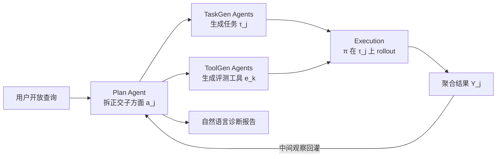

# ManipEvalAgent: Promptable and Efficient Evaluation Framework for Robotic Manipulation Policies

**会议**: ICLR 2026  
**OpenReview**: [https://openreview.net/forum?id=3u6AkbWEls](https://openreview.net/forum?id=3u6AkbWEls)  
**代码**: 待确认  
**领域**: 机器人操作 / 策略评估 / LLM Agent  
**关键词**: 机器人操作策略, 评估框架, VLM Agent, 代码生成, 仿真评估  

## 一句话总结
ManipEvalAgent 用一组协作的 VLM Agent 模仿人类专家"少量上手试几次就形成判断"的方式，对机器人操作策略做可提示、多轮、动态规划的评估——通过代码生成在仿真器里现造任务与评测工具，用远少于全量基准的采样得到与之相当的结论，同时给出可解释的诊断文本而非一个冷冰冰的成功率。

## 研究背景与动机

**领域现状**：机器人操作策略近年突飞猛进——从 Diffusion Policy 到 RT-1/RT-2、π0、RDT 这类通用 VLA 模型，端到端能力不断拓宽。配套地，RoboTwin、LIBERO、Meta-World、CALVIN 等仿真基准提供了标准化的任务套件与统一评测流程，成为模型横向比较的基础设施。

**现有痛点**：主流评测范式有三个结构性问题。其一是**昂贵**——静态基准要求在所有预定义任务 × 所有候选策略上穷举执行，动辄数万次 rollout、上百分钟，时间和算力成本高。其二是**僵化**——评测流程固定、任务集预设，不接受用户输入，无法回应"这个策略对物体外观泛化得怎么样"这类开放式、定制化需求。其三是**不可解释**——结论被压缩成成功率这一个标量，既不告诉你失败发生在什么条件下，也无法直接指导模型迭代。

**核心矛盾**：人类专家恰恰相反——只需小批量、几次上手交互，就能对策略整体能力形成可靠印象，并说清"哪强哪弱、为什么"。如何让自动化评测同时具备人类专家的**高效、可定制、可解释**，是本文要填的空白。

**本文目标**：提出一个评测框架，用尽量少的采样达到与全量基准相当的结论，同时按用户查询动态规划评测路径，并输出超越单一分数的诊断报告。

**核心 idea**：**把"评测"重新建模为一个可提示的、交互式的、自适应的 Agent 过程**——由 Plan Agent 模拟人类评测者把开放查询拆成正交的子方面，逐轮探索；由 TaskGen / ToolGen Agent 通过代码生成在仿真器里现造任务和评测工具；执行后把中间结果回灌给 Plan Agent，动态决定下一步评什么，最终汇总成自然语言报告。

## 方法详解

### 整体框架

ManipEvalAgent 由协作的 VLM Agent 驱动，通过少样本、多轮交互的循环来模仿人类专家评测。形式上，一个仿真器 $S=(\Omega,\Gamma)$ 提供能力 $\Omega$ 与约束 $\Gamma$（可用资产、接口等）；策略 $\pi(a_t|o_t,l)$ 在任务 $\tau$ 上 rollout 得到轨迹 $\zeta$ 与渲染帧 $I_{0:T}$。与依赖固定大测试集 $C$ 的经典方法不同，本框架把评测分解成评测中动态发现的一小撮子方面集合 $A=\{a_j\}$。整个系统由三个阶段构成一个多轮反馈环：Proposal（Plan Agent 拆子方面）→ Generation（TaskGen/ToolGen 代码生成造任务与工具）→ Execution（跑策略并用工具评测），执行结果再回到 Proposal 驱动下一轮。

### 关键设计

**1. Plan Agent：把开放查询变成可逐轮探索的评测路径** ManipEvalAgent 的灵魂是 Plan Agent，它承担规划、观察、总结三件事，模仿人类评测者"先试基础能力、再逐步深挖"的行为。收到用户查询后，它先读系统级 prompt——里面写明仿真器的能力与约束、以及被评策略的元信息（比如是否语言条件化）——然后挑一个初始子方面开评，并根据每轮中间结果迭代细化方向，直到证据足够才给出详细分析与总结。关键在于它把一个含糊的开放问题（"对操作物体的各种属性泛化得如何"）拆成正交子方面 $A=\{a_j\}$ 逐个击破：先评位置泛化拿到清晰结论，再评外观泛化若结果模糊，就进一步细化探针更精确地追问，这种"动态规划评测路径、避免冗余测试用例"正是效率的来源。

**2. TaskGen Agents：reuse-first 的任务代码生成 + 三重增强** 对每个子方面，TaskGen 输出一个单任务 Python 文件，含两个核心部分：场景构建（引用仿真器既有建场接口、往场景里填必要资产形成初始状态）和成功判据（生成 `check_success` 方法，每次 rollout 返回 bool 判断是否完成）。整个工作流遵循 **reuse-first 工程原则**——先检索仿真器里能直接复用的任务，满足要求就照用，只有复用不可能时才触发生成，以省时间、提完整度。但直接少样本 prompt 生成虽可用却不够稳，暴露三个问题：Agent 仅凭示例代码无法吃透仿真器接口细节、现有文档（多为人类开发者而写的 ReadMe）格式对 Agent 不友好、缺乏让 Agent 及时察觉生成场景偏差的低成本机制。为此引入三重增强：**RAG**（离线建 Task Library / Asset List / 文档库，生成时检索相似任务做 few-shot、用资产清单约束不调用不存在的资产）、**视觉自反思**（渲染生成场景的首帧，与任务提案的"预期画面"视觉比对，一旦发现不可接受偏差就发诊断与修改建议去改建场和判据代码）、**README.Agent**（面向 Agent 的文档，由人类专家+自动程序产出结构化摘要、提炼接口注意事项与坑，离线定期构建、同样经 RAG 检索）。

**3. ToolGen Agents：规则度量与 VQA 度量双轨，retrieval-first 扩展** 每个任务被 ToolGen 配一个评测工具，分两类：**规则度量** $r:\zeta\mapsto\mathbb{R}^d$（建在仿真器接口上的 Python 函数，吃轨迹输出标量/结构化分数，如 `safety_margin` 算最近间隙）和 **VQA 度量** $q:(I_{0:T},Q)\mapsto\mathbb{R}^d$（针对仿真器接口难拿到的信息，用 VLM 做视觉问答，以 $Q(a_j,\tau_j)$ 这种方面特定问题灵活评测）。工具箱开放可扩展，由人类专家预备一批验证过的常用工具直接调用、也作 few-shot 范例。工作流同样 **retrieval-first**：需要新工具时先检索复用，没有就检索相似工具 few-shot 生成、再注册回工具箱。

**4. 多轮反馈环下的评测流水线与聚合** 每个子方面 $a_j$ 配好任务 $\tau_j$ 与工具 $e_k$ 后，按 $\zeta_{j,m}=\text{Rollout}(\pi,\tau_j,\text{seed}_m)$ 采样 $M_j$ 条轨迹，规则工具走 $r(\zeta_{j,m})$、VQA 工具走 $q(I_{0:T},Q)$，结果先在子方面内聚合 $Y_j=\text{Aggregate}\{y_{j,m}\}_{m=1}^{M_j}$，再跨 $N$ 个子方面聚合 $Y=\text{Aggregate}\{Y_j\}_{j=1}^{N}$。这里 $M_j$ 远小于静态基准的全量采样，$N$ 是评测中动态发现而非预设，最终把数值分数与可解释文本结合，回灌 Plan Agent 决定继续提案还是收尾总结。

## 实验关键数据

实验回答三个问题：相对现有基准能否达到相当效果、开放查询下表现如何、代码生成阶段各模块各贡献多少。被评策略选了 5 个开源模型——单任务的 ACT、Diffusion Policy(DP)、DP3，以及 VLA 模型 RDT-1B 和 π0；基准选 RoboTwin 2.0 与 LIBERO。

### 主实验：评测时间对比

| 模型 | RoboTwin | LIBERO | Ours |
|------|----------|--------|------|
| ACT | 167 min / 56592 样本 | 117 min / 29546 样本 | **42 min / 16927 样本** |
| DP | 171 min / 55551 样本 | 132 min / 29059 样本 | **45 min / 16895 样本** |
| DP3 | 159 min / 52087 样本 | 113 min / 28343 样本 | **44 min / 15638 样本** |
| RDT | 210 min / 55435 样本 | 132 min / 28878 样本 | **63 min / 16676 样本** |
| π0 | 164 min / 51087 样本 | 103 min / 26732 样本 | **43 min / 15336 样本** |

时间普遍压到原基准的 1/3 左右，采样量约减 2/3。

### 结论一致性（10 次 trial 命中率：精确区间 / 误差容限内）

| 维度 | ACT | DP | DP3 | RDT | π0 |
|------|-----|-----|-----|-----|-----|
| S.R. (RoboTwin) | 50% / 90% | 60% / 100% | 50% / 80% | 50% / 60% | 70% / 100% |
| S.R. (LIBERO Avg.) | 60% / 70% | 50% / 70% | 40% / 60% | 70% / 90% | 50% / 50% |
| Spatial (LIBERO) | 70% / 100% | 100% / 100% | 80% / 80% | 70% / 100% | 60% / 80% |
| Obj (LIBERO) | 60% / 80% | 50% / 70% | 60% / 60% | 60% / 60% | 40% / 70% |
| Goal (LIBERO) | 30% / 70% | 70% / 70% | 50% / 70% | 50% / 60% | 50% / 50% |
| Long (LIBERO) | 60% / 70% | 60% / 80% | 50% / 70% | 70% / 80% | 60% / 90% |

多数维度在误差容限内能高比例复现全量基准的结论。

### 消融实验：代码生成模块

| 设置 | 生成成功率 ↑ |
|------|-------------|
| TaskGen (完整) | 98% |
| TaskGen w/o RAG | 95% |
| TaskGen w/o 视觉自反思 | 96% |
| TaskGen w/o README.Agent | 96% |
| TaskGen (Base, 纯 few-shot) | 93% |
| ToolGen (完整) | 96% |
| ToolGen w/o RAG | 92% |

### 关键发现
- **纯 few-shot 已可用（93%），但每个增强模块都带来稳定增益**——对一个需反复执行、稳定性要求高的评测系统，这些模块是必要的。
- **系统错误约 5%，且集中在生成阶段（69.8%）**，其中任务生成贡献最大（42.8%），ToolGen 27%，Plan Agent 仅 9.5%——印证代码生成子任务（需精确理解仿真器 API、物体语义、空间/物理约束）是当前最难啃的骨头。

## 亮点与洞察
- **范式转变而非增量改进**：把评测从"在固定测试集上穷举打分"重构成"可提示的交互式 Agent 探索"，第一次让机器人操作评测具备人类专家式的高效+可定制+可解释三位一体。
- **代码生成作为评测的执行引擎**：用 LLM 现场造任务和评测工具，而不是依赖预制任务库，这是"动态、按需评测"能成立的技术底座；reuse-first / retrieval-first 又把生成成本和不稳定性压下去。
- **视觉自反思很巧**：渲染首帧和提案"预期画面"比对，是个低成本却有效的纠错回路，直接拿 VLM 的视觉能力给代码生成兜底。
- **诚实的错误剖析**：明确承认 5% 失败率并定位到任务生成，为后续改进指了方向，而非粉饰系统稳定性。

## 局限与展望
- **5% 失败率对评测系统偏高**：评测要被反复执行、且作为"裁判"本身必须可信，生成阶段近 70% 的错误占比意味着结论的可复现性仍受代码生成稳定性掣肘。
- **一致性指标不算亮眼**：不少维度"精确区间"命中率只有 40%–60%，主要靠放宽到误差容限才好看；某些维度（如 π0 的 LIBERO Avg. 50%/50%）说明与全量基准的对齐还有差距。
- **依赖仿真器接口与既有资产**：reuse-first / RAG 都建立在仿真器有完善文档、资产库、任务库之上，迁移到接口文档稀缺的新仿真器时增强模块的收益存疑。
- **VQA 度量的可靠性未深究**：VLM 视觉理解本身会出错，把它作为评测工具的一环，其误差如何传导到最终结论缺乏定量分析。
- **展望**：更强的推理模型有望直接降低生成阶段错误；把 VQA 度量的不确定性显式建模、引入更严格的一致性校准，会让"少采样得相当结论"这一卖点更可信。

## 相关工作与启发
- **机器人操作策略**：从单任务（Diffusion Policy、3D Diffusion Policy、RISE）到通用 VLA（RT-1/RT-2、π0、RDT、OpenVLA），策略越来越强，也越来越需要高效灵活的评测——本文正是回应这一需求侧空白。
- **仿真基准与数据集**：SAPIEN、ManiSkill2、Meta-World、CALVIN、LIBERO、Open X-Embodiment、RoboTwin 1.0/2.0 等构成静态评测主流；本文把它们当作"被对齐的金标准"而非替代品，定位是更快地逼近它们的结论。
- **LLM Agent**：借鉴 CoT、自主 Agent、多轮交互、以及"LLM 替代人类评测且高度对齐"的研究（LLM-as-judge），把这套思路第一次系统迁移到仿真引擎内机器人操作策略的自动评测。
- **启发**：当评测本身昂贵且僵化时，"让 Agent 像人一样自适应探索 + 用代码生成现造度量"是一条通用思路，可外推到其他需要大规模 rollout 才能定性的领域（如自动驾驶策略、长程规划）。

## 评分
- **新颖性**: ⭐⭐⭐⭐ 把机器人操作评测重构成可提示、自适应的 Agent 过程，并用代码生成现造任务与工具，是该领域首个此类框架，范式层面有原创性。
- **实验充分度**: ⭐⭐⭐ 覆盖 5 个策略 × 2 个基准、含时间对比/一致性/消融/错误剖析，较完整；但一致性指标多数靠误差容限撑场面，开放查询部分以定性案例为主，缺更大规模定量验证。
- **写作质量**: ⭐⭐⭐⭐ 动机清晰、三阶段框架与公式表述到位，图示（Fig.1/2/3）帮助理解；个别句子有语法瑕疵但不影响阅读。
- **价值**: ⭐⭐⭐⭐ 评测时间压到 1/3、采样减 2/3 且结论可解释，对需频繁评测策略的机器人研究有实际加速作用，方法论也可外推到其他高成本评测场景。

<!-- RELATED:START -->

## 相关论文

- [\[ICLR 2026\] When would Vision-Proprioception Policies Fail in Robotic Manipulation?](when_would_vision-proprioception_policies_fail_in_robotic_manipulation.md)
- [\[ICLR 2026\] WorldGym: World Model as an Environment for Policy Evaluation](worldgym_world_model_as_an_environment_for_policy_evaluation.md)
- [\[AAAI 2026\] SemanticVLA: Semantic-Aligned Sparsification and Enhancement for Efficient Robotic Manipulation](../../AAAI2026/robotics/semanticvla_semantic-aligned_sparsification_and_enhancement_for_efficient_roboti.md)
- [\[NeurIPS 2025\] RoboCerebra: A Large-scale Benchmark for Long-horizon Robotic Manipulation Evaluation](../../NeurIPS2025/robotics/robocerebra_a_large-scale_benchmark_for_long-horizon_robotic_manipulation_evalua.md)
- [\[ICLR 2026\] Action-aware Dynamic Pruning for Efficient Vision-Language-Action Manipulation](action-aware_dynamic_pruning_for_efficient_vision-language-action_manipulation.md)

<!-- RELATED:END -->
