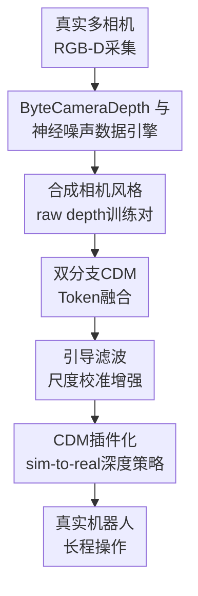

# Manipulation as in Simulation: Enabling Accurate Geometry Perception in Robots

**会议**: ICLR 2026  
**OpenReview**: [https://openreview.net/forum?id=sWyX1BpeN4](https://openreview.net/forum?id=sWyX1BpeN4)  
**代码**: https://manipulation-as-in-simulation.github.io/  
**领域**: 机器人 / 具身智能  
**关键词**: 机器人操作, 深度相机, 度量深度估计, sim-to-real, 几何感知  

## 一句话总结
这篇论文提出相机专属的 Camera Depth Models，把真实深度相机的粗糙 RGB-D 输入校正成接近仿真的高质量度量深度，从而让只在仿真干净深度上训练的机器人操作策略可以零微调迁移到真实长程任务。

## 研究背景与动机
**领域现状**：现代机器人操作策略大多从视觉观测学习动作，主流输入仍然是 RGB 图像或多视角 RGB 图像。RGB 对语义很友好，比如能看出杯子、碗、微波炉门，但操作本身又高度依赖三维几何：物体距离、尺寸、边界、薄物体姿态、可开合结构的位置，都会直接决定抓取点和运动轨迹。

**现有痛点**：深度相机看起来正好能提供这些几何信息，可实际机器人实验里的深度图往往非常脏。D435 这类主动红外双目会在边界、反光表面、玻璃上产生空洞和毛刺；L515 这类 ToF/LiDAR 相机会在金属、黑色或强反射区域失败。于是很多 3D 操作方法不得不对点云做裁剪、下采样、补洞和滤波，或者只在仿真里用完美深度做实验，真正部署到真实相机时几何就塌了。

**核心矛盾**：仿真能给机器人几乎无噪的度量深度，真实世界有廉价深度相机但输出不可信。直接把仿真深度加噪会损伤本来很有价值的几何细节；直接用真实 raw depth 又会把错误形状输入策略。本文抓住的矛盾是：要想让机器人“像在仿真里一样操作”，不是把仿真做得更脏，而是要把真实相机的深度恢复到接近仿真的干净几何。

**本文目标**：作者把问题拆成三个子任务：第一，采集不同深度相机的真实噪声模式；第二，用这些噪声模式在仿真数据上合成成对训练样本，训练一个从 RGB + raw depth 到准确 metric depth 的模型；第三，把这个模型作为真实机器人前端插件，让仿真深度训练出的深度-only policy 直接迁移到真实环境。

**切入角度**：论文没有走通用单目深度估计路线，因为单张 RGB 图像天然存在尺度歧义；也没有只做传统补洞，因为真实深度错误不仅是缺值，还有相机专属的尺度偏差、模糊、抖动和材料失败。它选择“相机专属模型”：每个 Camera Depth Model（CDM）知道某类相机的典型错法，同时利用 RGB 语义判断哪些 raw depth 该相信、哪些该修正。

**核心 idea**：用真实相机噪声学习出的数据引擎训练相机专属 RGB-D 度量深度模型，把真实 raw depth 转成仿真级干净深度，再用它桥接机器人操作的 sim-to-real 几何差距。

## 方法详解

### 整体框架
这篇论文的整体流程可以理解为“先学相机怎么犯错，再训练模型纠错，最后把纠错模型插到真实机器人前面”。训练侧先用多相机设备采集 ByteCameraDepth，分别学习 hole noise 和 value noise，然后把这些噪声迁移到带 clean depth 的仿真数据上，生成 raw-depth 风格输入与干净标签的训练对。部署侧则让 CDM 接收真实 RGB 和 raw depth，输出干净 metric depth，供只在仿真 clean depth 上训练的机器人策略使用。

更具体地说，CDM 本身不是一个单纯 depth completion 模型。它的输入是同一相机的 RGB 图像 $I$ 和 raw depth $D$，输出是高质量绝对深度 $\hat{D}$。RGB 分支负责提供物体边界、材料、语义区域等信息，depth 分支负责提供已有尺度提示，两者在 token 层按空间位置融合，再通过 DPT decoder 还原为密集深度图。这样做的好处是，模型既不会像单目深度那样丢掉真实尺度，也不会像传统深度滤波那样盲目信任传感器错误。

### 关键设计
**1. ByteCameraDepth 与神经噪声数据引擎：把“相机怎么坏”学成可合成的数据源**

训练 CDM 的核心难点是三元组数据不好拿：真实相机能给 RGB 和低质量深度，却很难给每个像素的真实干净深度；仿真能给干净深度，却没有真实相机的硬件噪声。作者因此先搭了一个多相机采集架，同时安装 RealSense D405/D415/D435/D455/L515、ZED 2i、Azure Kinect 等设备，覆盖 7 个相机、10 种深度模式和厨房、客厅、市场、卧室、浴室、办公室、休息室等 7 类场景。每个相机约 1.7 万帧，总体形成 17 万级 RGB-D 对，用来学习各类相机的噪声风格。

论文把噪声拆成两类。hole noise 是哪些像素会变成空洞，用带 DINOv2 backbone 和 DPT head 的二分类模型 $N_{hole}$ 从 RGB 预测有效/无效 mask；value noise 是非空洞像素的深度值偏差，用 Depth Anything V2 风格模型 $N_{value}$ 学习相机输出的相对深度风格。随后在 HyperSim、DREDS、HISS、IRS 等仿真数据上，用 $H(I)$ 决定哪些像素被挖空，用 $V(I)$ 生成相机风格深度值，构造 $\tilde{D}=\mu(V(I))\cdot(H(I)<0.5)$ 这样的低质量输入。这里的关键不是“随便加噪”，而是让合成数据带有某个真实相机的材料失败、边界空洞、尺度偏差和模糊模式。

**2. 双分支CDM Token融合：让模型同时相信尺度提示和RGB语义**

CDM 的模型结构很克制，但针对性很强。RGB 图像和 raw depth 分别进入两个 ViT encoder，得到 $X_I=ViT_I(I)$ 和 $X_D=ViT_D(D)$。如果只在 decoder 末端把 prompt depth 拼进去，模型很容易把深度当成浅层补充信号；本文则在多层 token 上做融合，让 RGB token 和 depth token 在相同空间位置交换信息。

融合模块的直觉是：一个位置的 RGB 语义告诉模型“这里可能是玻璃门/金属叉/碗边缘”，同一位置的 depth token 告诉模型“传感器认为这里有多远/是否缺失”。模型用 multi-head attention 融合对应 token，得到带尺度信息的特征 $\tilde{X}$，再把原始 RGB token 与融合 token 拼接后交给 DPT head 输出 $\hat{D}=DPT([X_I;\tilde{X}])$。这种设计让 CDM 可以直接吃有洞的 raw depth，不需要像 PromptDA、PriorDA 那样先做 hole filling；同时它保留了 RGB 语义，避免遇到传感器大面积错误时只做机械平滑。

**3. 引导滤波尺度校准增强：防止合成噪声把度量尺度带偏**

论文观察到，value noise 模型在真实 ByteCameraDepth 上微调后，虽然能学到很像相机的噪声纹理，但迁移到仿真数据时可能破坏正确 metric scale。这样一来，后续 CDM 会发现 prompt depth 的尺度不可靠，反而学会少用深度提示，失去 RGB-D 模型最重要的优势。

作者用 guided filter 处理这个尺度错位。它把 value noise 作为 guidance image $G$，把仿真的 ground-truth depth 作为待滤波输入 $A$，在局部窗口内拟合 $b_i=x_kg_i+y_k$。输出 $B$ 保留 value noise 的结构和相机风格，又被 ground-truth depth 拉回正确度量尺度。训练时随机采样窗口大小 $k$，相当于让 CDM 见到不同强度的“相机风格但尺度可信”的 prompt depth；再配合手工高频噪声补充神经噪声模型难以生成的细碎抖动。这个设计解决的是一个很具体的问题：合成数据不仅要像相机，还必须保持能训练 metric depth 的尺度监督。

**4. CDM插件化sim-to-real深度策略：真实部署时把世界变回仿真的几何形态**

CDM 的最终用途不是单纯刷深度估计榜，而是让机器人 policy 在真实世界看到类似仿真的几何。论文构建了四阶段 sim-to-real 管线：先在仿真中搭建几何相似的场景；再用可微渲染式标定对齐真实和仿真相机外参，并在仿真采样时做小幅相机位姿随机化；接着用扩展版 WBCMimicGen 生成更平滑的仿真演示；最后用 depth-only imitation learning 训练策略。

策略输入不是点云，而是单视角深度图加机器人关节位置和夹爪状态。作者刻意不使用 RGB 作为策略输入，是为了排除颜色语义带来的混淆，专门验证“准确几何”是否足够支撑操作。真实部署时，raw camera depth 不直接给 policy，而是先经过对应 CDM 变成 clean depth。这样 policy 训练时看到的是仿真 clean depth，测试时也尽量看到 clean depth；论文的核心主张就是通过这种插件式前端，把 observation gap 从“真实相机很脏”改写成“真实观测接近仿真”。

### 一个完整示例
以 Canteen 任务为例，机器人需要先抓起细叉子放进前方盒子，再抓薄盘子，把盘中垃圾倒入左侧盒子，最后把盘子放进前方盒子。对原始深度相机来说，叉子太细，盘子又薄且容易与桌面混在一起；在论文的可视化里，raw depth 甚至会把叉子的几何融合到盘子或背景里，真实点云中几乎没有可抓取的清楚形状。

在本文管线中，仿真阶段直接渲染干净的单视角深度，生成约 800 条 Canteen 演示轨迹，策略学到的是“叉子细长凸起在哪里、盘子边缘在哪里、目标盒子相对位置在哪里”。部署到真实 D435 或 L515 时，相机先输出 RGB 和 raw depth；CDM-D435 或 CDM-L515 根据 RGB 里的叉子/盘子语义和 raw depth 里的粗尺度提示，补出更完整的 metric depth。策略因此仍然像在仿真里一样接收一张干净深度图，再输出扩散策略预测的动作序列。表 2 中最能说明问题的是 D435 视角：raw depth 的 Canteen 总成功是 0/30，CDM-D435 提升到 14/30；L515 视角下 CDM-L515 更进一步达到 22/30，接近对应仿真视角的 20/50 总成功水平。

### 损失函数 / 训练策略
噪声模型训练分两部分。hole noise 模型把 raw depth 中 $D_{i,j}=0$ 的位置当成空洞标签，用逐像素二分类交叉熵训练；value noise 模型把相机低质量深度当成风格化相对深度标签，用 affine-invariant normalization 后的 L1 loss 训练。合成数据阶段再把 value noise、hole mask、guided filter 和高频手工噪声组合起来，形成相机专属 raw depth 风格。

CDM 训练目标是 L1 depth loss 加 gradient loss：

$$
\ell(M)=L1(D,\hat{D})+\ell_{grad}(D,\hat{D}),\quad
\ell_{grad}=\left|\frac{\partial(\hat{D}-D)}{\partial x}\right|+\left|\frac{\partial(\hat{D}-D)}{\partial y}\right|.
$$

实际训练用 disparity 作为目标；RGB 和 depth 分支的 ViT encoder 都从 DINOv2 初始化，decoder 从零训练。训练数据来自四个仿真数据集，共 28 万以上图像。机器人策略则采用 ResNet 编码单通道深度、MLP 编码本体状态、diffusion head 预测动作序列；仿真训练时不往深度里额外加噪，只使用 RandomShiftScaleRotate 缓解相机标定误差。

## 实验关键数据

### 主实验
论文的实验分三层：metric depth 零样本评估、真实 imitation learning、零样本 sim-to-real 操作。第一层在 Hammer 数据集上评估 D435、L515、Helios 三类传感器，且不做输出对齐后处理；第三层直接看真实机器人长程任务成功率。

| 场景 / 数据集 | 指标 | 本文 | 之前SOTA / 对照 | 提升 |
|--------|------|------|----------|------|
| Hammer D435 split | L1 ↓ / RMSE ↓ | CDM-D435: 0.0258 / 0.0404 | Raw Depth: 0.0550 / 0.1458 | L1 约减半，RMSE 大幅降低 |
| Hammer L515 split | L1 ↓ / RMSE ↓ | CDM-L515: 0.0156 / 0.0297 | Raw Depth: 0.0312 / 0.0813 | L1 约减半，RMSE 降到约 37% |
| Hammer Helios split | L1 ↓ / RMSE ↓ | CDM-L515: 0.0248 / 0.0403 | Raw Depth: 0.0384 / 0.0970 | 跨传感器仍明显更准 |
| D435 真实 Kitchen | 总成功率 ↑ | CDM-D435: 26/30 | Raw Depth: 0/30；PromptDA: 0/30；PriorDA: 7/30 | 从失败到接近仿真表现 |
| D435 真实 Canteen | 总成功率 ↑ | CDM-D435: 14/30 | Raw Depth: 0/30；PromptDA: 1/30；PriorDA: 0/30 | 细叉/薄盘任务出现可用迁移 |
| L515 真实 Canteen | 总成功率 ↑ | CDM-L515: 22/30 | Raw Depth: 0/30；PromptDA: 0/30；PriorDA: 3/30 | 最强真实 Canteen 结果 |

在 Hammer 上，CDM 不仅优于 raw depth，也优于需要补洞预处理的 PromptDA/PriorDA。更重要的是，在机器人实验里 raw depth 几乎无法完成任务，而 CDM 让策略达到和仿真接近的数量级，说明深度指标提升确实转化成了操作能力。

### 消融实验
论文没有只做单一模块删减式消融，而是用多个对照说明 CDM 的结构、相机专属训练、CDM 前端和演示生成质量各自的作用。

| 配置 | 关键指标 | 说明 |
|------|---------|------|
| PromptDA* 用相同合成数据训练 | D435 L1 0.0434，L515 L1 0.0235 | 同样数据下仍弱于 CDM，说明双分支 token 融合结构有贡献 |
| CDM 与相机不匹配 | D435 真实 Canteen：CDM-L515 为 0/30；L515 真实 Canteen：CDM-D435 为 9/30 | 静态深度指标能跨相机泛化，但机器人部署仍最好用对应相机模型 |
| 无 CDM 前端 | D435/L515 两个 sim-to-real 真实任务总成功均为 0/30 | raw depth 的几何错误足以让仿真训练策略完全失效 |
| CDM-D435 真实 imitation learning | Toothpaste 10/15、Put into cup 6/15、Pick bowl 11/15、Stack bowl 9/15 | 相比无 CDM 的 0/15、0/15、6/15、3/15，准确几何提升真实模仿学习 |
| WBCMimicGen vs MimicGen | 仿真 Kitchen 成功 72% vs 56%，Canteen 42% vs 24% | 更平滑的仿真演示提高策略质量，也减少动作边界处抖动 |

### 关键发现
- CDM 的收益不是“补洞好看”这么简单，而是把真实深度恢复到能被策略消费的几何表示；Kitchen 里的玻璃微波炉门、Canteen 里的金属叉和薄盘子都是 raw depth 的高失败区域。
- 相机专属性在机器人部署中比静态 benchmark 更重要。CDM-L515 在 Hammer D435 split 上甚至能有很强指标，但真实 D435 Canteen 上表现不如 CDM-D435，说明闭环操作对局部几何错误更敏感。
- CDM 的延迟很低：在 RTX 4090 + D435 上，端到端约 $0.151\pm0.002$s，比 PromptDA 的 $0.188$s、PriorDA 的 $0.154$s 和 D3RoMa 的 $1.531$s 更适合实时控制，频率超过 6Hz。
- 单视角 depth-only policy 仍能完成长程任务，说明如果几何足够准，机器人不一定总要依赖复杂多视角点云；这对低成本部署很有吸引力。

## 亮点与洞察
- 技术亮点之一是把问题定义从“给仿真深度加噪”反过来变成“把真实深度恢复成仿真深度”。这个视角很干净，因为它保护了仿真中本来高质量的几何监督，而不是为了迁移故意破坏它。
- CDM 的双分支结构很贴合真实传感器：RGB 提供语义纠错能力，raw depth 提供绝对尺度提示。单独依赖任何一边都不够，RGB 会有尺度歧义，raw depth 又会在玻璃、金属、透明物体上出错。
- ByteCameraDepth 的价值不只是数据量，而是它覆盖了多种真实相机和多种室内材料失败模式。对于机器人来说，这类“相机怎么失败”的数据比纯净室内深度数据更贴近部署风险。
- 论文最有启发的地方是把深度估计指标和机器人闭环成功率连起来验证。很多 depth paper 只报告 L1/RMSE，但这里能看到几厘米级几何误差会怎样影响抓叉子、放碗、关微波炉门。
- 这个思路可以迁移到触觉、力觉或事件相机等传感器：先学习某类硬件的真实噪声和失效模式，再用仿真高质量标签训练一个“硬件到理想观测”的前端，而不是让控制策略直接适应脏观测。

## 局限与展望
- CDM 仍会被错误 prompt depth 误导。附录里的 CDM-L515 失败案例显示，当金属平面导致大区域 raw depth 提示错误，而 RGB 语义又不足以判断真实几何时，模型可能沿着错误尺度修复。
- 论文主要验证了 D435 和 L515 上的真实机器人操作，其他相机虽然给出了模型和可视化，但缺少同等规模的真实闭环评测。相机专属模型在更多硬件上的稳定性还需要继续测。
- 当前策略是 depth-only imitation learning，刻意排除了 RGB 语义。这个设置适合证明准确几何的价值，但实际通用机器人策略可能需要 RGB、语言、深度、触觉共同输入，CDM 与大 VLA 模型如何结合仍是开放问题。
- 仿真管线仍需要几何相似场景、相机外参标定和一定物理交互调参。CDM 缩小的是视觉几何 gap，不等于完全解决动力学、接触、摩擦等 sim-to-real gap。
- 未来可以用 CDM 重标真实 RGB-D 数据，构造更干净的大规模 3D 操作数据；也可以把 CDM 输出转成点云、TSDF 或 occupancy 表示，服务于更复杂的多视角规划和基础模型训练。

## 相关工作与启发
- **vs PromptDA / PriorDA**: 它们也使用 prompt depth 来做 metric depth，但通常依赖补洞预处理，且融合深度提示的位置更浅。本文的 CDM 直接吃 raw depth，并在 token 层融合 RGB 和深度，因此更适合实时机器人输入。
- **vs Depth Anything / 单目 metric depth**: Depth Anything 系列擅长开放世界相对深度，但单 RGB 很难可靠恢复绝对尺度。CDM 明确把真实相机 raw depth 当尺度提示，用 RGB 主要做语义修正，任务定义更贴近机器人。
- **vs D3RoMa / 传统深度修复**: D3RoMa 面向材料无关的深度恢复，质量强但延迟高；本文 CDM 在 Hammer 上指标更好，且约 0.151s 的端到端延迟更适合控制闭环。
- **vs 3D Diffusion Policy / GenSim2 等点云操作方法**: 点云方法能利用 3D 表示，但常依赖裁剪、下采样、外参标定和噪声处理。本文选择直接用深度图做 policy 输入，展示了当深度图足够干净时，单视角 2.5D 表示也能完成复杂操作。
- **vs RGB sim-to-real 方法**: RGB 路线通常需要高保真渲染、纹理随机化或 real-to-sim 重建来缩小外观 gap。本文绕开颜色外观，把迁移重点放在几何一致性上，对需要精细抓取的位置控制更直接。

## 评分
- 新颖性: ⭐⭐⭐⭐⭐ 从“把仿真弄脏”转向“把真实深度变干净”，并用相机专属 CDM 连接深度估计和机器人 sim-to-real，问题定义很有辨识度。
- 实验充分度: ⭐⭐⭐⭐⭐ 覆盖静态深度 benchmark、真实 imitation learning、零样本 sim-to-real、延迟、附录定性和 WBCMimicGen 对照，证据链比较完整。
- 写作质量: ⭐⭐⭐⭐ 论文主线清楚，图表支撑强；但方法中噪声模型、guided filter 和机器人管线分散在主文与附录，第一次读需要来回对照。
- 价值: ⭐⭐⭐⭐⭐ 对机器人操作非常实用：如果 CDM 前端可靠，仿真数据和真实深度相机之间的可复用性会显著提高，也给通用机器人策略提供了更干净的几何入口。

<!-- RELATED:START -->

## 相关论文

- [\[CVPR 2026\] CycleManip: Enabling Cycle-based Manipulation via Effective History Perception and Understanding](../../CVPR2026/robotics/cyclemanip_enabling_cycle-based_manipulation_via_effective_history_perception_an.md)
- [\[ICLR 2026\] RoboCasa365: A Large-Scale Simulation Framework for Training and Benchmarking Generalist Robots](robocasa365_a_large-scale_simulation_framework_for_training_and_benchmarking_gen.md)
- [\[ICLR 2026\] Geometry-Aware Policy Imitation](geometry-aware_policy_imitation.md)
- [\[CVPR 2026\] GeoPredict: Leveraging Predictive Kinematics and 3D Gaussian Geometry for Precise VLA Manipulation](../../CVPR2026/robotics/geopredict_leveraging_predictive_kinematics_and_3d_gaussian_geometry_for_precise.md)
- [\[ICLR 2026\] Virtual Community: An Open World for Humans, Robots, and Society](virtual_community_an_open_world_for_humans_robots_and_society.md)

<!-- RELATED:END -->
