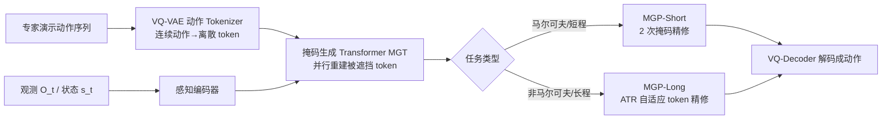

# Masked Generative Policy for Robotic Control

**会议**: ICLR 2026  
**OpenReview**: [https://openreview.net/forum?id=KFu4p3pd11](https://openreview.net/forum?id=KFu4p3pd11)  
**代码**: 待确认  
**领域**: 机器人操作 / 视觉运动模仿学习  
**关键词**: 掩码生成、动作 token、模仿学习、并行解码、非马尔可夫任务、自适应重规划  

## 一句话总结
把机器人动作离散化成 token，用图像生成里的"掩码生成 Transformer"一次并行预测整段动作、再只重采样低置信 token，从而同时甩掉扩散策略的多步去噪和自回归策略的逐 token 解码两个瓶颈，并借此在动态、缺观测、非马尔可夫任务上做到全局连贯的可靠控制。

## 研究背景与动机
**领域现状**：视觉运动模仿学习近年被统一成"对动作序列建条件生成模型"，主流是两条路线——扩散策略（Diffusion Policy、3D Diffusion Policy）把动作合成看成条件去噪过程，质量高但每步要跑多次去噪；自回归策略（QueST、VQ-BeT）把动作离散成 token、用 GPT 式 Transformer 逐 token 预测，结构上贴合机器人按序执行。

**现有痛点**：扩散策略每一步动作都要多步迭代采样，闭环实时控制时延迟高；Consistency Policy、FlowPolicy 等加速方案要么额外蒸馏、要么牺牲采样质量。自回归策略一次前向只出一个 token，延迟随序列长度线性增长；而且无记忆、前缀不可改——任何一处改动都要把后续 token 全部重新生成，导致它在缺观测、非马尔可夫任务上很脆弱。

**核心矛盾**：迭代采样带来的推理时延 与 长程、非马尔可夫操作所需的全局连贯性 / 鲁棒重规划能力，两者难以兼得——快的不稳、稳的不快。

**本文目标**：做一个既低延迟又高成功率、还能在执行过程中快速"改计划"的生成式策略，覆盖从短程马尔可夫到长程非马尔可夫的整谱任务。

**核心 idea**：**[掩码生成 + 置信度重采样]** 借鉴图像生成的 MaskGIT 思路，把动作表示成离散 token，用条件掩码 Transformer **一次并行**生成全部 token，再只对**低置信** token 做少量迭代精修；并据此设计两套采样范式——短程 MGP-Short 和带自适应 token 精修（ATR）的长程 MGP-Long。

## 方法详解

### 整体框架
MGP 分两阶段训练：先用 VQ-VAE 把连续动作序列压成离散 token（动作 tokenizer），再训练一个掩码生成 Transformer（MGT）学会"从被遮挡的 token 序列 + 观测条件"重建完整动作 token。推理时根据任务性质切两种采样范式：短程任务用 MGP-Short（少量 mask-and-refine 迭代），长程 / 非马尔可夫任务用 MGP-Long（一次预测整段轨迹，执行过程中依据新观测自适应精修未执行 token）。

### 关键设计

**1. 动作 Tokenizer：把连续动作压成可离散重建的 token，给掩码生成腾出离散潜空间。** 用 VQ-VAE 把一段连续动作 $a \in \mathbb{R}^{T\times j}$（$j$ 为末端执行器位置/旋转/夹爪状态维度）经两层残差 1D CNN 编码成 $\hat{y}\in\mathbb{R}^{N\times d}$，再到可学习码本里查最近邻 token，解码端用对称上采样 Conv1D 重建。训练目标是重建损失加 commitment 损失 $L_{VQ}=\lambda_{rec}\|a-\hat{a}\|_1+\beta\|\hat{y}-\text{sg}[y]\|_2^2$，码本用 EMA 更新并重置死码以保证利用率。训完即冻结，后续只在编码训练数据和解码 MGT 输出时用到——这一步把"生成动作"转成了"生成离散 token"，使图像生成那套掩码范式得以迁移过来。

**2. 掩码生成 Transformer（MGT）：并行出全部 token，靠 mask 监督学会"补全"。** MGT 要在给定观测 $O_t$、历史状态 $s_t$ 的条件下，从带 [MASK] 的序列里并行恢复 $N$ 个未来动作 token（还用 [END]/[PAD] 标记终止与填充）。结构上感知编码器先把观测与状态经 MLP 编成条件特征拼接，再过 2 层 cross-attention（观测 embedding 与动作 token embedding 做交叉注意）加 2 层 self-attention，输出每个 token 的 logits。训练时随机遮一部分 token、并以固定比例扰动剩余 token，最小化真值 token 的负对数似然 $L_{MGT}=-\mathbb{E}_{y\in K}\big[\sum_n \log p(y_n\mid y_M,c)\big]$。与 GPT 的逐 token 不同，它一次前向就出整段，这是低延迟的根。

**3. MGP-Short：短程马尔可夫任务的两步掩码精修。** 简单任务可视为 MDP、无需长程状态依赖，MGP-Short 只基于当前观测 $c_t$ 采样：第一轮把全 [MASK] 序列与 $c_t$ 喂进 Transformer 并行出 logits，用 Gumbel-Max 采样 $y=\arg\max_n(e_n/\tau+g_n)$（$g_n$ 为 Gumbel 噪声）保留多样性；随后把归一化概率当置信度排序，对最低置信的一批 token 重新遮挡、在第二轮重采样。只需两轮迭代就拿到高质量动作（消融显示 $r=2$ 比 $r=1$ 提升 14.3%，$r=3$ 无明显收益），每步推理仅 3ms。

**4. MGP-Long + 自适应 Token 精修（ATR）：长程 / 非马尔可夫任务的全局规划 + 在线精修。** 任务一开始就基于初始观测 $c_0$ 推断 $p(y^{0:N}_0\mid c_0)$、一次性采出覆盖整个 horizon 的完整 token 序列作为初始计划，机器人以可调步长执行。每执行 $n$ 个 token 后收到新观测 $c_i$，触发**后验置信度估计**：用已执行 token 作为隐状态 $H_i$，让 Transformer 在新观测下重算先前采样结果的概率 $S(y^{0:N}_{i-1})=\text{softmax}(e^{0:N})$（类比贝叶斯后验预测），已执行 token 的分数排除在外，只对未执行段 $n{:}N$ 归一化并把低分 token 重新遮挡 $y^{n:N}_{i-1M}\leftarrow\text{MASK}(y^{n:N}_{i-1},S)$，再连同已执行历史 token 一起喂回 Transformer 精修 $y^{n:N}_i=\text{GumbelMax}(p(y^{n:N}_i\mid y^{0:N}_{i-1M},c_i,H_{i-1}))$。这样既保留已执行 token 当"记忆锚点"维持全局连贯，又只针对性改不确定的未来 token——缺观测时甚至能跳过打分、靠已规划动作硬撑下去。

## 实验关键数据
评测覆盖 Meta-World（50 任务，Easy→Very Hard）、LIBERO-90、LIBERO-Long 共 150 个操作任务，外加缺观测、动态、非马尔可夫三类挑战环境；对比 10 个基线（DP、DP3、Simple-DP3、CP、FlowPolicy、QueST、VQ-BeT、PRISE、ACT、ResNet-T）。

### 主实验表格
Meta-World 单任务成功率与每步推理时延：

| 方法 | Easy(28) | Medium(11) | Hard(5) | V.Hard(5) | Avg SR | Inf.T/step(ms) | Inf.T/seq(ms) |
|------|----------|------------|---------|-----------|--------|----------------|---------------|
| DP | 0.836 | 0.311 | 0.108 | 0.266 | 0.380 | 106 | 4750 |
| Simple-DP3 | 0.868 | 0.420 | 0.387 | 0.350 | 0.506 | 63 | 2830 |
| DP3 | 0.909 | 0.616 | 0.380 | 0.490 | 0.599 | 145 | 6557 |
| CP | 0.912 | 0.627 | 0.400 | 0.510 | 0.612 | 5 | 230 |
| FlowPolicy | 0.902 | 0.630 | 0.392 | 0.360 | 0.571 | 19 | 850 |
| **MGP-Short** | **0.920** | **0.650** | **0.440** | **0.538** | **0.637** | **3** | **135** |

LIBERO 多任务成功率：

| 方法 | LIBERO-90 | LIBERO-Long |
|------|-----------|-------------|
| DP | 0.754 | 0.501 |
| VQ-BeT | 0.813 | 0.593 |
| QueST | 0.886 | 0.680 |
| **MGP-Short** | **0.889** | 0.770 |
| MGP-w/o SM | - | 0.805 |
| **MGP-Long** | - | **0.820** |

MGP-Short 平均成功率 0.637，比 DP3 高 3.8%、比 FlowPolicy 高 6.6%，每步 3ms 比 DP3（145ms）快约 49×；整段推理时延较 DP3 缩短最高 35×。模型仅 7M 参数（比 DP3 的 262M 少 37×），训练 2000 epoch 仅 55 分钟（DP3 需 3 小时，同 RTX 4090）。

### 消融实验表格
长程方法对比与 MGP-Long 消融（Meta-World Hard/Very Hard）：

| 方法 | Hard(5) | V.Hard(5) | Avg SR |
|------|---------|-----------|--------|
| DP3-Full Seq. | 0.188 | 0.350 | 0.270 |
| MGP-Full Seq.（无在线适配） | 0.294 | 0.386 | 0.340 |
| MGP-w/o SM（无打分掩码） | 0.510 | 0.572 | 0.541 |
| **MGP-Long** | **0.540** | **0.586** | **0.563** |

挑战环境（成功率）：

| 方法 | 缺观测 Avg | 动态 Avg | 非马尔可夫 Button On/Off | Button Color Change |
|------|-----------|----------|--------------------------|---------------------|
| DP3 | 0.200 | 0.360 | 0.00 | 0.00 |
| QueST | - | - | 0.00 | 0.00 |
| MGP-Short | 0.205 | 0.430 | 0.00 | 0.00 |
| **MGP-Long** | **0.525** | **0.436** | **1.00** | **1.00** |

关键超参消融：MGP-Short 精修步 $r=2$ 比 $r=1$ 提升 14.3%；MGP-Long 掩码比例 70% 最优；打分策略 ATR 比 Random 高 10.68%、比 Score Reuse 高 5.53%；执行步长 12 最优（54%）；码本大小、离散粒度（4 actions/token 最优）敏感度都很低。

### 关键发现
- MGP-Long 在两个非马尔可夫按钮任务上达到 100% 成功率，而 DP3 / QueST / MGP-Short 全部 0%——因为画面一帧看不出进度，只有保留全局计划 + 记忆锚点才能按规定颜色顺序按钮。
- 缺观测时 MGP-Long 比短程方法高约 22%–31%：短程方法遇到观测丢失只能"原地保持"、退化成静态分布外点云；MGP-Long 靠已规划的高置信未来 token 续命。
- 置信度可视化显示：置信度在接近物体时高、在精细抓取 / 反复尝试 / 环境变化（如篮筐移动）时骤降，精修恰好集中在"该改的地方"，说明打分掩码是有可解释依据的。

## 亮点与洞察
- **范式迁移很巧**：把图像生成里成熟的"掩码并行生成 + 迭代精修"（MaskGIT 系）首次系统搬到机器人模仿学习，正好同时治了扩散的"慢"和自回归的"前缀不可改"两个病。
- **一套表示、两种采样**：同一个 MGT 既能做短程闭环（MGP-Short）又能做长程全局规划（MGP-Long），ATR 让"改计划"变成"只重采样低置信 token"而非全序列重生成，这是它兼顾速度与鲁棒的关键。
- **后验置信度估计**有清晰的贝叶斯解读：新观测下重算旧 token 的后验预测概率，等价于"哪些计划在新信息下不再可信就改哪些"，把重规划从启发式变成了可量化的机制。
- **小而快**：7M 参数、分钟级训练、毫秒级推理，对真实闭环部署友好。

## 局限与展望
- 全部实验在仿真（Meta-World / LIBERO + 自建 LeRobot 仿真台），未见真机结果，sim-to-real 仍待验证。
- 依赖 VQ-VAE 动作离散化，动作精度受码本/离散粒度上限约束；论文虽显示敏感度低，但极高精度操作下离散误差可能成为天花板。
- 非马尔可夫任务实验只有两个自构按钮任务，泛化到更复杂的长程记忆 / 推理任务尚需更多样本。
- MGP-Long 的执行步长、掩码比例、精修步数等需按环境调参，缺自适应选择机制。

## 相关工作与启发
- **扩散策略线**：Diffusion Policy、3D Diffusion Policy（DP3）、Consistency Policy、FlowPolicy——本文的主要对比与"被取代"对象，痛点是多步采样慢。
- **自回归 / 离散 token 线**：QueST、VQ-BeT、PRISE、Chain-of-Action——共享"动作离散成 token"思路，但 MGP 用并行掩码生成替掉逐 token 解码。
- **掩码生成 Transformer 线**：MaskGIT、MUSE、StyleDrop（图像）、MMM、MoMask（人体动作）——MGP 的方法学根源，本文把它从内容生成迁到了控制。
- **启发**：当一个领域的序列生成被"逐元素自回归 vs 多步迭代去噪"两难卡住时，"并行生成 + 置信度引导的局部精修"可能是第三条路；而"保留已执行/高置信前缀当锚点、只改不确定部分"的思路，对任何需要在线重规划的序列决策都有借鉴价值。

## 评分
- **新颖性**: ⭐⭐⭐⭐ 首次把掩码生成 Transformer 系统迁到机器人模仿学习，ATR + 后验置信度估计的在线重规划机制设计扎实，虽是跨领域迁移但落地点选得准、问题切得对。
- **实验充分度**: ⭐⭐⭐⭐ 150 任务三基准 + 缺观测/动态/非马尔可夫三类挑战环境 + 10 基线 + 7 组消融，覆盖面广证据充分；扣分在全仿真无真机。
- **写作质量**: ⭐⭐⭐⭐ 动机—矛盾—方法—实验链路清晰，两种采样范式与图示对应明确，公式与机制解释到位。
- **价值**: ⭐⭐⭐⭐ 同时解决推理速度与长程鲁棒两大痛点，小模型毫秒级推理对真实部署吸引力强，非马尔可夫 0%→100% 的对比很有冲击力。

<!-- RELATED:START -->

## 相关论文

- [\[ICLR 2026\] Much Ado About Noising: Dispelling the Myths of Generative Robotic Control](much_ado_about_noising_dispelling_the_myths_of_generative_robotic_control.md)
- [\[CVPR 2026\] MaskDexGrasp: Generative Masked Modeling for Part-Aware Dexterous Grasp Synthesis](../../CVPR2026/robotics/maskdexgrasp_generative_masked_modeling_for_part-aware_dexterous_grasp_synthesis.md)
- [\[ICLR 2026\] Policy Contrastive Decoding for Robotic Foundation Models](policy_contrastive_decoding_for_robotic_foundation_models.md)
- [\[ICLR 2026\] Real-Time Robot Execution with Masked Action Chunking](real-time_robot_execution_with_masked_action_chunking.md)
- [\[ICLR 2026\] Cortical Policy: A Dual-Stream View Transformer for Robotic Manipulation](cortical_policy_a_dual-stream_view_transformer_for_robotic_manipulation.md)

<!-- RELATED:END -->
