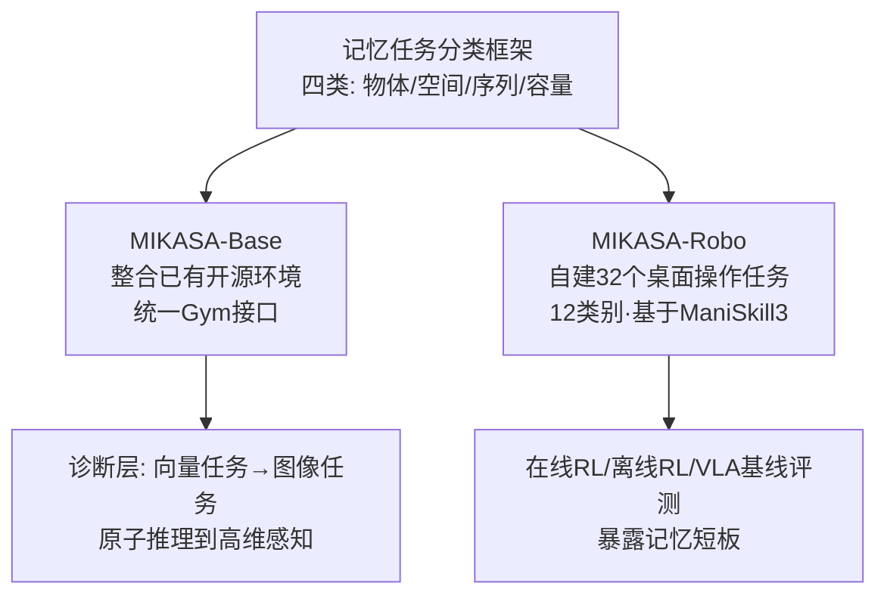

# Memory, Benchmark & Robots: A Benchmark for Solving Complex Tasks with Reinforcement Learning

**会议**: ICLR 2026  
**OpenReview**: [https://openreview.net/forum?id=9cLPurIZMj](https://openreview.net/forum?id=9cLPurIZMj)  
**代码**: [https://tinyurl.com/membenchrobots](https://tinyurl.com/membenchrobots) (`pip install mikasa-robo-suite`, MIT)  
**领域**: 机器人操作 / 记忆强化学习  
**关键词**: Memory RL, POMDP, Tabletop Manipulation, Benchmark, Partial Observability  

## 一句话总结
提出 MIKASA 记忆基准套件——用一套四类记忆任务分类框架统一了碎片化的记忆 RL 评测，并首次构建了 32 个桌面机器人操作记忆任务（MIKASA-Robo），系统暴露了主流 RL/VLA 智能体在部分可观测操作任务上的记忆短板。

## 研究背景与动机
- **领域现状**：现实世界中大量任务存在**部分可观测性**（POMDP）——延迟/稀疏奖励、长程信息保持，给智能体加上记忆机制（LSTM、Transformer、状态空间模型等）是主流解法。NLP 领域已有 LongBench 等成熟的记忆评测，但 RL 领域的记忆评测极度碎片化。
- **现有痛点**：如论文 Table 2 所揭示，几乎每个记忆增强算法（DRQN、GTrXL、AMAGO、RATE…）都在**自己定制的环境**上评测，任务集合几乎没有重叠；即便在单个 benchmark 内部，也往往只测某一类记忆（如记物体位置）而忽视另一类（如重建事件顺序），导致评测不完整、不同算法无法横向比较。
- **核心矛盾**：机器人操作领域尤其缺失——绝大多数操作模拟器把任务当成 MDP（全可观测）来设计，而真实场景（记住被毛巾盖住的盘子、判断微波炉门擦没擦够次数）本质需要时空记忆。现有"人为加噪声/遮挡把 MDP 改成 POMDP"的做法无法刻画操作任务的物理复杂性。并发工作 MemoryBench 只有 3 个任务、仅覆盖一种记忆类型，且基于无法高效并行的 RLBench。
- **本文目标**：提供一个**既覆盖核心记忆维度、又保持实践简洁**的统一框架，在抽象诊断任务和真实机器人操作两个层面系统评估记忆能力。
- **核心 idea**：**[分类驱动的统一基准]** 借鉴认知科学/发展心理学对人类记忆的研究，把记忆密集型 RL 任务归纳为四大类（物体/空间/序列/容量），再据此一边整合已有开源环境（MIKASA-Base），一边自建 32 个机器人操作任务（MIKASA-Robo），让"谁的记忆机制更好"第一次有了可对照的标尺。

## 方法详解

### 整体框架
MIKASA（Memory-Intensive Skills Assessment Suite for Agents）由三块构成：一个把记忆任务归为四类的**分类框架**，一个整合已有记忆环境、统一为 Gym 接口的诊断基准 **MIKASA-Base**，以及一个自建的 32 任务机器人操作基准 **MIKASA-Robo**。分类框架是地基，决定了后两个基准选/造哪些任务；MIKASA-Base 偏抽象诊断、MIKASA-Robo 偏真实物理，二者从"原子推理"递进到"高维感知"，共同覆盖记忆能力的完整谱系。

### 关键设计

**1. 四类记忆任务分类框架：把认知科学的记忆概念落到 RL 上。** 论文的核心贡献不是某个算法，而是这套分类标尺。它把记忆密集型任务定义在 POMDP 之上：存在一个**关联视界** $\xi > 1$，表示"决策关键事件发生"到"该信息必须被回忆起来"之间的最小时间步数——$\xi$ 越大记忆压力越大。在此基础上划出四类：**物体记忆**（对应认知科学的 object permanence，物体被遮挡后仍追踪其属性，如记住放进冰箱的水果）、**空间记忆**（环境布局与位置，如记住挪动过的杯子位置并放回）、**序列记忆**（时序有序信息的串行回忆，如记住往汤里加配料的顺序）、**记忆容量**（同时管理多条信息，对应 memory span，如清桌时记住多个物体的位置）。这套框架刻意取了人类记忆复杂度与 RL 可形式化之间的折中（论文 Figure 3）——既不像人类记忆那样复杂到无法建模，也不退化成简单时空依赖。

**2. MIKASA-Base：统一碎片化环境的诊断层。** 它把社区里广泛使用的开源记忆环境（POPGym、Memory Maze、Passive T-Maze、MiniGrid-Memory 等）按上述四类重新归类，统一封装到一套 Gym-like API 下。设计上分两层递进：第一层是**向量诊断环境**，隔离单一记忆机制、排除感知等无关干扰；第二层是**图像任务**，引入真实感知挑战、更接近实际部署。这种分层让研究者能从原子推理逐步验证到高维感官输入，把"智能体到底是哪一类记忆失败"精确归因。

**3. MIKASA-Robo：32 个桌面操作记忆任务。** 基于 **ManiSkill3** 构建（看中其 GPU 并行训练能力），按四类记忆共设计 12 个类别、32 个任务，每个任务有多种难度与配置模式。典型如 `ShellGameTouch`（前 5 步看红球位置，第 5 步被三个杯子盖住，再去碰正确杯子——物体记忆）、`RememberColor3/5/9`（看 5 步某色方块，消失 5 步后从 3/5/9 个候选中选回原色——物体记忆，数字即难度）、`RotateLenientPos`（记住 peg 初始朝向并旋转指定角度——空间记忆）、`SeqOfColors`/`ChainOfColors`（按任意/严格顺序回忆颜色——序列记忆）。每个任务都标注了"为成功必须记住的信息"（Oracle Info）与超时步数 $T$。训练模式上 `state`（含 oracle 全向量信息）用于验证任务在 MDP 下可解，而 **`RGB+joints`** 是标准记忆测试配置；奖励分 dense（连续反馈、学得快）与 sparse（只在完成时给信号、更贴近真实）。

**4. 多范式基线 + 数据集：让基准真正可用。** 论文不只发任务，还配齐了评测生态：在线 RL（PPO-MLP/PPO-LSTM、SAC、TD-MPC2）、离线 RL（BC、CQL、Decision Transformer、RATE、Diffusion Policy）以及 VLA 模型（Octo、OpenVLA、SpatialVLA、π0），并为全部 32 个任务释放了**专家级轨迹数据集**支持离线 RL 研究。无记忆架构（MLP）与有记忆架构（LSTM/Transformer）的对照，正是用来验证"这些任务确实在考记忆"的关键。

## 实验关键数据

### 主实验（VLA 模型在选定记忆任务上的成功率，100 episode，mean±sem）

| Model | ShellGameTouch | InterceptMedium | RememberColor3 | RememberColor5 | RememberColor9 |
|---|---|---|---|---|---|
| Octo-small | 0.46±0.05 | 0.39±0.04 | 0.45±0.06 | 0.17±0.03 | 0.11±0.03 |
| OpenVLA (K=4) | 0.12±0.05 | 0.06±0.02 | 0.21±0.00 | 0.09±0.02 | 0.08±0.02 |
| OpenVLA (K=8) | 0.47±0.05 | 0.14±0.03 | 0.59±0.04 | 0.16±0.03 | 0.06±0.02 |
| SpatialVLA (K=4) | 0.23±0.04 | 0.27±0.04 | 0.27±0.05 | 0.17±0.03 | 0.11±0.03 |

> 随候选颜色从 3→5→9 增多（记忆负荷上升），所有 VLA 成功率显著塌方至 ~0.1，印证任务确实在压记忆。

### 在线 RL 基线（RememberColor-v0，RGB+joints，dense reward）

| 设置 | 现象 |
|---|---|
| `state` 模式（MDP，全可观测） | PPO-MLP 可达 **100% 成功率**，证明任务本身可解、难点纯在记忆 |
| 3 色 + dense | PPO-LSTM 明显优于 PPO-MLP（记忆机制有效） |
| 5/9 色 + dense | 两者成功率均**骤降至接近 0** |
| 3 色 + sparse | 两种架构**均无法解出** |
| SAC / TD-MPC2 | 样本效率高于 PPO-MLP，但因缺显式记忆，复杂任务下性能崩塌 |

### 关键发现
- 任务在 MDP 下 100% 可解，说明失败完全归因于**部分可观测下的记忆缺失**，基准设计干净。
- 记忆负荷（候选数、序列长度）一增加，无论在线 RL、离线 RL 还是 VLA 都急剧退化——记忆能力随任务难度的退化曲线非常清晰。
- 机器人社区常用的 SAC/TD-MPC2 在记忆密集任务上不合适，凸显需要专门的记忆机制。

## 亮点与洞察
- **从认知科学借标尺**：四类记忆分类不是拍脑袋，而是对接 object permanence / working memory / serial recall / memory span 等成熟概念，给 RL 记忆评测提供了可解释的维度划分。
- **诊断与真实双层覆盖**：MIKASA-Base 管"干净诊断"、MIKASA-Robo 管"物理真实"，从向量到图像、从抽象到操作，归因能力强。
- **生态完整**：一次性给齐分类、环境、专家数据集、在线/离线/VLA 三套基线，且开源 MIT、支持 ManiSkill3 GPU 并行，落地门槛低。
- **强诊断价值**：用"MDP 下 100% 可解 vs POMDP 下崩塌"的对照，干净地把记忆能力从其他能力中剥离出来。

## 局限与展望
- 在线 RL 只选了 MLP/LSTM/SAC/TD-MPC2 等基础架构，作者明确说目标是**验证基准**而非全面算法横评，更先进的记忆架构（如各类 Transformer/SSM 变体）尚未系统评测。
- 任务仍是桌面操作的仿真环境，与真实机器人硬件、真实感知噪声之间的 sim-to-real gap 未在文中验证。
- 四类分类虽简洁，但因果推理、迁移推理（transitive inference）等更高阶认知记忆未纳入，框架刻意保持了简单性。
- 未来可作为标准平台推动记忆增强架构竞赛，并向多模态指令、长程多步任务扩展。

## 相关工作与启发
- **记忆 RL 基准**：POPGym、DMLab-30/PsychLab、Memory Gym、Memory Maze、BSuite 等，各自聚焦特定记忆侧面、任务互不重叠——正是 MIKASA 想统一的对象。
- **记忆分类工作**：Ni et al. 按时间视界分记忆/信用分配；Yue et al. 提记忆依赖对；Cherepanov et al. 区分长/短期、陈述性/程序性记忆——这些都偏重时序维度，**忽略了机器人中的物理空间维度**，本文补上了这一块。
- **操作基准**：ManiSkill3、LIBERO、Meta-World、RLBench 等几乎都按 MDP 设计、不测记忆（论文 Table 3）；并发的 MemoryBench 仅 3 任务、单一记忆类型。
- **启发**：当一个子领域陷入"各测各的、无法横比"的碎片化困境时，先建一套对接成熟学科（这里是认知科学）的分类标尺、再据此整合存量+自建增量，是把领域评测拉回正轨的有效范式。

## 评分
- **新颖性**: ⭐⭐⭐⭐ — 把认知科学记忆分类系统迁移到 RL，并首次为桌面操作构建大规模（32 任务）记忆基准，填补了机器人记忆评测的空白；分类思想本身是整合而非全新发明。
- **实验充分度**: ⭐⭐⭐⭐ — 覆盖在线 RL、离线 RL、VLA 三大范式，含 MDP 可解性对照和难度递增退化曲线，证据链完整；但记忆架构横评和 sim-to-real 验证有限。
- **写作质量**: ⭐⭐⭐⭐ — 动机—分类—基准—实验逻辑清晰，图表（Table 1/2/3、Figure 1/3）有效支撑论证。
- **价值**: ⭐⭐⭐⭐⭐ — 开源、即装即用、数据集齐全，有望成为记忆 RL 与记忆增强机器人操作的事实标准评测平台，社区价值高。

<!-- RELATED:START -->

## 相关论文

- [\[ICLR 2026\] MolLangBench: A Comprehensive Benchmark for Language-Prompted Molecular Structure Recognition, Editing, and Generation](mollangbench_a_comprehensive_benchmark_for_language-prompted_molecular_structure.md)
- [\[ICLR 2026\] TaCo: A Benchmark for Lossless and Lossy Codecs of Heterogeneous Tactile Data](taco_a_benchmark_for_lossless_and_lossy_codecs_of_heterogeneous_tactile_data.md)
- [\[ICLR 2026\] CoNavBench: Collaborative Long-Horizon Vision-Language Navigation Benchmark](conavbench_collaborative_long-horizon_vision-language_navigation_benchmark.md)
- [\[ICLR 2026\] RF-MatID: Dataset and Benchmark for Radio Frequency Material Identification](rf-matid_dataset_and_benchmark_for_radio_frequency_material_identification.md)
- [\[ICLR 2026\] AutoBio: A Simulation and Benchmark for Robotic Automation in Digital Biology Laboratory](autobio_a_simulation_and_benchmark_for_robotic_automation_in_digital_biology_lab.md)

<!-- RELATED:END -->
