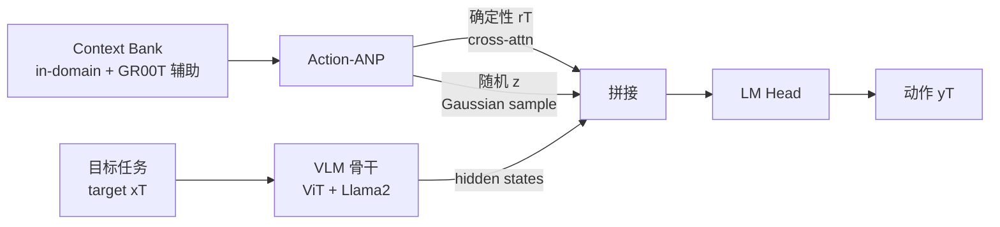

# MetaVLA: Unified Meta Co-Training for Efficient Embodied Adaptation

**会议**: ICLR 2026  
**OpenReview**: [https://openreview.net/forum?id=E1K2Ph3LtS](https://openreview.net/forum?id=E1K2Ph3LtS)  
**代码**: 待开源（论文承诺 Code will be available）  
**领域**: 机器人 / 具身智能（VLA 后训练）  
**关键词**: Vision-Language-Action, Meta-Learning, Multi-Task Co-Training, Attentive Neural Processes, Post-Training Efficiency  

## 一句话总结
MetaVLA 在 VLA 后训练阶段引入一个由 Attentive Neural Process 派生的轻量上下文记忆模块（Action-ANP），把多任务联合训练从"任务越多越崩"变成"加辅助任务还能涨点"，用单个模型在 LIBERO 上把 OpenVLA 240K 步训练压到 75K 步、GPU 时间砍 76%，长程任务还反超 8%。

## 研究背景与动机
**领域现状**：VLA（视觉-语言-动作）模型通常从 VLM 预训练而来，再通过监督微调（SFT）或强化学习适配到新的具身任务。当前主流实践（如 OpenVLA）对每个下游任务**单独**微调一个模型——LIBERO 四个 suite 就要训四个模型。

**现有痛点**：这种 per-task SFT 范式代价高昂且脆弱。OpenVLA 微调全部四个 LIBERO suite 需要约 240K 步、近 100 GPU 小时；OpenVLA-OFT 更要 150K~500K 步。长程任务（LIBERO-Long）尤其是训练瓶颈，往往要大量梯度步才能稳定输出有意义的动作序列，泛化差、适配慢，还产出一堆重复的 checkpoint 难维护。

**核心矛盾**：一个自然的想法是用多任务联合训练（co-training）共享知识、降低成本。作者从 vanilla 多任务 SFT 起步——把四个 LIBERO suite 喂给一个模型确实能降 GPU 时长、略涨成功率。但当他们想**进一步加入更多更异质的辅助任务**时却发现：朴素地堆辅助任务反而**拖慢收敛、掉点**，而且任务越多崩得越狠（加 5single+1bimanual 后平均成功率从 76.2% 暴跌到 8.6%）。作者把矛头指向异质分布带来的优化不稳定——相机视角、自由度（DoF）这些特征空间和动作空间的错配，抵消了 co-training 的好处。

**本文目标**：设计一个统一、骨干无关（backbone-agnostic）的 VLA 后训练框架，既能享受联合训练的效率，又能安全地吃下高多样性的辅助任务，不带来 per-task SFT 的低效，也不踩 naive 多任务 SFT 的掉点坑。

**核心 idea**：**用元学习把"辅助任务"从"参与优化的训练目标"降级成"被检索的上下文记忆"**——提出 **Context-Aware Meta Co-Training**：建一个 context bank（含 in-domain 目标任务 + out-of-domain 辅助任务），用 Attentive Neural Process 派生的 Action-ANP 把这些上下文聚合成可参考的表示注入动作解码器，让模型在不直接对辅助数据做梯度优化的前提下"借鉴"它们带来的信息增益，从而隔离掉异质分布的优化干扰。

## 方法详解

### 整体框架
MetaVLA 在标准 VLA 骨干（OpenVLA = ViT + Llama2-7B + 动作头）之上挂一个轻量 Action-ANP 模块。训练时维护两个数据库：**target bank**（只含四个 LIBERO suite 的目标集，是真正被优化的对象）和 **context bank**（in-domain 任务的上下文集 + GR00T 辅助任务）。每次预测时，Action-ANP 把 context bank 里的样本聚合成确定性表示和随机性全局表示，与 Llama 隐状态拼接后过 LM head 出动作 logits，端到端训练。

### 关键设计
**1. Action-ANP：把"参考演示"建模成函数分布，而非新增训练目标。** 这是整套方法的灵魂。作者不让辅助任务直接进损失，而是借 Attentive Neural Process 的思路，把"给定上下文预测目标动作"建模成对函数的分布：$p(y_T \mid x_T, x_C, y_C) := \int p(y_T \mid x_T, r_T, z)\, q(z \mid \bar{s}_C)\, dz$。其中 context 样本对 $(x_{Ci}, y_{Ci})$ 经自注意力聚合出每条上下文表示 $r_{Ci}, s_{Ci}$；目标特征 $x_T$ 作为 query 对 context 的 key/value 做交叉注意力得到**确定性表示** $r_T$（捕捉与目标相关的依赖），$\bar{s}_C$ 是所有 $s_{Ci}$ 的均值、再据此采样**随机全局隐变量** $z$（建模与具体目标无关的上下文分布）。两条分支一确定一随机，给模型提供"可参考的演示"。关键好处是辅助数据只被"注意/检索"，不直接参与目标优化，因此异质分布的优化干扰被隔离开。

**2. 变分下界 + KL 约束：让目标分布"参考但不漂移"。** 训练时额外用真值对 $(x_T, y_T)$ 经同样的自注意力+取均值过程产出目标侧表示 $\bar{s}_T$，通过对高斯隐变量 $z$ 重参数化，最大化变分下界：$\log p(y_T \mid x_T, x_C, y_C) \geq \mathbb{E}_{q(z \mid s_T)}[\log p(y_T \mid x_T, r_T, z)] - D_{KL}(q(z \mid \bar{s}_T) \,\|\, q(z \mid \bar{s}_C))$。第一项负责重建目标动作，第二项 KL 散度把目标分布拽住、不让它偏离上下文分布太远——这正是异质 co-training 能保持稳定的数学保证：上下文越多样，KL 项越能起到"软对齐"的正则作用，而不是让优化被多样分布拉散。与原始 ANP 用小网络不同，这里把 OpenVLA 的预训练 Llama2 当 backbone，Action-ANP 产出的随机+确定性隐向量拼到 Llama 最后输出层前，复用标准 Llama 解码端到端训练。

**3. 双数据库 + 周期刷新：上下文是"外挂记忆"而非训练集。** context bank 同时装 in-domain（四个 LIBERO suite 切出来的、与 target 集不重叠的 context 集）和 out-of-domain 辅助任务（选 GR00T 数据集），target bank 只装四个 suite 的 target 集。为保证上下文覆盖面，每 $K=200$ 步刷新一次 context 集：每个 context 任务随机采 $b_C=32$ 条样本（$b_C$ 对各任务一致以简化实现）。$K$ 平衡训练速度与解码质量，$b_C=32$ 平衡显存与性能。这种"周期采样外挂记忆"的设计让单个模型能在所有 target suite 上联合训练，而不必为每个 suite 存独立 checkpoint。

**4. 辅助任务选择：要"够不一样"才有信息增益。** 作者刻意选 GR00T 而非和 LIBERO 高度相似的数据，理由有二：GR00T 在 OpenVLA 预训练中完全没见过（信息增益大），且与 LIBERO 部分相关但结构不同（在熟悉与多样之间取平衡）。LIBERO 是 Franka Panda 单臂、7-DoF、前视相机；选入的 GR00T 任务则包含双臂 14-DoF 操作和仅侧视的单臂操作——视角和动作空间都故意拉开差异，用来检验 MetaVLA 的鲁棒性。这与 Zhao et al. 谨慎挑近似任务的做法相反，作者认为放宽辅助任务多样性能带来更可扩展的适配框架，实验也证明这种"少筛选、高多样"的 context bank 反而涨点。

## 实验关键数据

### 主实验（LIBERO，OpenVLA 骨干，成功率 % / 训练步数）

| Model | Steps | Goal | Spatial | Object | Long | Average |
|---|---|---|---|---|---|---|
| OpenVLA（四个独立模型） | 240K | 76.2 | 84.7 | 87.0 | 51.8 | 74.9 |
| SFT-4LIBERO（单模型 naive co-train） | 75K | 77.8 | 84.8 | 87.4 | 54.7 | 76.2 |
| SFT-4LIBERO+5single+1bimanual | 75K | 15.2 | 5.6 | 12.0 | 1.6 | **8.6** |
| SFT-4LIBERO+5single+1bimanual | 187.5K | 23.4 | 16.7 | 13.6 | 4.4 | 14.5 |
| MetaVLA（ours，仅 LIBERO 上下文） | 75K | 78.9 | 88.5 | 88.5 | 55.3 | 77.8 |
| **MetaVLA+5single+1bimanual（ours）** | 75K | 78.7 | 89.9 | 88.9 | **59.8** | **79.3** |

MetaVLA 加六个辅助任务后平均超 OpenVLA **4.4%**、超 SFT-4LIBERO **3.1%**，LIBERO-Long 上分别领先 **8.0% / 5.1%**；模型数从 4 降到 1，训练步从 240K 降到 75K，GPU 时间从 ~100 小时降到 ~24 小时（约 −76%）。最戏剧的是 naive SFT 加同样辅助任务会从 76.2% 崩到 8.6%，加训到 187.5K 也只回到 14.5%——MetaVLA 把"加任务即崩"逆转成"加任务还涨"。

### 消融实验

| 维度 | 关键结果 |
|---|---|
| 换骨干（NORA-Long, 3B Qwen2.5-VL） | MetaVLA 无辅助任务超 NORA-Long **4.9%**；加辅助任务平均冲到 **91.8%**，超 naive SFT 同设置 **25.4%**，验证骨干无关性 |
| context batch size $b_C$ | 成功率随 $b_C$ 单调上升，$b_C=32$ 最佳且不增显存开销 |
| 辅助任务选择 | 三种辅助设置（变相机视角/动作空间/任务数）下 MetaVLA 均超对应 SFT 版本，说明 context bank 可放心扩容 |
| 推理开销 | 紧凑记忆模块仅增 **0.3 ms/token** 延迟 |

### 关键发现
- naive 多任务 SFT 掉点的部分原因是"每任务步数被稀释"（75K 步下 per-task 从 18.75K 降到 7.5K），但加训到 187.5K 仍远不及 MetaVLA，证明问题本质是异质分布的优化不稳定，而非单纯步数不够。
- 把辅助任务降级为"被检索的上下文"是关键：MetaVLA 在 Accuracy / Imitation Loss / L1 Loss 三条曲线上都比 SFT 更稳更快收敛。

## 亮点与洞察
- **范式转换**：把"多任务 co-training"的失败重新归因为"辅助任务不该进损失"，用元学习的 in-context 检索机制绕开异质优化干扰——这是比"调采样比例/加正则"更根本的思路。
- **工程友好**：plug-in 模块、骨干无关、几乎零推理开销（0.3ms/token），且能从 SFT 平滑扩展到 RL，落地门槛低。
- **效率账漂亮**：单模型替代四模型，训练步与 GPU 时间双双砍掉约 3/4，对资源受限/民主化场景特别有价值。
- **反直觉证据扎实**：用"加辅助任务 naive SFT 崩到 8.6%"作为强对照，凸显 ANP 机制的必要性，故事讲得有说服力。

## 局限与展望
- 作者自承对"MetaVLA 为何能稳定吃下异质分布"只给了直觉解释，**缺严格理论证明**，受算力限制留作 future work。
- 评测主要局限在 **LIBERO 仿真**（Franka 单臂），真实机器人、更大规模 embodiment 多样性下的表现未验证。
- 辅助任务来源单一（GR00T），"少筛选高多样"的结论能否推广到任意辅助数据池仍待考。
- context bank 周期刷新引入 $K, b_C$ 等超参，规模继续放大后的检索成本与显存增长趋势未充分讨论。

## 相关工作与启发
- **VLA 模型**：离散 token 自回归（OpenVLA、RT 系列）vs 连续动作（diffusion policy / flow matching，π0、π0.5）；本文与这些预训练阶段的改进正交，专攻后训练。
- **多任务 co-training**：在 LLM/VLM（GPT-2、LLaVA、Qwen-3、Molmo/Pixmo）已被验证有效，但在 VLA 后训练阶段长期被忽视——多数工作只在预训练 co-train，下游仍 per-task SFT。MetaVLA 填的正是这个空白。
- **元学习 / ANP**：借 Attentive Neural Process 的任务不变性、对相关演示的选择性注意、避免适配时直接优化上下文这三条性质，使其天然适配 VLA 的低数据跨域适配。
- **启发**：当"加数据反而掉点"时，先问"这些数据该不该进梯度"——把外部知识改成可检索的上下文记忆，可能比硬调优化器更有效。这套"记忆增强 + 元学习"思路对其他需要吃异质辅助数据的微调场景（多模态对齐、跨域 RL）都有迁移价值。

## 评分
- **新颖性**: ⭐⭐⭐⭐ — 把 ANP/元学习引入 VLA 后训练、将辅助任务降级为上下文记忆来解决异质 co-training 不稳定，角度新颖且切中真实痛点。
- **实验充分度**: ⭐⭐⭐⭐ — 双骨干（OpenVLA + NORA-Long）、强对照（naive SFT 崩盘）、batch size / 辅助任务 / 延迟多维消融较完整；扣分在仅限 LIBERO 仿真、缺真机与理论证明。
- **写作质量**: ⭐⭐⭐⭐ — 动机递进清晰（从 naive co-train 失败引出方法），图表与公式配合到位，故事完整。
- **价值**: ⭐⭐⭐⭐ — 训练成本砍 76%、单模型替代多模型、几乎零推理开销，对资源受限的 VLA 适配有直接实用价值。

<!-- RELATED:START -->

## 相关论文

- [\[ICML 2026\] Online Self-Training for Co-Adaptation in Hierarchical Diffusion Policies](../../ICML2026/robotics/online_self-training_for_co-adaptation_in_hierarchical_diffusion_policies.md)
- [\[NeurIPS 2025\] Generalizable Domain Adaptation for Sim-and-Real Policy Co-Training](../../NeurIPS2025/robotics/generalizable_domain_adaptation_for_sim-and-real_policy_co-training.md)
- [\[ICLR 2026\] Hybrid Training for Vision-Language-Action Models](hybrid_training_for_vision-language-action_models.md)
- [\[ICLR 2026\] HybridVLA: Collaborative Diffusion and Autoregression in a Unified Vision-Language-Action Model](hybridvla_collaborative_diffusion_and_autoregression_in_a_unified_vision-languag.md)
- [\[ICLR 2026\] EVLP: Learning Unified Embodied Vision-Language Planner with Reinforced Supervised Fine-Tuning](evlp_learning_unified_embodied_vision-language_planner_with_reinforced_supervise.md)

<!-- RELATED:END -->
