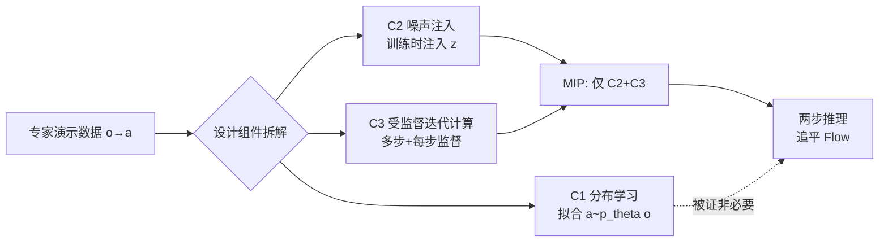

# Much Ado About Noising: Dispelling the Myths of Generative Robotic Control

**会议**: ICLR 2026  
**OpenReview**: [https://openreview.net/forum?id=LzWKuxTKuW](https://openreview.net/forum?id=LzWKuxTKuW)  
**代码**: 项目主页（论文 abstract 提及，待确认链接）  
**领域**: 机器人控制 / 行为克隆 / 生成式策略  
**关键词**: 生成式控制策略, 行为克隆, 流模型, 多模态, 迭代计算, 流形吸附  

## 一句话总结
本文系统性地"祛魅"生成式机器人控制策略（GCP）——通过 28 个行为克隆 benchmark 的严格消融，证明 GCP 优于回归策略的真正原因既不是多模态建模、也不是表达能力，而是「训练阶段注入噪声 + 受监督的迭代计算」这一组合，并据此设计出仅两步、无需分布拟合的极简策略 MIP，性能基本追平流模型。

## 研究背景与动机
- **领域现状**：扩散、流模型等生成式架构（统称 GCP）近年成为机器人行为克隆（BC）的主流策略参数化方式，从 Diffusion Policy 到 π0 等大型机器人模型都采用它。社区普遍相信 GCP 的优势来自它"会建模动作分布"。
- **现有痛点**：关于 GCP 为何强，业界堆砌了一大堆假设却从未被严格验证——H1 像素控制更好、H2 捕获训练数据的多模态、H3 迭代计算带来更强表达力、H4 噪声充当表示学习/数据增强、H5 训练更稳更可扩展。这些假设大多在「对比时架构不对齐」的情况下得出，存在严重混淆。
- **核心矛盾**：生成式建模的目标（采样出高质量且多样的样本，复现数据分布）和控制任务的目标（只要选出一个能带来好下游表现的动作即可）本质不同。那么，复现专家数据分布（尤其是多模态）到底是不是强控制性能的**必要条件**？
- **本文目标**：用受控实验逐一证伪上述假设，找出 GCP 成功的真正最小充分要素，并把它从"分布拟合"的外衣中剥离出来。
- **核心 idea**：**【分布拟合是误区】** GCP 的成功与"建模分布/多模态"几乎无关，真正起作用的是 **C2 噪声注入 + C3 受监督迭代计算** 的组合；据此可用一个不做任何分布学习的两步回归策略复现流模型性能。

## 方法详解

### 整体框架
论文先用受控实验逐个证伪旧假设（控制架构后 GCP 仅在少数高精度任务领先；多模态不存在；表达力不更强），再把 GCP 的设计空间拆成三个正交组件——C1 分布学习、C2 噪声注入、C3 受监督迭代计算（SIC）。然后沿 RCP↔GCP 之间构造一系列只组合 C2/C3、**不含 C1** 的策略变体，最终锁定同时具备 C2+C3 的极简两步策略 MIP 才能追平流模型，从而把成功归因到这两个组件。

### 关键设计

**1. 三组件分类法（taxonomy）：把 GCP 的设计空间拆成可单独消融的零件。** 论文指出所有 GCP 都可分解为三个组件：C1 分布学习指训练模型去拟合条件分布 $a \sim \pi_\theta(o)$ 而非确定性预测 $a=\pi_\theta(o)$；C2 噪声注入指训练时往网络额外灌入随机输入 $z$（如流模型里随机插值 $I_t = ta+(1-t)z$ 中的 $z$）；C3 受监督迭代计算（SIC）指推理时把上一步输出再喂回同一网络做多步精修，且训练时**每一步都拿到独立的监督信号**。流模型同时具备这三者，回归策略（RCP）一个都不沾。这个分类法是后续所有消融的支点——只有把三者拆开，才能问"到底哪个零件在起作用"。

**2. 证伪三大假设——架构对齐是关键。** 论文首次把为扩散/流设计的强力架构（Chi-Transformer、Sudeep-DiT、Chi-UNet 乃至预训练 π0）反过来当**回归策略**用——只需把噪声水平和初始噪声置零（$z=0, t=0$）。在这种公平对齐下，GCP 与 RCP 在绝大多数 benchmark 上打平，只在极少数高精度插入类任务（Tool-Hang、Transport）上 GCP 领先。进一步：（a）多模态根本不存在——在 Push-T 对称轴、Kitchen 多分支等"理应多模"的状态采样多个动作，t-SNE 可视化只看到单一聚类而非分立模态，且用均值动作 $a=\mathbb{E}_{z}[\pi(z,o)]$ 替代采样几乎不掉点（Table 1）；（b）表达力不更强——在 $\kappa$-log-concave（单模）假设下，论文证明无穷积分步的流策略关于观测 $o$ 的 Lipschitz 常数被流场上界控制：$\|\nabla_o \pi^\star_\theta(z,o)\| \le L\sqrt{1+\kappa^{-1}}$，即迭代计算并不能凭空换来对 $o\to a$ 映射的更高敏感度，实测中 RCP 的 Lipschitz 常数反而更大（Table 3）。

**3. MIP——只保留 C2+C3 的极简两步策略。** 先从两步去噪（TSD）出发：第一步从零去噪、第二步从固定索引 $t^\star=0.9$ 去噪。MIP 进一步把 TSD 第一项的目标 $(t^\star)^{-1}I_{t^\star}$ 换成其期望（即直接监督真值动作 $a$），并令初始噪声 $I_0=0$，使随机性 $z$ 只在第二步发挥作用。训练目标为
$$\pi^{\text{MIP}}_\theta \approx \arg\min_\theta \mathbb{E}\big(\|\pi_\theta(o, I_0{=}0, t{=}0)-a\|^2 + \|\pi_\theta(o, I_{t^\star}, t^\star)-a\|^2\big),$$
推理时确定性地两步生成：$\hat{a}_0 \leftarrow \pi_\theta(o,0,0)$，$\hat{a} \leftarrow \pi_\theta(o, t^\star \hat{a}_0, t^\star)$。MIP 关键在于**两步都用真值 $a$ 监督**（体现 C3 最简形式），第二步插值里含 $z$（体现 C2），但**完全不做分布学习**（无 C1），推理也无随机性。作为对照，论文还设计了只含 C2 的 Straight Flow（SF）和只含 C3 的 Residual Regression（RR），三者恰好覆盖 C2/C3 的全部组合。

**4. 把优势归因到"流形吸附"而非重建精度。** 论文发现 MIP、Flow、RCP 在验证集上的重建 L2 误差**几乎相同**，验证损失无法预测谁性能更好。真正区分它们的是一个新指标——离流形范数（off-manifold norm）：把预测动作投影到邻近状态专家动作张成的空间，度量其偏离分量。只有 MIP 和 Flow 能做到低离流形误差（Table 4），说明受监督迭代计算（C3）能把预测逐步"吸附"回专家动作流形；而 SF 没这个好处，说明吸附依赖迭代。同时噪声（C2）起稳定作用——RR（有 C3 无 C2）反而比回归更差，说明无随机性时迭代生成极其脆弱，C2 为迭代过程提供"覆盖度"以抑制逐步累积的复合误差。

## 实验关键数据

### 主实验：MIP 追平 Flow
覆盖 28 个 BC benchmark（state/image/point-cloud/language 多模态，含 LIBERO 130 任务多任务 VLA），7 个最难任务上相对 Flow 的平均成功率（Figure 1）：

| 方法 | 组件 | 相对 Flow 成功率 |
|------|------|------------------|
| Regression (RCP) | 无 | 0.74 |
| Straight Flow (SF) | 仅 C2 | 0.74 |
| Residual Regression (RR) | 仅 C3 | 0.73 |
| **MIP（本文）** | **C2+C3** | **1.02** |
| Flow (GCP) | C1+C2+C3 | 1.00 |

单独的 C2（SF）或 C3（RR）都打不过回归，唯有 C2+C3 组合（MIP）追平甚至略超流模型，且训练时间约为常见 consistency 模型的一半。

### 消融与诊断证据

| 诊断 | 设置 | 结果 | 结论 |
|------|------|------|------|
| 采样策略（Table 1）| Push-T/Kitchen/Tool-Hang | $z=0$ / $\mathcal{N}(0,I)$ / 均值 三者成功率几乎一致（如 Tool-Hang 0.78/0.80/0.76） | 不存在分立动作模态 |
| 确定性专家（Table 2）| 用确定性流策略重采数据 | Flow 0.72 vs Reg 0.64，差距缩小但仍在 | 多模态不足以解释差距 |
| Lipschitz 常数（Table 3）| 100 状态平均 | RCP 反而更大（如 Push-T State 0.90 vs Flow 0.45）| GCP 表达力不更强 |
| 流形吸附（Table 4）| Tool-Hang 确定性数据 | 验证 L2 都低；仅 MIP/Flow 离流形 L2 低（0.054/0.042）| 吸附而非重建驱动性能 |

### 关键发现
- **架构 > 目标函数**：动作分块（action chunking）长度、网络架构对成功率的影响远大于"生成 vs 回归"的选择；GCP 仅在高精度任务领先 >5%。
- **可扩展性**：回归在最小模型上反而更强，但随模型增大扩展更差；MIP/Flow 因 C2+C3 能更好利用大模型容量（Figure 5）。
- **中间步监督必不可少**：去掉中间步监督、或不按时间步 $t^\star$ 条件化（网络无法学到跨步的不同函数）的变体，性能比回归还差。

## 亮点与洞察
- **方法论上的"祛魅"价值极高**：首次把扩散/流的强力架构反向当回归策略严格 benchmark，戳破了"GCP 强=会建模分布"这一被默认多年的混淆，是难得的负结果型严谨工作。
- **MIP 作为"算法消融实验"而非"新 SOTA"**：它的意义不在于刷点，而在于用最小可复现单元证明 C1 可弃、C2+C3 才是核心，指明了一个去掉分布拟合负担的全新设计沙盒。
- **"流形吸附"是个有启发的新视角**：把控制性能从"重建精度"解耦到"在 o.o.d. 状态下沿关键方向的误差"，比验证损失更能预测闭环表现。

## 局限与展望
- **机制仍是谜**：论文坦承没有已知理论能解释"为何 GCP/MIP 比训练良好的回归更具流形吸附"，线性模型的隐式正则论证不足以解释 MIP，留作未来工作。
- **结论范围限定**：研究聚焦于流式 GCP 和单/多任务 BC benchmark；扩散、自回归 token 等其它 GCP 形态、以及真实大规模 VLA 的结论是否一致仍需验证。
- **"隐藏多模态"未完全排除**：确定性专家实验中差距缩小但未消失，说明数据中可能仍有少量未被观测到的多模态，因高维观测下样本稀疏难以暴露冲突动作。
- **流形吸附为何利于控制只是猜想**：作者推测高精度任务对不同误差方向敏感度不均，但尚未严格建立。

## 相关工作与启发
- **与 Diffusion Policy / π0 的对话**：直接挑战 Chi et al. (2023)、Reuss et al. (2023) 提出的"多模态是 GCP 成功根源"的论断，并把 π0 等工业 VLA 纳入受控对比。
- **与 flow-map / consistency / shortcut 模型的区分**：MIP 表面像两步 flow-map，但本质不同——后者满足 C1、需在连续噪声水平上训练，而 MIP 不做分布学习、只两步监督。
- **启发**：对机器人策略设计者而言，与其纠结分布建模，不如把精力投向"受监督迭代 + 训练噪声"这一更轻量、更可控的设计空间；同时提醒整个领域在比较生成 vs 回归时务必对齐架构，否则结论极易被混淆。

## 评分
- **新颖性**: ⭐⭐⭐⭐⭐ 系统性证伪主流假设 + 提出极简反例 MIP + 引入流形吸附视角，是难得的高质量"重新理解"型工作。
- **实验充分度**: ⭐⭐⭐⭐⭐ 28 个 benchmark、4 种模态、多架构多种子、含理论证明与多角度诊断证据，严谨度罕见。
- **写作质量**: ⭐⭐⭐⭐ 逻辑链条（先证伪→拆组件→构造最小反例→归因）清晰有力，但术语密集、部分诊断细节挤在附录。
- **价值**: ⭐⭐⭐⭐⭐ 改变社区对 GCP 成功原因的认知，并为继续控制策略设计开辟去分布拟合的新方向，影响面广。

<!-- RELATED:START -->

## 相关论文

- [\[ICLR 2026\] Masked Generative Policy for Robotic Control](masked_generative_policy_for_robotic_control.md)
- [\[ICLR 2026\] Ctrl-World: A Controllable Generative World Model for Robot Manipulation](ctrl-world_a_controllable_generative_world_model_for_robot_manipulation.md)
- [\[ICLR 2026\] Action Chunking and Exploratory Data Collection Yield Exponential Improvements in Behavior Cloning for Continuous Control](action_chunking_and_data_augmentation_yield_exponential_improvements_in_behavior.md)
- [\[ICLR 2026\] Grounding Generative Planners in Verifiable Logic: A Hybrid Architecture for Trustworthy Embodied AI](grounding_generative_planners_in_verifiable_logic_a_hybrid_architecture_for_trus.md)
- [\[ICLR 2026\] On Entropy Control in LLM-RL Algorithms](on_entropy_control_in_llm-rl_algorithms.md)

<!-- RELATED:END -->
