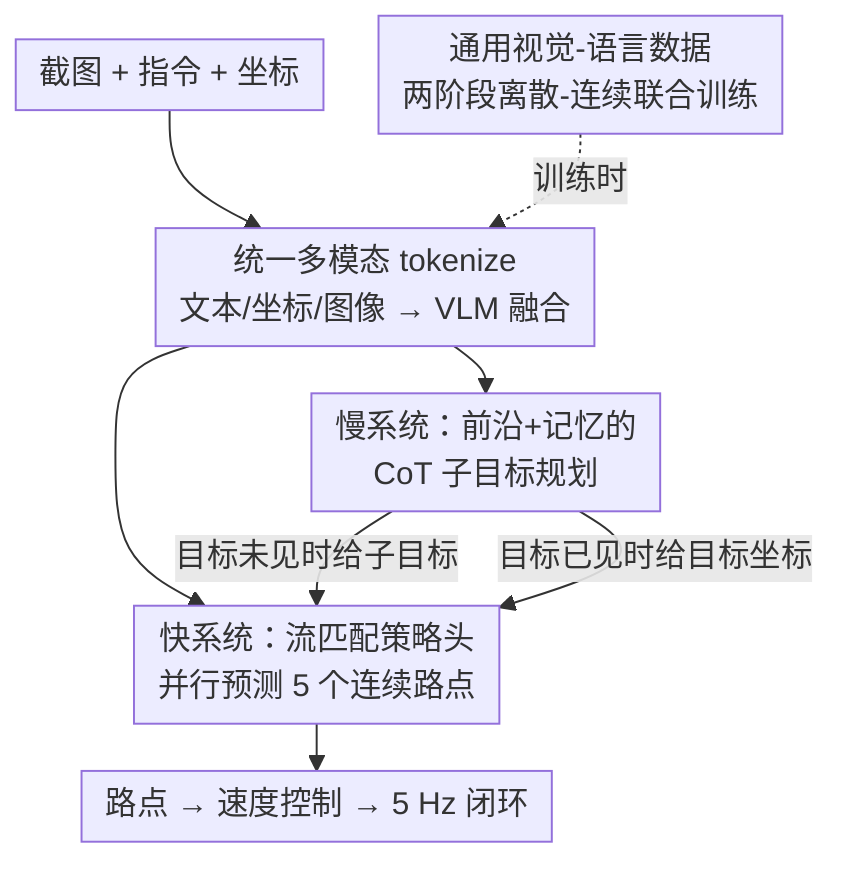

# OmniNav: A Unified Framework for Prospective Exploration and Visual-Language Navigation

**会议**: ICLR 2026  
**OpenReview**: [https://openreview.net/forum?id=zGtTQTD1zu](https://openreview.net/forum?id=zGtTQTD1zu)  
**代码**: 待确认  
**领域**: 机器人导航 / 具身智能 / 多模态VLM  
**关键词**: 具身导航, 视觉语言导航, 快慢双系统, 流匹配策略, 前沿探索

## 一句话总结
OmniNav 用一个 VLM 骨干 + 流匹配（flow-matching）策略头的快慢双系统架构，把 instruct-goal、object-goal、point-goal 和前沿探索四类导航任务统一进单一模型：快系统从短时视觉上下文连续预测高精度路点支持 5 Hz 实时控制，慢系统用长时记忆与前沿做带 CoT 的子目标规划，再辅以大规模通用视觉-语言数据联合训练，在 R2R-CE / RxR-CE / HM3D-OVON 等多个 benchmark 上刷到 SOTA 并完成真机部署。

## 研究背景与动机
**领域现状**：具身导航要求机器人在没有预建地图的情况下感知环境、理解自然语言指令、自主探索。目前研究主要围绕三种范式：point-goal（给定坐标）、instruct-goal（给定语言指令，如 R2R/RxR）、object-goal（找某类物体）。近年大量工作直接用 VLM/Video-LLM/VLA 端到端把视觉指令解码成低层动作。

**现有痛点**：作者指出现有方法各有硬伤。其一，多数方法是为单一任务定制的，依赖任务专属数据，跨任务迁移和相互增益的潜力受限——Uni-NaVid 虽统一了多任务但用离散动作预测、长程规划做得不够；MTU3D 把前沿探索和视觉定位耦合，却要构造 3D 物体坐标，部署复杂。其二，把动作离散化（action chunk）会牺牲精度和灵活性；VLM 调用频率受限、频繁 context reset 导致流式视频输入下难以低延迟部署。其三，也是最关键的观察——实际失败的主因往往不是导航策略本身没学好，而是对通用指令和开放词表物体的理解不足。

**核心矛盾**：长程深思（global planning、记忆）与短程敏捷（低延迟实时控制）之间存在 trade-off，单一反应式策略会在长程探索中陷入局部环路、地图覆盖差；而纯端到端 VLA 又卡在流式输入与低延迟推理上。同时，"导航范式好学、通用理解能力难学"这一点被多数工作忽略。

**本文目标**：构造一个统一、高效的框架，同时解决实时操作、快慢协同、泛化三件事，覆盖四类导航范式。

**切入角度**：借鉴双系统理论（dual-system / fast-slow），把"快速反应"和"慎重规划"拆给两个互补模块，并用一个中央记忆（KV cache）把它们串起来，让决策既局部敏捷又全局一致。

**核心 idea**：用连续路点的流匹配快系统替代离散动作预测拿到精度与低延迟，用带 CoT 的前沿推理慢系统补长程规划，再把大规模通用视觉-语言数据混进多任务联合训练，专门补"理解"这块短板。

## 方法详解

### 整体框架
OmniNav 以 Qwen2.5-VL-3B-Instruct 为基座，先把四类任务的输入统一 tokenize 成 LLM 可消费的离散 token——文本 token（任务描述、物体类别、point-goal 指令）、坐标 token（候选搜索区域的 2D 坐标+朝向角，经 MLP 编码成稠密 embedding）、图像 token（中央记忆维护一个带位姿戳的环形缓冲区，快系统时空采样最多 20 帧、慢系统在候选前沿的时空邻域采样，统一用 ViT 编码）。VLM 对这些特征做深度融合，输出的融合特征 $O_{VLM}$ 同时喂给快、慢两个系统。

快系统是一个纯视觉、端到端的策略，把融合特征作为条件，用流匹配策略头并行生成未来 $H=5$ 个连续路点；慢系统则在快系统之上，用前沿和历史图像构建长程空间-语义记忆，做带 CoT 的子目标规划。两者协作流程是：慢系统用前沿或记忆生成高层子目标，一旦子目标确定，快系统接管、逐步产出低层路点序列直到抵达目标。整套架构通过一个中央记忆（KV cache）共享时空上下文。

### 关键设计

**1. 流匹配连续路点策略：用条件扩散生成代替离散动作，拿回精度与低延迟**

针对"动作离散化牺牲精度、自回归逐步预测累积误差、推理慢"这个痛点，快系统把路点预测建模成条件扩散生成任务，而非逐 token 自回归。每个路点是五元组 $w_t^{(i)} = (x^{(i)}, y^{(i)}, \sin\theta^{(i)}, \cos\theta^{(i)}, c^{(i)})$，其中 $(x,y)$ 是 2D 位置，$\theta$ 用 sin-cos 嵌入避免在 $\pi/-\pi$ 处的不连续，$c\in\{0,1\}$ 是是否触发"到达"的二值完成标志。策略网络是 DiT 变体：自注意力块在加噪 token 上捕捉路点序列内的时空依赖，交叉注意力块去 attend VLM 上下文 $O_{VLM}$。

训练用条件流匹配：给定真值序列 $w_{t:t+H}$、噪声 $\epsilon\sim\mathcal{N}(0,I)$ 和时间 $\tau\in[0,1]$，构造输入 $w^\tau_{t:t+H} = \tau w_{t:t+H} + (1-\tau)\epsilon$，策略 $\pi$ 学习去噪残差 $\epsilon - w_{t:t+H}$，最小化

$$\mathbb{E}_{\tau,\epsilon}\left[\left\|\pi(O_{VLM}, w^\tau_{t:t+H}) - (\epsilon - w_{t:t+H})\right\|^2\right].$$

推理时从噪声出发做 $S=5$ 步 Euler 积分迭代细化。因为是非自回归一次性生成整条路点序列，配合 20 帧历史能跑到 5 Hz 实时闭环控制，且轨迹更平滑精确——这正是它相比自回归方法的优势所在。

**2. 快慢双系统 + 中央记忆：把全局规划和局部执行分给两个模块协同**

针对"长程深思与短程敏捷的 trade-off"，OmniNav 让慢系统负责全局规划、快系统负责局部执行，二者经中央记忆耦合。关键在于：快系统不是个只会跟着预设坐标走、或对预规划路径做平滑的低层控制器，它必须持续用原始视觉输入朝子目标移动——比如慢系统给了一个坐标但直线路径被墙挡住，快系统得用视觉线索绕开障碍；从物体记忆拿到目标坐标后，它还能根据当前所见调整最终位姿，精确停在物体的左/右/中。通过边移动边更新细化路点，快系统能更准确抵达目标。这种"plan–execute"分层回环更贴合人在陌生环境里的推理-行为模式，在长程记忆密集的场景里保证了探索效率和轨迹一致性。

**3. 语义+推理感知的前沿选择与长时记忆：让探索"会找"而不是只奔最近前沿**

针对长程 object-goal 探索中"纯反应式策略陷入局部环路、地图覆盖差"，慢系统维护一张 3D 占据地图（每个区域标记为已探索/未知），前沿即两者的边界点。它再构建一个记忆库，归档每步执行后的视觉数据与对应位姿。采样策略把历史上下文连到未来探索：收集 agent 当前位置附近所有历史图像，对每个前沿遍历这些图像、挑出原始拍摄视角与该前沿空间坐标最对齐的那张，作为该前沿的视觉代理。选前沿时模型做综合的空间与内容推理——找马桶时优先去卫生间、找电视时找客厅；若目标已在记忆或当前视野中则直接输出其位置。

不同于以往非语义前沿探索（下一个目标常常就是最近前沿、顶多用距离-朝向启发式微调），OmniNav 把每个前沿绑定到其第一视角图像，再用显式 CoT 推理这些视图来判断哪个前沿对当前任务更有信息量/更有希望。CoT 让子目标选择依据透明，支持过程级自检与自纠，减少长链和复杂语义任务中的累积误差。这种基于图像+前沿的记忆，比 scene graph 或复杂语义地图实现更简洁。

**4. 通用数据联合训练 + 两阶段离散-连续训练：把短板"理解"补上而不破坏控制**

基于"实际失败主因是通用指令/开放词表物体理解不足"这个核心观察，作者把大规模通用视觉-语言数据（通用 QA、image captioning、OCR、图表理解、coding、math，取自 MAmmoTH-VL）和 grounding/referring 数据（RefCOCO 系列、Objects365）混进多任务联合训练，为 VLN 注入语言理解、视觉语义、结构化推理、常识先验（如"浴巾通常在浴室"），并把"红沙发""带把手的门""第二把椅子"这类细粒度语言映射到正确图像区域。

训练分两阶段平衡语义与连续控制：Stage 1 用自回归目标预测离散变量（导航动作 chunk、通用语义数据、Embodied QA、grounding/referring），实现语言-视觉-动作对齐；Stage 2 给共享骨干挂上流匹配策略头预测连续路点，并混入 20% 的 Stage-1 离散数据做联合训练，防止连续控制微调把基座 VLM 的能力侵蚀掉。连续路点坐标用 min-max 归一化保证训练稳定。消融显示这套通用数据 + CoT 的组合在开放环境里带来稳定且显著的成功率提升。

## 实验关键数据

### 主实验
在 R2R-CE / RxR-CE 的 Val-Unseen split 上，仅用快系统和纯 RGB 输入，OmniNav 就刷到 SOTA：

| 数据集 | 指标 | OmniNav | 之前最佳(CorrectNav) | 提升 |
|--------|------|---------|----------|------|
| R2R-CE Val-Unseen | SR↑ | 69.5 | 65.1 | +4.4 |
| R2R-CE Val-Unseen | SPL↑ | 66.1 | 62.3 | +3.8 |
| R2R-CE Val-Unseen | NE↓ | 3.74 | 4.24 | -0.50 |
| RxR-CE Val-Unseen | SR↑ | 73.6 | 69.3 | +4.3 |

object-goal（HM3D-OVON）上，纯视觉的 OmniNav 已超最佳方法 2.7%；加入慢系统 + 前沿推理（需深度与里程计建占据地图）后大幅领先：

| 配置 | Val-Unseen SR↑ | Val-Unseen SPL↑ | 说明 |
|------|------|------|------|
| OmniNav（纯视觉） | 43.5 | 27.3 | 超 MTU3D(40.8) 2.7% |
| OmniNav*（w/ slow+CoT） | 59.2 | 33.2 | 超最强先前方法 18.4% |

point-goal（CityWalker，户外）上用 MAOE（平均朝向误差）开放集指标，OmniNav 11.53% 优于 CityWalker 的 15.23%。

### 消融实验
HM3D-OVON Val-Unseen 上逐一开启四个组件：

| 配置 | SR↑ | SPL↑ | 说明 |
|------|------|------|------|
| 仅 base | 35.3 | 22.1 | 离散动作 chunk |
| + policy-head | 43.5 | 27.3 | 流匹配连续路点 |
| + slow-system | 55.9 | 30.7 | 前沿+长时记忆规划 |
| + general data | 57.7 | 32.9 | 通用 MLLM/grounding 数据 |
| + CoT（Full） | 59.2 | 33.2 | 显式链式推理 |

### 关键发现
- **慢系统在长程探索上贡献最大**：从 43.5→55.9（+12.4 SR），因为记录已探索区域减少冗余探索、把主动探索分解成子目标形成分层 plan-execute 回环，最匹配 OVON 这类需全局规划的任务。
- **连续路点 vs 离散动作 chunk**：在 R2R-CE/RxR-CE/OVON 上离散动作退化明显；离散语义 token（左/右）易与语言对齐适合第一阶段训练，但作为粗粒度运动控制不如连续路点做细粒度控制。
- **CoT 让子目标选择依据透明**，支持过程级自检自纠，在长链/复杂语义任务上减少累积误差、带来稳定提升。
- **真机部署**：快系统（VLM+策略头）部署在带 RTX 3090 的云服务器，历史缓冲 20 帧 120×106、当前三视图 480×426，跑 >5 Hz，输出路点喂给板载速度控制模块，在四足机器人上 zero-shot 验证三类导航任务。

## 亮点与洞察
- **"瓶颈不在策略学习而在理解"这一诊断是全文最有价值的洞察**：作者没有继续堆策略网络，而是把大规模通用 captioning/grounding 数据混进导航训练，直接对症下药提升成功率，这个判断对整个具身导航社区都有参考意义。
- **用流匹配生成连续路点替代离散动作**，一次非自回归生成整条 5 路点序列，既拿回精度又支持 5 Hz 实时——把扩散/流匹配从机械臂操作迁到导航 waypoint 是个干净的设计。
- **前沿绑定第一视角图像 + CoT 推理选前沿**：用图像当前沿的"视觉代理"，比 scene graph/语义地图实现简洁，又比纯几何最近前沿"会找"，这套记忆-前沿采样策略可迁移到任何需要主动探索的任务。
- **两阶段离散-连续联合训练里混 20% 离散数据防遗忘**，是个通用且可复用的 trick，避免连续控制微调侵蚀基座 VLM 能力。

## 局限与展望
- 作者承认：完整慢系统的真机部署需额外工程（与 LiDAR/深度估计的鲁棒实时集成），本文真机只部署了快系统，慢系统的物理部署与延迟-频率 trade-off 系统优化留作未来工作。
- 慢系统依赖深度与里程计来建占据地图（object-goal 表中标注需 Depth+Odo.），纯 RGB 下无法发挥全部规划能力，这限制了在仅 RGB 平台上的可用性。
- point-goal 仅在 CityWalker 单一 benchmark 上用 MAOE 评测，证据相对单薄；不同任务采用不同观测模态（纯视觉 vs 深度+里程计），横向比较时需注意输入条件不一致。
- 改进思路：把慢系统的前沿推理蒸馏进快系统以摆脱对深度/里程计的依赖，或探索端侧轻量化慢系统实现真正全栈实时部署。

## 相关工作与启发
- **vs Uni-NaVid**：都做统一多任务导航，但 Uni-NaVid 用离散动作预测且长程 LLM 规划不足；OmniNav 用连续路点 + 显式快慢双系统补长程规划，OVON 与 R2R-CE 上均显著领先。
- **vs MTU3D**：MTU3D 用"move to understand"把前沿探索和视觉定位耦合，但要构造 3D 物体坐标、部署复杂；OmniNav 用图像作前沿视觉代理 + CoT 推理，实现更简洁，OVON Val-Unseen SR 59.2 vs 40.8。
- **vs 端到端 VLA / Video-LLM（StreamVLN 等）**：它们端到端整合视觉-语言-动作但卡在流式输入、长上下文管理、低延迟推理；OmniNav 用 KV cache 中央记忆 + 非自回归流匹配策略缓解延迟，R2R-CE SR 69.5 vs StreamVLN 56.9。

## 评分
- 新颖性: ⭐⭐⭐⭐ 快慢双系统本身有前例，但"瓶颈在理解"的诊断 + 流匹配连续路点 + 前沿 CoT 选择的组合用于统一导航有新意。
- 实验充分度: ⭐⭐⭐⭐⭐ 覆盖四类任务、多 benchmark、完整消融 + 真机部署，证据扎实。
- 写作质量: ⭐⭐⭐⭐ 动机清晰、方法叙述完整，少量公式/表格排版略粗糙。
- 价值: ⭐⭐⭐⭐⭐ 统一架构 + 真机 5 Hz 部署 + 通用数据补理解的洞察，对具身导航落地有实际指导意义。

<!-- RELATED:START -->

## 相关论文

- [\[CVPR 2026\] FantasyVLN: Unified Multimodal Chain-of-Thought Reasoning for Vision-and-Language Navigation](../../CVPR2026/robotics/fantasyvln_unified_multimodal_chain-of-thought_reasoning_for_vision-and-language.md)
- [\[ICLR 2026\] UniVLA: Unified Vision-Language-Action Model](unified_vision-language-action_model.md)
- [\[ICLR 2026\] Uncertainty-Aware Gaussian Map for Vision-Language Navigation](uncertainty-aware_gaussian_map_for_vision-language_navigation.md)
- [\[CVPR 2026\] HTNav: A Hybrid Navigation Framework with Tiered Structure for Urban Aerial Vision-and-Language Navigation](../../CVPR2026/robotics/htnav_a_hybrid_navigation_framework_with_tiered_structure_for_urban_aerial_visio.md)
- [\[CVPR 2026\] CUBic: Coordinated Unified Bimanual Perception and Control Framework](../../CVPR2026/robotics/cubic_coordinated_unified_bimanual_perception_and_control_framework.md)

<!-- RELATED:END -->
