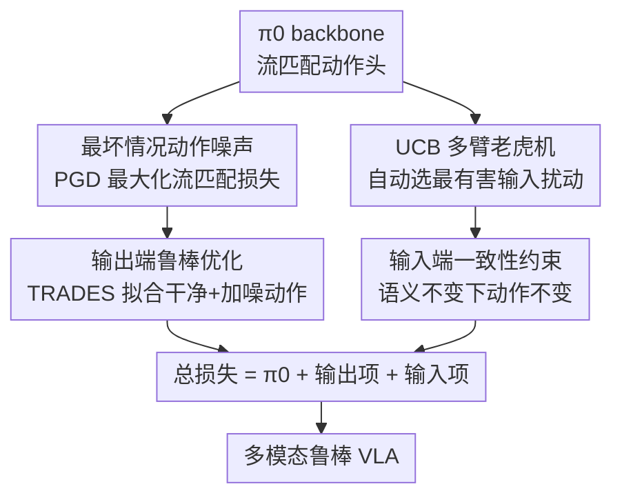

# On Robustness of Vision-Language-Action Model against Multi-Modal Perturbations

**会议**: ICLR 2026  
**OpenReview**: [https://openreview.net/forum?id=cS6xizdYD5](https://openreview.net/forum?id=cS6xizdYD5)  
**代码**: https://github.com/gakakulicc/RobustVLA  
**领域**: 机器人 / 具身智能 / VLA 鲁棒性  
**关键词**: VLA、多模态鲁棒性、流匹配、对抗训练、多臂老虎机

## 一句话总结
本文先系统评测主流 VLA 在动作/观测/环境/指令四类模态共 17 种扰动下的鲁棒性（发现动作是最脆弱模态、已有视觉鲁棒方法不迁移、π0 最稳），再提出 RobustVLA：对输出做最坏情况动作噪声下的鲁棒优化、对输入做语义不变下的动作一致性约束，并用 UCB 老虎机自动挑最有害扰动训练，在 LIBERO 上比 π0 绝对涨 14.0%、真机仅 25 条示范就比 π0 高 65.6% 成功率。

## 研究背景与动机

**领域现状**：VLA（Vision-Language-Action）模型把视觉、语言和动作打通，在互联网规模机器人数据上预训练后能做跨本体、通用的灵巧操作，是当下机器人基础模型的主流路线。代表工作包括自回归式的 OpenVLA（把动作离散成 token）和扩散式的 π0（用流匹配生成连续高频动作）。

**现有痛点**：真实部署里，扰动远不止视觉噪声——动作端有传感器/执行器噪声和外力扰动，观测端有相机误差，环境端有干扰物和光照变化，指令端有同义改写和歧义表达。但已有的鲁棒 VLA 工作（VLATest 只评测、BYOVLA 用大模型做视觉 inpainting、GEVRM 做 model-based planning）几乎只盯着视觉输入，既没测过其它模态，又重度依赖外部大模型、推理开销巨大。

**核心矛盾**：VLA 是离线模仿学习出来的策略，一旦动作偏离数据分布，后续 rollout 就会滑出分布（OOD），误差随时间步**二次累积**（而在线 RL 因为能交互纠错只是线性累积）。这让动作鲁棒性在"只有离线数据、无法与环境交互"的设定下格外难做——传统鲁棒 RL 的 minimax 对抗训练需要模拟器，而 VLA 没有。

**本文目标**：拆成两步——(1) 把 VLA 在全模态扰动下的鲁棒性测清楚，给出该往哪儿使劲的结论；(2) 造一个能同时扛输入和输出扰动、又不依赖外部大模型的鲁棒 VLA。

**切入角度**：作者先做大规模评测，得到三条关键发现：①动作是最脆弱模态（π0 在动作噪声仅 2.5% 时成功率就掉到 52.4%，5% 时几乎全崩）；②已有视觉鲁棒方法（BYOVLA）在非视觉模态上提升为 +0.0%，根本不迁移；③π0 比 OpenVLA、π0-FAST 分别高 27.9%、5.1%，扩散动作头自带鲁棒优势。于是把 π0 选作 backbone。

**核心 idea**：把鲁棒性拆成"输出端"和"输入端"两半分别求解——输出端针对最坏动作噪声做对抗式流匹配，输入端在语义不变假设下约束动作一致，再用 UCB 老虎机自动决定每步训哪种扰动。

## 方法详解

### 整体框架
RobustVLA 是一个**微调框架**，在已有 π0（带 rectified flow matching 动作头）基础上加两项鲁棒正则，目标函数是三项之和 $\mathcal{L}^\tau_{RobustVLA}=\mathcal{L}^\tau_{\pi_0}+\mathcal{L}^\tau_{in}+\mathcal{L}^\tau_{out}$。整体思路是：**输出端**先用 PGD 求出"最大化流匹配损失"的最坏动作噪声 $\delta$，再用 TRADES 式目标同时拟合干净动作分布和被扰动的动作分布；**输入端**利用"语义不变扰动不应改变最优动作"这一观察，约束模型在加噪输入下输出一致动作；而面对十几种输入扰动，**调度器**把"选哪种扰动来训"建成多臂老虎机，用 UCB 自动挑出当前最有害的那个。三项叠加后既保留 π0 的干净性能，又把鲁棒性铺到四个模态。

### 关键设计

**1. 最坏情况动作噪声 + 输出端鲁棒优化：把流匹配损失当作动作质量的代理来对抗**

针对"动作是最脆弱模态、且离线设定下无法靠环境纠错"这个痛点。核心难点是：成功率没法逐步测量，怎么定义"最坏动作"？作者借鉴鲁棒 RL 的思路——既然离线示范 $(o_t,A_t)$ 是更可能成功的动作，那就用流匹配损失 $\|v_\theta(\hat A^\tau_t,o_t)-u(\hat A^\tau_t|\hat A^1_t)\|^2$ 当作动作质量的经验度量（附录里实测该损失与成功率的 Pearson 相关高达 $r=-0.95$）。于是把加噪动作写成 $\hat A^1_t=A^1_t+\delta$，在 rectified flow 下扰动后的流满足 $u(\hat A^\tau_t|\hat A^1_t)=u(A^\tau_t|A^1_t)-\delta$，用 PGD 求解最大化损失的 $\delta$。拿到 $\delta$ 后用 TRADES 目标兼顾干净精度与鲁棒：

$$\min_\theta\ \mathcal{L}^\tau_{\pi_0}+\lambda_{out}\max_\delta\mathbb{E}\,\|v_\theta(\hat A^\tau_t,o_t)-u(\hat A^\tau_t|\hat A_t)\|^2$$

作者给了三重解读：它既是**对抗训练**（同时匹配干净分布 $p(A_t|o_t)$ 和对抗分布 $p(A_t+\delta|o_t)$），又是**标签平滑**（注入噪声让学到的流不那么确定、抑制过度自信和过拟合具体动作），还是**离群点惩罚**（因为 $\delta$ 大致指向速度场与 rectified flow 失配最大的方向，MSE 目标里这种失配会被 $\delta$ 二次放大，从而惩罚 VLA 拟合不好的 corner case）。这个设计也能推广到一般扩散 VLA（丢掉 rectified flow 的化简假设）和自回归 VLA（OpenVLA 上对 binning 前的动作加噪、最大化交叉熵，并约束扰动后落在原 bin 及相邻 bin）。

**2. 输入端一致性约束：语义不变的扰动不该改变最优动作**

针对观测/环境/指令端的输入噪声。作者的关键观察是：相机噪声、干扰物、光照、同义改写这些扰动虽然改变了输入 $o_t$，但机器人所处的物理状态没变、要完成的任务没变，因此**最优动作应当不变**。于是把流匹配目标改写成在加噪输入下仍输出相同动作：

$$\min_\theta\max_{\omega_i}\mathbb{E}\,\|v_\theta(A^\tau_t,\omega_i(o_t))-u(A^\tau_t|A_t)\|^2$$

这相当于把离线 RL 里的状态扰动技术搬到 VLA 输入端：对抗地挑最坏输入 $\omega_i$，逼模型把"被污染的输入"映回"和干净输入一致"的动作。此外为增强局部平滑性，还额外加了一个 $\ell_p$ 有界的观测噪声 $\eta$（同样用 PGD 求解）来最大化 $\mathcal{L}^\tau_{in}$。

**3. UCB 多臂老虎机：自动挑出当前最有害的扰动来训，而不是均匀随机**

针对"十几种输入扰动怎么平衡"这个工程痛点。简单 Gaussian 噪声好防但对复杂噪声帮助甚微，给每种扰动手调固定权重又太费时。作者把"每步选哪种扰动"建成多臂老虎机，用 UCB 在探索与利用间权衡：

$$\omega_i^*=\arg\max_{\omega_i\in\Omega}\Big[r_n(\omega_i)+\alpha\sqrt{\tfrac{\log n}{\omega_i(n)}}\Big]$$

其中奖励 $r_n(\omega_i)$ 定义为"该扰动带来的流匹配损失增量"，即同一 $(o_t,A_t)$ 下加噪目标与干净目标之差——损失涨得越多说明这种扰动当前越有害、越该练。奖励再用 EMA（衰减 0.9）维护均值方差做 z-score 归一化稳定训练。选出的 $\omega_i^*$ 进入输入鲁棒项 $\mathcal{L}^\tau_{in}$。消融显示去掉 UCB 会掉 7.3%，说明它能防止模型只对单一主导噪声过拟合（相比之下朴素域随机化 DR 因为只对少数简单扰动过拟合，表现很差）。

### 损失函数 / 训练策略
总目标为三项相加 $\mathcal{L}^\tau_{RobustVLA}=\mathcal{L}^\tau_{\pi_0}+\mathcal{L}^\tau_{in}+\mathcal{L}^\tau_{out}$，$\lambda_{in}=\lambda_{out}=1$，动作噪声 $\delta=0.03$，观测噪声 $\eta=8/255$。其余沿用 π0 / OpenVLA 官方训练配方。

## 实验关键数据

### 主实验
LIBERO 基准、17 种扰动、π0 backbone（成功率 %，均为绝对提升）：

| 配置 | 17 扰动平均 | 无扰动 | 相对 π0 | 相对 BYOVLA |
|------|------|------|------|------|
| π0 | 62.6 | 96.0 | — | — |
| BYOVLA | 64.0 | 95.2 | +1.4 | — |
| **RobustVLA** | **76.6** | 95.5 | **+14.0** | **+12.6** |

- OpenVLA backbone：RobustVLA 比 OpenVLA 高 13.2%、比 BYOVLA 高 10.4%，证明对扩散式与自回归式 VLA 都有效。
- 效率：单 episode 推理约 11s，与 π0 相当，但比依赖外部 LLM 的 BYOVLA **快 50.6×**。
- 混合扰动（输入+输出各随机采一种）：比 π0 高 14.5%、比 BYOVLA 高 10.4%（$p<0.001$，配对 t 检验）。
- 真机 FR5：仅 25 条示范时比 π0 高 **65.6%** 成功率；即便给到 100 条（π0 已饱和）仍高 30%。

### 消融实验

| 配置 | 17 扰动平均 | 说明 |
|------|------|------|
| RobustVLA (Full) | 76.6 | 完整模型 |
| w/o out | 71.7 | 去掉输出鲁棒项 |
| w/o UCB | 69.3 | 不用 UCB 平衡，掉 7.3% |
| w/o in | 64.8 | 去掉输入鲁棒项 |
| DR | 61.8 | 域随机化，甚至不如 π0 |

### 关键发现
- **输入鲁棒项贡献最大**：去掉后从 76.6 掉到 64.8；UCB 也很关键（去掉掉 7.3%）；DR 因过拟合少数简单扰动反而比 π0（62.6）还低。
- **跨模态正向迁移**：在 14/17 个扰动上 Full 优于两个单端消融——输出鲁棒能对抗输入噪声诱发的动作漂移，输入鲁棒能改善动作噪声诱发的未见转移。如 w/o in 在观测扰动 Dead Pixel 上仍有收益，w/o out 在动作扰动上仍有收益。
- **泛化到未见扰动**：External Force 未在训练中出现，仍获提升；LIBERO-long 长程任务上比 π0 高 19.61%。
- **真机低数据优势明显**：实验室数据昂贵、状态覆盖有限，baseline 易过拟合示范，而 RobustVLA 训练时预演噪声，在 25 条示范的低数据区就很稳。

## 亮点与洞察
- **把"鲁棒性"拆成输入/输出两半分别求解**很干净：输出端走对抗流匹配，输入端走语义不变一致性，二者还能跨模态互相增益，比"只补视觉"的思路视野大得多。
- **用流匹配损失当动作质量代理**是巧妙的工程取巧——离线设定下成功率不可逐步测量，而损失与成功率高度负相关（$r=-0.95$），于是最坏动作就能用 PGD 直接对损失求解。
- **同一个输出正则的三重解读**（对抗训练 / 标签平滑 / 离群点惩罚）把一个公式讲出三层意义，迁移性强：标签平滑视角说明它能抑制过度自信，离群惩罚视角说明它专治拟合不好的 corner case。
- **UCB 选扰动**这个调度思路可复用到任何"多种数据增强/对抗类型需要自动配比"的训练里，比人工调权重或均匀随机都更省心且更稳。

## 局限与展望
- 评测与方法都以 π0（流匹配）为主，自回归 VLA 上只给了适配方案和聚合结果，细粒度分析偏少。
- 17 种扰动虽广，但每种噪声的强度/参数仍是人为设定（如 $\delta=0.03$、$\eta=8/255$），真实世界扰动分布是否被覆盖仍待检验；真机也因安全省略了 External Force。
- 方法是离线微调框架，依赖已有示范质量；在示范极少且任务更复杂时鲁棒上限如何尚未充分探究。
- UCB 奖励只用"流匹配损失增量"定义，可能偏向损失大但未必最影响成功率的扰动，奖励设计还有打磨空间。

## 相关工作与启发
- **vs BYOVLA**：BYOVLA 用 VLM 做视觉敏感区分割+inpainting，只管视觉、且要反复调外部大模型；本文管四模态、不依赖外部模型，推理快 50.6×、非视觉模态提升从 +0.0% 变为大幅正收益。
- **vs GEVRM**：GEVRM 靠 model-based planning 防色彩抖动等常见视觉损坏，仍局限视觉；本文用对抗式微调直接改训练目标，覆盖动作/指令等更难的模态。
- **vs 鲁棒 RL（robust MDP / action-robust RL）**：传统方法靠模拟器做 minimax 对抗，VLA 只有离线数据、动作偏差必致 OOD；本文用流匹配损失把最坏动作的求解搬进离线设定，是把鲁棒 RL 思想落到离线 VLA 的关键桥梁。

## 评分
- 新颖性: ⭐⭐⭐⭐⭐ 首个系统化做 VLA 多模态鲁棒、并把输入/输出鲁棒+UCB 调度整合进流匹配的框架
- 实验充分度: ⭐⭐⭐⭐⭐ 17 扰动×2 backbone、仿真+真机、混合扰动、效率、消融、低数据全覆盖
- 写作质量: ⭐⭐⭐⭐ 评测→方法→实验逻辑清晰，三重解读出彩；部分公式排版有笔误需对原文
- 价值: ⭐⭐⭐⭐⭐ 真机低数据下 +65.6% 且不依赖外部大模型，对实际部署意义大

<!-- RELATED:START -->

## 相关论文

- [\[ICLR 2026\] UniVLA: Unified Vision-Language-Action Model](unified_vision-language-action_model.md)
- [\[ICLR 2026\] Vlaser: Vision-Language-Action Model with Synergistic Embodied Reasoning](vlaser_vision-language-action_model_with_synergistic_embodied_reasoning.md)
- [\[ICLR 2026\] WMPO: World Model-based Policy Optimization for Vision-Language-Action Models](wmpo_world_model-based_policy_optimization_for_vision-language-action_models.md)
- [\[ICLR 2026\] AutoFly: Vision-Language-Action Model for UAV Autonomous Navigation in the Wild](autofly_vision-language-action_model_for_uav_autonomous_navigation_in_the_wild.md)
- [\[ICLR 2026\] Unified Diffusion VLA: Vision-Language-Action Model via Joint Discrete Denoising Diffusion Process](unified_diffusion_vla_vision-language-action_model_via_joint_discrete_denosing_d.md)

<!-- RELATED:END -->
