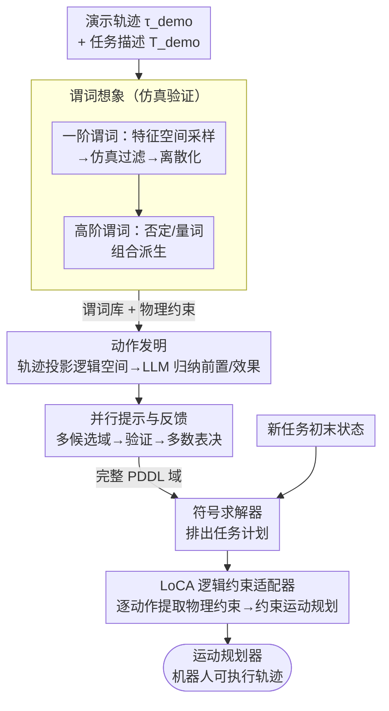

# One Demo Is All It Takes: Planning Domain Derivation with LLMs from A Single Demonstration

**会议**: ICLR 2026  
**arXiv**: [2505.18382](https://arxiv.org/abs/2505.18382)  
**代码**: 无  
**领域**: 机器人规划 / TAMP / LLM  
**关键词**: PDDL, 任务与运动规划, LLM推理, 物理仿真, 谓词生成, 运动规划接口

## 一句话总结

提出 PDDLLM 框架，仅需**一个演示轨迹**即可自动推导完整的 PDDL 规划域（谓词+动作），通过 LLM 推理与物理仿真的交叉验证生成可解释的符号表示，并借助逻辑约束适配器 (LoCA) 自动对接运动规划器，在 9 个环境 1200+ 任务中成功率领先 6 个 LLM 基线至少 20%，且成功部署于 3 个物理机器人平台。

## 研究背景与动机

**领域现状**：任务与运动规划 (TAMP) 将高层符号推理与底层运动规划相结合，是解决长距离机器人任务的主流范式。其核心依赖于 PDDL 语言定义的规划域 $\mathcal{D} = (\mathcal{P}, \mathcal{A})$，包含谓词集 $\mathcal{P}$ 和动作集 $\mathcal{A}$。

**核心痛点**：PDDL 规划域的构建高度依赖人工：定义谓词（如 `(on ?o1 ?o2)`）、动作的前置条件 $\mathcal{P}_{pre}$ 和效果 $\mathcal{P}_{eff}$ 均需领域专家精心设计，工程量大且难以迁移到新环境。

**LLM 的局限**：虽然 LLM 在任务规划中展现出强泛化能力，但在长距离推理上不可靠——时序依赖关系复杂时容易出错（Huang et al., 2022a）。

**现有域生成方法的不足**：(1) 需要预定义的谓词或动作作为先验知识（Silver et al., 2023; Kumar et al., 2023）→人工参与仍然较多；(2) 基于 LLM 的方法需要详细的自然语言域描述和精心的 prompt 工程（Guan et al., 2023）；(3) 许多方法假设符号动作已有对应的运动技能，动作与运动规划器的对接仍需手动完成。

**切入角度**：将 LLM 的语义理解能力与物理仿真的验证能力结合——仿真提供物理可行性检验（LLM 独力无法保证），LLM 提供语义抽象和模式识别能力。仅需一个演示→全自动构建规划域。

**核心贡献**：(1) 首次实现 one-shot demo → 完整 PDDL 域的全自动管线；(2) 提出 LoCA 自动将符号动作对接运动规划器；(3) 在 1200+ 任务上验证了方法的有效性和可部署性。

## 方法详解

### 整体框架

PDDLLM 接收一个演示轨迹 $\tau_{demo}$（连续环境状态序列）和一句任务描述 $T_{demo}$，分**域推导**和**推理**两段工作。域推导段：先用物理仿真“想象”出一批物理可行的**谓词**（连带可计算的物理约束边界），再把演示压到逻辑空间提炼出 **PDDL 动作**，整个生成过程外面套一层**并行提示与反馈**——同一演示并行跑多份、验证后投票选出最可靠的完整 PDDL 域。推理段：新任务的初末状态交给符号求解器排出任务计划，再由逻辑约束适配器 **LoCA** 把计划里的每个符号动作自动翻译成运动规划器能执行的约束问题：

$$\tilde{a}^{(0)}, \tilde{a}^{(1)}, \ldots = \text{MotionPlanner}(\text{PDDLLM}(\mathcal{S}_{new}^{(init)}, \mathcal{S}_{new}^{(goal)}, T_{demo}, \tau_{demo}))$$

### 关键设计

**1. 谓词想象：让仿真替 LLM 把关物理可行性**

纯靠 LLM 凭空想谓词，常会编出物理上站不住脚的关系（比如悬空的 `(is_on)`），所以这里把谓词生成拆成两阶段、并交给仿真器兜底。一阶谓词阶段，先在特征空间（位置 $(x,y,z)$、颜色 $(r,g,b)$ 等）里均匀采样物体状态，让物理仿真器逐一验证可行性，把穿透、悬浮等不合理状态过滤掉，再把连续特征空间按粒度 $u_f$ 离散成子区间；LLM 只需从这些已被验证可行的子空间里总结出有语义的谓词（如 `(is_on ?o1 ?o2)`、`(smaller ?o1 ?o2)`）并标注任务相关性。关键在于，每个谓词都附带它对应的子空间边界作为**物理约束**，这份约束后面直接喂给运动规划器判定谓词真值。高阶谓词阶段则用否定 $\neg$ 与量词 $\forall$、$\exists$ 组合一阶谓词，系统地派生更复杂的关系，例如 `(is_on ?o1 ?o2)` $\to$ `(not_is_on ?o1 ?o2)` $\to$ `(∀_o1_not_is_on ?o1 ?o2)`（表示 o2 在最顶部）。离散化加仿真验证这一组合，让 LLM 不再面对散乱的连续空间，而是从稳定可行的模式里抽象谓词，同时顺手给出了可计算的约束边界。

**2. 动作发明：先把长轨迹压成逻辑跳变，再让 LLM 读模式**

演示轨迹动辄上千步连续状态，直接让 LLM 在连续空间里找动作边界既慢又不准。这里的思路是用已生成的谓词库把连续轨迹 $\tau_{demo}$ 投影到逻辑空间 $\tau_{demo}^{logic}$——超过 1000 步的轨迹被压缩成寥寥数步逻辑状态转移。随后抽取每次转移的前后状态对作为 prompt，让 LLM 据此总结出 PDDL 动作定义，即前置条件 $\mathcal{P}_{pre}$ 和效果 $\mathcal{P}_{eff}$。这一步把连续操纵问题转化成离散的模式识别问题：LLM 只面对关键的状态跳变，正好发挥它擅长归纳模式的长处。

**3. 并行提示与反馈：用冗余采样压住 LLM 的随机性**

谓词想象和动作发明都靠单次 LLM 生成，而 LLM 带随机性、一次出错整套域就废了，所以在它们外面套一层冗余采样兜底。做法是同一演示并行生成多个候选 PDDL 域，经运行时验证（语法、完整性、可达性检查）淘汰失败候选，再多数表决选出最可靠的那一份作为最终域。实验发现并行提示数超过 5 之后，最终域的正确性就趋于稳定，因此用较低的额外开销换来了显著更高的可靠性。

**4. 逻辑约束适配器 LoCA：自动把符号动作翻译成运动约束**

有了可靠的 PDDL 域，推理期要把符号计划落到机器人身上。传统 TAMP 里，符号动作和运动规划的对接要靠人手把语义编码成数学约束（Toussaint, 2015），是最繁琐的工程环节。LoCA 直接复用谓词想象阶段已经生成好的物理约束：对任务计划里的每个逻辑动作，它自动提取效果集 $\mathcal{P}_{eff}$ 中所有一阶谓词对应的物理约束（数学不等式形式），依序施加到运动规划器，把单个逻辑动作转化成标准的**约束运动规划问题**，从而保证产出的轨迹满足该动作的语义。因为约束信息是现成的，整个对接无需任何额外人工映射；这套机制也兼容 VLA 模型——逻辑动作可直接作为 VLA 的 prompt 条件。

## 实验结果

### 表1：各方法在 9 个任务中的规划成功率 (%, 时间限制=50s)

| 方法 | Stack | Unstack | Color Class. | Alignment | Parts Assem. | Rearrange | Burger Cook | Bridge Build | Tower Hanoi | **Overall** |
|------|-------|---------|-------------|-----------|-------------|-----------|-------------|-------------|-------------|------------|
| Expert | 98.5 | 100 | 100 | 100 | 98.9 | 73.3 | 100 | 100 | 100 | 95.7 |
| LLMTAMP | 41.7 | 89.4 | 18.1 | 31.1 | 33.3 | 5.6 | 27.8 | 43.3 | 14.3 | 35.7 |
| LLMTAMP-FF | 70.8 | 94.6 | 36.4 | 52.0 | 53.9 | 17.4 | 50.0 | 53.3 | 14.3 | 52.5 |
| LLMTAMP-FR | 64.2 | 92.1 | 49.0 | 40.0 | 41.3 | 11.8 | 48.6 | 51.7 | 14.3 | 48.6 |
| RuleAsMem | 85.5 | 88.4 | 88.7 | 96.0 | 95.0 | 1.1 | 27.8 | 20.0 | 14.3 | 69.9 |
| **PDDLLM** | **97.5** | **97.7** | **100** | **100** | **100** | **64.3** | **91.7** | **87.2** | **100** | **93.3** |

### 表2：PDDLLM vs 推理型 LLM 的成功率与 Token 开销 (时间限制=500s)

| 任务 | PDDLLM | LLMTAMP | o1-TAMP | R1-TAMP | PDDLLM(k) | LLMTAMP(k) | o1-TAMP(k) | R1-TAMP(k) |
|------|--------|---------|---------|---------|-----------|------------|------------|------------|
| Rearrangement | **73.8** | 5.6 | 70.8 | 40.0 | 334 | 212 | 1200 | 1460 |
| Tower of Hanoi | **100** | 14.3 | 33.3 | 14.3 | 535 | 36 | 529 | 353 |
| Bridge Building | **87.2** | 44.3 | 51.7 | 40.0 | 375 | 50 | 270 | 363 |
| **Overall** | **80.5** | 13.9 | 61.5 | 35.9 | 415 | 99 | 666 | 725 |

### 表3：域质量评估——缺失/冗余谓词比例

| 任务 | 缺失谓词 | 冗余谓词 |
|------|---------|---------|
| Stack | 4.2% | 8.3% |
| Burger Cooking | 22.2% | 3.7% |
| Bridge Building | 22.2% | 3.7% |
| Tower of Hanoi | 0.0% | 14.3% |

## 关键发现

1. **大幅领先 LLM 基线**：PDDLLM 整体成功率 93.3%，比最佳 LLM 基线 LLMTAMP-FF (52.5%) 高出超 40 个百分点。在复杂任务（Tower of Hanoi, Color Classification）上提升尤为显著——从 14.3%/36.4% 提升到 100%。
2. **超越推理型 LLM**：即使 o1-TAMP 和 R1-TAMP 使用 500s 时间限制，PDDLLM 仍以 80.5% 整体成功率领先 o1-TAMP 的 61.5%，且 Token 开销更低（415k vs 666k）。
3. **接近专家设计水平**：PDDLLM 的 93.3% 与专家域的 95.7% 仅差 2.4 个百分点。在 Color Classification、Alignment、Parts Assembly、Tower of Hanoi 四个任务上完全匹配专家域的 100% 成功率。
4. **跨任务知识迁移**：PDDLLM 能将不同演示中学到的动作模块化组合——用 stack + unstack 的演示解决 rearrangement，用 stack + align 的演示解决 bridge building。
5. **仿真验证不可或缺**：消融实验证实，去掉仿真验证后谓词质量显著下降（物理不合理的谓词增多）。离散化连续特征空间也是关键——使 LLM 能从散乱数据中提取稳定模式。
6. **Token 效率优势**：PDDLLM 的 Token 开销集中在一次性域推导阶段，后续规划完全由符号求解器处理，无需额外 Token，特别适合长期部署中重复执行类似任务。

## 亮点与洞察

- **仿真 + LLM 互补架构**：仿真提供物理可行性验证（LLM 独力无法保证），LLM 提供语义抽象和模式识别→两者缺一不可。这是将 LLM 用于物理推理的一个优秀范式。
- **One-Shot Demo → 可泛化域**：极低的数据需求（仅一个演示）即可生成泛化到新任务的完整规划域，显著降低了 TAMP 的使用门槛。
- **LoCA 消除最大人工瓶颈**：传统 TAMP 中符号→运动的手工对接是最繁琐的工程环节。LoCA 利用谓词生成阶段已有的物理约束信息实现全自动化。
- **模块化动作组合**：PDDL 动作语法的模块化特性使得跨任务的知识迁移自然发生——不同演示中学到的动作可直接组合到新域中。
- **符号求解器 vs LLM 规划器**：RuleAsMem 的对比实验揭示了一个重要 insight——LLM 理解复杂规划域的能力有限，将域规则交给符号求解器比交给 LLM 规划器更可靠。

## 局限性

1. **复杂谓词遗漏**：在复杂任务（如 Bridge Building、Burger Cooking）中偶尔会遗漏高阶谓词（如 `(all_base_finished)`），导致规划器需要额外的可行性检查和回溯，在固定时间预算下降低成功率。
2. **感知局限**：依赖 ArUco 标记等简单感知方案，无法直接从原始视觉输入推导规划域。复杂的动态和几何（可变形物体、流体）也是挑战。
3. **仿真依赖**：谓词想象阶段需要物理仿真器进行大量并行 roll-out，在没有准确仿真模型的场景下难以使用。
4. **初始离散化敏感性**：虽然 LLM 可以在后续对离散化粒度进行调整，但初始超参数 $u_f$ 的选择仍会影响谓词生成质量。

## 相关工作对比

### vs LLM 直接规划 (LLMTAMP, SayCan 系列)

| 维度 | PDDLLM | LLM 直接规划 |
|------|--------|-------------|
| 规划方式 | LLM 推导域 → 符号求解器规划 | LLM 直接输出动作序列 |
| 长距离推理 | 强（符号求解器保证） | 弱（LLM 时序依赖易出错） |
| Token 开销 | 一次性域推导，后续无开销 | 每次规划都消耗 Token |
| 可验证性 | PDDL 域可人工审查和修正 | LLM 输出不可验证 |
| 数据需求 | 1 个演示 | 需要任务描述/历史上下文 |

### vs 传统域学习 (Predicate Invention, VisualPredicator)

| 维度 | PDDLLM | 传统域学习 |
|------|--------|-----------|
| 先验知识 | 无需预定义谓词/动作 | 需要部分预定义符号 |
| 训练数据 | 单个演示 | 通常需要大量演示数据 |
| 运动对接 | LoCA 自动对接 | 通常假设有预定义运动技能 |
| 可解释性 | 生成人可读的 PDDL 域 | 部分方法生成的表示不可解释 |

### vs 手工 TAMP 域 (Expert Design)

| 维度 | PDDLLM | Expert Design |
|------|--------|--------------|
| 构建成本 | 全自动，无需领域专家 | 需要专家手工编写和调试 |
| 规划性能 | 93.3% 整体成功率 | 95.7% 整体成功率（仅高 2.4%） |
| 可迁移性 | 新环境只需新演示 | 新环境需重新设计域 |
| 域完整性 | 偶有谓词遗漏 | 完整但工程量大 |

## 评分

- **新颖性**: ⭐⭐⭐⭐⭐ — 首次实现 one-shot demo → 完整 PDDL 域的全自动管线，无需任何预定义谓词或动作
- **实验充分度**: ⭐⭐⭐⭐⭐ — 9 个环境 / 1200+ 任务 / 6 个基线 / 3 个物理平台 / 消融实验 / 域质量评估 / Token 分析
- **写作质量**: ⭐⭐⭐⭐ — 框架图示清晰直观，各组件的动机和设计逻辑阐述到位，但偶有符号记法不统一
- **实用价值**: ⭐⭐⭐⭐⭐ — 显著降低机器人长距离任务规划的门槛，LoCA 解决了 TAMP 最大的工程痛点

<!-- RELATED:START -->

## 相关论文

- [\[ICLR 2026\] DemoGrasp: Universal Dexterous Grasping from a Single Demonstration](demograsp_universal_dexterous_grasping_from_a_single_demonstration.md)
- [\[ICLR 2026\] VLBiMan: Vision-Language Anchored One-Shot Demonstration Enables Generalizable Bimanual Robotic Manipulation](vlbiman_vision-language_anchored_one-shot_demonstration_enables_generalizable_bi.md)
- [\[CVPR 2026\] Cross-Domain Demo-to-Code via Neurosymbolic Counterfactual Reasoning](../../CVPR2026/robotics/cross-domain_demo-to-code_via_neurosymbolic_counterfactual_reasoning.md)
- [\[ICLR 2026\] All-day Multi-scenes Lifelong Vision-and-Language Navigation with Tucker Adaptation](all-day_multi-scenes_lifelong_vision-and-language_navigation_with_tucker_adaptat.md)
- [\[ICLR 2026\] Statistical Guarantees for Offline Domain Randomization](statistical_guarantees_for_offline_domain_randomization.md)

<!-- RELATED:END -->
