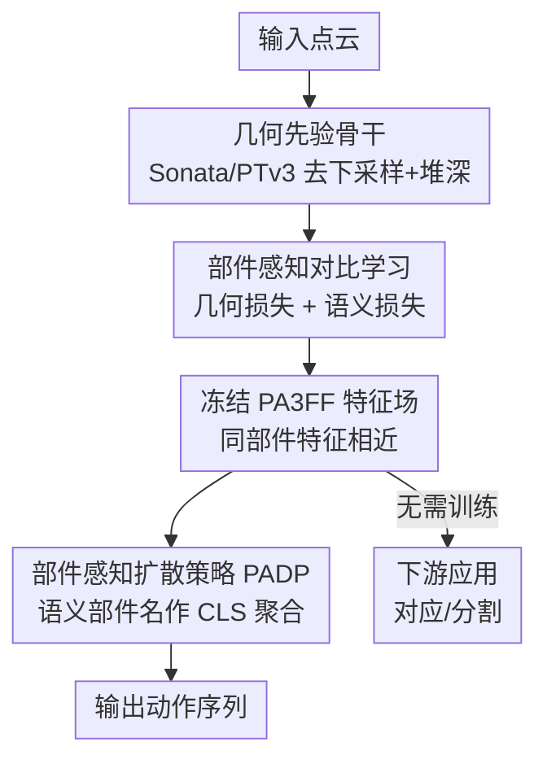

# PA3FF：面向可泛化铰接物体操作的部件感知稠密 3D 特征场

**会议**: ICLR 2026  
**OpenReview**: [https://openreview.net/forum?id=qXfRXfAHOK](https://openreview.net/forum?id=qXfRXfAHOK)  
**论文**: [Project Page](https://pa3ff.github.io/)  
**代码**: https://pa3ff.github.io/ (项目页)  
**领域**: 机器人/具身智能 / 3D视觉 / 模仿学习  
**关键词**: 铰接物体操作, 3D 特征场, 部件感知, 对比学习, 扩散策略

## 一句话总结
本文提出 PA3FF——一个直接从点云前馈预测、特征距离反映"是否属于同一功能部件"的稠密 3D 特征场，并在其之上搭建部件感知扩散策略 PADP，用很少的示范就能让机器人泛化地操作各类铰接物体（门把手、旋钮、盖子等），在 PartInstruct 仿真和 8 个真机任务上显著超过 CLIP / DINOv2 / Grounded-SAM 等 2D/3D 表征。

## 研究背景与动机
**领域现状**：要让机器人能操作千差万别的物体，关键在于理解"功能部件"——把手在哪、旋钮怎么转，这些部件决定了"在哪操作、怎么操作"。近年的主流做法是借用 2D 视觉-语言基础模型（CLIP、DINOv2、SigLIP）的语义特征来提升策略的泛化性。

**现有痛点**：2D 基础特征天生缺少 3D 几何和空间连续性，而后者恰恰是推理物体形状、部件配置和可操作性所必需的。为补上 3D，一些工作通过多视角融合或神经渲染把 2D 特征"抬升"到 3D 特征场，但这类方法不是原生 3D 表征，普遍存在三个硬伤：推理慢（甚至要几分钟）、跨视角特征不一致、空间分辨率低（如 ViT 按 patch 切分，DINOv2 的特征图比原图小 14 倍，细小部件直接丢失）。

**核心矛盾**：2D 特征在"语义质量"和"空间分辨率/几何一致性"之间存在天然权衡，而且即便强行抬升到 3D，也没有专门针对"功能部件"做监督——它们分不清同一个部件内部该一致、不同部件之间该区分。

**本文目标**：设计一个原生 3D、稠密、且显式具备部件感知的特征表示，使"特征相近 ⇔ 同属一个功能部件"，并把它落地成一个样本高效、能泛化到新物体的操作策略。

**切入角度**：与其从 2D 抬升，不如直接在点云上做。作者借助 Sonata（在 14 万点云上自蒸馏预训练的 Point Transformer V3）提供的丰富 3D 几何先验，再用对比学习把"部件级"语义注入进去。

**核心 idea**：用一个前馈的 3D 特征场（点特征间距离编码部件归属）替代"2D 特征抬升"，再把这个冻结的特征场接进扩散策略，做到操作的可泛化与高样本效率。

## 方法详解

### 整体框架
整个系统分两大块、三个阶段。前两个阶段训练表征 PA3FF：先拿一个在大规模点云上自蒸馏预训练好的 PTv3 骨干（Sonata）提取几何特征，再用跨物体的对比学习把"部件级一致/区分"的语义炼进特征里；第三阶段把训练好的 PA3FF 冻结，作为感知骨干接进扩散策略 PADP，由它把点云特征聚合成全局表征并条件化地生成机器人动作。

输入是点云 $P=\{p_i\in\mathbb{R}^3\}_{i=1}^N$，PA3FF 输出一个连续特征场 $f:\mathbb{R}^3\to\mathbb{R}^n$，给每个点一个 $n$ 维特征向量；其语义是：同一部件的点 $p_a,p_b$ 应有相近特征 $f(p_a)\approx f(p_b)$。下游 PADP 把这套特征 + 机器人本体状态作为条件，预测未来一段动作序列。

### 关键设计

**1. 原生 3D 几何骨干：用预训练点云模型替代 2D 特征抬升**

针对"2D 抬升慢、跨视角不一致、分辨率低"的痛点，本文不再做多视角融合，而是直接用 Sonata（自监督预训练的 PTv3）作为特征提取器 $f(p)$ 从点云抽多尺度特征，天然得到前馈、跨视角一致、逐点稠密的几何特征。但 Sonata 原本是为场景级数据训练的，PTv3 用激进下采样来扩大感受野、降算力——这对点数少、空间尺度小的物体级输入并不合适。作者据此做了关键改造：**移除 PTv3 中大部分下采样层，转而堆叠更多 Transformer block 来加深网络**，从而在保留细节的同时增强特征抽象。整体框架是模型无关的，可替换更强的 3D 提取器。

**2. 部件感知对比学习：几何损失 + 语义损失双约束**

光有几何先验还分不清功能部件，作者用对比学习把"部件"概念注入特征空间，由两个互补损失组成。**几何损失** $L_{Geo}$ 处理点与点之间的空间关系——拉近同部件点、推远异部件点，形式上沿用监督对比损失（SupCon）：

$$L_{Geo}=\sum_{i=1}^{N}\frac{-1}{N_{a_i}-1}\sum_{j=1}^{N}\mathbb{1}_{i\neq j}\cdot\mathbb{1}_{a_i=a_j}\cdot\log\frac{\exp(f_i\cdot f_j/\tau)}{\sum_{k=1}^{N}\mathbb{1}_{i\neq k}\exp(f_i\cdot f_k/\tau)}$$

其中 $a_i$ 是第 $i$ 个点的部件标签，$\tau$ 为温度系数。**语义损失** $L_{Sem}$ 则把点特征与部件名称的语义对齐：用 SigLIP 文本编码器把部件名（如"Switch, Spout, Base of a Faucet"）编码成语义向量 $x_k=\mathrm{SigLip}(s_k)$，再以 InfoNCE 把每个点特征对齐到其对应部件名：

$$L_{Sem}=\sum_{i=1}^{N}-\log\frac{\exp(f_i\cdot x_{a_i}/\tau)}{\sum_{k=1}^{m}\exp(f_i\cdot x_k/\tau)}$$

总损失 $L_{total}=L_{Geo}+L_{Sem}$，让特征既在部件内几何一致、又与部件名称语义对齐。监督信号来自 PartNet-Mobility、3DCoMPaT、PartObjaverse-Tiny 等带部件标注的公开数据集。

**3. 轻量特征精炼网络：把 Sonata 输出炼成部件级表征**

直接用 Sonata 特征还不够区分部件，作者在 Sonata 之上加一个**浅层逐点 MLP** 作为精炼网络，专门用上面的 $L_{total}$ 来引导学习。它很轻但很关键——消融显示去掉精炼会让成功率从 62% 掉到 46%（见下文），说明部件级一致性/区分性主要由这步对比精炼带来，而非单纯靠 Sonata。

**4. 部件感知扩散策略 PADP：以部件名为 CLS token 聚合特征生成动作**

有了 PA3FF，作者把它**冻结**当感知骨干，搭一个扩散策略来真正驱动机器人。观测 $o_t=[P^1_t,\dots,P^n_t,q_t]$ 包含多相机点云和本体状态 $q_t$，策略建模条件分布 $p(A_t\mid o_t)$，预测动作块 $A_t=[a_t,\dots,a_{t+H-1}]$；训练用 DDPM、推理用 DDIM 加速，目标是去噪 MSE $L(\phi)=\mathrm{MSE}(a_t,D_\theta(o_t,\tilde a_t,k))$。设计的巧点在聚合方式：由于 PA3FF 特征本身语义有意义，作者**把"任务关键部件名"的语义嵌入当作 CLS token** 喂进一个可训练 Transformer 编码器，用它来引导逐点特征聚成全局表征，再拼上机器人位姿、过两层 MLP 压缩，最后由扩散动作头输出动作。也就是说，"该关注哪个部件"被显式地以语义方式告诉了策略，这正是它在新物体上仍能定位功能部件的关键。

### 损失函数 / 训练策略
表征阶段用 $L_{total}=L_{Geo}+L_{Sem}$ 训练（SupCon + InfoNCE，温度 $\tau$）；策略阶段冻结 PA3FF，用 DDPM 去噪 MSE 训练扩散动作头，DDIM 加速采样。真机每个任务仅采集 30 条人工遥操作示范，动作空间为末端执行器位姿 + 夹爪状态。

## 实验关键数据

### 主实验
PartInstruct 仿真五级泛化协议（OS/OI/TP/TC/OC 五个测试集，成功率 %）：

| 方法 | Test1(OS) | Test5(OC) | 平均 |
|------|-----------|-----------|------|
| DP | 7.27 | 6.67 | 5.96 |
| DP3 | 23.18 | 6.67 | 15.40 |
| GenDP | 24.34 | 14.61 | 19.36 |
| **本文 PADP** | **36.76** | **26.67** | **28.79** |

平均成功率相对最强基线 GenDP 绝对提升约 9.4%。真机 8 任务（未见物体，每任务 10 次试验）：PADP 平均成功率 **58.75%**，而基线最高仅 35%。Open Bottle 泛化测试（完成率 %）：

| 方法 | 原始 | 空间 | 物体 | 环境 |
|------|------|------|------|------|
| GenDP | 50 | 30 | — | 30 |
| **PADP** | **80** | **60** | — | **60** |

### 消融实验
"Put in Drawer" 任务上逐组件消融：

| 配置 | Put in Drawer (%) | 说明 |
|------|-------------------|------|
| PADP 完整模型 | 62 | — |
| w/o 堆叠额外 Transformer | 58 | 去掉骨干改造掉 4% |
| w/o 几何损失 | 54 | — |
| w/o 语义损失 | 46 | 掉点最多 |
| Sonata + DP3 | 39 | 直接拼接收益有限 |
| DP3 基线 | 37 | — |

### 关键发现
- **特征精炼（对比学习）贡献最大**：去掉精炼从 62% 掉到 46%（−16%），说明性能主要来自部件感知特征学习，而非单纯用 Sonata。
- **直接拼接收效甚微**：Sonata+DP3 仅 39%，比 DP3 基线（37%）只高 2%，证明不做架构改造、简单堆现成模块没用。
- **2D 特征看不见细小部件**：DINOv2/SigLIP 难以表征占不到一个 patch 的细薄部件（如冰箱把手），而 PA3FF 的特征场更平滑、能高亮功能部件。
- **泛化来自部件共享结构**：即便不同微波炉外观各异，PA3FF 能识别出共享的功能结构（把手、机身），从而在位姿/形状变化下保持一致操作。

## 亮点与洞察
- **"特征距离 = 部件归属"这个表征语义非常干净**：它把"理解部件"这件抽象的事，变成了特征空间里一个可度量、可聚类的量，因此同一套特征既能驱动策略、又能零额外训练地做对应学习和部件分割。
- **用部件名语义嵌入当 CLS token** 是个可迁移的小技巧：把"该关注哪个部件"以文本语义显式注入到特征聚合里，相当于给策略一个软性的注意力先验，值得借鉴到其他需要"任务条件聚合"的策略架构。
- **把场景级预训练模型"瘦身"到物体级**：去下采样 + 堆深 Transformer，是把大场景骨干迁到小物体输入的实用经验。

## 局限与展望
- 真机每任务仅 30 条示范，任务集中在铰接物体的开/关/拉/盖等中短时程动作；长时程、多阶段复杂任务的表现未充分验证。
- 部件感知依赖 PartNet-Mobility 等数据集的部件标注质量与覆盖范围，对标注里没有的稀有部件类型可能泛化受限。
- 表征训练与策略训练分两段、PA3FF 冻结，端到端联合优化是否能进一步提升尚未探索。
- 表征本身是 3D-native，对深度/点云传感质量有依赖；极端遮挡或稀疏点云下的鲁棒性待考。

## 相关工作与启发
- **vs GenDP**：GenDP 用 2D 图像特征与场景观测算余弦相似度构造稠密语义场，做到类别级泛化，但依赖 DINOv2 的 2D 特征导致跨视角不一致，且语义粒度不够、定位不到功能部件。本文用 3D-native、功能感知的细粒度特征场，定位更准、示范更少，仿真平均与真机都明显领先。
- **vs DP3 / DP**：DP3、DP 是通用扩散策略，未显式建模部件语义；Sonata+DP3 直接拼接只比 DP3 高 2%，凸显本文的部件感知精炼才是泛化的关键。
- **vs 关键帧式 3D 策略（PerAct / Act3D / 3D Diffuser Actor）**：这些方法预测离散关键帧，长时程/精细操作受限；本文走连续动作块的扩散路线，动作表示更灵活。

## 评分
- 新颖性: ⭐⭐⭐⭐ "特征距离编码部件归属"的原生 3D 表征 + 部件名 CLS 聚合，角度清新且自洽。
- 实验充分度: ⭐⭐⭐⭐ 覆盖仿真五级泛化 + 8 真机任务 + 下游对应/分割，消融到位。
- 写作质量: ⭐⭐⭐⭐ 动机—方法—实验脉络清晰，图示直观。
- 价值: ⭐⭐⭐⭐ 提供了一个可复用的部件感知 3D 基础特征，能赋能多种下游机器人任务。

<!-- RELATED:START -->

## 相关论文

- [\[ICLR 2026\] EquAct: An SE(3)-Equivariant Multi-Task Transformer for 3D Robotic Manipulation](equact_an_se3-equivariant_multi-task_transformer_for_3d_robotic_manipulation.md)
- [\[ICLR 2026\] OmniEVA: Embodied Versatile Planner via Task-Adaptive 3D-Grounded and Embodiment-aware Reasoning](omnieva_embodied_versatile_planner_via_task-adaptive_3d-grounded_and_embodiment-.md)
- [\[CVPR 2025\] 3D-MVP: 3D Multiview Pretraining for Robotic Manipulation](../../CVPR2025/robotics/3d-mvp_3d_multiview_pretraining_for_manipulation.md)
- [\[CVPR 2026\] DiffuView: Multi-View Diffusion Pretraining for 3D-Aware Robotic Manipulation](../../CVPR2026/robotics/diffuview_multi-view_diffusion_pretraining_for_3d_aware_robotic_manipulation.md)
- [\[CVPR 2026\] Structural Action Transformer for 3D Dexterous Manipulation](../../CVPR2026/robotics/structural_action_transformer_for_3d_dexterous_manipulation.md)

<!-- RELATED:END -->
