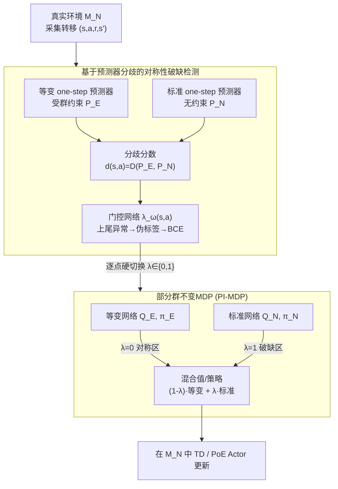

# Partially Equivariant Reinforcement Learning in Symmetry-Breaking Environments

**会议**: ICLR 2026  
**arXiv**: [2512.00915](https://arxiv.org/abs/2512.00915)  
**代码**: [项目页面](https://pranaboy72.github.io/perl_page/)  
**领域**: 强化学习/等变性  
**关键词**: 部分等变性, 对称性破缺, 群不变MDP, 门控策略, Bellman误差传播

## 一句话总结

提出部分群不变MDP (PI-MDP) 框架，通过可学习的门控函数 $\lambda(s,a)$ 在状态-动作空间中逐点切换等变与标准Bellman更新，从理论上证明局部对称性破缺会经过折扣回溯放大 $1/(1-\gamma)$ 倍产生全局值函数误差，而PI-MDP可将误差严格限制在破缺区域内；实例化为PE-DQN和PE-SAC两种算法，在Grid-World、MuJoCo运动、机械臂操作等任务上全面超越严格等变和近似等变基线。

## 研究背景与动机

**领域现状**：群等变性为强化学习提供了强大的归纳偏置——通过构建群不变MDP（要求奖励函数 $R(s,a)=R(gs,ga)$ 和转移核 $P(s'|s,a)=P(gs'|gs,ga)$ 对群 $G$ 的所有元素 $g$ 成立），等变网络可以在对称状态之间实现零样本泛化，大幅提升样本效率。现有的等变RL工作（如EMLP-based RPP、等变DQN等）都建立在环境完全满足群不变假设的前提上。

**现有痛点**：真实世界的控制任务几乎不可能完全满足群不变条件。以机器人控制为例，地面接触力破坏了上下对称、执行器力矩限制破坏了关节对称、障碍物的存在破坏了空间旋转对称。关键问题在于：即使对称性只在状态-动作空间的某个局部区域被打破，传统等变RL也会在该区域产生错误的值估计，而这个局部误差会通过Bellman回溯在整个空间中传播和放大，最终导致全局策略退化甚至训练失败。

**核心矛盾**：严格等变方法在破缺区域引入不可控误差；而现有的近似等变方法（如RPP通过残差路径全局松弛等变约束）虽然提供了一定的鲁棒性，但"全局均匀松弛"的策略要么在完全对称区域损失了采样效率，要么在破缺严重时仍然不稳定——因为它无法区分"哪里对称、哪里不对称"。

**本文目标** (1) 量化局部对称性破缺如何通过Bellman算子传播为全局值函数误差；(2) 设计一种可以在状态-动作空间中逐点选择"用等变还是用标准"更新的框架；(3) 无需先验知识，数据驱动地自动检测对称性破缺区域。

**切入角度**：作者观察到群不变MDP $\mathcal{M}_E$ 和真实MDP $\mathcal{M}_N$ 的偏差可以用逐点奖励偏差 $\epsilon_R(s,a)$ 和转移偏差 $\epsilon_P(s,a)$ 精确描述。如果能在 $\epsilon>0$ 的区域回退到标准更新，就能从源头阻断误差传播。

**核心 idea**：用一个可学习的二值门控函数 $\lambda(s,a)$ 在每个状态-动作对上自动选择等变或标准Bellman更新，在保持对称区域采样效率的同时令破缺区域的误差不再向外传播。

## 方法详解

### 整体框架

PERL（Partially Equivariant RL）的整体流程是：维护两套并行的值函数/策略网络——一套是满足群等变约束的 $(Q_E, \pi_E)$，一套是无约束的标准网络 $(Q_N, \pi_N)$；同时训练一个门控函数 $\lambda_\omega(s,a) \in \{0,1\}$ 来判断每个状态-动作对是否处于对称性破缺区域。最终的Q值和策略通过 $\lambda$ 在两套网络之间做硬切换：对称区域用等变网络，破缺区域用标准网络。整个训练在真实环境 $\mathcal{M}_N$ 中进行，门控函数通过两个one-step预测器的分歧来提供监督信号。运行时数据流是：先由两个预测器的分歧训出门控 $\lambda_\omega$（对称性破缺检测），再用 $\lambda_\omega$ 把等变/标准两套网络逐点混合（部分群不变MDP），最后在真实环境里做TD/Actor更新；而误差传播分析是支撑这套"逐点切换"路由的理论依据，本身不是运行时的一个模块。

### 关键设计

**1. 局部→全局误差传播分析：先量化"破缺到底有多致命"**

要论证"为什么不能全局松弛、必须逐点处理"，得先把局部破缺如何放大成全局问题算清楚。作者用逐点偏差刻画真实MDP $\mathcal{M}_N$ 与群不变MDP $\mathcal{M}_E$ 的差距：奖励偏差 $\epsilon_R(s,a) = |R_N(s,a) - R_E(s,a)|$，转移偏差 $\epsilon_P(s,a) = \frac{1}{2}\int|P_N(s'|s,a) - P_E(s'|s,a)|ds'$。Lemma 1 先给出单步上界——某个 $(s,a)$ 上的 Bellman 误差不超过 $\epsilon_R(s,a) + 2\gamma V_{\max}\epsilon_P(s,a)$，即一步的偏差由奖励和转移两部分共同决定。真正致命的是 Proposition 1：把这些单步误差沿 Bellman 回溯累积后，最优值函数的全局误差被放大为

$$\|Q_N^* - Q_E^*\|_\infty \leq \frac{1}{1-\gamma}\|\delta\|_\infty$$

也就是说，哪怕破缺只发生在一个局部区域，折扣回溯也会把它放大 $(1-\gamma)^{-1}$ 倍后污染整个值函数。这条结论解释了严格等变RL在真实环境里失败的根因：不是等变性这个先验本身有问题，而是局部的MDP不匹配被Bellman算子搬运、放大成了全局偏差——所以补救必须在源头、在局部把误差掐断，全局均匀松弛是治标不治本。

**2. 部分群不变MDP (PI-MDP)：把"哪里用等变"写进MDP本身**

有了误差界就知道方向：在 $\delta>0$ 的破缺区域回退到标准更新，让那一项归零。作者把这个直觉抬升成一个有理论保证的MDP框架，引入门控函数 $\lambda: \mathcal{S}\times\mathcal{A} \to [0,1]$，用它对等变侧和标准侧做凸组合，定义混合奖励与混合转移核：

$$R_H = (1-\lambda)R_E + \lambda R_N, \qquad P_H = (1-\lambda)P_E + \lambda P_N$$

凸组合不是随手取的——它保证 $P_H$ 仍是合法的转移核（概率非负且归一），MDP不会因为混合而失效。Theorem 1 进一步证明对应的 Bellman 算子 $\mathcal{T}_H$ 可以仿射分解为等变算子与标准算子的凸组合，并且仍是 $\gamma$-收缩映射，因此存在唯一不动点、迭代必然收敛。最关键的是 Corollary 1 给出的误差界 $\|Q_H^* - Q_N^*\|_\infty \leq \frac{1}{1-\gamma}\|(1-\lambda)\delta\|_\infty$：只要门控在破缺区域取 $\lambda=1$，$(1-\lambda)\delta$ 在那里就为零，理论上能把 PI-MDP 的最优值函数误差压到零。这条界同时反过来当作设计指南——它直接告诉算法 $\lambda$ 该怎么取（破缺处趋近1、对称处趋近0），让后面的检测模块有了明确的优化目标。

**3. 基于预测器分歧的对称性破缺检测：没有先验也能找出破缺区域**

理论说"破缺处取 $\lambda=1$"，但现实里 $\epsilon_R, \epsilon_P$ 无法直接测——因为算它们需要事先知道真实的群不变MDP，而这恰恰是拿不到的。作者用一个间接但可操作的代理信号绕开：同时训练两个one-step预测器，等变预测器 $\hat{P}_E$ 受群约束，标准预测器 $\hat{P}_N$ 不受约束。在对称区域两者都能拟合真实动力学、预测一致；而在破缺区域，$\hat{P}_E$ 受群约束只能表达"群平均"后的代理动力学，$\hat{P}_N$ 却能逼近真实动力学，两者预测就会明显分歧。于是用分歧分数 $d(s,a) = D(\hat{P}_E, \hat{P}_N)$ 作为破缺信号：把分布上尾的高分歧样本当作异常值，生成伪标签 $y \in \{0,1\}$，再用二元交叉熵训练门控网络 $\lambda_\omega$。用异常值检测而非固定阈值，避免了"破缺多严重才算破缺"这个难调的硬门限。门控网络在RL更新时被frozen、不接收RL梯度，从而把"检测破缺"和"优化策略"两个任务解耦，防止值函数的训练信号反过来污染门控判断。

### 损失函数 / 训练策略

**Critic损失**：门控混合Q值 $Q_\theta(s,a) = (1-\lambda_\omega)Q_{E,\theta}(s,a) + \lambda_\omega Q_{N,\theta}(s,a)$，用标准TD目标训练（DQN用hard max，SAC用soft max）。$\lambda_\omega$ 在计算TD目标时stop-gradient处理。

**Actor损失（SAC版）**：引入状态级门控 $\lambda_\zeta(s)$，策略采用乘积专家(PoE)形式 $\pi_\phi \propto \pi_E^{1-\lambda_\zeta} \cdot \pi_N^{\lambda_\zeta}$。$\lambda_\zeta$ 通过expectile回归从 $\lambda_\omega(s,a)$ 聚合而来——使用 $\tau \to 1$ 的expectile损失逼近 $\max_a \lambda_\omega(s,a)$，确保只要某个动作在该状态下触发了破缺信号，整个策略就切换到标准模式（保守策略）。

**预测器损失**：$\hat{P}_E$ 和 $\hat{P}_N$ 分别用等变/标准网络拟合one-step转移，可选地加上奖励预测头 $\hat{R}_i(s,a)$ 用于检测奖励层面的对称性破缺。

**整体训练循环**：每步先采集数据→更新预测器→计算分歧→更新门控→更新critic→更新actor→soft更新target网络。各组件（critic、actor、预测器、门控）使用独立trunk以保证训练稳定性。

## 实验关键数据

### 主实验：Grid-World离散控制（$C_4$旋转对称 + 障碍物破缺）

| 方法 | 0障碍物 | 10障碍物 | 20障碍物 | 30障碍物 | 40障碍物 |
|------|---------|---------|---------|---------|---------|
| Vanilla DQN | 中等 | 中等 | 中等 | 中等 | 中等 |
| Equivariant DQN | **最高** | 快速下降 | 大幅退化 | 严重退化 | 接近失败 |
| RPP-DQN (近似等变) | 高 | 略高于Vanilla | 略高于Vanilla | 略高于Vanilla | 略高于Vanilla |
| Approx. Equivariant DQN | 高 | 略高于Vanilla | 略高于Vanilla | 中等 | 中等 |
| **PE-DQN** | **最高** | **最高** | **最高** | **最高** | **最高** |

随着障碍物增加，PE-DQN与第二名的差距持续扩大，验证了"破缺越严重→选择性等变越重要"的理论预测。

### 主实验：连续控制（MuJoCo + 机械臂）

| 环境 | SAC | Equi-SAC | RPP-SAC | Approx-SAC | **PE-SAC** | 对称破缺来源 |
|------|-----|----------|---------|------------|-----------|-------------|
| Hopper | 中等 | 中等 | 中等 | 中等 | **最高学习速度** | 地面接触 |
| Ant | 中等 | 中等 | 中等 | 中等 | **最高（效率+最终性能）** | 腿部非对称力矩 |
| Swimmer | 中等 | **最高** | 高 | 高 | 接近最高 | 几乎无破缺 |
| Fetch Reach | 中等 | 高 | 高 | 高 | **最高** | 地面约束 |
| UR5e Reach | 中等 | 不稳定/崩溃 | 不稳定 | 不稳定 | **最高且稳定** | 动力学+自由朝向 |

在UR5e Reach任务中效果最为显著：严格等变和近似等变SAC因真实机械臂动力学导致的大量对称性破缺而不稳定甚至崩溃，PE-SAC是唯一保持稳定高性能的方法。

### 消融实验

| 配置 | Grid-World (30obs) | 说明 |
|------|-------------------|------|
| PE-DQN (完整) | **最高** | 硬门控 + 预测器分歧 |
| 软门控 ($\lambda \in [0,1]$) | 下降 | 训练不如硬门控稳定 |
| 共享trunk (critic) | 略降 | 有时影响稳定性 |
| 共享trunk (actor) | 下降 | 等变/标准网络相互干扰 |
| 去掉奖励头 (仅转移分歧) | 奖励破缺场景下降 | 无法检测纯奖励层面的破缺 |
| 采样max ($K=4$) 替代 $\lambda_\zeta$ | 接近完整 | 轻量替代，在稀疏破缺时稍弱 |
| 采样max ($K=8$) 替代 $\lambda_\zeta$ | 接近完整 | 与学习的状态门控相当 |

### 关键发现

- **破缺程度-性能曲线**：在Grid-World中系统地增加障碍物数量（0→40），PE-DQN的相对优势随破缺增大而单调增强。在完全对称环境中，$\lambda$ 快速收敛到约0（纯等变模式），性能与严格等变DQN持平，不存在额外开销导致的性能损失
- **门控可视化**：学习到的 $\lambda$ 在Grid-World中与障碍物位置高度吻合——在远离障碍物的开阔区域 $\lambda \approx 0$（使用等变），在障碍物附近 $\lambda = 1$（使用标准），验证了检测机制的有效性
- **硬门控优于软门控**：实验表明 $\lambda \in \{0,1\}$ 的硬切换比 $\lambda \in [0,1]$ 的软插值训练更稳定，原因可能是软门控引入了梯度耦合导致两套网络相互干扰
- **复杂动力学鲁棒性**：在40障碍物+随机转移的Grid-World变体中，PE-DQN仍保持最优性能，说明预测器分歧检测在噪声动力学下依然有效
- **奖励层面破缺**：在"部分障碍物可通过但产生负奖励"的变体中，加入奖励预测头的PE-DQN依然最优，能同时处理转移和奖励两个层面的对称性破缺

## 亮点与洞察

- **误差传播理论填补了认知空白**：之前人们只是经验性地发现等变RL在真实环境中效果不稳定，本文首次严格证明了"局部对称性破缺→经Bellman回溯放大 $(1-\gamma)^{-1}$ 倍→全局值函数偏差"的传播机制。这个理论不仅解释了现象，还精确指出了解决方向——必须在局部层面阻断误差
- **门控设计兼顾理论和实用**：PI-MDP的凸组合形式保证了MDP合法性和收缩性，而Corollary 1的误差界直接告诉我们 $\lambda$ 应该在破缺区域取1——理论与算法设计之间的对应非常紧密。实际使用中不需要知道真实的 $\epsilon_R, \epsilon_P$，预测器分歧提供了可行的代理信号
- **可迁移的"选择性归纳偏置"范式**：这个"在需要时应用先验、不需要时放松"的思路不仅限于等变性。任何利用结构性先验（如稀疏性、平滑性、因果结构）的方法，在先验部分失效的场景中，都可以借鉴这种门控切换思路

## 局限与展望

- **计算开销**：需要维护双份网络（等变+标准）以及额外的预测器和门控网络，训练时间约为标准RL的2-3倍。对于参数量本就很大的任务（如高维视觉输入），这一开销可能难以接受
- **普遍破缺时退化**：当对称性在整个空间中都被严重打破时（如强重力场下的全方向运动），$\lambda$ 几乎处处为1，框架退化为标准RL，等变性带来的收益消失，但仍有额外的架构开销
- **仅支持状态级输入**：目前的等变网络（基于EMLP）工作在状态向量上，尚未扩展到视觉观测（图像/点云）；将PI-MDP推广到视觉RL是作者提到的主要未来方向
- **门控精度依赖预测器质量**：分歧检测的准确性取决于两个预测器的拟合质量。在高维复杂动力学中，预测器本身可能不够准确，导致门控信号有噪声。可以考虑集成多个预测器或使用更强的世界模型来提升检测可靠性

## 相关工作与启发

- **vs RPP (Finzi et al., 2021)**：RPP通过在等变层旁加一条残差路径来全局松弛等变约束，本质上是"每个参数独立决定等变程度"。PE-RL则是在状态-动作空间中逐点决定是否使用等变。RPP的松弛是连续的且在整个网络中均匀应用，PE-RL的门控是二值的且空间自适应的。实验中PE-RL在破缺严重的场景（如25+障碍物、UR5e）远优于RPP
- **vs Approx. Equivariant RL (Park et al., 2025)**：同样尝试处理近似对称性，但采用全局架构修改的方式。在轻微破缺时表现与PE-RL相当，但在严重破缺时（如Grid-World 30+障碍物）性能显著低于PE-RL，因为全局松弛无法将"好的区域"和"坏的区域"区分开
- **启发**：本文的误差传播分析框架可以直接应用于分析其他利用结构先验的RL方法（如因果RL、分层RL中的选项框架），帮助理解"先验假设部分违反"对性能的定量影响

## 评分

- 新颖性: ⭐⭐⭐⭐⭐ PI-MDP框架+误差传播理论+门控检测机制三位一体，理论-算法-实验链条完整
- 实验充分度: ⭐⭐⭐⭐ 离散/连续/操作三大类任务覆盖面广，系统性破缺程度分析有说服力，但缺少视觉输入和真实机器人实验
- 写作质量: ⭐⭐⭐⭐⭐ 从理论到算法的推导逻辑清晰，定理-推论-算法的层次结构组织得很好
- 价值: ⭐⭐⭐⭐⭐ 对等变RL落地现实场景具有根本性推动作用，"选择性归纳偏置"的范式具有广泛迁移潜力

<!-- RELATED:START -->

## 相关论文

- [\[AAAI 2026\] Coordinated Humanoid Robot Locomotion with Symmetry Equivariant Reinforcement Learning Policy](../../AAAI2026/robotics/coordinated_humanoid_robot_locomotion_with_symmetry_equivariant_reinforcement_le.md)
- [\[ICLR 2026\] RAVEN: End-to-end Equivariant Robot Learning with RGB Cameras](raven_end-to-end_equivariant_robot_learning_with_rgb_cameras.md)
- [\[ICLR 2026\] EquAct: An SE(3)-Equivariant Multi-Task Transformer for 3D Robotic Manipulation](equact_an_se3-equivariant_multi-task_transformer_for_3d_robotic_manipulation.md)
- [\[ICLR 2026\] MVR: Multi-view Video Reward Shaping for Reinforcement Learning](mvr_multi-view_video_reward_shaping_for_reinforcement_learning.md)
- [\[ICLR 2026\] From Seeing to Experiencing: Scaling Navigation Foundation Models with Reinforcement Learning](from_seeing_to_experiencing_scaling_navigation_foundation_models_with_reinforcem.md)

<!-- RELATED:END -->
