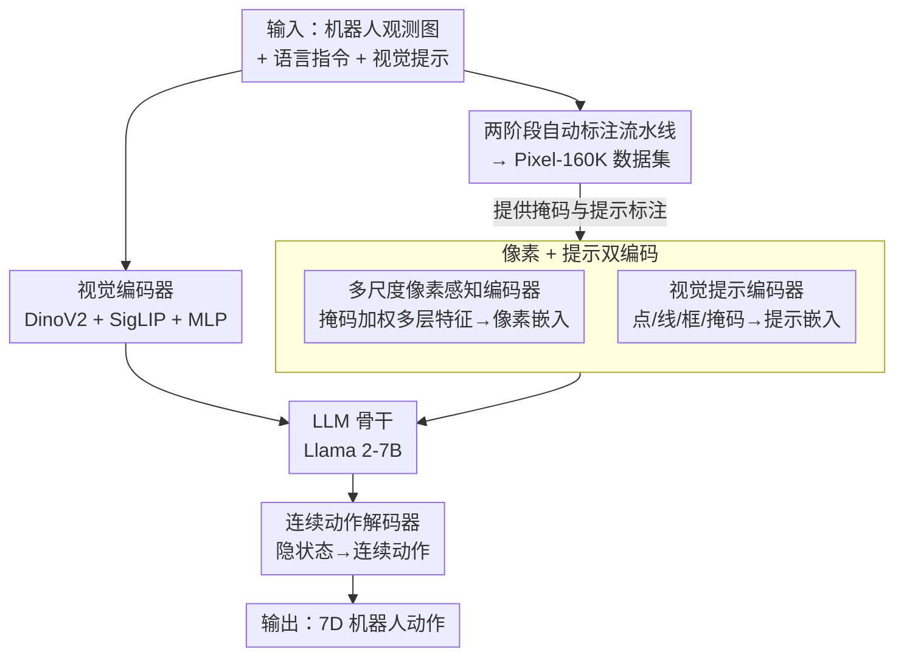

# PixelVLA: Advancing Pixel-level Understanding in Vision-Language-Action Model

**会议**: ICLR 2026  
**OpenReview**: [https://openreview.net/forum?id=7M6ryCABIc](https://openreview.net/forum?id=7M6ryCABIc)  
**论文**: [Project Page](https://wenqiliang.github.io/PixelVLA/)  
**代码**: https://wenqiliang.github.io/PixelVLA/ (项目页)  
**领域**: 机器人 / 具身智能 / VLA  
**关键词**: 视觉-语言-动作模型, 像素级理解, 视觉提示, 连续动作, 视觉运动指令微调

## 一句话总结
PixelVLA 是首个同时支持像素级理解与多模态提示（文本 + 点/线/框/掩码）的视觉-语言-动作模型，通过给现有 VLA 插入「多尺度像素感知编码器 + 视觉提示编码器 + 连续动作解码器」三个组件，并用自动标注流水线造出 16 万条带像素标注的 Pixel-160K 数据集做两阶段视觉运动指令微调，只花 OpenVLA 1.5% 的预训练成本就把操作成功率提升了 10.1%∼28.7%。

## 研究背景与动机

**领域现状**：视觉-语言-动作模型（VLA）把大规模机器人数据和预训练视觉-语言模型（VLM）结合起来，能在零样本场景下泛化到没见过的物体和指令，代表工作如 RT-2、OpenVLA、π0，已经成为通用机器人操作策略的主流范式。

**现有痛点**：这些 VLA 几乎都直接继承自 VLM，而 VLM 只在「图像级」处理观测——它能告诉你画面里有个茄子，却说不清茄子的精确像素轮廓和空间边界。这带来两个具体毛病：其一，缺乏像素级（fine-grained）的场景理解，空间推理能力弱，分布外泛化随之变差；其二，绝大多数 VLA 只吃文本指令，忽略了点、线、框、掩码这类直观的视觉线索，人机交互方式单一，遇到「把*这个*茄子放进篮子」这种需要指代的指令就抓瞎。

**核心矛盾**：像素级理解在 VLM 端（如 Shikra、Ferret）已被验证有效，但要把它搬进 VLA 却卡在数据上——现有机器人数据集（OXE、DROID 等）既没有多模态视觉提示，也没有像素级掩码标注；而直接拿现成的开集分割模型去给机器人图像打标，又因为机器人图像杂乱、低质、与 VLM 预训练数据存在巨大域差而效果很差。

**本文目标**：(1) 设计一套能让 VLA 获得像素级理解、并接受多模态视觉提示的模型结构；(2) 解决「机器人数据没有像素标注」这个数据瓶颈，自动造出可用的训练数据；(3) 设计配套的训练流程，让上述能力以低成本注入已有 VLA。

**切入角度**：作者借鉴 VLM 里成熟的「视觉指令微调」（visual instruction tuning），把它迁移到 VLA，提出**视觉运动指令微调**（Visuomotor Instruction Tuning）这一范式——把原本只有 $a_t = F_\theta(x_t, L)$（图像 + 文本 → 动作）的动作生成，扩展为 $a_t = F_\theta(x_t, p_t, L, V)$，额外引入像素掩码输入 $p_t$ 和多样视觉提示 $V$。

**核心 idea**：用「像素感知嵌入」把分割掩码携带的像素级信息编码进 LLM token，再配一个轻量视觉提示编码器接收点/线/框/掩码，外加连续动作解码器替代离散动作 token，三件套以即插即用的方式增强已有 VLA，并用自动标注流水线补齐缺失的像素级训练数据。

## 方法详解

### 整体框架

PixelVLA 要解决的是「让一个原本只懂图像级语义的 VLA 学会看懂像素、并能被视觉提示指挥」。它的骨架沿用 OpenVLA 那套 Prismatic-7B（DinoV2 + SigLIP 视觉编码器 + Llama 2-7B），在此之上插入三个新组件，整条链路是：机器人观测图、语言指令、视觉提示三路输入 → 视觉编码器抽视觉嵌入、**多尺度像素感知编码器**把分割掩码区域的多层特征聚合成像素感知嵌入、**视觉提示编码器**把点/线/框/掩码编码成提示嵌入 → 这些嵌入和文本一起喂进 LLM → 取 LLM 最后一层隐状态，经**连续动作解码器**直接回归出 7 维机器人动作（含动作分块）。

要驱动这套结构，还需要两块支撑：一是**两阶段自动标注流水线**，把公开机器人数据（Fractal、Bridge v2）自动加工成带像素掩码和视觉提示的 Pixel-160K 数据集；二是**两阶段视觉运动指令微调**，先学连续动作表征、再用 LoRA 注入像素级理解。

### 关键设计

**1. 多尺度像素感知编码器：把掩码区域的多层视觉特征压成 LLM 能读的像素嵌入**

这一块直接针对「VLA 看不到像素」的痛点。给定一张观测图 $x_0$，先用 SigLIP 抽出多层视觉特征 $F_v^0=\{f_v^{0,i}\}_{i=1}^L$（$L$ 是选取的特征层数），再拿像素掩码 $p_0$ 去「圈」出目标区域。核心是对每一层特征做掩码加权平均后线性投影、跨层求和再过 MLP，得到像素感知嵌入 $E_p^0$：

$$E_p^0 = \mathrm{MLP}\Big(\sum_{i=1}^{L}\Gamma_i(f_p^{0,i})\Big),\qquad f_p^{0,i}=\frac{p_0\cdot f_v^{0,i}}{|p_0|}$$

其中 $\Gamma_i(\cdot)$ 是第 $i$ 层的线性投影，$f_p^{0,i}$ 就是用掩码归一化后的「该层、该区域」的平均特征。这样做的妙处在于：掩码本身携带了物体的精确像素边界，把多个尺度的特征都按这个边界聚合，等于把「物体到底占哪些像素」这一信息浓缩进固定长度的 token 嵌入，再交给 LLM。由于这些嵌入由动作预测损失反向监督，模型会自发学到「像素信息 ↔ 动作」的关联，从而把像素级理解真正注入 VLA 骨干，而不是只停留在感知端。

**2. 视觉提示编码器：用 SAM 式轻量编码器统一吃下点/线/框/掩码**

这一块解决「VLA 只听文本、不接受视觉指令」的问题。作者借鉴 SAM 的提示编码器：用户给的视觉提示 $V_0$（点、线、区域、掩码）先按其归一化图像坐标转成连续位置嵌入，再叠加可学习的「提示类型嵌入」（区分这是点还是框），得到提示特征 $F_s^0$，最后过 MLP 得到提示感知嵌入 $E_s^0$。关键在于每个嵌入都通过坐标位置嵌入显式绑定到图像中的某个位置/区域，所以编码全程都保留了视觉提示的空间位置信息——这让用户可以用「点一下这个茄子」而非啰嗦的文字描述来指代操作对象，极大扩展了人机交互的灵活度，也补上了文本提示丢失的细粒度空间线索。

**3. 连续动作解码器：直接回归连续动作，绕开离散化的精度损失**

OpenVLA 这类模型把动作每一维归一化到 $[-1,+1]$ 再均匀切成 256 个 bin，用自回归方式预测离散动作 token，这种离散化天然会丢掉细粒度的动作细节。PixelVLA 改走 π0 的连续路线：取 LLM 最后一层隐状态 $F_t$，依次过线性投影、$N_r$ 个 ResNet 块、MLP 投影，直接输出连续动作 $A\in\mathbb{R}^{N_c\times 7}$，其中 $N_c$ 是动作分块（action chunking）的块大小。连续表示 + 动作分块的组合既避免了离散化误差的累积，又能捕捉更长程的时序依赖——这正是它在 LIBERO-Long 这类长程任务上涨点尤其明显的原因。

**4. 两阶段自动标注流水线 → Pixel-160K：从杂乱机器人视频里自动抠出像素标注**

没有像素标注就无从训练前三个组件，这一块就是数据引擎。它分两阶段：**夹爪感知区域提议**——观察到机器人「合爪」的那一刻往往正对着目标物体，于是把每个 episode 第一次合爪状态的观测帧 $x^{G_\eta}_\eta$ 抽出来当成一段「离散视频」，用 SAM 2 分割出夹爪掩码，取其最小外接框并适当外扩，得到每个 episode 的区域提议 $R_\eta$，从而在杂乱低质画面里稳稳框出操作对象的大致位置。**多模态物体分割**——用 Llama 2-7B 从指令（如「Put the Eggplant in Yellow Basket」）里抽出目标物名词「Eggplant」，连同区域提议 $R_\eta$ 一起喂给开放词表检测器 Grounding DINO 和 SAM，生成精细掩码并按置信度过滤，只保留最高框置信度内的掩码；最后在掩码内随机采点、画线、抠外接框，自动派生出多样的视觉提示。流水线对 Fractal 和 Bridge v2 处理后再人工快筛掉约 19.2% 的坏样本，最终得到 16 万条 episode、650 万组带视觉提示与掩码标注的图像-文本-动作三元组。

### 损失函数 / 训练策略

训练采用**两阶段视觉运动指令微调**。**第一阶段（连续动作训练，CAT）**：用 OpenVLA/π0 的预训练权重初始化视觉编码器、MLP 投影和 LLM，去掉两个新编码器，冻结除连续动作解码器外的所有模块，仅用 L1 回归损失把 LLM 隐状态对齐到真实连续动作，在 Fractal + Bridge v2 混合数据上训练，目的是先稳稳学到鲁棒的连续动作表征（适配 π0 时因其本身已有 action expert，省略此阶段）。**第二阶段（像素级理解增强，PUE）**：在 Pixel-160K 上用 LoRA（rank $r=32$）微调 LLM 骨干，同时联合训练视觉提示编码器与多尺度像素感知编码器、优化连续动作解码器，其余模块冻结。单步前向的损失为：

$$\mathcal{L}_{PixelVLA}=\sum_{i=1}^{B}\big\|a_i - C\big(H(E_v^i, E_l^i, E_p^i, E_s^i)\big)\big\|_1$$

其中 $C(\cdot)$ 是连续动作解码器，$H$ 是 LLM 骨干，$E_v/E_l/E_p/E_s$ 分别是视觉、语言、像素感知、提示感知四类嵌入，全程用 L1 回归监督。

## 实验关键数据

在 SimplerEnv-Google Robot、SimplerEnv-WidowX、LIBERO 三个仿真基准上评测，并把架构同时套进 OpenVLA 和 π0 两个底座验证通用性。

### 主实验

| 基准 / 设置 | 指标 | PixelVLA | 对比基线 | 提升 |
|------|------|------|----------|------|
| Google Robot (VM 平均) | 成功率 | 61.4 | OpenVLA 32.7 | +28.7 |
| Google Robot (VA 平均) | 成功率 | 50.1 | OpenVLA 40.0 | +10.1 |
| WidowX (Suc. 平均, π0 底座) | 成功率 | 33.8 | π0 27.1 | +6.7 |
| LIBERO (四套件平均) | 成功率 | 86.7 | OpenVLA 76.5 | +10.2 |
| LIBERO-Long | 成功率 | 82.6 | OpenVLA 53.7 | +28.9 |

PixelVLA 在 LIBERO 四套件平均拿到 86.7 的 SOTA，且在长程的 LIBERO-Long 上大幅领先，作者归因于连续动作解码器：动作分块捕捉更长时序依赖、连续预测缓解了离散化误差的累积。

### 消融实验

在 Google Robot（Variant Aggregation）上以 OpenVLA 为基线逐组件叠加：

| 配置 | 平均成功率 | 说明 |
|------|---------|------|
| Baseline | 40.0 | OpenVLA 原始 |
| +FT | 37.0 | 仅在 Fractal+Bridge 上微调，反而掉 3 |
| +FT+CAT | 43.8 | 加连续动作训练阶段，+3.8 |
| +FT+PUE | 48.0 | 加像素级理解增强阶段，+8.0 |
| PixelVLA (CAT+PUE) | 50.1 | 完整两阶段，比 +CAT 高 6.3 |

### 关键发现
- **像素级理解（PUE）是涨点主力**：单独加 PUE 就带来 +8.0，远高于连续动作训练单独的 +3.8，说明把像素信息注入 VLA 确实是泛化的关键。
- **直接微调反而掉点**：单纯 +FT 比 baseline 还低 3 分，说明性能提升来自新组件与两阶段范式，而非「多训了点数据」。
- **两阶段联合有小代价**：完整两阶段在 Open/Close Drawer 这一高难度任务上相比单阶段 +PUE 略有下降，作者归因为联合优化中的灾难性遗忘与该任务的高敏感性，但整体仍最优。
- **成本极低**：达到上述效果只用了 OpenVLA 约 1.5% 的预训练算力。

## 亮点与洞察
- **「合爪即对准物体」是个很省的先验**：用机器人第一次合爪的帧去定位目标，避开了对全程逐帧标注的需求，把昂贵的像素标注问题转化成一个几乎免费的自动流水线——这个观察可迁移到任何需要从操作轨迹里反推「操作对象」的数据构造任务。
- **像素信息靠动作损失隐式监督**：像素感知嵌入没有专门的分割损失，而是靠下游动作回归损失反向「逼」模型学会用像素信息——把感知能力的获取折叠进控制目标，省去了多任务损失的平衡难题。
- **即插即用**：同一套架构和训练流程在 OpenVLA 和 π0 上都涨点，说明它是对 VLA 的通用增强而非依赖特定底座，复用价值高。
- **多模态提示统一编码**：借 SAM 提示编码器把点/线/框/掩码统一成坐标位置嵌入，是把分割社区的成熟设计搬进具身控制的巧妙嫁接。

## 局限与展望
- **只在仿真上验证**：三大基准全是 SimplerEnv / LIBERO 仿真，缺少真实机器人部署结果，sim-to-real 的实际收益仍待检验。
- **依赖单第三人称视角与 224×224 低分辨率**：像素级理解在更高分辨率、多视角或遮挡严重场景下是否仍稳健没有充分探讨。
- **两阶段联合的遗忘问题未解**：消融已暴露在高难任务上因灾难性遗忘掉点，缺少针对性的缓解机制。
- **标注流水线的自动质量有上限**：仍需人工快筛掉约 19.2% 的坏样本，且「合爪对准目标」的假设在双臂、非抓取类任务上可能失效。

## 相关工作与启发
- **vs OpenVLA**：OpenVLA 用离散动作 token、纯文本提示、图像级理解；PixelVLA 在其骨干上加像素感知 + 视觉提示 + 连续动作三件套，零样本操作成功率提升 10.1%∼28.7%，且只用 1.5% 预训练成本。
- **vs π0**：π0 提供了连续动作 / action expert 的思路，PixelVLA 直接复用其连续动作范式作为底座之一，再叠加像素级理解，验证了增强的通用性。
- **vs TraceVLA**：TraceVLA 用视觉轨迹提示增强时空感知，仍停在图像/轨迹级；PixelVLA 走到像素掩码级别，并支持点/线/框/掩码多种提示形态，在 Google Robot 与 LIBERO 上均超过它。
- **vs LLaRA / 区域级 VLM（Shikra、Ferret）**：这些工作把坐标当文本 token 或做区域级 grounding，PixelVLA 则把像素掩码特征直接编码进 token，并首次在 VLA（控制）而非纯 VLM（感知）里实现细粒度像素理解与连续动作的对齐。

## 评分
- 新颖性: ⭐⭐⭐⭐⭐ 首个在 VLA 中同时实现像素级理解与多模态视觉提示，并配套自动标注数据引擎。
- 实验充分度: ⭐⭐⭐⭐ 三基准两底座 + 逐组件消融较完整，但全为仿真、缺真机验证。
- 写作质量: ⭐⭐⭐⭐ 结构清晰、公式与图示到位，少数符号（$E_o$ vs $E_p$）略有不一致。
- 价值: ⭐⭐⭐⭐⭐ 即插即用、低成本、可迁移到多种 VLA，对具身操作的细粒度感知有实用推动。

<!-- RELATED:START -->

## 相关论文

- [\[ICLR 2026\] Vision-Language-Action Instruction Tuning: From Understanding to Manipulation](vision-language-action_instruction_tuning_from_understanding_to_manipulation.md)
- [\[ICLR 2026\] TPRU: Advancing Temporal and Procedural Understanding in Large Multimodal Models](tpru_advancing_temporal_and_procedural_understanding_in_large_multimodal_models.md)
- [\[ICLR 2026\] Vlaser: Vision-Language-Action Model with Synergistic Embodied Reasoning](vlaser_vision-language-action_model_with_synergistic_embodied_reasoning.md)
- [\[ICLR 2026\] UniVLA: Unified Vision-Language-Action Model](unified_vision-language-action_model.md)
- [\[ICLR 2026\] WMPO: World Model-based Policy Optimization for Vision-Language-Action Models](wmpo_world_model-based_policy_optimization_for_vision-language-action_models.md)

<!-- RELATED:END -->
