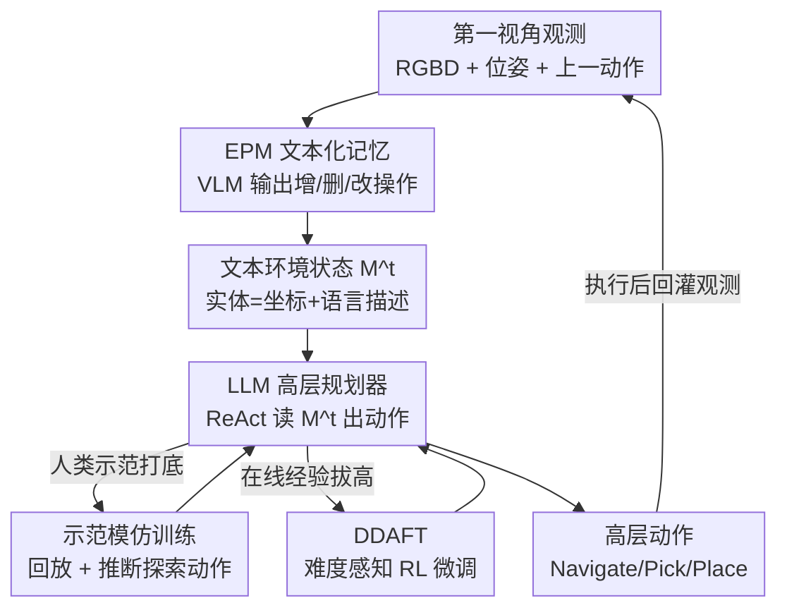

# Planning with an Embodied Learnable Memory

**会议**: ICLR 2026  
**OpenReview**: [https://openreview.net/forum?id=79BOATBal9](https://openreview.net/forum?id=79BOATBal9)  
**代码**: 待确认  
**领域**: 具身智能 / 机器人 / 长程任务规划  
**关键词**: 具身记忆, 移动操作, VLM, 任务规划, 强化学习

## 一句话总结
本文提出 EPM（Embodied Perception Memory）——一个用单个 VLM 从第一视角观测里增删改维护「文本化场景表示」的可学习记忆，再配上「人类示范模仿 + 难度感知在线 RL（DDAFT）」两套规划训练法，让 LLM 规划器在动态家庭环境的长程移动操作任务上，相比强基线在 PARTNR 上把成功率最高拉高 55%。

## 研究背景与动机
**领域现状**：要让机器人在家里完成「把桌上的剪刀、手机、信用卡搬到台面」这种长程移动操作任务，需要记忆（记住物体在哪）、感知（看到当前场景）和规划（决定下一步动作）三者配合。现有主流做法是给 LLM 规划器外挂一套感知/记忆模块：要么存第一视角图像、要么存带特征的点云（如 ConceptGraphs、DynaMem、3D-Mem），规划时再用语言 query 去检索相关信息。

**现有痛点**：这套「多模块拼接」的记忆表示有三个具体问题。其一，**处理不了动态环境**——物体被机器人或人不断搬动、状态不断变化，基于静态点云/特征的表示难以更新，常依赖启发式 re-association 来追踪物体，且无法纠正误检。其二，**计算开销大**——查询大模型多次、对大词表逐类别检测，内存和算力都吃紧。其三，**query 难写**——作者引用前作（GOAT）指出，朴素的语言特征匹配在精度和召回上无法兼得，让规划器去精确措辞 query 既困难又不切实际。

**核心矛盾**：把「感知/记忆」和「规划」拆成独立模块并用 query 接口连接，虽然解耦了两者，却让系统对每个模块的表示极度敏感，误差会沿管线传播导致规划失败；而且这种 query 式接口决定了规划器只能在「能写出 query」的数据上训练，无法直接吃机器人交互数据来改进。

**本文目标**：设计一种既能处理动态环境、又高效、还能让 LLM 规划器无需显式 query 就直接读取环境信息的记忆表示，并配套出能从真实交互数据里学规划的训练方法。

**切入角度**：作者观察到，如果记忆能直接吐出**文本形式**的物体清单（每个实体带 3D 坐标 + 自然语言描述与关系），那它天然就能塞进 LLM 规划器的上下文里，规划器不再需要发 API query 检索信息，而只需专注生成动作——这样规划器就能用没有 query 标注的交互/示范数据来训练。

**核心 idea**：用「一个端到端 VLM 输出离散的增/删/改操作来维护文本化场景记忆」取代「多模型拼接 + query 检索」，再用「人类示范 + 难度感知 RL」教规划器在这套带噪记忆上稳健规划。

## 方法详解

### 整体框架
系统分两层：底层是 **EPM 记忆**，把第一视角观测转成一份可随时间更新的文本环境状态 $M^t$；上层是 **LLM 高层规划器**，读取 $M^t$ 输出高层动作（Navigate/Pick/Place/Open），再由底层技能策略执行。形式上 EPM 学一个更新函数 $f$，使得 $M^t = f(M^{t-1}, o^t, a^t)$，其中 $o^t$ 是 RGBD + 相机位姿 + 内参，$a^t$ 是上一步动作。环境状态 $M$ 是一串实体，每个实体含唯一 id、3D 质心坐标 $c_i \in \mathbb{R}^3$ 和一段自然语言描述 $d_i$（开放词表名称、状态、与其它实体的关系）。

关键在于 EPM 不重新生成整张 $M^t$，而是输出一组**离散操作**叠加到 $M^{t-1}$ 上；规划器则用 ReAct 范式自回归地在「世界表示 ↔ 动作」之间交替，且每步只把被 EPM 更新过的实体加进上下文，避免上下文爆炸。规划器本身又通过两条训练管线增强：人类示范模仿（HD）打底，难度感知在线 RL（DDAFT）继续拔高。

### 关键设计

**1. EPM：用单个 VLM 输出离散记忆操作维护文本场景**

针对「多模块拼接处理不了动态、且要 query」的痛点，EPM 把整套感知-记忆收进**一个** VLM（基于 LLaVa-OneVision-7B + LoRA 微调）。它不预测新的整张记忆，而是在四类离散操作里选择：`Add (<coords>):<description>`（把新见物体反投影到世界坐标后加入）、`Update k (<coords>):<description>`（改 id 为 $k$ 的实体坐标/描述，例如柜子被打开、或近看后纠正误标的类别）、`Remove k`（删掉消失或误检的实体）、`No updates`（无新信息时保持 $M^t \equiv M^{t-1}$）。这套设计的关键收益是：物体追踪、re-association、纠错全部**在模型内部学到**，而非靠阈值/启发式；输出天然是文本，可直接被 LLM 规划器消费，省掉了显式 query。训练数据靠在 PARTNR 仿真里用特权信息（simulator 提供的静态布局 + 家具初始化 $M^0$）启发式地推导操作序列得到——注意启发式只用于造训练数据，推理时不用。

**2. 从人类示范推导规划轨迹（HD）：让规划学会探索且对记忆噪声鲁棒**

直接拿人类遥操作示范训规划器有个矛盾：感知系统不同会诱导不同的最优动作（「像素级完美感知」的智能体原地转一圈就能认全房间，而「近视」智能体必须走动才能建立同等理解）。本文的解法是**在仿真里回放遥操作、同时让感知系统（EPM）在环（in-the-loop）跑**，从而得到「针对该感知系统的规划轨迹」，无需为每种感知单独采数据。具体流程（`toPlanningTrace`）：逐帧 step 环境并更新 EPM，每个交互标签（Pick/Place/Open/Close）对应一个规划动作；若到上一动作结束时 EPM 还没检测到交互物体，就补 `Explore` 动作去找它——并刻意采样「找不到物体的探索」教穷尽搜索、采样「导航-抓取幻觉物体」教对 EPM 幻觉的鲁棒性；最后用 episode 的评测函数把「不推进任务的交互序列」剔除（`optimize`），缓解人类示范里偶发的次优行为。生成的轨迹用 LoRA 微调 LLM。

**3. DDAFT：难度感知的无价值函数在线 RL，自诱导课程**

为了用在线经验继续拔高规划，作者提出 Dynamic Difficulty-Aware Fine-Tuning。它属于面向 LLM 的**无价值函数 RL**：先用初始策略 $\pi_0$（即 HD 模型）在所有 episode 上 rollout，得到带任务奖励的轨迹数据集 $D_0 = \{(x_0, r_0), \dots, (x_n, r_n)\}$，然后在「微调模型 ↔ 采新轨迹」之间交替，本文实验用 RFT 目标拟合。和常规 LLM 推理微调（如 GRPO、DART-Math）从训练集**均匀采样**不同，DDAFT 把采样偏向**当前数据集里还没有成功样例的难题**——具体按「各 episode 失败率的 softmax」诱导出的分布来决定在哪些 episode 上生成新轨迹。和 DART-Math 的关键区别在于：DART-Math 产出的是静态微调集，而 DDAFT **迭代运行**，用当前策略动态估计指令难度，从而在数据上自诱导出一条课程，带来更高的样本效率和最终性能。

### 一个完整示例
以任务「把剪刀、手机、信用卡从桌子搬到台面」为例：初始 $M^0$ 含静态家具（Entity.1 咖啡桌）。机器人前进观测后，EPM 看到桌面物体，输出 `Add (0.3,0.8): Scissors on Entity.1`、`Add (0.6,0.9): Phone on Entity.1`，并对一个误加实体输出 `Remove: Entity.4`；这些操作叠加到 $M^{t-1}$ 得到更新后的文本状态。高层规划器读到「剪刀在 Entity.1 上」后直接输出 `Action: Grab Object.2`，无需先发 query 去问「剪刀在哪」。若某目标物体尚未被 EPM 检测到，HD 训出的策略会先发 `Explore` 动作走动搜索，再回到「检测到 → 导航 → 抓取 → 放置」的循环，直到任务评测函数判定完成。

## 实验关键数据

### 主实验
规划评测在 PARTNR 单智能体 benchmark（1000 个验证 episode、12 个 HSSD 场景）上进行，指标含成功率（SR↑）、完成度（PC↑）、仿真步数、规划周期、冗余动作。下表节选 Learned（学习到的感知）设置：

| 配置（Learned 感知） | 成功率 SR↑ | 完成度 PC↑ | 仿真步数↓ |
|--------|------|------|------|
| DynaMem（基线） | 0.03 | 0.11 | 5090 |
| PP（Llama3.3-70B，无微调） | 0.46 | 0.65 | 1850 |
| PP+DDAFT（本文） | 0.58 | 0.74 | 2200 |
| HD（本文，8B 模型） | 0.55 | 0.69 | 3040 |
| HD+DDAFT（本文） | 0.58 | 0.74 | 2250 |

本文方法（row 8-10）相比强基线（DynaMem、PP）在成功率上分别有 **55%** 和 **12%** 的绝对提升；且即便给 DynaMem 配上真值感知（GT，SR 仅 0.17），仍远逊于本文。速度上本文比 DynaMem 快 **3.5×**。一个有意思的对比：用 8B 的 HD（GT 感知 SR 0.63）就超过了 70B 的 PP（SR 0.51）0.12 个点。

感知层独立评测（不在规划环里）见下表（PARTNR，节点 F1）：

| 方法 | 节点 Precision | 节点 Recall | 节点 F1 |
|------|------|------|------|
| GT（特权上界） | 0.86 | 0.54 | 0.60 |
| GPT-4o | 0.00 | 0.05 | 0.00 |
| DynaMem | 0.04 | 0.10 | 0.05 |
| EPM（本文） | 0.36 | 0.42 | 0.34 |

EPM 在仿真里显著超 GPT-4o / DynaMem，但 F1=0.34 远未饱和（数据集本身难，物体常部分可见或远距离）。仅用仿真数据训练的 EPM 能迁移到真实 Spot-Indoor 数据集，但会误分类、难关联同物体的多个实例。

### 消融实验

| 配置 | 关键发现 | 说明 |
|------|---------|------|
| PP → PP+DDAFT (GT) | SR 0.51 → 0.66（+0.15） | DDAFT 对预训练策略提升最大 |
| HD → HD+DDAFT (GT) | SR 0.63 → 0.68（+0.05） | HD 已较强，RL 提升较小 |
| PP → PP+DDAFT (Learned) | SR 0.46 → 0.58（+0.12） | DDAFT 在带噪感知下同样有效 |
| HD vs PP (Learned) | 0.55 vs 0.46 | 示范训练让小模型适应 EPM 失效 |
| HD (Learned) vs PP (GT) | 0.55 vs 0.51 | 学习感知 + HD 竟超过 PP+真值感知 |

### 关键发现
- **HD 能从 EPM 表示里有效规划**：8B 的 HD 超过 70B 的 PP（GT 设置 +0.12 SR），说明从示范推导轨迹是学具身规划的有效途径。
- **HD 对 EPM 失效有适应力**：带学习感知时 HD 不仅超 PP，甚至超过「PP + 完美感知」，说明示范无需采集「感知特定」的轨迹也能教出鲁棒规划。
- **DDAFT 普适**：对 PP 和 HD、对 GT 和学习感知都能涨点，提供了一套增强文本规划策略的通用配方。
- **真机验证**：PP+DDAFT + 学习 EPM 在 Spot 机器人 20 个真实场景里成功 55%（失败来自规划和技能执行两方面），其中 70% 的任务 EPM 能预测出正确计划。

## 亮点与洞察
- **「记忆即文本、规划即续写」的统一**：把感知-记忆做成输出离散文本操作的单个 VLM，让记忆天然进 LLM 上下文、规划器无需发 query——这一步同时解决了「query 难写」和「无 query 标注数据没法训规划」两个痛点，是全文最巧的设计。
- **感知在环回放造规划数据**：用「仿真回放遥操作 + EPM 在环」生成「感知特定」的规划轨迹，绕开了「不同感知诱导不同最优动作」的矛盾，且不用为每种感知重新采数据，这套数据合成思路可迁移到任何「感知-动作耦合」的模仿学习场景。
- **难度感知采样自诱导课程**：DDAFT 用「失败率 softmax」把 RL 探索预算砸到难题上，且迭代地用当前策略重估难度，比静态难度集（DART-Math）更高效——这套「动态难度课程」可复用到一般 LLM 推理 RL。
- **故意注入噪声训练**：在示范里刻意采样「失败的探索」和「抓幻觉物体」，主动教规划器对带噪记忆鲁棒，而不是假设记忆完美——这是把 EPM 不完美（F1 仅 0.34）当成既定事实来设计规划器的务实选择。

## 局限与展望
- 作者承认：训练**仅用仿真数据**，因为大规模真实动态场景 + 细粒度规划动作的数据采集太难，真机训练留作future work。
- **纯文本表示有天花板**：若任务需要推理「文本里没表示出来的物体属性」，规划器无从下手；作者提出 EPM 框架可扩展为携带连续视觉特征的混合系统，或与 VLA/视觉运动模块配对。
- 自行观察：EPM 感知 F1 仅 0.34、真机迁移会误分类/难关联多实例，规划成功率很大程度建立在「示范教会对噪声鲁棒」之上；一旦任务对感知精度更敏感（如细粒度实例区分），当前管线可能吃力。真机 55% 成功率中失败混合了规划与技能两类误差，未完全解耦。
- 表中横向比较需注意 caveat：PP 的仿真步数/规划周期更低主要因为它解的是更短程任务，不能直接当「更高效」来读。

## 相关工作与启发
- **vs DynaMem**：DynaMem 在全局体素栅格里存聚合物体嵌入 + RGBD/位姿，靠特征匹配检索体素再用目标检测器定位，需对大词表逐类别 query、无法推断物体关系、且是开环规划；EPM 直接产出含关系的文本、单模型端到端、闭环规划，速度快 3.5×、规划成功率高出 55%（绝对）。
- **vs ConceptGraphs / 3D-Mem 等场景图/图像记忆**：它们靠启发式做物体 re-association 与纠错、对动态场景敏感、误差沿管线传播；EPM 把 re-association 和纠错**学进模型**，并支持 Add/Update/Remove 动态操作。
- **vs DART-Math（RL 采样）**：DART-Math 产出静态难度微调集；DDAFT 迭代运行、用当前策略动态估计难度，样本效率与性能更优。
- **vs 直接预测低层动作的 VLA（如 GR00T）**：那类方法把动作直接 ground 到视觉，但受 VLM 记忆容量限制，难以支撑大环境长程探索；本文走「LLM 规划器 + 可学习外部记忆」路线，专攻长程。

## 评分
- 新颖性: ⭐⭐⭐⭐⭐ 「文本化可学习记忆 + 无 query 规划 + 难度感知 RL」三件套组合新颖，EPM 的离散操作式记忆尤其有想法。
- 实验充分度: ⭐⭐⭐⭐ 仿真主实验 + 感知独立评测 + 真机验证齐全，消融清晰；但真实训练缺位、感知 F1 偏低。
- 写作质量: ⭐⭐⭐⭐ 动机推导扎实、表格与发现对应清楚，方法多模块但讲得有条理。
- 价值: ⭐⭐⭐⭐⭐ 为长程动态具身规划提供了一套可复用的「记忆即文本 + 示范/RL 训规划」配方，工程与研究价值都高。

<!-- RELATED:START -->

## 相关论文

- [\[ICLR 2026\] MomaGraph: State-Aware Unified Scene Graphs with Vision-Language Models for Embodied Task Planning](momagraph_state-aware_unified_scene_graphs_with_vision-language_models_for_embod.md)
- [\[CVPR 2026\] Predict Before You Explore: Predictive Planning with Specialized Memory for Embodied Question Answering](../../CVPR2026/robotics/predict_before_you_explore_predictive_planning_with_specialized_memory_for_embod.md)
- [\[ICLR 2026\] Embodied Agents Meet Personalization: Investigating Challenges and Solutions Through the Lens of Memory Utilization](embodied_agents_meet_personalization_investigating_challenges_and_solutions_thro.md)
- [\[ICLR 2026\] SLAP: Shortcut Learning for Abstract Planning](slap_shortcut_learning_for_abstract_planning.md)
- [\[ICLR 2026\] REI-Bench: Can Embodied Agents Understand Vague Human Instructions in Task Planning?](rei-bench_can_embodied_agents_understand_vague_human_instructions_in_task_planni.md)

<!-- RELATED:END -->
